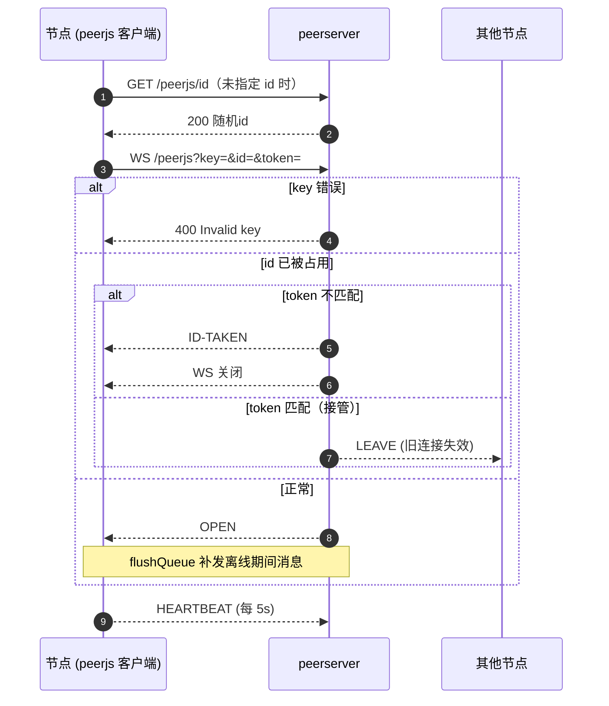
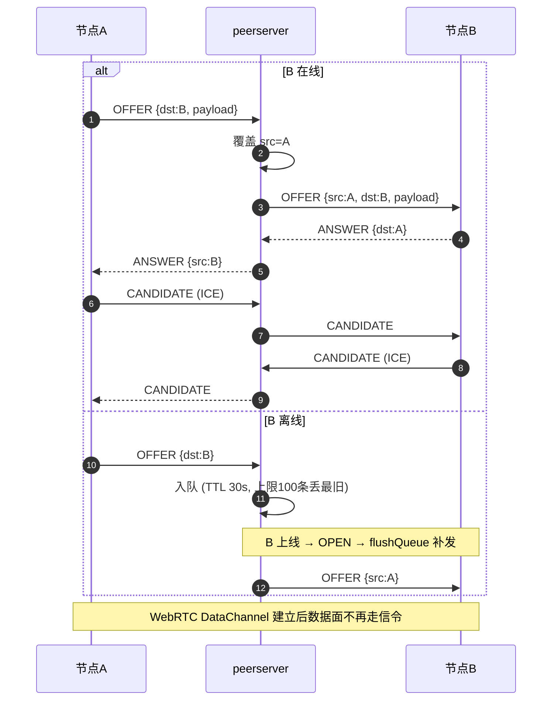
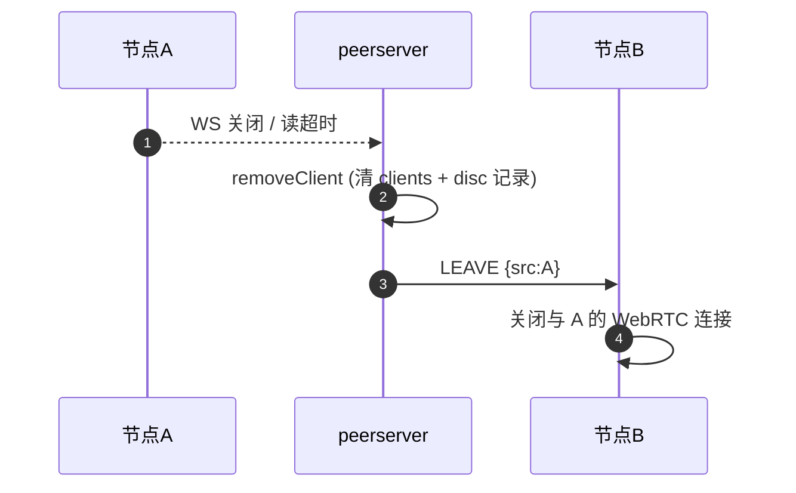
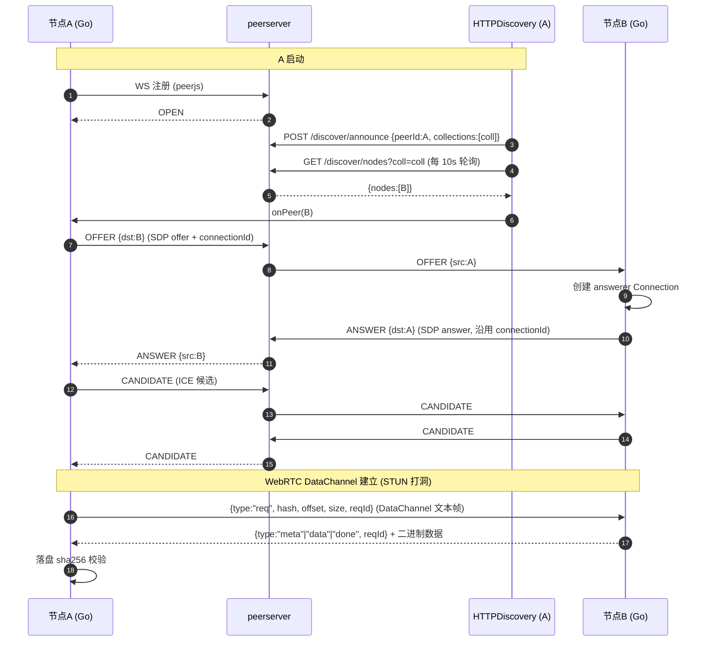
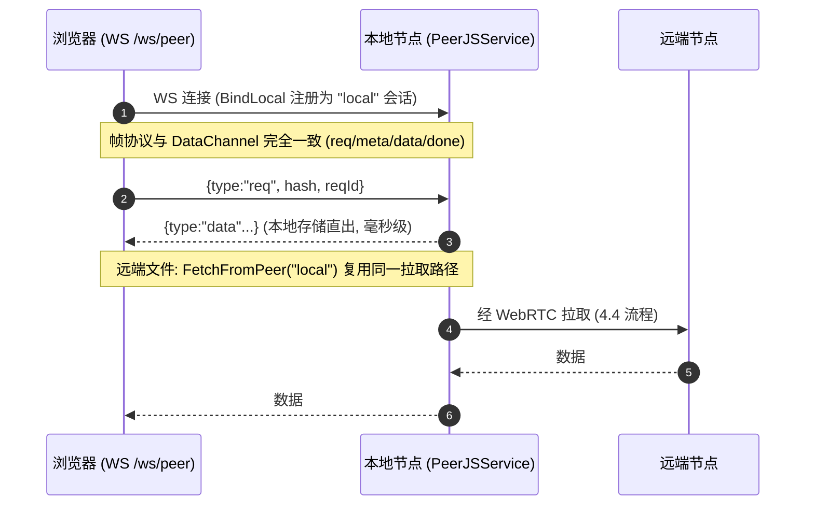
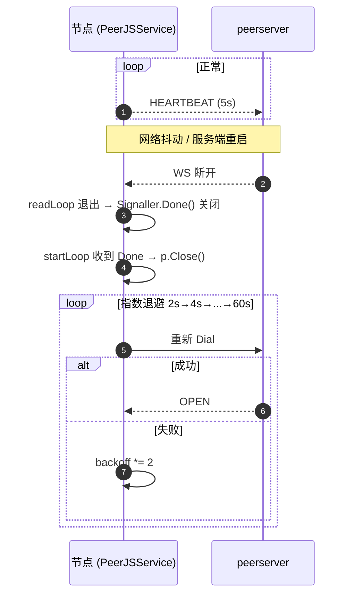

# Peersignal 自托管信令服务器

> 代码：`back/internal/signalserver/` + `back/cmd/peerserver/`（REFACTOR §3.6）
> 职责：替代公共云信令（0.peerjs.com）与公共 MQTT broker——**信令 + 房间发现二合一**。

## 1. 系统框架

### 1.1 peersignal 在 peerdrive 中的位置

```
┌─────────────────────────────┐   ┌──────────────────────────────┐
│        浏览器 (React)        │   │       Go 节点 (back/)         │
│  peerjs 前端库 (host/port/key)│  │  peerjs 模块 (back/peerjs/)   │
│                             │   │  ├─ Signaller（信令客户端）    │
└──────────┬──────────────────┘   │  ├─ Connection（DataChannel） │
           │ wss + https          │  └─ Peer（路由/生命周期）      │
           │                      └──────────┬───────────────────┘
           │                                 │ wss + https
           ▼                                 ▼
┌─────────────────────────────────────────────────────────────┐
│              peerserver（自托管信令 + 发现，二合一）            │
│                                                             │
│  back/cmd/peerserver/main.go         ┌────────────────────┐  │
│    ├── /peerjs (WS)  ──────────────► │  signalserver.Server│  │
│    ├── /peerjs/id (GET)             │   ├─ clients (id→conn)│  │
│    ├── /discover/announce (POST) ──►│   ├─ queues (离线队列) │  │
│    └── /discover/nodes (GET) ──────►│   └─ disc (房间发现)   │  │
│                                     └────────────────────┘  │
└─────────────────────────────────────────────────────────────┘
        ▲                                    │
        │ WS 信令（SDP/ICE 只经服务器）        │ HTTP 发现（announce/查询）
        │ 数据面 WebRTC 直连（不经服务器）      ▼
        └──────────────┬────────────────────┐
                       │                    │
            浏览器 ↔ 节点 / 节点 ↔ 节点   节点 → HTTPDiscovery (transport/)
```

### 1.2 代码框架（服务器内部）

```
back/internal/signalserver/signalserver.go
├── Server                核心：一把 mu 锁保护全部状态
│   ├── key/queueTTL/heartbeatTTL        配置（key 校验、队列 TTL、心跳 TTL）
│   ├── clients  map[string]*client      id → 在线连接
│   ├── queues   map[string][]queuedMsg  dst → 离线消息（30s TTL，上限 100/dst）
│   └── disc     map[string]map[string]time.Time  collection → peerId → lastSeen
├── client               一条在线信令连接
│   ├── id/token/conn                    身份 + WS 连接
│   └── sendMu                           串行化 WriteJSON（gorilla 禁并发写）
├── queuedMsg            离线队列条目（msg + expire）
├── Message              信令消息 {type, src, dst, payload}
│
├── 处理入口
│   ├── HandleID    GET /peerjs/id       随机 id（text/plain）
│   ├── HandleWS    WS 升级 + 校验 → OPEN → flushQueue → readLoop
│   ├── HandleAnnounce POST /discover/announce  节点登记房间
│   └── HandleNodes GET /discover/nodes  查询在线节点（过期剔除）
│
└── 内部循环
    ├── readLoop      收消息 → 覆盖 src → 续读超时 → route
    ├── route         在线转发 / 离线入队（LEAVE/EXPIRE 不入队）
    ├── flushQueue    dst 上线补发离线队列
    ├── removeClient  断线清理 → 广播 LEAVE → 清发现记录
    ├── Start/sweepQueues  30s 周期清理过期队列
    └── randomID      16 位字母数字 id 生成
```

## 2. 功能清单

### 2.1 信令（PeerJS 兼容协议子集）

| 功能 | 说明 |
|---|---|
| 节点注册 | WS 升级，校验 `key/id/token` 三参数；成功回 `OPEN` |
| ID 分配 | `GET /peerjs/id` 返回随机 id（peerjs API 兼容） |
| 消息转发 | `OFFER/ANSWER/CANDIDATE` 等按 `dst` 转发；服务端覆盖 `src` |
| 离线队列 | dst 不在线时消息入队（TTL 30s），上线后补发；`LEAVE/EXPIRE` 不入队 |
| 断线通知 | 任一节点断开 → 广播 `LEAVE` 给所有在线节点 |
| ID 防劫持 | 同 id 二次连接：token 匹配 → 接管旧连接；不匹配 → 回 `ID-TAKEN` 拒绝 |
| 心跳 | 客户端每 5s 发 `HEARTBEAT`；服务端 60s 读超时兜底清理死连接 |
| 资源保护 | 每 dst 队列上限 100 条（丢最旧）、单消息 40KB、body 1KB、集合 ≤64 |

### 2.2 房间发现（替代 MQTT）

| 功能 | 说明 |
|---|---|
| 节点登记 | `POST /discover/announce {peerId, collections[]}`，节点 30s 心跳刷新 |
| 在线查询 | `GET /discover/nodes?coll={hash}` → `{nodes:[{peerId,lastSeen}]}` |
| 过期剔除 | lastSeen 超过 90s（heartbeatTTL）即视为离线，查询时剔除 |
| 解耦 | 发现走 HTTP，与信令 WS 连接无关（节点可用任意 HTTP 入口上报） |

## 3. 端点一览

| 端点 | 方法 | 参数 | 说明 |
|---|---|---|---|
| `/peerjs` | WS | `key,id,token` | 信令 WebSocket |
| `/peerjs/id` | GET | - | 分配随机 id（text/plain） |
| `/discover/announce` | POST | JSON `{peerId,collections[]}` | 节点登记房间 |
| `/discover/nodes` | GET | `coll` | 查询集合在线节点 |

启动：`peerserver [-addr :9000] [-key peerjs]`

## 4. 时序（Sequence Diagram）

### 4.1 节点注册



### 4.2 消息转发（在线 / 离线）



### 4.3 断线处理



### 4.4 节点间完整互联（发现 → 信令 → 直连 → 拉文件）



### 4.5 浏览器直连本地节点（WS 会话，同帧协议）



时序要点：
- 信令只负责 SDP/ICE 交换与房间发现；**数据面全程 WebRTC 直连**，服务器不碰数据
- answerer 必须沿用 offerer 的 `connectionId`，否则 ANSWER 路由不到（REFACTOR §5 第一坑）
- 对端未上线时 OFFER 入队过期 → 客户端收到 `EXPIRE` 关闭连接，`connectLoop` 指数退避重连
  （公共云信令会发 EXPIRE；自托管当前不发，靠 H7 断线重连兜底）
- 断线重连复用同一 backoff（2s→60s），成功后重置

### 4.6 断线重连（H7）



## 5. 发现工作流程（HTTPDiscovery）

```
节点 (back/internal/transport/http_discovery.go)
  Start() 启动 loop：
    ├─ announce()   POST /discover/announce（上线 + 每 30s 心跳刷新 lastSeen）
    └─ discover()   每 10s GET /discover/nodes?coll={hash}
                      ├─ 过滤自己/空 id/超长 id
                      └─ 未见过 → onPeer(peerID) → PeerJSService.connectLoop 互联
```

- 自托管后服务器天然知道所有在线节点（都连着它做信令），发现从「MQTT 广播」降级为「HTTP 查询」
- `PEERDRIVE_DISCOVER_URL` 设置后优先于 MQTT（`peerjs_service.go:192`）
- 节点端 discovery 去重：`HTTPDiscovery.seen` 防止重复 onPeer

## 6. 关键实现细节（坑）

| 点 | 实现 |
|---|---|
| 并发安全 | 全状态一把 `Server.mu`；gorilla WS 不允许并发写 → `client.sendMu` |
| 队列 OOM（H3） | 原实现队列无上限 → 每 dst 上限 100 条丢最旧（信令消息过期即失效） |
| 过期堆积 | `sweepQueues` 30s 周期清理（原只在 flushQueue 时清，dst 永不连则堆积） |
| 读放大 | WS 读限制 40KB + 60s 读超时（heartbeat 刷新）；announce body 1KB + 集合 ≤64（M15） |
| 锁内 Close 死锁 | 代码内凡「持锁收集、解锁后 Close」均为该坑的修复（Go mutex 非重入） |
| 客户端断线失聪（H7） | 公共云 WS 掉线 → `Signaller.Done()` 通知 → startLoop 指数退避（2s→60s）整轮重连 |

## 7. 客户端接入

```
浏览器（peerjs 前端库）
  new Peer(id, {host, port, key})  ← host/port/key 指向自托管，零代码改动

Go 节点（back/peerjs 模块，peerjs_service.go:150）
  opts.Host/Port/Secure/Key = PEERDRIVE_PEERJS_HOST/PORT/SECURE/KEY
  PEERDRIVE_DISCOVER_URL    = https://peersignal.moonchan.xyz（发现优先于 MQTT）
```

| 环境变量 | 默认 | 说明 |
|---|---|---|
| `PEERDRIVE_PEERJS_HOST` | 0.peerjs.com | 信令服务器主机 |
| `PEERDRIVE_PEERJS_PORT` | 443 | 信令端口 |
| `PEERDRIVE_PEERJS_KEY` | peerjs | 信令 key（客户端必须与服务端一致） |
| `PEERDRIVE_PEERJS_SECURE` | true | wss/https |
| `PEERDRIVE_DISCOVER_URL` | - | 自托管发现 API 基址（设置后优先于 MQTT） |
| `PEERDRIVE_MQTT_ENABLE` | false | MQTT 发现（无 DISCOVER_URL 时的后备） |

## 8. 线上部署（cloudcone）

```
peersignal.moonchan.xyz ──CF 橙云 A 记录──► 117.55.237.217（cloudcone nginx）
        │ wss + https
   peerserver（systemd，127.0.0.1:9000，key=pd-signal-b9447b406828e500）
```

- 服务端：`peerserver -addr :9000 -key <key>`（systemd 托管，nginx 反代）
- 域名：`wss://peersignal.moonchan.xyz/peerjs` + `https://peersignal.moonchan.xyz/discover/*`
- 部署更新（避免 Text file busy）：构建 → 上传 `.new` → `systemctl stop && mv && start`
- CF 100s 空闲超时无影响（心跳 5s 保活）；cloudcone 443 不走宿主机代理（直连）
- 安全：信令自有后无公共云 MITM 面；后续可在服务器加 token 白名单

## 9. 验证

```bash
# 单元测试（无网络）
cd back && go test -tags nosqlite ./internal/signalserver/ -count=1

# 自托管集成测试（内存信令服务器，本地起；测试名大小写：TestSelfHosted*）
cd back && go test -tags "nosqlite integration" ./test/integration/ -run 'TestSelfHosted' -count=1 -v

# 线上全链路（无代理跑，会向 peersignal.moonchan.xyz 注册节点）
PEERDRIVE_LIVE_TEST=1 go test -tags "nosqlite integration" ./test/integration/ -run TestLive -v
```

覆盖：注册 OPEN + src 覆盖转发、离线入队补发、LEAVE 广播、ID-TAKEN、错误 key 拒绝、
announce/查询 + 心跳过期剔除（`signalserver_test.go`）；自托管信令 → 发现 → 互联 → 拉文件
全链路（`test/integration/selfhosted_test.go`、`live_test.go`）。