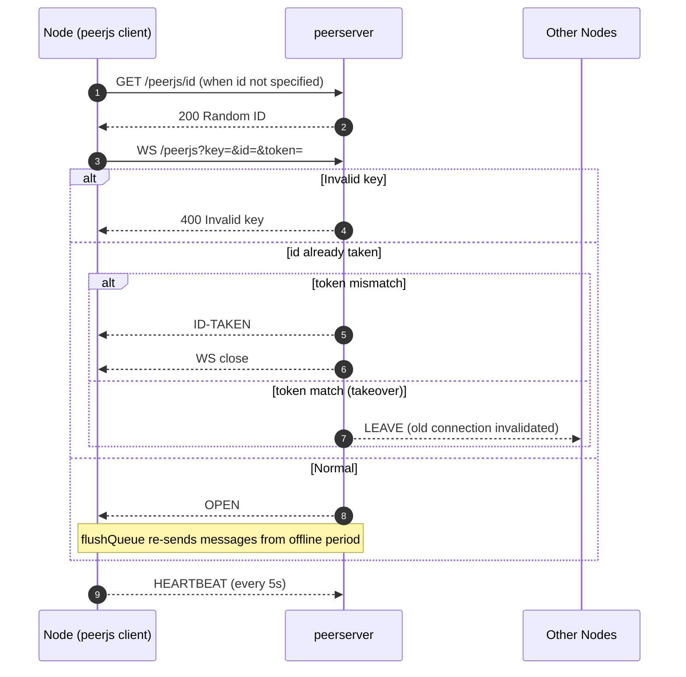
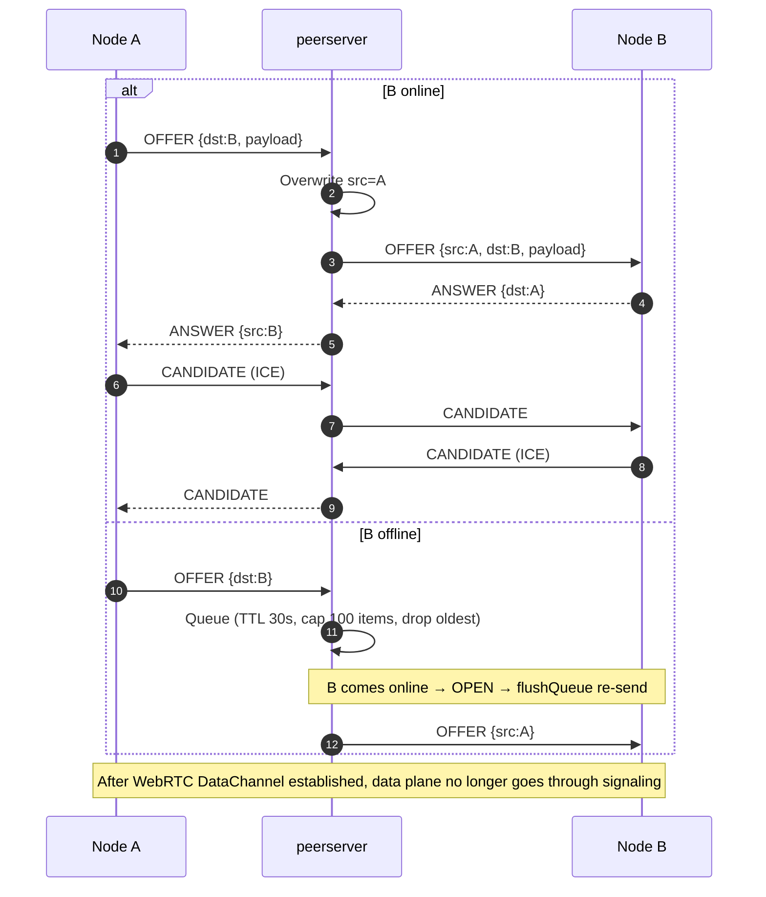
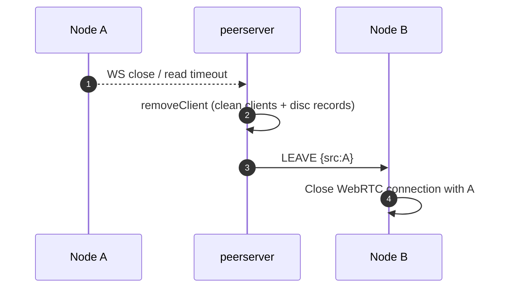
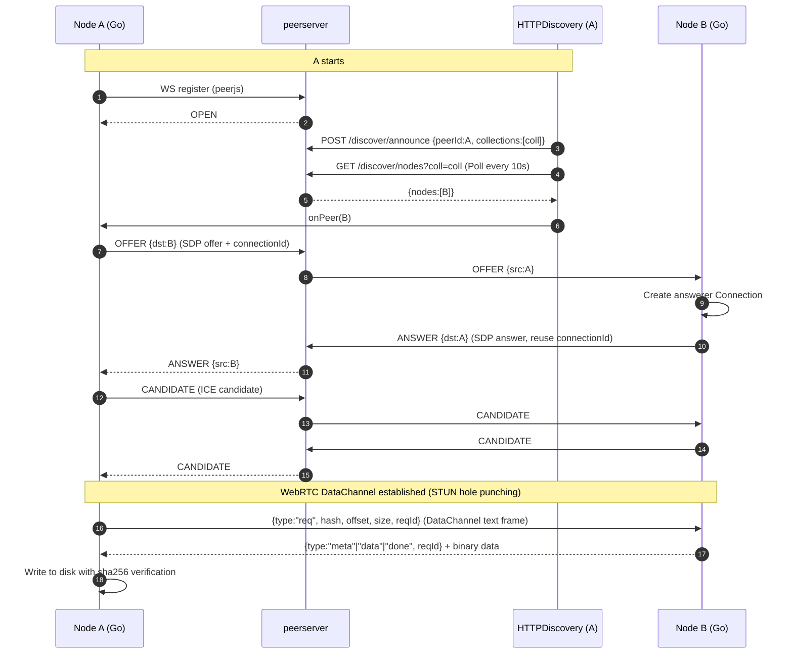
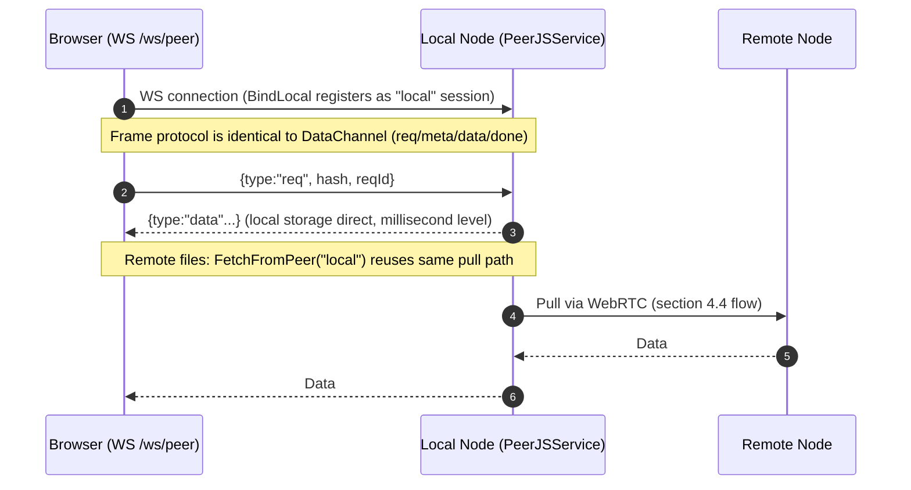
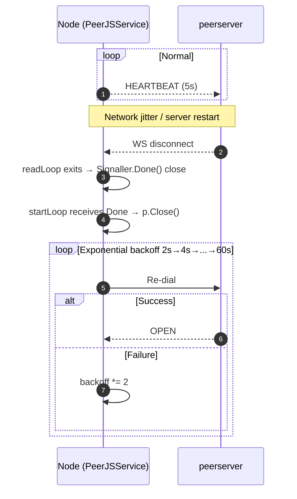

# Peersignal Self-hosted Signaling Server

> Code: `back/internal/signalserver/` + `back/cmd/peerserver/` (REFACTOR §3.6)
> Role: Replace public cloud signaling (0.peerjs.com) and public MQTT broker — **signaling + room discovery in one**.

## 1. System Architecture

### 1.1 peersignal's Place in peerdrive

```
┌─────────────────────────────┐   ┌──────────────────────────────┐
│        Browser (React)        │   │       Go Node (back/)         │
│  peerjs frontend lib (host/port/key)│  │  peerjs module (back/peerjs/)   │
│                             │   │  ├─ Signaller (signaling client)    │
└──────────┬──────────────────┘   │  ├─ Connection (DataChannel) │
           │ wss + https          │  └─ Peer (routing/lifecycle)      │
           │                      └──────────┬───────────────────┘
           │                                 │ wss + https
           ▼                                 ▼
┌─────────────────────────────────────────────────────────────┐
│              peerserver (self-hosted signaling + discovery, 2-in-1)            │
│                                                             │
│  back/cmd/peerserver/main.go         ┌────────────────────┐  │
│    ├── /peerjs (WS)  ──────────────► │  signalserver.Server│  │
│    ├── /peerjs/id (GET)             │   ├─ clients (id→conn)│  │
│    ├── /discover/announce (POST) ──►│   ├─ queues (offline queue) │  │
│    └── /discover/nodes (GET) ──────►│   └─ disc (room discovery)   │  │
│                                     └────────────────────┘  │
└─────────────────────────────────────────────────────────────┘
        ▲                                    │
        │ WS signaling (SDP/ICE only via server)        │ HTTP discovery (announce/query)
        │ Data plane WebRTC direct (not via server)      ▼
        └──────────────┬────────────────────┐
                       │                    │
           Browser ↔ Node / Node ↔ Node   Node → HTTPDiscovery (transport/)
```

### 1.2 Code Framework (Server Internals)

```
back/internal/signalserver/signalserver.go
├── Server                Core: one mu lock protects all state
│   ├── key/queueTTL/heartbeatTTL        Config (key verification, queue TTL, heartbeat TTL)
│   ├── clients  map[string]*client      id → online connections
│   ├── queues   map[string][]queuedMsg  dst → offline messages (30s TTL, cap 100/dst)
│   └── disc     map[string]map[string]time.Time  collection → peerId → lastSeen
├── client               One online signaling connection
│   ├── id/token/conn                    Identity + WS connection
│   └── sendMu                           Serialize WriteJSON (gorilla forbids concurrent writes)
├── queuedMsg            Offline queue entry (msg + expire)
├── Message              Signaling message {type, src, dst, payload}
│
├── Processing entry
│   ├── HandleID    GET /peerjs/id       Random id (text/plain)
│   ├── HandleWS    WS upgrade + validation → OPEN → flushQueue → readLoop
│   ├── HandleAnnounce POST /discover/announce  Node registers rooms
│   └── HandleNodes GET /discover/nodes  Query online nodes (remove expired)
│
└── Internal loop
    ├── readLoop      Receive message → overwrite src → extend read timeout → route
    ├── route         Online forwarding / offline queue (LEAVE/EXPIRE not queued)
    ├── flushQueue    Flush offline queue when dst comes online
    ├── removeClient  Cleanup on disconnect → broadcast LEAVE → clear discovery records
    ├── Start/sweepQueues  30s periodic cleanup of expired queues
    └── randomID      16-char alphanumeric id generation
```

## 2. Feature List

### 2.1 Signaling (PeerJS-compatible Protocol Subset)

| Feature | Description |
|---|---|
| Node Registration | WS upgrade, validate `key/id/token` params; reply `OPEN` on success |
| ID Assignment | `GET /peerjs/id` returns a random id (peerjs API compatible) |
| Message Forwarding | Forward `OFFER/ANSWER/CANDIDATE` etc. by `dst`; server overwrites `src` |
| Offline Queue | Messages queued when dst is offline (TTL 30s), resent on reconnect; `LEAVE/EXPIRE` not queued |
| Disconnect Notification | Any node disconnects → broadcast `LEAVE` to all online nodes |
| ID Anti-Hijack | Second connection with same id: token match → take over old connection; mismatch → reply `ID-TAKEN` and reject |
| Heartbeat | Client sends `HEARTBEAT` every 5s; server enforces 60s read timeout to clean dead connections |
| Resource Protection | Per-dst queue cap 100 (drop oldest), single message 40KB, body 1KB, collections ≤64 |

### 2.2 Room Discovery (MQTT Replacement)

| Feature | Description |
|---|---|
| Node Registration | `POST /discover/announce {peerId, collections[]}`, node refreshes via 30s heartbeat |
| Online Query | `GET /discover/nodes?coll={hash}` → `{nodes:[{peerId,lastSeen}]}` |
| Expired Removal | lastSeen exceeding 90s (heartbeatTTL) considered offline, filtered out on query |
| Decoupling | Discovery uses HTTP, independent of signaling WS connection (nodes can report via any HTTP endpoint) |

## 3. Endpoint Overview

| Endpoint | Method | Params | Description |
|---|---|---|---|
| `/peerjs` | WS | `key,id,token` | Signaling WebSocket |
| `/peerjs/id` | GET | - | Allocate random id (text/plain) |
| `/discover/announce` | POST | JSON `{peerId,collections[]}` | Node registers rooms |
| `/discover/nodes` | GET | `coll` | Query online nodes in collection |

Startup: `peerserver [-addr :9000] [-key peerjs]`

## 4. Sequence Diagrams

### 4.1 Node Registration


```mermaid
sequenceDiagram
    autonumber
    participant N as Node (peerjs client)
    participant S as peerserver
    participant B as Other Nodes

    N->>S: GET /peerjs/id (when id not specified)
    S-->>N: 200 Random ID
    N->>S: WS /peerjs?key=&id=&token=
    alt Invalid key
        S-->>N: 400 Invalid key
    else id already taken
        alt token mismatch
            S-->>N: ID-TAKEN
            S-->>N: WS close
        else token match (takeover)
            S-->>B: LEAVE (old connection invalidated)
        end
    else Normal
        S-->>N: OPEN
        Note over S,N: flushQueue re-sends messages from offline period
    end
    N-->>S: HEARTBEAT (every 5s)
```

### 4.2 Message Forwarding (Online / Offline)


```mermaid
sequenceDiagram
    autonumber
    participant A as Node A
    participant S as peerserver
    participant B as Node B

    alt B online
        A->>S: OFFER {dst:B, payload}
        S->>S: Overwrite src=A
        S->>B: OFFER {src:A, dst:B, payload}
        B-->>S: ANSWER {dst:A}
        S-->>A: ANSWER {src:B}
        A->>S: CANDIDATE (ICE)
        S->>B: CANDIDATE
        B->>S: CANDIDATE (ICE)
        S-->>A: CANDIDATE
    else B offline
        A->>S: OFFER {dst:B}
        S->>S: Queue (TTL 30s, cap 100 items, drop oldest)
        Note over B,S: B comes online → OPEN → flushQueue re-send
        S->>B: OFFER {src:A}
    end
    Note over A,B: After WebRTC DataChannel established, data plane no longer goes through signaling
```

### 4.3 Disconnection Handling


```mermaid
sequenceDiagram
    autonumber
    participant A as Node A
    participant S as peerserver
    participant B as Node B

    A-->>S: WS close / read timeout
    S->>S: removeClient (clean clients + disc records)
    S->>B: LEAVE {src:A}
    B->>B: Close WebRTC connection with A
```

### 4.4 Full Node-to-Node Interconnection (Discovery → Signaling → Direct Connect → File Pull)


```mermaid
sequenceDiagram
    autonumber
    participant A as Node A (Go)
    participant S as peerserver
    participant D as HTTPDiscovery (A)
    participant B as Node B (Go)

    Note over A,D: A starts
    A->>S: WS register (peerjs)
    S-->>A: OPEN
    D->>S: POST /discover/announce {peerId:A, collections:[coll]}
    D->>S: GET /discover/nodes?coll=coll (Poll every 10s)
    S-->>D: {nodes:[B]}
    D->>A: onPeer(B)
    A->>S: OFFER {dst:B} (SDP offer + connectionId)
    S->>B: OFFER {src:A}
    B->>B: Create answerer Connection
    B->>S: ANSWER {dst:A} (SDP answer, reuse connectionId)
    S-->>A: ANSWER {src:B}
    A->>S: CANDIDATE (ICE candidate)
    S->>B: CANDIDATE
    B->>S: CANDIDATE
    S-->>A: CANDIDATE
    Note over A,B: WebRTC DataChannel established (STUN hole punching)
    A->>B: {type:"req", hash, offset, size, reqId} (DataChannel text frame)
    B-->>A: {type:"meta"|"data"|"done", reqId} + binary data
    A->>A: Write to disk with sha256 verification
```

### 4.5 Browser Direct Connect to Local Node (WS Session, Same Frame Protocol)


```mermaid
sequenceDiagram
    autonumber
    participant W as Browser (WS /ws/peer)
    participant S as Local Node (PeerJSService)
    participant N as Remote Node

    W->>S: WS connection (BindLocal registers as "local" session)
    Note over W,S: Frame protocol is identical to DataChannel (req/meta/data/done)
    W->>S: {type:"req", hash, reqId}
    S-->>W: {type:"data"...} (local storage direct, millisecond level)
    Note over W,S: Remote files: FetchFromPeer("local") reuses same pull path
    S->>N: Pull via WebRTC (section 4.4 flow)
    N-->>S: Data
    S-->>W: Data
```

Sequence Highlights:
- Signaling only handles SDP/ICE exchange and room discovery; **data plane is entirely WebRTC direct**, server never touches data
- Answerer must reuse offerer's `connectionId`, otherwise ANSWER won't route (REFACTOR §5, pitfall #1)
- When peer is offline, OFFER queues and expires → client receives `EXPIRE` and closes connection, `connectLoop` reconnects with exponential backoff
  (Public cloud signaling sends EXPIRE; self-hosted currently does not, relying on H7 disconnect-reconnect as fallback)
- Disconnect-reconnect reuses the same backoff (2s→60s), reset on success

### 4.6 Disconnect Reconnect (H7)


```mermaid
sequenceDiagram
    autonumber
    participant N as Node (PeerJSService)
    participant S as peerserver

    loop Normal
        N-->>S: HEARTBEAT (5s)
    end
    Note over N,S: Network jitter / server restart
    S-->>N: WS disconnect
    N->>N: readLoop exits → Signaller.Done() close
    N->>N: startLoop receives Done → p.Close()
    loop Exponential backoff 2s→4s→...→60s
        N->>S: Re-dial
        alt Success
            S-->>N: OPEN
        else Failure
            N->>N: backoff *= 2
        end
    end
```

## 5. Discovery Workflow (HTTPDiscovery)

```
Node (back/internal/transport/http_discovery.go)
  Start() starts loop:
    ├─ announce()   POST /discover/announce (come online + refresh lastSeen every 30s heartbeat)
    └─ discover()   Every 10s GET /discover/nodes?coll={hash}
                       ├─ Filter self/empty id/overly long id
                       └─ Never seen → onPeer(peerID) → PeerJSService.connectLoop interconnect
```

- After self-hosting, the server naturally knows all online nodes (all connected to it for signaling), so discovery downgrades from "MQTT broadcast" to "HTTP query"
- `PEERDRIVE_DISCOVER_URL` takes precedence over MQTT when set (`peerjs_service.go:192`)
- Node-side discovery deduplication: `HTTPDiscovery.seen` prevents duplicate onPeer calls

## 6. Key Implementation Details (Pitfalls)

| Point | Implementation |
|---|---|
| Concurrency Safety | Single `Server.mu` protects all state; gorilla WS disallows concurrent writes → `client.sendMu` |
| Queue OOM (H3) | Original implementation had unbounded queues → per-dst cap 100, drop oldest (signaling messages expire anyway) |
| Expired Accumulation | `sweepQueues` runs 30s periodic cleanup (originally only cleaned on flushQueue, so queues accumulated if dst never connected) |
| Read Amplification | WS read limit 40KB + 60s read timeout (heartbeat refresh); announce body 1KB + collections ≤64 (M15) |
| Close Under Lock Deadlock | All "collect under lock, Close after unlock" patterns in code are fixes for this pitfall (Go mutex is not reentrant) |
| Client Disconnect Deafness (H7) | Public cloud WS drops → `Signaller.Done()` notification → startLoop exponential backoff (2s→60s) full reconnect |

## 7. Client Integration

```
Browser (peerjs frontend lib)
  new Peer(id, {host, port, key})  ← host/port/key point to self-hosted, zero code changes

Go Node (back/peerjs module, peerjs_service.go:150)
  opts.Host/Port/Secure/Key = PEERDRIVE_PEERJS_HOST/PORT/SECURE/KEY
  PEERDRIVE_DISCOVER_URL    = https://peersignal.moonchan.xyz (discovery takes precedence over MQTT)
```

| Env Variable | Default | Description |
|---|---|---|
| `PEERDRIVE_PEERJS_HOST` | 0.peerjs.com | Signaling server host |
| `PEERDRIVE_PEERJS_PORT` | 443 | Signaling port |
| `PEERDRIVE_PEERJS_KEY` | peerjs | Signaling key (client must match server) |
| `PEERDRIVE_PEERJS_SECURE` | true | wss/https |
| `PEERDRIVE_DISCOVER_URL` | - | Self-hosted discovery API base URL (takes precedence over MQTT when set) |
| `PEERDRIVE_MQTT_ENABLE` | false | MQTT discovery (fallback when DISCOVER_URL is not set) |

## 8. Production Deployment (cloudcone)

```
peersignal.moonchan.xyz ──CF orange-cloud A record──► 117.55.237.217 (cloudcone nginx)
        │ wss + https
   peerserver (systemd, 127.0.0.1:9000, key=pd-signal-b9447b406828e500)
```

- Server: `peerserver -addr :9000 -key <key>` (systemd managed, nginx reverse proxy)
- Domain: `wss://peersignal.moonchan.xyz/peerjs` + `https://peersignal.moonchan.xyz/discover/*`
- Deployment update (avoid Text file busy): build → upload `.new` → `systemctl stop && mv && start`
- CF 100s idle timeout has no impact (heartbeat 5s keeps alive); cloudcone 443 bypasses host proxy (direct)
- Security: Self-hosted signaling eliminates public cloud MITM surface; can add token whitelist on server later

## 9. Verification

```bash
# Unit tests (no network)
cd back && go test -tags nosqlite ./internal/signalserver/ -count=1

# Self-hosted integration tests (in-memory signaling server, local start; test name casing: TestSelfHosted*)
cd back && go test -tags "nosqlite integration" ./test/integration/ -run 'TestSelfHosted' -count=1 -v

# Full online pipeline (runs without proxy, registers node to peersignal.moonchan.xyz)
PEERDRIVE_LIVE_TEST=1 go test -tags "nosqlite integration" ./test/integration/ -run TestLive -v
```

Coverage: Registration OPEN + src override forwarding, offline queue resend, LEAVE broadcast, ID-TAKEN, invalid key rejection,
announce/query + heartbeat expiration removal (`signalserver_test.go`); self-hosted signaling → discovery → interconnection → file pull
full pipeline (`test/integration/selfhosted_test.go`, `live_test.go`).
