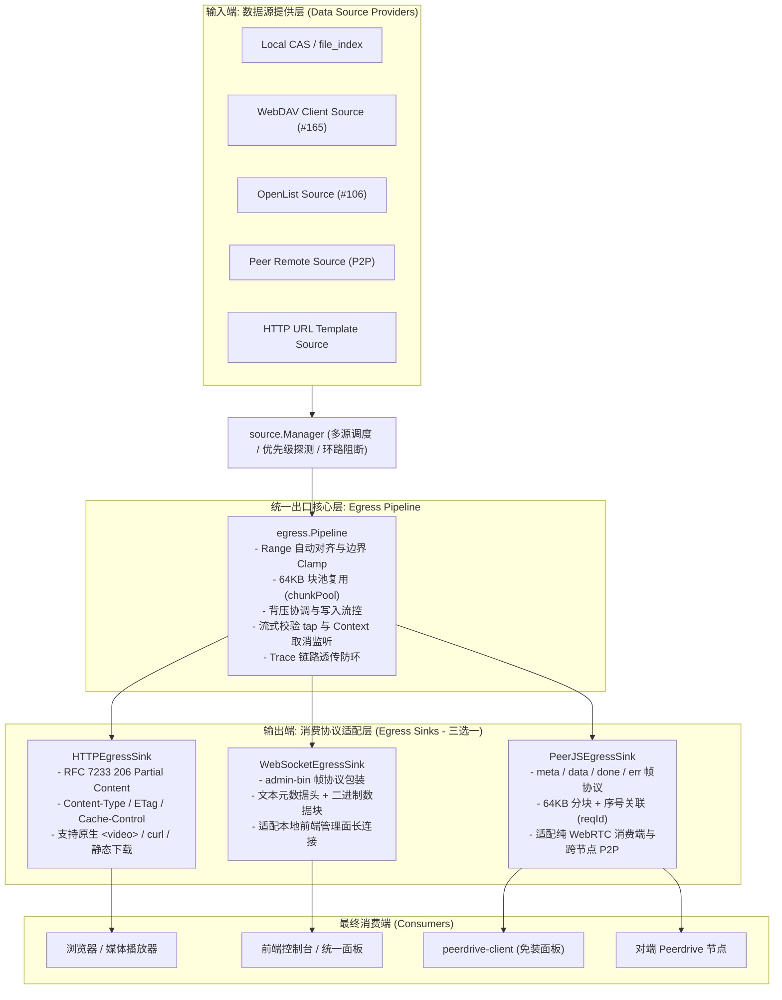

# 统一出口抽象架构设计规范 (UNIFIED-EGRESS-ABSTRACTION.md)

> 对应 Issue: #193  
> 状态: 架构设计完成 · 待分阶段实现  
> 关联规范: `doc/LAYERS.md` (架构总纲 v2), `doc/WEBDAV-SOURCE-EVALUATION.md` (#165), `doc/ROADMAP.md` (演进阶段), `doc/NETDISK.md` (网盘消费链路)

---

## 1. 背景与核心问题

### 1.1 输入端与输出端的概念边界混淆
在既有代码演进中，针对外部协议（如 WebDAV、OpenList、SMB、PeerJS、HTTP）的讨论容易陷入「服务 vs 客户端」的二元混淆：
- **数据提供端（Ingress / Data Provider）**：数据从何处来。WebDAV、OpenList、本地 CAS 存储、P2P 对端节点、外部 URL 模板、SMB 共享，在 Peerdrive 架构中**严格定位于上游数据源（Data Source）**。它们统一实现 `source.Source` 接口，注册入 `source.Manager`，对外屏蔽具体协议细节，向上层只暴露按 SHA-256 哈希定位与 Range 流式取数能力（`OpenStream(hash, offset, size)`）。
  - **核心事实**：WebDAV 只是数据提供端之一（作为客户端取数），Peerdrive **不充当 WebDAV 服务端**。
- **消费出口端（Egress / Consumer Delivery）**：数据向何处去。Peerdrive 节点作为数据提供者，需要向各种形态的消费端（浏览器前端、流媒体播放器、单文件免装面板、其他互联 Peer 节点、CLI 工具）下发数据。当前 Go 节点向消费端输出数据的形态为 **HTTP / WS / PeerJS 三选一**。

### 1.2 现状痛点：输出链路割裂
目前向消费端提供数据的三条管道（HTTP、WebSocket、PeerJS DataChannel）在实现上存在明显的逻辑割裂：
1. **逻辑重复与分散**：
   - PeerJS 数据面：在 `back/internal/transport/inbound.go` 的 `serveFile` 函数（约 300 行）中独立实现了路径判定、CAS 兜底、分块循环、缓冲池管理与写流控；
   - HTTP 接口面：在 `back/internal/controller/file.go` 中通过 Gin 上下文处理标准 HTTP 流与 Range 头；
   - WebSocket 管理面：在 `back/internal/transport/admin.go` 中针对 `admin-bin` 独立组装二进制分帧下发。
2. **能力与行为不一致**：
   - **Range 协商机制不统一**：PeerJS 的 `dcReq` 支持显式的 `Offset` / `Size`；HTTP 遵循 RFC 7233 的 `Range: bytes=start-end`；WebSocket 目前基本以单次完整二进制帧推送为主，缺乏统一的局部切片协议；
   - **流控与背压（Backpressure）机制割裂**：WebRTC DataChannel 依赖底层的 `BufferedAmountLowThreshold` 与全局 `lowWater` 条件广播；HTTP 依赖内核 TCP Socket 写阻塞；WebSocket 依赖连接级缓冲写入。若不进行抽象收敛，并发请求极易引发内存膨胀或协程饥饿；
   - **防环与 Trace 传播不对称**：PeerJS 的回源环路检测由 `dcReq.Trace`（`TraceKey`）深度支持；当消费端走 HTTP 或 WS 请求多源下发时，缺少标准化的回源链路追溯上下文；
   - **错误响应模型异构**：PeerJS 回复 `{type:"err", msg, code}` 帧；HTTP 回复 404/416/500 JSON；WS 回复 `admin-resp` 包装。

因此，亟需提炼**统一出口抽象（Unified Egress Abstraction）**，将「上游源取数」与「下游多形态分发」彻底解耦。

---

## 2. 统一出口抽象模型 (Unified Egress Abstraction)



---

## 3. 核心接口与管道模型设计

### 3.1 统一请求载荷：`EgressRequest`
无论来自 HTTP GET 请求、WebSocket 请求帧，还是 WebRTC DataChannel 的 `req` 帧，在进入传输管线前统一收敛为标准请求结构：

```go
package egress

import (
    "context"
)

// EgressRequest 消费端出流请求
type EgressRequest struct {
    Hash       string          // 必填：64hex SHA-256 内容哈希
    Offset     int64           // 偏移量（默认 0）
    Size       int64           // 请求长度（-1 表示读取至 EOF）
    Trace      []string        // 回源防环跟踪链（当前节点追加自己 ID）
    ReqID      string          // 请求标识（PeerJS/WS 用于响应关联；HTTP 可用于追踪日志）
    ClientID   string          // 消费端标识（对端 peerID、SessionID 或 RemoteAddr）
    IsLocal    bool            // 是否为本地管理会话（WS local / 127.0.0.1）
    Context    context.Context // 生命周期控制上下文
}
```

### 3.2 统一响应接收器接口：`EgressSink`
输出端适配器只需实现 `EgressSink` 接口，负责将通用数据事件翻译为对应传输协议的具体动作：

```go
package egress

// EgressMeta 内容元数据
type EgressMeta struct {
    Hash        string // 64hex SHA-256
    TotalSize   int64  // 内容总长度（字节）
    Offset      int64  // 实际响应起始偏移
    ContentSize int64  // 本次传输字节数
    MimeType    string // MIME 类型（如 video/mp4, image/png, application/octet-stream）
    ETag        string // HTTP 缓存指纹（即 hash 或带引号指纹）
    ReqID       string // 对应的请求 ID
}

// EgressSink 协议输出适配器接口
type EgressSink interface {
    // WriteMeta 发送元数据（HTTP: 发送状态码与 Headers; WS: 发送 admin-bin 声明帧; PeerJS: 发送 meta 帧）
    WriteMeta(meta EgressMeta) error

    // WriteChunk 发送单块数据载荷（默认 64KB 块）
    WriteChunk(offset int64, chunk []byte) error

    // WriteDone 传输正常结束信号（HTTP: 完成刷盘; WS/PeerJS: 发送 done 帧）
    WriteDone() error

    // WriteError 传输异常中止（HTTP: 4xx/5xx 响应; WS/PeerJS: 发送 err 帧）
    WriteError(code string, message string, httpStatus int) error

    // WaitForBackpressure 当底层传输写缓冲超过阈值时阻塞等待，保证写端不会撑爆内存
    WaitForBackpressure(ctx context.Context) error
}
```

### 3.3 统一流泵管线：`Pipeline`
`Pipeline` 作为领域核心，不依赖具体的 HTTP 或 WebRTC 库，纯粹负责调度与协调：

```go
package egress

import (
    "context"
    "fmt"
    "io"
    "peerdrive/internal/source"
)

// Pipeline 统一出口调度管线
type Pipeline struct {
    sources *source.Manager
}

func NewPipeline(mgr *source.Manager) *Pipeline {
    return &Pipeline{sources: mgr}
}

// Serve 执行端到端数据泵出
func (p *Pipeline) Serve(req EgressRequest, sink EgressSink) error {
    ctx := req.Context
    if ctx == nil {
        ctx = context.Background()
    }

    // 1. 防环检查（如果 Trace 包含当前节点，立刻阻断）
    // ...

    // 2. 从 SourceManager 获取内容与总大小
    // SourceManager.OpenStream 自动根据本地 CAS / file_index / WebDAV / Peer / URL 优先级择优命中
    stream, total, err := p.sources.OpenStreamWithTotal(ctx, req.Hash, req.Offset, req.Size, req.Trace)
    if err != nil {
        return sink.WriteError("NOT_FOUND", fmt.Sprintf("content not available: %v", err), 404)
    }
    defer stream.Close()

    // 3. 计算实际 Range 边界与 MIME
    actualOffset := req.Offset
    if actualOffset < 0 {
        actualOffset = 0
    }
    actualSize := req.Size
    if actualSize < 0 || actualOffset+actualSize > total {
        actualSize = total - actualOffset
    }

    meta := EgressMeta{
        Hash:        req.Hash,
        TotalSize:   total,
        Offset:      actualOffset,
        ContentSize: actualSize,
        MimeType:    GuessMimeType(req.Hash),
        ETag:        fmt.Sprintf("\"%s\"", req.Hash),
        ReqID:       req.ReqID,
    }

    if err := sink.WriteMeta(meta); err != nil {
        return err
    }

    // 4. 循环泵送（基于 64KB 块池）
    buf := GetChunkBuffer()
    defer PutChunkBuffer(buf)

    sent := int64(0)
    for sent < actualSize {
        select {
        case <-ctx.Done():
            return ctx.Err()
        default:
        }

        // 协调底层背压（DataChannel 缓冲区过大或网络拥塞）
        if err := sink.WaitForBackpressure(ctx); err != nil {
            return err
        }

        toRead := int64(len(buf))
        if remain := actualSize - sent; remain < toRead {
            toRead = remain
        }

        n, readErr := io.ReadFull(stream, buf[:toRead])
        if n > 0 {
            if err := sink.WriteChunk(actualOffset+sent, buf[:n]); err != nil {
                return err
            }
            sent += int64(n)
        }
        if readErr != nil {
            if readErr == io.EOF || readErr == io.ErrUnexpectedEOF {
                break
            }
            return sink.WriteError("READ_FAILED", readErr.Error(), 500)
        }
    }

    return sink.WriteDone()
}
```

---

## 4. 三大消费出口适配器详细规范

### 4.1 HTTP Egress 适配器 (`HTTPEgressSink`)
- **适用场景**：
  - 浏览器原生 `<video>` / `<audio>` 播放、直接下载、cURL 请求、第三方播放器挂载。
- **协议语义映射**：
  - `WriteMeta`：
    - 若 `meta.Offset > 0` 或 `meta.ContentSize < meta.TotalSize`，返回 HTTP 状态码 `206 Partial Content`，并填充响应头：
      - `Content-Range: bytes <offset>-<offset+size-1>/<total>`
      - `Accept-Ranges: bytes`
    - 若全量请求，返回 `200 OK`，填充 `Content-Length: <total>`；
    - 填充 `Content-Type: <mime>`，`ETag: <etag>`，`Cache-Control: public, max-age=31536000, immutable`（CAS 内容不可变，天然可强缓存）；
  - `WriteChunk`：直接调用 `ResponseWriter.Write(chunk)`；若支持 `http.Flusher`，每块写入后按需 Flush；
  - `WriteDone`：正常返回结束；
  - `WriteError`：若 Header 尚未发出，返回对应状态码（404/416/500）与标准 JSON 错误体。

### 4.2 WebSocket Egress 适配器 (`WebSocketEgressSink`)
- **适用场景**：
  - 本地前端单页面（SPA）管理面会话（`/ws/peer`）、跨窗口长连接通信。
- **协议语义映射**：
  - `WriteMeta`：
    - 下发声明帧（文本 JSON）：`{"type":"admin-bin", "hash":meta.Hash, "total":meta.TotalSize, "mime":meta.MimeType, "reqId":meta.ReqID}`；
  - `WriteChunk`：
    - 以 WebSocket 二进制帧（Opcode 0x2）形式直接推送字节块；
  - `WriteDone`：
    - 无需额外控制帧，或者下发结束状态回执；
  - `WaitForBackpressure`：
    - 监听 WebSocket 连接写入通道的水位，避免快读慢写导致缓冲区暴涨。

### 4.3 PeerJS DataChannel Egress 适配器 (`PeerJSEgressSink`)
- **适用场景**：
  - WebRTC P2P 互联节点直传、免安装单文件网盘面板（`packages/peerdrive-client`）。
- **协议语义映射**：
  - 完全遵循 Peerdrive 既有的 DataChannel 帧协议：
  - `WriteMeta`：
    - 发送 `meta` 帧（文本 JSON）：`{"type":"meta", "hash":meta.Hash, "total":meta.TotalSize, "reqId":meta.ReqID}`；
  - `WriteChunk`：
    - 组装单帧：`{"type":"data", "hash":meta.Hash, "offset":offset, "size":len(chunk), "reqId":meta.ReqID}` 声明帧紧随数据块（采用 `Connection.SendFrame`）；
  - `WriteDone`：
    - 发送 `done` 帧：`{"type":"done", "hash":meta.Hash, "reqId":meta.ReqID}`；
  - `WriteError`：
    - 发送 `err` 帧：`{"type":"err", "hash":meta.Hash, "msg":message, "code":code, "reqId":meta.ReqID}`；
  - `WaitForBackpressure`：
    - 读取 WebRTC DataChannel 的 `BufferedAmount`，若超过设定高水位（例如 1MB），挂起并等待 `OnBufferedAmountLow`（低水位回调）触发唤醒。

---

## 5. 端到端协同链路示例：WebDAV 取数到三形态下发

以「用户通过 Peerdrive 访问挂载在外部 WebDAV 上的高清视频」为例，全链路交互如下：

```
[消费端请求: HTTP / WS / PeerJS 任选其一]
                      │
                      ▼
            [EgressRequest 归一化]
                      │
                      ▼
             [egress.Pipeline]
                      │
                      ▼
         [source.Manager.OpenStream]
                      │ (路由命中 WebDAVSource)
                      ▼
        [WebDAVSource.OpenStream]
                      │ (按需下推 HTTP Range)
                      ▼
  [外部 WebDAV 服务 (Nextcloud / Alist)]
  GET /remote.php/webdav/video.mp4 (Range: bytes=1000-66535)
                      │
                      ▼ (流式返回分片)
             [egress.Pipeline] (64KB 块池边读边泵)
                      │
         ┌────────────┼────────────┐
         ▼            ▼            ▼
   [HTTP Adapter] [WS Adapter] [PeerJS Adapter]
   HTTP 206 流    admin-bin    DataChannel 块
         │            │            │
         ▼            ▼            ▼
   原生 <video>   前端播放器    P2P 对端节点 / 面板
```

无论消费端采用何种方式连接（本地 Web 页面走 WS，外部播放器走 HTTP，远程好友走 PeerJS），核心数据流转均遵循同一套背压与分块策略，实现了全链路：
1. **零多余内存堆积**：流式直接搬运，不将数 GB 文件落盘或驻留 RAM；
2. **端到端 Range 直通**：上游支持 HTTP Range 下推，下游支持三通道局部切片；
3. **架构完全正交**：新增数据提供端（如 SMB）或新增导出形态（如 QUIC/WebTransport）时，两端各自单向扩充，无需交叉改动。

---

## 6. 三阶段实施计划

- **阶段 1：设计规范与接口契约固化（本 Issue #193 与 PR 落地）**
  - 明确数据提供端（WebDAV）与消费端（HTTP/WS/PeerJS）的二元正交关系；
  - 确立 `EgressRequest`、`EgressSink`、`Pipeline` 的结构与行为规范；
  - 保持与 `doc/LAYERS.md` 及既有代码体系的 100% 引用兼容。
- **阶段 2：后端核心管道实现与 `serveFile` 重构**
  - 在 `internal/egress` 建立管道包；
  - 将 `back/internal/transport/inbound.go` 的 `serveFile` 下发逻辑重构为使用 `PeerJSEgressSink`；
  - 补充针对不同 Sink 的单元测试与背压模拟测试。
- **阶段 3：全出口统一收敛与 WebDAV 客户端接入**
  - 将 HTTP 下载与 WS `admin-bin` 迁移至 `egress.Pipeline`；
  - 依照 #165 规范正式接入 `WebDAVSource`，完成「WebDAV 提供端 $\rightarrow$ 统一出口 $\rightarrow$ 三选一消费端」的完整闭环。
