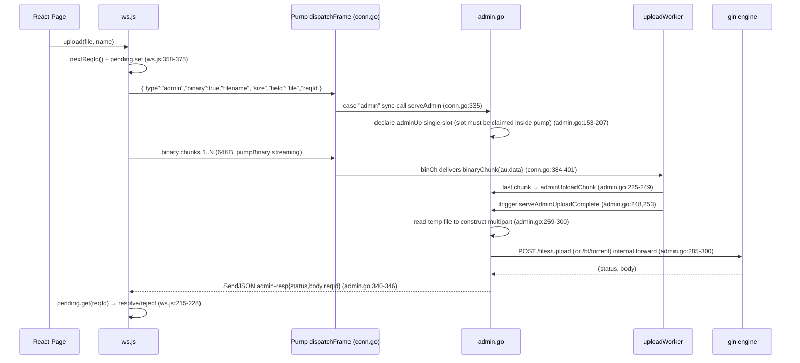

# Connection 01: frontend ↔ backend (local WS session)

- **Modules involved**: `../modules/13-frontend.md` and `../modules/04-router.md` (the backend surface is actually carried by `../modules/09-transport.md`'s `WSSession`/`PeerJSService.bindConn`, internally forwarded back to the gin engine via `admin.go`)
- **Code locations**: A side `front/src/ws.js` (session client: connect, heartbeat, reconnect, reqId routing, `admin/upload/download/stat/downloadStream`; pages call it directly since 2026-10-07), `packages/peerdrive-client/src/protocol.js` (pure function definitions for the frame protocol, character-by-character aligned with the Go side), `front/src/lib/nodeSession.js` (cross-page node session reference, no network behavior); B side `back/internal/router/peerjs_routes.go` (`/ws/peer` upgrade + Origin/loopback whitelist + `BindLocal`), `back/internal/transport/admin.go` (`admin` verb internal forward to gin engine), `back/internal/transport/conn.go` (`bindConn`/`dispatchFrame` frame pump and `adminUp` collection), `back/internal/transport/ws_session.go` (`WSSession` adapter, ping/pong keepalive), `back/internal/router/router.go:396-415` (`SetAdminHandler` injects gin engine)
- **Direction**: bidirectional (browser ↔ local backend: control plane admin + file data plane req/upload share a single WS connection; HTTP endpoints are retained as legacy for old clients/curl/integration tests, the frontend production path no longer fetches HTTP)

## 1. Connection Method

**Channel type: WebSocket (a single persistent connection between browser and backend process)**. Frontend and backend establish a `WSSession` via `GET /ws/peer` (backend ID fixed as `"local"`, `back/internal/transport/peerjs_service.go:313-319`; `NewWSSession("local", conn)`, `peerjs_routes.go:182-183`), **the same connection carries both the control plane and the file data plane**, with both ends reusing the DataChannel frame protocol:

- **Text frames = JSON control headers**; **binary frames = data chunks**; `SendFrame` guarantees atomic contiguity of "JSON header + immediately following binary body" (`ws_session.go:98-111`); the frontend routes using a single-slot `binaryExpect` based on the "most recent binary declaration header" (`front/src/ws.js:49-51,229-251,291-313`).
- **Frame protocol** (identical to the remote DataChannel, do not change; character-by-character aligned with `conn.go:13-26` and `front/src/lib/pd-client/protocol.js:1-24`):
  - Admin plane: `{"type":"admin","method","path","body","token","reqId"}` → response `{"type":"admin-resp","status","body","reqId"}` or binary declaration `{"type":"admin-bin","status","size","reqId"}` followed by a binary frame; error `{"type":"err","msg","reqId"}` (`front/src/ws.js:9-16`; `back/internal/transport/admin.go:55-92`).
  - Binary upload: admin frame with `binary:true` + `filename/field/size` declaration, followed by binary chunks; the backend constructs a multipart/form-data request after receiving all chunks and forwards to `body.path` (default `/files/upload`, BT torrent uses `/bt/torrent` + `field:"torrent"`), `admin.go:64-69, 153-208`; `adminBinMax = 64MB` (`admin.go:45`), `adminUploadTimeout = 30s` (`admin.go:49`).
  - File data plane: `{"type":"req","hash","offset","size","reqId"}` → `{"type":"meta","total","reqId"}` + `{"type":"data","size","reqId"}` with binary chunks… + `{"type":"done"}` or `{"type":"err"}` (`front/src/ws.js:17-20`; `serveFile` in `conn.go:297-306`).
- **reqId concurrent routing**: the connection is **single-connection reused**; all frontend pending requests are paired by reqId (`front/src/ws.js:39-40,198-201,344-349`); reqId is generated as `w+timestamp+sequence`; backend `connState.expect` / `fetches` / `adminUp` single-slot state pairs by reqId or frame sequence (`conn.go:384-401`).
- **Authentication**:
  - Handshake phase: WebSocket upgrade checks `Origin` whitelist (`peerjs_routes.go:159-176`, `peerjsCfg.IsOriginAllowed`); when no Origin is present, only loopback remote is allowed (`isLoopbackRemote`, `peerjs_routes.go:54-66`) — prevents curl/wscat requests without Origin from obtaining full admin access.
  - Request phase: the frontend puts the token obtained by `getAuthToken()` into the admin frame `token` field (`front/src/ws.js:53-61,345`); the backend `serveAdmin` injects the `Authorization` header when forwarding; gin's `AuthRequired` middleware validates identically to HTTP (`admin.go:26-27`; the `SetAdminHandler` closure for internal forwarding in `router.go:400-415`).
  - WebRTC/PeerJS sessions **deliberately do not implement admin verb**: `serveAdmin`'s first line `if c.ID() != "local"` returns `err` directly (`admin.go:136-140`), preventing admin surface exposure (file header comment `admin.go:5-11`; user decision, frontend side corresponds to `front/src/ws.js:30-31`).
- **When/who establishes the connection**: **lazily established by the frontend on demand** (`ws.js:152-196`) — only when `sock==null` on the first call to `admin/upload/download/stat/downloadStream` does `new WebSocket(wsUrl(getWsBase()) + '/ws/peer')` happen (`ws.js:154-160`); the backend, after assembling `peerjsService` in `main`, calls `registerPeerJSRoutes` to mount `GET /ws/peer` (`peerjs_routes.go:74-184`), and immediately `BindLocal` on handshake success. The frontend `getWsBase()` reads `localStorage.peerdrive_api_base`, defaulting to `https://wsl-3000.moonchan.xyz` (`ws.js:63-65`; `api.js:18,28-30`); the protocol prefix is automatically mapped from `https?://` to `wss://|ws://` (`ws.js:33-36`).

**Why not direct HTTP**: The frame protocol naturally covers the file data plane (req/meta/data/done/err + upload), but writing verbs individually for collection/auth/BT/IPFS/task admin plane operations would be massive duplicated effort; the backend adds an admin verb on the local WS session (`admin.go:3-8,13-19`), translating admin frames into internal `*http.Request` and injecting into the gin engine, reusing all controllers (0 duplicate implementations). HTTP endpoints are retained as legacy; the frontend production path no longer fetches (`front/src/api.js:1-7,155-160`).

## 2. Timing

### 2.1 Connection Establishment + First Admin Request (`admin(method,path,body)`)

```mermaid
sequenceDiagram
  participant UI as React Page
  participant API as api.js request()
  participant WS as ws.js (WS client)
  participant B as Backend /ws/peer (gin)
  participant S as PeerJSService.bindConn
  participant A as admin.go serveAdmin
  participant G as gin engine (controller)

  UI->>API: request('GET','/files/list')
  API->>WS: ws.admin('GET','/files/list')
  WS->>WS: sock==null → new WebSocket(wss://host/ws/peer) (ws.js:154-160)
  WS->>B: WS handshake GET /ws/peer (Origin: ...)
  B->>B: CheckOrigin whitelist check (peerjs_routes.go:159-176)
  B-->>WS: 101 Switching Protocols
  B->>S: NewWSSession("local", conn) + BindLocal(sess) (peerjs_routes.go:182-183)
  S->>S: dedupConn / bindConn: attach OnMessage/OnClose、uploadWorker、fwdWorker (conn.go:228-268)
  WS->>WS: sock.onopen → setStatus('open') + startHeartbeat (ws.js:165-169)
  WS->>S: {"type":"admin","method":"GET","path":"/files/list","token":"...","reqId":"w…"}
  S->>S: dispatchFrame parse JSON (conn.go:278-295)
  S->>A: case "admin" sync-call serveAdmin (conn.go:328-335)
  A->>A: c.ID()=="local" check; inject token into Authorization header (admin.go:136-140, 217)
  A->>G: construct internal *http.Request → httptest.ServeHTTP (admin.go:222, router.go:403-414)
  G-->>A: (status, body, contentType)
  A-->>S: SendJSON admin-resp{status, body, reqId} (admin.go:340-346)
  S-->>WS: text frame
  WS->>WS: handleText case "admin-resp" → pending.get(reqId) pair (ws.js:215-228)
  alt status >= 400
    WS-->>API: reject Error{status, data}
  else
    WS-->>API: resolve(body)
  end
  API-->>UI: result / throw error
```

### 2.2 File Download (`req` verb, same frame set as DataChannel)

```mermaid
sequenceDiagram
  participant UI as React Page
  participant WS as ws.js
  participant S as Backend serveFile (conn.go)

  UI->>WS: download(hash)
  WS->>WS: nextReqId() + pending.set (ws.js:430-440)
  WS->>S: {"type":"req","hash","offset":0,"size":-1,"reqId"}
  S->>S: dispatchFrame case "req" → go serveFile (conn.go:297-306)
  S-->>WS: {"type":"meta","total","reqId"}
  WS->>WS: kind=='stat' only resolve total; download ignored (ws.js:254-262)
  loop each 64KB chunk
    S->>S: SendFrame(data header + binary chunk) (ws_session.go:98-111)
    S-->>WS: text frame data{size,reqId} + binary chunk
    WS->>WS: data header → set binaryExpect slot; binary frame belongs to binaryExpect (ws.js:242-253,291-313)
  end
  S-->>WS: {"type":"done","reqId"}
  WS->>WS: clear binaryExpect, assemble all chunks, resolve (ws.js:263-277,327-336)
```

### 2.3 Binary Upload (admin + binary declaration + chunks)



### 2.4 Step-by-Step Explanation

1. **Lazy connection establishment**: all five entry points `admin/upload/download/stat/downloadStream` start with `connect()` (`ws.js:339-341,358-360,430-432,450-452,479-481`); `connect()` is idempotent (`sock._wsHandlers` marker, `ws.js:161-163`) — the first call issues one `new WebSocket`, subsequent calls reuse the same connection.
2. **Handshake validation**: gin's `Upgrader.CheckOrigin` first checks the Origin whitelist (`peerjs_routes.go:160-176`); without Origin, only local loopback is allowed (`isLoopbackRemote`). Handshake failure → `c.JSON(400, ...)` (`peerjs_routes.go:178-180`). On successful handshake, immediately `NewWSSession("local", conn)` + `peerjsService.BindLocal(sess)` (`peerjs_routes.go:182-183`); inside `NewWSSession`: `SetReadLimit(3*64KB)`, `SetReadDeadline(90s)`, `SetPongHandler` refreshes read timeout, starts `readLoop` and `heartbeatLoop` (ping every 30s, `ws_session.go:44-78`).
3. **Message dispatch**: the backend `bindConn` immediately attaches `OnMessage(dispatchFrame)` (`conn.go:259`, **must happen before any potentially yielding operation**, to avoid the peer's first frame being dropped; see comment `conn.go:250-258`), then starts `uploadWorker` and `fwdWorker`, and finally `pskSendAuth` (`conn.go:262-268`). `dispatchFrame` parses the JSON header and dispatches by `type`: `case "admin"` **synchronously** calls `serveAdmin` (`conn.go:328-335`; synchrony is a hard constraint — the binary declaration's `adminUp` slot claim must be completed within the pump, otherwise when subsequent binary chunks arrive, `adminUp` is still empty and all chunks are lost; see comment `conn.go:271-277, 332-334`).
4. **Admin internal forwarding**: `serveAdmin` first validates `c.ID()=="local"` (`admin.go:136-140`, non-local returns err uniformly), then parses `adminReq` (`admin.go:141-149`). JSON request path: `buildAdminRequest` constructs an internal `*http.Request` (`admin.go:217`) → `go dispatchAdmin` async forwards (`admin.go:222`), because internal HTTP forwarding can be slow (large lists/slow clients); offloading from the pump avoids blocking other frames on the same connection (`admin.go:211-212`). Response passes through `adminBinMax=64MB` check; exceeding the limit returns 413 with a hint to use the req verb for chunking (`admin.go:343-345`).
5. **Frontend reqId routing**: `handleText` dispatches by `msg.type`: `admin-resp` → `pending.get(reqId)` pairing, `status>=400` constructs `Error{status,data}` consistent with the fetch version (structured error bodies like 409 conflict lists are available, `ws.js:215-228`); `admin-bin` → sets `binaryExpect` single slot, size=0 directly `finishBinaryExpect` (`ws.js:229-241`); `data` header → sets `binaryExpect` (`ws.js:242-253`); `meta` only meaningful for `kind=='stat'` (`ws.js:254-262`); `done` → clears `binaryExpect`, `assemble` all chunks, `resolve` (`ws.js:263-277`); `err` → `pending.get(reqId).reject` (`ws.js:279-285`).
6. **binaryExpect single-slot routing**: `handleBinary` only consumes binary frames when `binaryExpect` is non-empty, accumulating to `size` then processing by `type` (`ws.js:291-313`). **Semantics are identical to the backend connection-level expect** (backend `SendFrame` guarantees header+chunk atomic contiguity, see `ws_session.go:98-111`; `conn.go:20-24` comment) — this is the hard constraint that "a binary frame must belong to the most recently declared data/admin-bin header"; breaking it causes silent misalignment.
7. **Heartbeat + dead connection detection**: `startHeartbeat` sends `admin('GET','/ping')` every 25s (`ws.js:124-139`); `lastRecv` is the timestamp of any inbound frame (`ws.js:171-178`); exceeding `STALE_MS=60s` triggers active `sock.close()` for reconnect (`ws.js:130-133`). **Note**: the `admin` heartbeat reuses the request path, `handleText` goes through the admin-resp branch; since the heartbeat's `reqId` has no corresponding pending entry, `pending.get(msg.reqId)` returns undefined and is silently ignored — the heartbeat both probes liveness and maintains it.
8. **Disconnect reconnect**: `onclose` rejects all pending, clears `binaryExpect`, `sock=null`, `setStatus('closed')`; if `sock._wsOwned` (connection created by this module, not a test-injected mock) then `scheduleReconnect` with exponential backoff (`RETRY_MIN_MS=1s` → `RETRY_MAX_MS=30s`, `ws.js:83-86,141-150,179-191`). `onerror` only `close()`s, letting `onclose` handle unified cleanup (`ws.js:192-195`).
9. **Admin surface only exposed on local WS**: WebRTC/PeerJS connections receiving admin frames are rejected inside `serveAdmin` (`admin.go:136-140`). The frontend production path also no longer has fetch HTTP calls (`api.js:2-7,155-160`); HTTP endpoints are legacy only (`router.go:14-18` header comment).
10. **Frontend page/component consumption**: all exported endpoint functions in `api.js` eventually land on `ws.admin(method,path,body)` (`api.js:158-160`); file downloads go through `ws.download/downloadToFile` (`api.js:164-168`). `lib/nodeSession.js` only stores the remote node session reference (PeerJS DataChannel client), **not involving this connection** — this connection manages the "local node" (`local`), while the remote node goes through the DataChannel path in `lib/pd-client/` (a separate connection, see `../modules/13-frontend.md` §1 table and `07-transport-peerjs.md`).

## 3. Case Handling

| Exception/Edge Case | Behavior & Rationale (code location) | Description |
|---|---|---|
| **Timeout** | ① Backend WS read timeout 90s (`ws_session.go:52`), `SetPongHandler` refreshes on pong receipt; heartbeat goroutine pings every 30s (`ws_session.go:67-78`) — dead connection with no pong within 90s → read timeout → `readLoop` errors out → `Close()` cleans up session. ② Frontend heartbeat every 25s (`ws.js:83,124-139`), `STALE_MS=60s` with no inbound frame triggers active `close()` for reconnect (`ws.js:84,130-133`). ③ Admin upload collection timeout 30s (`admin.go:49`); `time.Since(au.created) > adminUploadTimeout` inside `adminUploadChunk` checks timeout and aborts with err (`conn.go:384-401`, `admin.go:243-247`). ④ `req` verb managed by `serveFile` itself for chunking and timeout (`conn.go:297-306`, see `../modules/09-transport.md` for details). ⑤ **Frontend `reqId` has no request-level timeout** — relies only on disconnect reject and heartbeat timeout as fallback; `idleTimeoutMs/openTimeoutMs/verbTimeoutMs` in `pd-client/client.js:67-74` are only for the remote DataChannel consumer, not for this connection. | Backend and frontend each have their own heartbeat/dead connection detection, with symmetric semantics: either side detecting death leads to `onclose`/`Close()` for resource release. |
| **Disconnect / Reconnect** | Backend close: `readLoop` error → `defer Close()` (`ws_session.go:142-155`) → `OnClose` triggers `cleanupConn` (`conn.go:427-469`): unregister connection, clear `adminUp` temp files (order: close handle first then delete file, Windows compatible, `conn.go:446-450`), notify all `fetches.errCh`, close `fwd.out`. Frontend close: `onclose` rejects all pending + clears `binaryExpect` + `sock=null` (`ws.js:179-191`); `_wsOwned` triggers `scheduleReconnect` with exponential backoff (1s→2s→…→30s, `ws.js:141-150`). Retry limit is unbounded (30s repeated attempts); `retryDelay` resets to 1s on successful `onopen` (`ws.js:165-168`). | Single connection reuse means one disconnect affects all pending requests; rejecting all is expected behavior. Reconnect is frontend-driven; the backend does not actively dial (this is WS, not WebRTC, direction is fixed). |
| **Duplicate / Concurrent** | ① Concurrent download of same hash: each `download()` generates a new reqId; backend `connState.fetches` is a map (`conn.go:239-244,451`), no interference. ② Concurrent admin requests of same type: `pending` map distinguishes by reqId (`ws.js:40`), no dedup. ③ Admin binary upload **connection-level single slot**: when a new declaration frame arrives and the previous slot is not fully received, `serveAdmin` proactively clears the old temp file and returns `err:"admin upload replaced by new declaration"` for the old reqId (`admin.go:165-177`) — prevents browser Promise from hanging indefinitely. ④ Frontend `getBlobUrl` has concurrent dedup (`blobUrlInflight`, `api.js:186-194`) to avoid duplicate downloads. | Apart from the admin upload single slot, all requests are fully concurrent. The single-slot design is because upload chunks arrive in streaming order and cannot be split by reqId after the fact — this is intentional design, not a defect. |
| **Data missing or validation failure** | ① Admin frame format invalid (`Method==""` or `Path==""`) → err `invalid admin request` (`admin.go:141-145`). ② `adminHandler==nil` (router not assembled) → err `admin handler not configured` (`admin.go:146-149`). ③ Admin upload `Size<0` or `>64MB` → err `invalid admin upload size` (`admin.go:156-159`). ④ Admin upload chunks fully received but `au.got < au.size` (browser abandoned) → err `upload aborted: incomplete` (`admin.go:255-257`); declared size doesn't match actual or timeout → err `upload aborted: size mismatch or timeout` (`admin.go:243-247`). ⑤ Admin response body > `adminBinMax` → 413 `admin binary response exceeds 64MB limit; use req verb streaming` (`admin.go:343-345`). ⑥ `req` frame hash invalid or non-existent returns err frame from `serveFile` (`conn.go:297-306`, see `../modules/09-transport.md`). ⑦ Frontend `handleBinary` silently discards when no `binaryExpect` (`ws.js:294-295`) — protects subsequent requests from being polluted by late-arriving chunks. | All err frames carry reqId (when possible); when `pending.get(reqId)` on the frontend doesn't find a match, it's silently ignored — prevents non-target requests from being erroneously resolved/rejected. |
| **Auth failure** | ① Handshake phase: Origin not in whitelist → upgrade rejected (`peerjs_routes.go:160-176`); no Origin and non-loopback → rejected (`peerjs_routes.go:169`). ② Request phase: admin frame `token` empty/incorrect → gin `AuthRequired` middleware returns 401 by HTTP semantics on internal forward (`admin.go:26-27`; `router.go:112-119`), returns via `admin-resp{status:401}`; frontend `ws.admin` converts to `Error.status=401` reject (`ws.js:219-223`). ③ Session ID validation: WebRTC connection sending admin frame → err `admin verb is only allowed on the local session` (`admin.go:136-140`). ④ When `RegistrationServer` is not configured, `AuthRequired` passes locally (single-machine mode), semantics same as HTTP surface (see `../modules/04-router.md`). | The key defense is the three layers of `c.ID()=="local"` + Origin whitelist + loopback fallback: bypassing any layer (e.g., reverse proxy not configured with TrustedProxies) could expose the admin surface. `isLoopbackRemote` deliberately doesn't use XFF (`peerjs_routes.go:54-58`). |
| **Half-open state** | ① Connection object exists but is dead: the browser side may not trigger `onclose` for minutes; relies on 25s heartbeat + 60s `STALE_MS` for active `close()` (`ws.js:67-86,124-139`). ② Backend read loop hung: relies on 90s `ReadDeadline` + 30s ping fallback (`ws_session.go:44-78`). ③ `adminHandler` assembly-time vs runtime race: `SetAdminHandler` uses `adminMu` protection (`admin.go:352-360`); comment explains "set during assembly, read-only thereafter" (`admin.go:355`) — if assembly is missed, `serveAdmin` returns err `admin handler not configured` directly (`admin.go:146-149`). ④ When `sock.readyState !== WebSocket.OPEN` (`CONNECTING`), all three entry points (`admin/upload/download`) return `Promise.reject(new Error('ws: not connected'))` (`ws.js:341-343,360-362,432-434,452-454,481-483`) — prevents `sock.send` from synchronously throwing `InvalidStateError` causing pending leaks. ⑤ Empty admin-bin response: `binaryExpect.size==0` immediately `finishBinaryExpect` + clear slot (`ws.js:234-239`), otherwise the residual single slot would misattribute the next unrelated binary frame to a completed request. | "Half-open" in this connection has two layers: network layer (browser/backend heartbeat + ReadDeadline fallback) and protocol layer (timing of `binaryExpect` single-slot clearing, `adminUp` empty file immediate slot removal, `admin.go:195-204`). |
| **Process restart** | ① Backend restart: all `WSSession` instances lost, `s.conns`/`s.pending` maps cleared (`conn.go:228-248`); frontend heartbeat's next 25s probe fails → 60s `STALE_MS` triggers active close → auto reconnect within 30s (`ws.js:141-150`). ② Frontend restart: `sock` module-level variable resets; `connect()` idempotently rebuilds (`ws.js:154-160`). ③ Backend assembly: `router.SetupRouter` calls `peerjsService.SetAdminHandler(...)` after injecting `peerjsService` (`router.go:402-415`); the internal forwarding closure uses `httptest.NewRecorder()` to reuse the gin engine; `req.RemoteAddr=="127.0.0.1:0"` avoids rate-limit false positives (`router.go:404-410`). ④ `adminUploadState` temp files: connection close cleaned by `cleanupConn` (`conn.go:446-450`); abnormal process exit cleaned by the OS (temp directory), no persistent residue. ⑤ Tokens and backend addresses in localStorage persist across restarts (`api.js:9-11,63-67`), automatically reused on next connection. | No "session recovery" concept; frontend auto-reconnect is the only restart self-healing mechanism; recovery time = backend startup time + frontend backoff (≤30s). |
| **Protocol misalignment (when hard constraints are broken)** | ① Data headers must be text frames, chunks must be binary frames (`protocol.js:16-22`); sending chunks as JSON arrays would be parsed as control frames (Go side `dispatchFrame` `msg.IsText` check, `conn.go:279`). ② Data headers and chunks must be atomically contiguous (backend `SendFrame` uses `sendMu` serialization, `ws_session.go:98-111`); interleaved sending causes "most recent data header" single-slot routing to go haywire. ③ Field names must be character-by-character aligned (`reqId` not `req_id`), otherwise the peer can't route and the request hangs until timeout (`protocol.js:22-24`). ④ Frontend `binaryExpect` and backend connection-level `expect` semantics must be consistent; breaking them causes silent misalignment (`ws.js:49-51,22-31` header comment). | These constraints "won't error when broken, just silently misalign" (`protocol.js:16`) — this is the part of this connection most in need of documentation. |

## 4. Related Documents

- Connection documents (same directory):
  - [02-router-controller.md](02-router-controller.md): the landing point for this connection's backend surface — `SetAdminHandler` internal forwarding reuses the router's gin engine and global middleware (auth/rate-limit/CORS, `router.go:400-415`); admin frames eventually call the controller handler registered by the router.
  - [03-controller-service.md](03-controller-service.md): the next hop after admin forwarding reaches the controller.
  - [05-router-source.md](05-router-source.md): admin frame forwarding to source endpoints like `/p2p/pull*`.
  - [06-service-transport.md](06-service-transport.md): admin frame forwarding to endpoints like `/peerjs/fetch` triggers cross-node pull.
  - [07-transport-peerjs.md](07-transport-peerjs.md): **the other carrier of the frame protocol** — this connection's local WS frame protocol is completely identical to DataChannel (`ws_session.go:31-33`); the frontend `lib/pd-client/protocol.js` and the backend `conn.go` share the same character-by-character alignment (`protocol.js:1-24`).
  - [08-transport-signalserver.md](08-transport-signalserver.md): PeerJS signaling surface (for remote connections), unrelated to this connection's local WS but sharing `peerjsService` assembly.
  - [11-transport-storage.md](11-transport-storage.md): the final landing point for `req` verb pulled content (CAS storage reads).
  - [12-frontend-signalserver.md](12-frontend-signalserver.md): frontend PeerJS consumer connects directly to remote via signaling; this is a parallel second network surface alongside the local WS session (see `../modules/13-frontend.md` §1 table).
  - [13-media-node-ech.md](13-media-node-ech.md): independent `go-peerjs` instance, no data plane interaction.
- Module documents: `../modules/13-frontend.md` (frontend SPA positioning, two surfaces, `ws.js` lifecycle and state machine), `../modules/04-router.md` (gin engine assembly, middleware, `SetAdminHandler` injection point), `../modules/09-transport.md` (`WSSession`/`PeerJSService`, `bindConn` dispatch, `connState` state, `serveAdmin`/`serveFile` frame handling), `../modules/10-peerjs.md` (DataChannel frame protocol same origin, PSK gating vs local WS session comparison).
