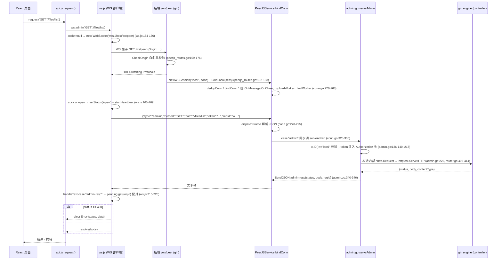
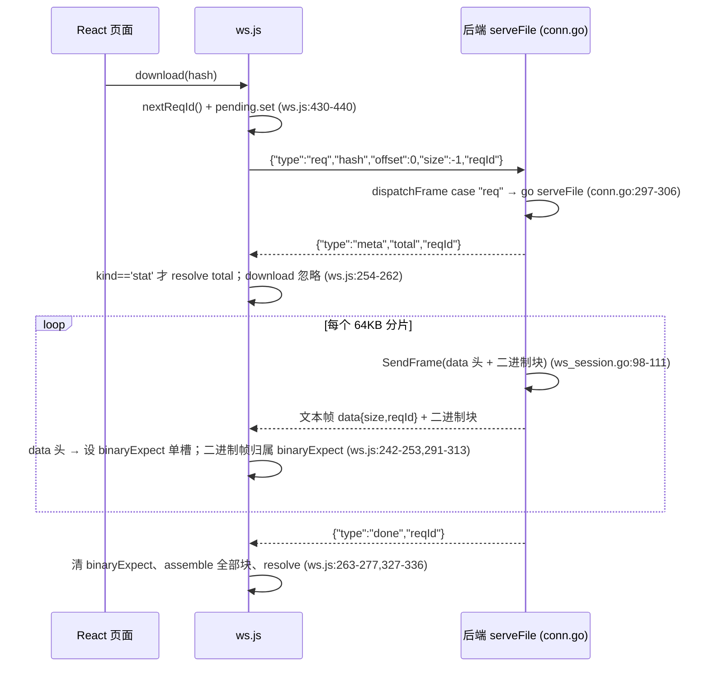
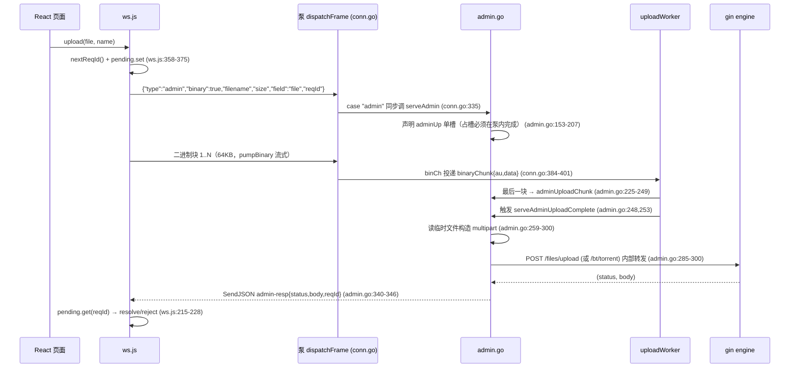

# 连接 01：frontend ↔ backend（本地 WS 会话）

- **涉及模块**：`../modules/13-frontend.md` 与 `../modules/04-router.md`（后端面实际由 `../modules/09-transport.md` 的 `WSSession`/`PeerJSService.bindConn` 承载，经 `admin.go` 内部转发回 gin engine）
- **代码位置**：A 侧 `front/src/ws.js`（会话客户端：连接、心跳、重连、reqId 路由、`admin/upload/download/stat/downloadStream`）、`front/src/api.js`（页面 → WS 语义桥：`request()` = `ws.admin()`）、`front/src/lib/pd-client/protocol.js`（帧协议纯函数定义，与 Go 侧逐字对齐）、`front/src/lib/nodeSession.js`（跨页面节点会话引用，无网络行为）；B 侧 `back/internal/router/peerjs_routes.go`（`/ws/peer` 升级 + Origin/loopback 白名单 + `BindLocal`）、`back/internal/transport/admin.go`（`admin` verb 内部转发 gin engine）、`back/internal/transport/conn.go`（`bindConn`/`dispatchFrame` 帧泵与 `adminUp` 收集）、`back/internal/transport/ws_session.go`（`WSSession` 适配器、ping/pong 保活）、`back/internal/router/router.go:396-415`（`SetAdminHandler` 注入 gin engine）
- **方向**：双向（浏览器 ↔ 本机后端：控制面 admin + 文件数据面 req/upload 共用一条 WS 连接；HTTP 端点仍保留为 legacy 兼容旧客户端/curl/集成测试，前端生产路径不再 fetch HTTP）

## 1. 连接方式

**通道类型：WebSocket（浏览器与后端进程之间的单条持久连接）**。前后端通过 `GET /ws/peer` 建立一条 `WSSession`（后端 ID 固定为 `"local"`，`back/internal/transport/peerjs_service.go:313-319`；`NewWSSession("local", conn)`，`peerjs_routes.go:182-183`），**同一连接同时承载控制面与文件数据面**，两端复用 DataChannel 帧协议：

- **文本帧 = JSON 控制头**；**二进制帧 = 数据块**；`SendFrame` 保证「JSON 头 + 紧随的二进制体」原子连续（`ws_session.go:98-111`），前端据此用「最近二进制声明头」单槽 `binaryExpect` 做路由（`front/src/ws.js:49-51,229-251,291-313`）。
- **帧协议**（与远端 DataChannel 完全一致，勿改；逐字对齐 `conn.go:13-26` 与 `front/src/lib/pd-client/protocol.js:1-24`）：
  - 管理面：`{"type":"admin","method","path","body","token","reqId"}` → 响应 `{"type":"admin-resp","status","body","reqId"}` 或二进制声明 `{"type":"admin-bin","status","size","reqId"}` + 紧随一个二进制帧；错误 `{"type":"err","msg","reqId"}`（`front/src/ws.js:9-16`；`back/internal/transport/admin.go:55-92`）。
  - 二进制上传：admin 帧带 `binary:true` + `filename/field/size` 声明后，紧随二进制块；后端收齐后构造 multipart/form-data 转发到 `body.path`（默认 `/files/upload`，BT torrent 用 `/bt/torrent` + `field:"torrent"`），`admin.go:64-69, 153-208`；`adminBinMax = 64MB`（`admin.go:45`），`adminUploadTimeout = 30s`（`admin.go:49`）。
  - 文件数据面：`{"type":"req","hash","offset","size","reqId"}` → `{"type":"meta","total","reqId"}` + `{"type":"data","size","reqId"}` 与二进制块… + `{"type":"done"}` 或 `{"type":"err"}`（`front/src/ws.js:17-20`；`conn.go:297-306` 的 `serveFile`）。
- **reqId 并发路由**：连接是**单连接复用**，前端所有 pending 请求按 reqId 配对（`front/src/ws.js:39-40,198-201,344-349`），reqId 由 `w+时间戳+序号` 生成；后端 `connState.expect` / `fetches` / `adminUp` 单槽状态按 reqId 或帧序配对（`conn.go:384-401`）。
- **鉴权方式**：
  - 握手期：WebSocket 升级检查 `Origin` 白名单（`peerjs_routes.go:159-176`，`peerjsCfg.IsOriginAllowed`）；无 Origin 时仅放行 loopback 远端（`isLoopbackRemote`，`peerjs_routes.go:54-66`）——防止 curl/wscat 无 Origin 请求拿到完整管理面。
  - 请求期：前端把 `getAuthToken()` 取到的 token 放进 admin 帧 `token` 字段（`front/src/ws.js:53-61,345`），后端 `serveAdmin` 转发时注入 `Authorization` 头，gin 的 `AuthRequired` 中间件按 HTTP 完全一致地校验（`admin.go:26-27`；`router.go:400-415` 内部转发的 `SetAdminHandler` 闭包）。
  - WebRTC/PeerJS 会话**故意不实现 admin verb**：`serveAdmin` 首行 `if c.ID() != "local"` 直接回 `err`（`admin.go:136-140`），防权限面暴露（文件头注释 `admin.go:5-11`；用户决策，前端侧对应 `front/src/ws.js:30-31`）。
- **连接何时/由谁建立**：**由前端按需懒建立**（`ws.js:152-196`）——第一次调用 `admin/upload/download/stat/downloadStream` 时若 `sock==null` 才 `new WebSocket(wsUrl(getWsBase()) + '/ws/peer')`（`ws.js:154-160`）；后端在 `main` 装配 `peerjsService` 后 `registerPeerJSRoutes` 挂 `GET /ws/peer`（`peerjs_routes.go:74-184`），握手成功即刻 `BindLocal`。前端 `getWsBase()` 取 `localStorage.peerdrive_api_base`，默认 `https://wsl-3000.moonchan.xyz`（`ws.js:63-65`；`api.js:18,28-30`）；协议前缀按 `https?://` 自动映射到 `wss://|ws://`（`ws.js:33-36`）。

**为什么不用 HTTP 直连**：帧协议天然覆盖文件数据面（req/meta/data/done/err + upload），但集合/认证/BT/IPFS/任务等管理面若逐个写 verb 是巨大重复劳动；后端在本地 WS 会话上补一个 admin verb（`admin.go:3-8,13-19`），把 admin 帧翻译为内部 `*http.Request` 注入 gin engine，复用全部 controller（0 重复实现）。HTTP 端点保留为 legacy，前端生产路径不再 fetch（`front/src/api.js:1-7,155-160`）。

## 2. 时序

### 2.1 连接建立 + 首次管理请求（`admin(method,path,body)`）

### 2.2 文件下载（`req` verb，与 DataChannel 同一套帧）

### 2.3 二进制上传（admin + binary 声明 + 分片）

### 2.4 逐步说明

1. **懒建立连接**：`admin/upload/download/stat/downloadStream` 五个入口都以 `connect()` 开头（`ws.js:339-341,358-360,430-432,450-452,479-481`），`connect()` 幂等（`sock._wsHandlers` 标记，`ws.js:161-163`）——首次调用发一次 `new WebSocket`，后续调用复用同一连接。
2. **握手校验**：gin 的 `Upgrader.CheckOrigin` 先看 Origin 白名单（`peerjs_routes.go:160-176`）；无 Origin 只放行本机回环（`isLoopbackRemote`）。握手失败 → `c.JSON(400, ...)`（`peerjs_routes.go:178-180`）。握手成功立即 `NewWSSession("local", conn)` + `peerjsService.BindLocal(sess)`（`peerjs_routes.go:182-183`）；`NewWSSession` 内 `SetReadLimit(3*64KB)`、`SetReadDeadline(90s)`、`SetPongHandler` 刷新读超时、启 `readLoop` 与 `heartbeatLoop`（30s ping 一次，`ws_session.go:44-78`）。
3. **消息分派**：后端 `bindConn` 立即挂 `OnMessage(dispatchFrame)`（`conn.go:259`，**必须在做任何可能让出的事之前**，避免对端第一帧被丢，见注释 `conn.go:250-258`），再启 `uploadWorker` 与 `fwdWorker`，最后 `pskSendAuth`（`conn.go:262-268`）。`dispatchFrame` 解析 JSON 头按 `type` 分派：`case "admin"` **同步**调用 `serveAdmin`（`conn.go:328-335`，同步是硬约束——binary 声明的 `adminUp` 占槽必须在泵内完成，否则后续二进制块到达时 `adminUp` 仍为空，块全部丢失，见注释 `conn.go:271-277, 332-334`）。
4. **admin 内部转发**：`serveAdmin` 先校验 `c.ID()=="local"`（`admin.go:136-140`，非本地一律回 err），再解析 `adminReq`（`admin.go:141-149`）。JSON 请求路径：`buildAdminRequest` 构造内部 `*http.Request`（`admin.go:217`）→ `go dispatchAdmin` 异步转发（`admin.go:222`），因为内部 HTTP 转发可能较慢（大列表/慢客户端），放泵外避免阻塞同连接其他帧（`admin.go:211-212`）。响应经 `adminBinMax=64MB` 判断，超上限回 413 并提示走 req verb 分片（`admin.go:343-345`）。
5. **前端 reqId 路由**：`handleText` 按 `msg.type` 分派：`admin-resp` → `pending.get(reqId)` 配对，`status>=400` 构造 `Error{status,data}` 与 fetch 版一致（409 冲突清单等结构化错误体可用，`ws.js:215-228`）；`admin-bin` → 设 `binaryExpect` 单槽，size=0 直接 `finishBinaryExpect`（`ws.js:229-241`）；`data` 头 → 设 `binaryExpect`（`ws.js:242-253`）；`meta` 只对 `kind=='stat'` 有意义（`ws.js:254-262`）；`done` → 清 `binaryExpect`、`assemble` 全部块、`resolve`（`ws.js:263-277`）；`err` → `pending.get(reqId).reject`（`ws.js:279-285`）。
6. **binaryExpect 单槽路由**：`handleBinary` 只在 `binaryExpect` 非空时消费二进制帧，累计到 `size` 后按 `type` 处理（`ws.js:291-313`）。**语义与后端连接级 expect 完全一致**（后端 `SendFrame` 保证头+块原子连续，见 `ws_session.go:98-111`；`conn.go:20-24` 注释）——这是「一个二进制帧必属于最近声明的 data/admin-bin 头」的硬约束，破坏则静默错位。
7. **心跳 + 死连接检测**：`startHeartbeat` 每 25s 发 `admin('GET','/ping')`（`ws.js:124-139`）；`lastRecv` 是任意入站帧的时间戳（`ws.js:171-178`），超过 `STALE_MS=60s` 就主动 `sock.close()` 走重连（`ws.js:130-133`）。**注意**：`admin` 心跳复用请求路径，`handleText` 会走 admin-resp 分支；由于心跳的 `reqId` 无对应 pending 条目，`pending.get(msg.reqId)` 返回 undefined 被静默忽略——心跳既探活又保活。
8. **断线重连**：`onclose` 里 reject 全部 pending、清 `binaryExpect`、`sock=null`、`setStatus('closed')`；若 `sock._wsOwned`（本模块自己建的连接，非测试注入的 mock）则 `scheduleReconnect` 按指数退避（`RETRY_MIN_MS=1s` → `RETRY_MAX_MS=30s`，`ws.js:83-86,141-150,179-191`）。onerror 只 `close()`，让 onclose 统一走收尾（`ws.js:192-195`）。
9. **管理面只暴露本地 WS**：WebRTC/PeerJS 连接收到 admin 帧在 `serveAdmin` 内被拒（`admin.go:136-140`）。前端生产路径也不再有 fetch HTTP 调用（`api.js:2-7,155-160`），HTTP 端点仅为 legacy 兼容（`router.go:14-18` 头注释）。
10. **前端页面/组件消费**：`api.js` 所有导出端点函数体最终都落到 `ws.admin(method,path,body)`（`api.js:158-160`）；文件下载走 `ws.download/downloadToFile`（`api.js:164-168`）。`lib/nodeSession.js` 只存对端节点会话引用（PeerJS DataChannel 客户端），**不涉及本连接**——本连接管理的是「本节点」（`local`），对端节点走 `lib/pd-client/` 的 DataChannel 路径（另一条连接，见 `../modules/13-frontend.md` §1 表格与 `07-transport-peerjs.md`）。

## 3. 情况处理

| 异常/边界场景 | 行为与依据（代码位置） | 说明 |
|---|---|---|
| **超时** | ① 后端 WS 读超时 90s（`ws_session.go:52`），`SetPongHandler` 收到 pong 刷新；心跳 goroutine 每 30s ping 一次（`ws_session.go:67-78`）——死连接 90s 内无 pong → 读超时 → `readLoop` 报错退出 → `Close()` 清理会话。② 前端心跳 25s 一次（`ws.js:83,124-139`），`STALE_MS=60s` 无入站帧主动 `close()` 触发重连（`ws.js:84,130-133`）。③ admin 上传收集超时 30s（`admin.go:49`）；`adminUploadChunk` 内 `time.Since(au.created) > adminUploadTimeout` 判超时并中止回 err（`conn.go:384-401`，`admin.go:243-247`）。④ `req` verb 由 `serveFile` 自身管理分片与超时（`conn.go:297-306`，具体见 `../modules/09-transport.md`）。⑤ **前端 `reqId` 无请求级超时**——只靠断连 reject 与心跳超时兜底，`pd-client/client.js:67-74` 的 `idleTimeoutMs/openTimeoutMs/verbTimeoutMs` 只用于对端 DataChannel 消费端，不适用于本连接。 | 后端与前端各自一套心跳/死连接检测，语义对称：任一侧判死都会走到 `onclose`/`Close()` 释放资源。 |
| **断连 / 重连** | 后端关闭：`readLoop` 报错 → `defer Close()`（`ws_session.go:142-155`）→ `OnClose` 触发 `cleanupConn`（`conn.go:427-469`）：注销连接、清 `adminUp` 临时文件（顺序：先关句柄再删文件，Windows 兼容，`conn.go:446-450`）、通知所有 `fetches.errCh`、关 `fwd.out`。前端关闭：`onclose` reject 全部 pending + 清 `binaryExpect` + `sock=null`（`ws.js:179-191`）；`_wsOwned` 触发 `scheduleReconnect` 指数退避（1s→2s→…→30s，`ws.js:141-150`）。重试上限不封顶（30s 反复尝试），`retryDelay` 在 `onopen` 成功时复位为 1s（`ws.js:165-168`）。 | 单连接复用意味着一次断连会连累所有 pending 请求，reject 全部是预期行为；重连由前端驱动，后端不主动拨号（这是 WS，不是 WebRTC，方向固定）。 |
| **重复 / 并发** | ① 同一 hash 并发下载：每次 `download()` 生成新 reqId，后端 `connState.fetches` 是 map（`conn.go:239-244,451`），互不干扰。② 同一 admin 请求并发：`pending` map 按 reqId 区分（`ws.js:40`），无去重。③ admin 二进制上传**连接级单槽**：新声明帧到达时若上一槽未收齐，`serveAdmin` 主动清旧临时文件并给旧 reqId 回 `err:"admin upload replaced by new declaration"`（`admin.go:165-177`）——防止浏览器 Promise 永久挂起。④ 前端 `getBlobUrl` 有并发去重（`blobUrlInflight`，`api.js:186-194`）避免重复下载。 | 除 admin 上传单槽外，请求全并发；单槽设计是因为上传分片是流式顺序到达，无法事后按 reqId 拆——这是刻意设计，不是缺陷。 |
| **数据缺失或校验失败** | ① admin 帧格式非法（`Method==""` 或 `Path==""`）→ err `invalid admin request`（`admin.go:141-145`）。② `adminHandler==nil`（router 未装配）→ err `admin handler not configured`（`admin.go:146-149`）。③ admin 上传 `Size<0` 或 `>64MB` → err `invalid admin upload size`（`admin.go:156-159`）。④ admin 上传分片收齐但 `au.got < au.size`（浏览器放弃）→ err `upload aborted: incomplete`（`admin.go:255-257`）；声明 size 与实际不符或超时 → err `upload aborted: size mismatch or timeout`（`admin.go:243-247`）。⑤ admin 响应体 > `adminBinMax` → 413 `admin binary response exceeds 64MB limit; use req verb streaming`（`admin.go:343-345`）。⑥ `req` 帧 hash 非法或不存在由 `serveFile` 回 err 帧（`conn.go:297-306`，具体见 `../modules/09-transport.md`）。⑦ 前端 `handleBinary` 在无 `binaryExpect` 时静默丢弃（`ws.js:294-295`）——保护后续请求不被迟到块污染。 | 所有 err 帧都带 reqId（能带的都带），前端 `pending.get(reqId)` 找不到时静默忽略——避免非目标请求被误 resolve/reject。 |
| **鉴权失败** | ① 握手期：Origin 不在白名单 → 拒绝升级（`peerjs_routes.go:160-176`）；无 Origin 且非 loopback → 拒绝（`peerjs_routes.go:169`）。② 请求期：admin 帧 `token` 为空/错误 → 内部转发时 gin `AuthRequired` 中间件按 HTTP 语义回 401（`admin.go:26-27`；`router.go:112-119`），经 `admin-resp{status:401}` 回流，前端 `ws.admin` 转成 `Error.status=401` reject（`ws.js:219-223`）。③ 会话 ID 校验：WebRTC 连接发 admin 帧 → err `admin verb is only allowed on the local session`（`admin.go:136-140`）。④ 未配 `RegistrationServer` 时 `AuthRequired` 本地放行（单机模式），语义同 HTTP 面（见 `../modules/04-router.md`）。 | 关键防线是 `c.ID()=="local"` + Origin 白名单 + loopback 兜底三层：任何一层被绕过（例如反代未配 TrustedProxies）都可能导致管理面暴露，`isLoopbackRemote` 之所以不用 XFF 是刻意保守（`peerjs_routes.go:54-58`）。 |
| **半开状态** | ① 连接对象存在但已死：浏览器端可能几分钟不触发 `onclose`，靠 25s 心跳 + 60s `STALE_MS` 主动 `close()`（`ws.js:67-86,124-139`）。② 后端读循环挂住：靠 90s `ReadDeadline` + 30s ping 兜底（`ws_session.go:44-78`）。③ `adminHandler` 装配期与运行期竞态：`SetAdminHandler` 用 `adminMu` 保护（`admin.go:352-360`），注释说明「装配期设置，之后只读」（`admin.go:355`）——若漏装配则 `serveAdmin` 直接 err `admin handler not configured`（`admin.go:146-149`）。④ `sock.readyState !== WebSocket.OPEN` 时（`CONNECTING`）三个入口（`admin/upload/download`）都返回 `Promise.reject(new Error('ws: not connected'))`（`ws.js:341-343,360-362,432-434,452-454,481-483`）——防 `sock.send` 同步抛 `InvalidStateError` 造成 pending 泄漏。⑤ 空 admin-bin 响应：`binaryExpect.size==0` 立即 `finishBinaryExpect` + 清槽（`ws.js:234-239`），否则残留单槽会把下一次无关二进制帧误判给已完成请求。 | 「半开」在本连接有两层：网络层（浏览器/后端心跳 + ReadDeadline 兜底）与协议层（`binaryExpect` 单槽的清零时机、`adminUp` 空文件立即摘槽，`admin.go:195-204`）。 |
| **进程重启** | ① 后端重启：所有 `WSSession` 实例丢失、`s.conns`/`s.pending` map 清空（`conn.go:228-248`），前端心跳下一次 25s 探测失败 → 60s `STALE_MS` 触发主动 close → 30s 内自动重连（`ws.js:141-150`）。② 前端重启：`sock` 模块级变量归零，`connect()` 幂等重建（`ws.js:154-160`）。③ 后端装配：`router.SetupRouter` 在注入 `peerjsService` 后调用 `peerjsService.SetAdminHandler(...)`（`router.go:402-415`），内部转发闭包用 `httptest.NewRecorder()` 复用 gin engine，`req.RemoteAddr=="127.0.0.1:0"` 避免限流误判（`router.go:404-410`）。④ `adminUploadState` 临时文件：连接关闭由 `cleanupConn` 清理（`conn.go:446-450`）；进程异常退出由操作系统回收（temp 目录），无持久化残留。⑤ localStorage 里的 token 与后端地址跨重启保留（`api.js:9-11,63-67`），下次连接自动复用。 | 无「恢复会话」概念；前端自动重连是唯一的重启自愈机制，恢复时间 = 后端启动时间 + 前端退避（≤30s）。 |
| **协议错位（破坏硬约束时）** | ① data 头必须文本帧、块必须二进制帧（`protocol.js:16-22`）；把块发成 JSON 数组会被当控制帧解析（Go 侧 `dispatchFrame` `msg.IsText` 判定，`conn.go:279`）。② data 头与块必须原子连续（后端 `SendFrame` 用 `sendMu` 串行，`ws_session.go:98-111`）；交错发送会让「最近 data 头」单槽路由错乱。③ 字段名必须逐字对齐（`reqId` 不是 `req_id`），否则对端路由不到、请求挂到超时（`protocol.js:22-24`）。④ 前端 `binaryExpect` 与后端连接级 `expect` 语义必须一致，破坏则静默错位（`ws.js:49-51,22-31` 头注释）。 | 这些约束「破坏了不会报错，只会静默错位」（`protocol.js:16`）——是本连接最需要文档化的部分。 |

## 4. 相关文档

- 连接文档（同目录）：
  - [02-router-controller.md](02-router-controller.md)：本连接后端面的落点——`SetAdminHandler` 内部转发复用 router 的 gin engine 与全局中间件（认证/限流/CORS，`router.go:400-415`），admin 帧最终调到的是 router 注册的 controller handler。
  - [03-controller-service.md](03-controller-service.md)：admin 转发到达 controller 后的下一跳。
  - [05-router-source.md](05-router-source.md)：admin 帧转发 `/p2p/pull*` 等 source 端点。
  - [06-service-transport.md](06-service-transport.md)：admin 帧转发 `/peerjs/fetch` 等端点触发跨节点拉取。
  - [07-transport-peerjs.md](07-transport-peerjs.md)：**帧协议的另一个承载方**——本连接本地 WS 的帧协议与 DataChannel 完全一致（`ws_session.go:31-33`），前端 `lib/pd-client/protocol.js` 与后端 `conn.go` 共用同一套逐字对齐（`protocol.js:1-24`）。
  - [08-transport-signalserver.md](08-transport-signalserver.md)：PeerJS 信令面（对端连接用），与本连接本地 WS 无关但共享 `peerjsService` 装配。
  - [11-transport-storage.md](11-transport-storage.md)：`req` verb 拉取内容的最终落点（CAS 存储读取）。
  - [12-frontend-signalserver.md](12-frontend-signalserver.md)：前端 PeerJS 消费端经信令直连对端，与本地 WS 会话是并列的第二个网络面（见 `../modules/13-frontend.md` §1 表格）。
  - [13-media-node-ech.md](13-media-node-ech.md)：独立 `go-peerjs` 实例，无数据面交互。
- 模块文档：`../modules/13-frontend.md`（前端 SPA 定位、两个面、`ws.js` 生命周期与状态机）、`../modules/04-router.md`（gin engine 装配、中间件、`SetAdminHandler` 注入点）、`../modules/09-transport.md`（`WSSession`/`PeerJSService`、`bindConn` 分派、`connState` 状态、`serveAdmin`/`serveFile` 帧处理）、`../modules/10-peerjs.md`（DataChannel 帧协议同源，PSK 门禁与本地 WS 会话对比）。
