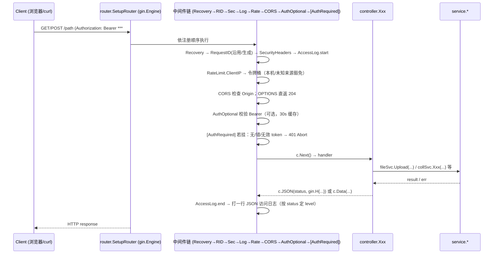
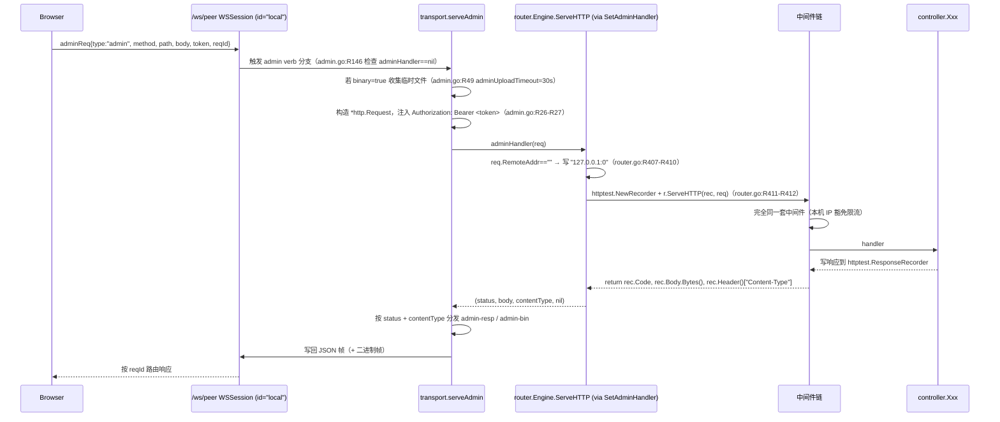

# 连接 02：router ↔ controller（HTTP 分发）

- **涉及模块**：`../modules/04-router.md` 与 `../modules/05-controller.md`
- **代码位置**：A 侧 `back/internal/router/router.go`、`back/internal/router/middleware.go`、`back/internal/router/auth_middleware.go`、`back/internal/router/collection_dispatch.go`、`back/internal/router/peerjs_routes.go`、`back/internal/router/source_routes.go`；B 侧 `back/internal/controller/*.go`
- **方向**：A→B 主（HTTP handler 调用 controller 包级函数）；B→A 无回调（controller 只写响应，不经 router 回环）；例外是 admin verb 内部转发把已建立的 `/ws/peer` 会话反向喂进 A 侧 gin engine（见 §1.4）

## 1. 连接方式

### 1.1 通道类型

- **进程内函数调用**（Gin `gin.HandlerFunc` → `controller.*`）。router 端点在 `SetupRouter` 内一次性绑定到 `gin.Engine`（`back/internal/router/router.go:R44-R51`），controller 只暴露 `func(c *gin.Context)` 形态的处理函数，无独立网络通道、无独立协程边界。
- **HTTP over TCP**（外部入口）。`gin.Engine` 由 `cmd/server/main.go` 调用 `SetupRouter` 后交给 `http.Server` 监听；请求入口包括浏览器直连、`curl`、外部脚本、以及 §1.4 的内部转发。

### 1.2 协议帧与参数格式

- **HTTP 层**：`METHOD /path?q=v`，body 支持 `application/json`、`multipart/form-data`（`/files/upload`、`/sources/local/write`、`/sources/bt/torrent`）。
- **中间件注入的 Context key**（供 controller 读取）：`storageDir`（`router.go:R76-R79`）、`request_id`（`middleware.go:R45`）、`authenticated` / `username` / `role`（`auth_middleware.go:R33-R51`、`R78-R80`）。
- **URL 参数补齐**：分派器 `withParams(c, "k", "v", ...)` 直接 `append(c.Params, ...)`（`collection_dispatch.go:R91-R96`），让底层 controller 用 `c.Param("username")` 读到与「直接注册路由」一致的键名。此处注释明确说明「不能用 `c.Copy()`」——gin v1.8+ 的 `Context.Copy` 不复制 `ResponseWriter`，下游 `c.JSON` 会 nil-pointer panic（`collection_dispatch.go:R87-R90`）。
- **admin 帧（内部转发用）**：`adminReq{type, method, path, body, token, binary, filename, field, size, reqId}`（`back/internal/transport/admin.go:R57-R72`），响应 `adminResp{type, status, body, reqId}` 或 `adminBinResp{type, status, size, reqId}` 后紧跟二进制帧（`admin.go:R76-R92`）。
- **响应编码约定**：controller 统一走 `c.JSON(status, gin.H{...})` 或 `c.Data`（例：`controller/file.go:R75`、`controller/health.go:R42-R69`），Content-Type 由 gin 决定；错误一律 `{ "error": "..." }`。

### 1.3 鉴权方式

- 采用 **Bearer token + 外部注册服务器**（`auth_middleware.go:R1-R3`）。`Authorization: Bearer <token>` 经 `validateToken` 转发到 `${RegistrationServer}/auth/whoami`（`auth_middleware.go:R147-R169`）。
- **两级认证**：
  - `AuthOptional`（`auth_middleware.go:R29-R53`）——全局挂一层，无 token 或 token 无效时只把 `authenticated=false` 写入 Context，不阻断；controller 自行按业务决定是否需要。
  - `AuthRequired`（`auth_middleware.go:R57-R82`）——按路由逐条挂载到 mutating/admin 端点（`router.go:R236`、`R244-R247`、`R251-R253`、`R260-R264`、`R268-R279`、`R287-R288`、`R302-R314`、`R320-R327`、`R334-R342`、`R350-R355`、`R361`、`R370-R371`、`R380-R381`、`R50`、`R119`）。
- **无注册服务器时**：`authDisabled()` 返回 true（`auth_middleware.go:R26`），`AuthRequired` 内部放行——本地单机模式全站可用；公网部署配置 `RegistrationServer` 后自动收紧（`auth_middleware.go:R23-R26`）。
- **令牌校验 30s 内存缓存**（`auth_middleware.go:R92`、`R94-R145`）：只缓存成功结果（`R140-R143`），网络抖动不会把一次失败放大成 30s 全站 401；代价是吊销最长 30s 生效。

### 1.4 admin verb 内部转发到 gin engine（关键复用点）

- `router.SetupRouter` 结尾通过 `peerjsService.SetAdminHandler(...)` 把 `*gin.Engine.ServeHTTP` 交给 transport 层（`router.go:R402-R414`）。admin 帧在 `back/internal/transport/admin.go:R13-R27`、`R318` 由 `serveAdmin` 构造 `*http.Request` 后回调本 handler，用 `httptest.NewRecorder` 承接响应体，返回 `(status, body, contentType, nil)`。
- **中转请求的 RemoteAddr**：admin 帧来自本地 `/ws/peer` WS 会话，没有 TCP 来源；`req.RemoteAddr == ""` 时统一写为 `"127.0.0.1:0"`（`router.go:R407-R410`），这样限流不会把管理请求算进「未知来源」桶（`middleware.go:R224-R229` 明确对 `127.0.0.1` / `::1` 豁免）。
- **中间件零分叉**：内部转发请求走完全同一套 `gin.Recovery → RequestID → SecurityHeaders → AccessLog → RateLimit → CORS → AuthOptional → [AuthRequired] → handler`，行为与外部 HTTP 一致；这是「admin 帧 verb 不再逐个复刻 controller 逻辑」的设计核心（`router.go:R396-R401`）。
- **响应分岔**：JSON 直接回 `admin-resp`；二进制响应转 `admin-bin` 头帧 + 紧随一个二进制帧（`admin.go:R16-R24`、`R43-R45`，上限 `adminBinMax = 64MB`）。大文件下载走 `req` verb 分片（`admin.go:R24`）。

### 1.5 中间件挂载顺序与失败语义

`SetupRouter` 中的挂载即执行顺序（`router.go:R49-R51` + `R75-R107` + `R112-R115`）：

```
gin.Recovery  →  RequestID  →  SecurityHeaders  →  AccessLog  →  RateLimit
   →  注入 storageDir  →  CORS（OPTIONS 直返 204）
   →  AuthOptional（条件挂载，仅注册服务器存在时）
   →  路由级 [AuthRequired]（mutating/admin 端点显式挂载）
   →  controller handler
```

关键点（`middleware.go:R1-R11` 注释、`R164-R196`、`R214-R220`）：

1. **Recovery 在最外层**——任何 controller panic 都会被 `gin.Recovery` 收回，转 500，进程不崩。
2. **RequestID 必须最早**——后续所有日志（AccessLog 尤其）要带同一个 `X-Request-ID`（`middleware.go:R31-R48`）；上游传的头沿用（`R39-R44`），超长截断到 128 字符（`R42-R44`）。
3. **AccessLog 在 RateLimit 之前**——被限流的请求也要留痕，否则攻击流量反而最安静（`middleware.go:R7-R10`）。
4. **OPTIONS 预检不进限流**——预检 429 掉，前端只会看到「莫名其妙的跨域错误」（`middleware.go:R214-R220`；CORS 里 `OPTIONS` 直接 `AbortWithStatus(204)` 于 `router.go:R102-R105`）。
5. **CORS 白名单严格回显**——非白名单 Origin 不设 `Access-Control-Allow-Origin`（浏览器阻止响应读取）；`Access-Control-Allow-Credentials: true` 只在白名单场景下同时发（`router.go:R81-R101`）。
6. **AuthRequired 是路由级挂载**（`r.Use` 会全局生效）——所有需要鉴权的路由在注册时逐个 `POST/...  authRequired, handler` 传入（`router.go:R236`、`R244` 等 20+ 处）。
7. **失败语义**：`AuthRequired` 三种 401（无头 `authentication required` / 格式错 `invalid authorization format` / 令牌无效 `invalid or expired token`，`auth_middleware.go:R65-R76`）；限流返回 429 + `{"error":"rate limit exceeded","request_id":...,"retry_after":1}`（`middleware.go:R230-R236`）；`gin.Recovery` 兜底 500。

### 1.6 依赖装配（谁把 controller 的 service 塞进去）

controller 包不直接依赖 service/repository——所有依赖由 `SetupRouter` 在装配期用 `Init*Controller(...)` 一次性注入：

- `InitFileController(service.NewFileService(cfg))`（`router.go:R121-R122`，`controller/file.go:R32-R36`）
- `InitHealth(repository.Ping)`（`router.go:R124`，`controller/health.go:R27-R32`）——探针只注入 `func() error`，controller 层不见 repository
- `InitCollectionController(service.NewCollectionService())`（`router.go:R126`，`controller/collection.go:R41-R44`）
- `InitShareController`、`InitPinController`、`InitAnonController`、`InitForwardController(peerjsService)`、`InitPeerShareController(peerjsService)`、`InitBTController`、`InitBTClient`、`InitIPFSProvider`、`InitUniversalDownloader`、`InitNodeDirectory`、`InitNodeShareController`、`InitPeerPuller`（`router.go:R127-R148`、`R197-R208`、`peerjs_routes.go:R33-R47`）

同步控制器是唯一在 `SetupRouter` 内**局部** new 的（`syncCtrl := controller.NewSyncController(...)`，`router.go:R211-R213`），因为它的 service 依赖链只在 sync 端点用到，注入无必要。

## 2. 时序

### 2.1 外部 HTTP 请求（正常路径）



关键代码位置：

1. 引擎构造与全局中间件：`router.go:R49-R53`（`gin.New()` + `Recovery` + `RequestID/SecurityHeaders/AccessLog/RateLimit` 四件）。
2. CORS 中间件与 OPTIONS 短路：`router.go:R81-R107`。
3. AuthOptional 与 authRequired 生成：`router.go:R112-R119`；实现见 `auth_middleware.go:R29-R82`。
4. 具体路由注册：`r.GET("/ping", controller.Ping)`（`router.go:R225`）到 `r.GET("/:username/:collection_name/*filepath", controller.DownloadCollectionFile)`（`router.go:R375`）；写操作挂 `authRequired`（例：`r.POST("/download/:hash/refresh", authRequired, controller.UniversalDownloadRefresh)`，`router.go:R236`）。
5. controller handler 结构：读取 `c.Param` / `ShouldBindJSON` → 调 service → `c.JSON` 回包（例：`controller/file.go:R39-R80`；`controller/health.go:R41-R69`）。

### 2.2 admin verb 内部转发（复用同一 gin engine）



关键点：

- **中间件链零分叉**：内部转发请求也过 AccessLog / AuthRequired / RateLimit；AccessLog 会把管理面请求与外部请求一起写入同一份日志（`middleware.go:R108-R148`）。
- **鉴权语义一致**：admin 帧携带的 `token` 被拼进 `Authorization: Bearer` 头（`admin.go:R26-R27`），gin 的 `AuthRequired` 走同一份 `validateToken`（`auth_middleware.go:R132-R145`），令牌 30s 缓存跨通道共享（同一进程内存）。
- **管理面只在本地 WS**：`serveAdmin` 由 `admin.go:R5-R12` 注释明确说明「WebRTC/PeerJS 连接可能来自公共信令上的任意节点，若管理 verb 同样实现，等于把本节点管理口开放给未知对端」；`WSSession.ID() == "local"` 是硬边界。

### 2.3 分派器时序（`/collections` 冲突合并）

`dispatchCreateCollection` / `dispatchGetCollection` / `dispatchGetTree` 三个函数把两组语义不同但 URL 形态冲突的 controller 合并（`collection_dispatch.go:R15-R96`）。

- **POST /collections**：`io.ReadAll(c.Request.Body)` → 尝试反序列化 `{"username":"..."}` → 有 username 走 `controller.CreateCollection`，无走 `controller.CreateAnonCollection`（`collection_dispatch.go:R17-R33`）。**注意**：读 body 失败会 fallback 到匿名路径（`R19-R22`），不返回错误——这是有意的容错：`io.ReadAll` 失败几乎总是客户端提前断开。
- **GET /collections/:id**：64 位 hex → `DownloadAnonFile` / `GetAnonCollection`；否则 `ListCollections`（`collection_dispatch.go:R39-R48`）。
- **GET /collections/:id/*filepath**：按 `filepath` 段数 switch（`collection_dispatch.go:R59-R80`）——0 段=列集合、1 段=集合详情、2 段末段为 `log`=版本日志、其他=404。
- **参数补键**：分派器通过 `withParams(c, "username", id, ...)` 把 URL `:id` 翻译成 controller 期待的 `:username` / `:collection_name`（`collection_dispatch.go:R83-R96`）。gin 不允许同层 `:param` 与 `*wildcard` 并存（`R56-R58` 注释），因此这个 wildcard 路由内部分派是 gin 约束下的唯一写法。

## 3. 情况处理

| 异常/边界场景 | 行为与依据（代码位置） | 说明 |
| --- | --- | --- |
| **超时：注册服务器 /auth/whoami 挂起** | `http.Client{Timeout: 5s}`，响应体 `io.LimitReader(64<<10)`（`auth_middleware.go:R147-R169`）。超时/错误返回 `("", "")` → AuthRequired 视同无效 token → 401；AuthOptional 置 `authenticated=false` 放行。 | 原实现无超时会把连接池耗尽（注释 `R148-R150` 记录此为已知事故）。 |
| **超时：admin 二进制上传不发数据块** | `adminUploadTimeout = 30 * time.Second`，超时中止并清理临时文件（`admin.go:R47-R49`、`R106 aborted` 标记）。 | 同 M6 对 upload verb 的修复；避免占位不释放。 |
| **超时：/peerjs/fetch 请求超 64MB** | `maxPeerjsHTTPFetch = 64<<20`，超限 413 `{"error":"requested size exceeds 64MB limit; use /ws/peer chunked transfer"}`（`peerjs_routes.go:R130-R136`）；service 返回体超上限也 413（`R148-R150`）。 | H4 修复：响应 buffer 驻留内存的兜底防线。 |
| **断连/重连：RateLimit 桶清理** | 令牌桶 map 超过 4096 条时 `sweep` 清理 10 分钟以上不活跃的桶（`middleware.go:R184-R196`）。 | 防长跑内存泄漏；清理条件保守，正常流量感知不到。 |
| **断连/重连：tokenCache 条目过期** | `cacheGet` 过期当没命中（`auth_middleware.go:R107-R115`）；`cachePut` 超过 1024 条时同步扫一次过期项（`R117-R130`）。 | 只缓存成功结果（`R140-R143`）——失败可能是网络抖动，缓存会放大成 30s 全站 401。 |
| **重复/并发：同 IP 高频请求** | 令牌桶按 ClientIP 分配；本机 `127.0.0.1` / `::1` / 空 IP 豁免（`middleware.go:R222-R229`）；超限返回 429 + `{"retry_after":1}`（`R230-R236`）；OPTIONS 预检不计数（`R214-R220`）。 | 按 IP 限流是唯一稳定标识——本进程无账号体系（`R200-R202` 注释）。admin 内部转发标 127.0.0.1 后天然豁免，避免管理台点几下就 429（`router.go:R404-R410`）。 |
| **重复/并发：controller 内 panic** | 最外层 `gin.Recovery()`（`router.go:R50`）兜底为 500；`AccessLog` 在 Recovery 之后记录，因此 panic 请求仍会写一行 `level:error`（`middleware.go:R107-R148`）。 | AccessLog 的 `c.Next()` 在 `start := time.Now()` 之后、panic 之前先挂，返回后按 `c.Writer.Status() >= 500` 判级。 |
| **重复/并发：分派器修改 Params** | `withParams` 直接 `append(c.Params, ...)` 而非 `c.Copy()`（`collection_dispatch.go:R83-R96`）。注释 `R87-R90` 说明 gin v1.8+ 的 `Copy` 不复制 ResponseWriter，会导致下游 `c.JSON` nil-pointer panic（2026-08-19 test.sh 6b 暴露）。 | 单请求串行调用，append 后 handler 返回即结束，无需回滚。 |
| **数据缺失：POST /collections body 读取失败** | `io.ReadAll` 出错 → 直接走 `controller.CreateAnonCollection(c)`，不报错（`collection_dispatch.go:R17-R23`）。 | 容错：多数场景是客户端断开；不返回错误避免暴露实现细节。 |
| **数据缺失：ShouldBindJSON 失败 / peer+hash 缺失** | `/peerjs/fetch` 缺 peer/hash 或 body 非 JSON → 400 `{"error":"peer and hash required"}`（`peerjs_routes.go:R126-R129`）；`/sources/:name/priority` 缺 priority → 400（`source_routes.go:R36-R38`）；`/sources/local/add` 空 path → 400（`R54-R56`）。 | 校验失败语义统一：controller 端点返回 400 + `{"error":...}`。 |
| **数据缺失：hash 格式非法** | `hashutil.IsValidSHA256(body.Hash)` 校验（`peerjs_routes.go:R138-R141`）；不合法 400。 | 避免把非法 hash 传给 service 层。 |
| **数据缺失：storageDir 未注入** | 全局中间件在最前面 `c.Set("storageDir", cfg.StorageDir)`（`router.go:R75-R79`）；controller 缺失时使用默认值或报错由具体实现处理。 | 装配期一次性注入，运行期只读。 |
| **数据缺失：探针 dbPing 未装配** | `/ready` 若 `dbPing == nil` 直接 503 `{"status":"unavailable","reason":"health check not wired"}`（`controller/health.go:R56-R62`）。 | 「一个永远 200 的 readiness 比没有 readiness 更危险」（`R57-R59` 注释）。 |
| **校验失败：CORS 非白名单 Origin** | 不设 `Access-Control-Allow-Origin`（`router.go:R87-R98`）——浏览器阻止读取响应；`Vary: Origin` 仅对白名单回显（`R92`）。 | L8 修复：原实现非白名单也回 `*` + `Credentials: true`，白名单形同虚设。 |
| **校验失败：/ws/peer 无 Origin 的远端连接** | `CheckOrigin` 检查 `Origin` 头，缺失时仅当 `isLoopbackRemote(r.RemoteAddr)` 为真才放行（`peerjs_routes.go:R158-R175`、`R54-R66`）；`peerjsCfg.IsOriginAllowed(origin)` 校验白名单（`R171-R174`）。 | 原来「无 Origin 一律放行」= 端口可达就拿到完整管理面；`WSSession.IsLocal()` 恒 true 还把它当「自己」看 private 内容。 |
| **校验失败：内部转发 RemoteAddr 为空** | `req.RemoteAddr == ""` → 写 `"127.0.0.1:0"`（`router.go:R407-R410`）。 | 否则 `ClientIP()` 是空串，限流把所有管理请求归到一个「未知来源」桶。语义上管理面本来就只服务本地 WS。 |
| **鉴权失败：无 Authorization 头** | `AuthRequired` → 401 `{"error":"authentication required"}`（`auth_middleware.go:R63-R67`）；`AuthOptional` 置 `authenticated=false` 放行（`R31-R36`）。 | 两种中间件语义清晰：全局挂 optional，敏感路由再叠 required。 |
| **鉴权失败：Bearer 格式错** | 401 `{"error":"invalid authorization format"}`（`auth_middleware.go:R68-R72`）。 | 空 token / 非 `bearer` scheme 都走这一分支。 |
| **鉴权失败：令牌无效或过期** | 401 `{"error":"invalid or expired token"}`（`auth_middleware.go:R73-R77`）。 | validateToken 返回 `""` 即无效；含 whoami 非 200、body 解析失败、缓存过期。 |
| **鉴权失败：本地单机模式（无注册服务器）** | `authDisabled()` → true，`AuthRequired` 内部直接放行（`auth_middleware.go:R57-R62`、`R26`）。 | 本地部署零摩擦；公网部署必须配 `RegistrationServer` 才收紧。 |
| **鉴权失败：admin 帧未带 token 调 mutating 端点** | admin 帧的 `token` 字段拼进 `Authorization`（`admin.go:R26-R27`）；空 token 走 AuthRequired 分支返回 401，serveAdmin 将 401 透传到前端 `admin-resp{status:401}`。 | 内部转发不绕过鉴权，是复用 gin 中间件的核心收益。 |
| **半开状态：OPTIONS 预检** | CORS 中间件检测到 `OPTIONS` → `AbortWithStatus(204)`（`router.go:R102-R105`）；RateLimit 也跳过计数（`middleware.go:R214-R220`）。 | 预检是浏览器「敲门」，不是真请求；被 429 会引发跨域错误。 |
| **半开状态：gin.RedirectTrailingSlash / RedirectFixedPath** | 均关闭（`router.go:R52-R53`）。 | 强制 301 会把 `/files/upload/` 变成 `/files/upload` 等，破坏 curl / 前端路径匹配。 |
| **半开状态：/peerjs/fetch 请求 size 与响应 size 不一致** | 请求 > 64MB 直接 413；响应超限也 413（`peerjs_routes.go:R130-R150`）；service 已先按请求 size 校验对端声明（`R147` 注释）。 | 双向兜底：HTTP 端点不做无上限内存驻留。 |
| **半开状态：TrustedProxies 配置错误** | `SetTrustedProxies(list)` 失败只 `LogWarn`，不影响启动（`router.go:R67-R69`）；`"all"` 视为 `0.0.0.0/0`（`R57-R60`）。 | 反代后面不配此项则所有人算同一 IP 一起限流（`R55-R56` 注释）。 |
| **进程重启：装配期一次执行** | `SetupRouter` 由 main 只调一次（`router.go:R43-R45`）；所有 `Init*Controller` 在装配期注入，之后只读；tokenCache / limiter / startedAt 都是进程内存（`auth_middleware.go:R94-R98`、`middleware.go:R157-R162`、`controller/health.go:R20`）。 | 重启即全部重置：令牌校验缓存、限流桶、uptime 都从零开始。 |
| **进程重启：/health vs /ready 语义** | `/health` 只报 `uptime_sec` 不查依赖（`controller/health.go:R41-R46`）——liveness，编排系统据此判断「重启风暴」；`/ready` 走 `dbPing()`，失败 503（`R56-R69`）——readiness，编排系统据此摘流量。 | 「不查任何依赖」是刻意的：数据库一抖就把健康服务杀掉会形成重启循环（`R3-R6` 注释）。 |
| **进程重启：路由注册冲突** | 历史遗留：`/anon/*`、`/actions/*` 与真实路由重复注册曾导致 `gin` 启动即 panic（`router.go:R294-R299` 注释）。修复：删除 redirect 层，把冲突合并为分派器（`dispatchCreateCollection` 等）。 | 现状：`/actions/*` 保留 merge/fork 两条（`R368-R372`）；`/collections/*` 已合并用户体系与 anon 体系。 |

## 4. 相关文档

### 4.1 其他连接文档

- `./01-frontend-backend.md`——浏览器 ↔ 后端 HTTP/WS 边界；`/ws/peer` 的握手与 Origin 白名单在此定义，本连接的 CORS 与 `isLoopbackRemote` 是它的落点。
- `./03-controller-service.md`——controller ↔ service；本连接的 B 侧调用出口（`fileSvc.Upload`、`collSvc.Xxx`）。
- `./05-router-source.md`——router 挂载的 `source` 管理面（`/sources/*`，`source_routes.go:R25-R265`）。
- `./07-transport-peerjs.md`——PeerJS WebRTC DataChannel 与信令；本连接的 `/peerjs/*` 与 `/ws/peer` 是其入口。
- `./08-transport-signalserver.md`——外部信令服务器（`mqtt_discovery.go`、`http_discovery.go`），与本连接无直接调用但共用注册/发现链路。
- `./09-controller-downloader.md`——controller 层调用 UniversalDownloader；本连接 `r.GET("/download/:hash", controller.UniversalDownload)`（`router.go:R234`）是入口。
- `./10-controller-storage.md`——controller 与 storage 目录约定；本连接在中间件里注入 `storageDir`（`router.go:R76-R79`）。
- `./12-frontend-signalserver.md`——前端直连信令，与本连接无直接调用但共用 PeerJS 发现链。

### 4.2 模块文档

- `../modules/04-router.md`——router 包的整体设计、`SetupRouter` 装配流程、中间件挂载契约。
- `../modules/05-controller.md`——controller 包分层约定（不见 repository、依赖由 `Init*Controller` 注入）、handler 命名与错误返回约定。
- `../modules/09-transport.md`——transport 层，含 `PeerJSService.SetAdminHandler` 与 `serveAdmin` 实现（本连接 §1.4 的内部转发落点）。
- `../modules/10-peerjs.md`——PeerJS 信令、PSK、DataChannel 会话。
- `../modules/11-signalserver.md`——外部信令服务器抽象。
- `../modules/06-service.md`——controller 调用的服务层，是本连接下游的直接依赖。

### 4.3 关键契约

- controller 层不 import repository（`controller/health.go:R24-R27` 明确「服务层 → 仓储层，controller 只见服务」）。
- controller handler 统一返回 `{"error": "..."}` 错误体（例：`controller/file.go:R49`、`controller/health.go:R60`）。
- router 是唯一调用 `Init*Controller` 的地方——装配入口集中，便于审计（`router.go:R121-R148`、`R197-R208`、`peerjs_routes.go:R33-R47`）。
