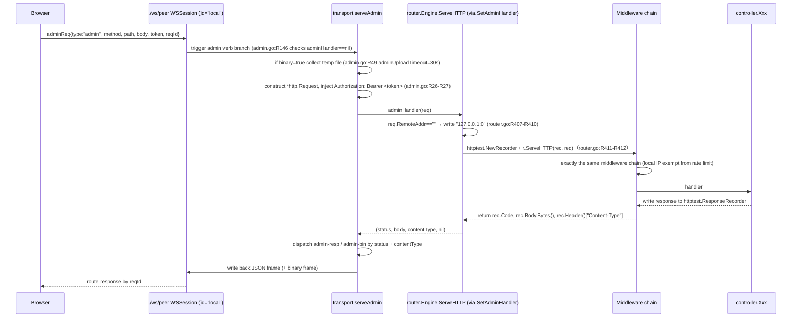

# Connection 02: router ↔ controller (HTTP dispatch)

- **Modules involved**: `../modules/04-router.md` and `../modules/05-controller.md`
- **Code locations**: A side `back/internal/router/router.go`, `back/internal/router/middleware.go`, `back/internal/router/auth_middleware.go`, `back/internal/router/collection_dispatch.go`, `back/internal/router/peerjs_routes.go`, `back/internal/router/source_routes.go`; B side `back/internal/controller/*.go`
- **Direction**: A→B primary (HTTP handler calls controller package-level functions); B→A no callback (controller only writes response, no loopback through router); exception is admin verb internal forwarding feeding the established `/ws/peer` session back into A side gin engine (see §1.4)

## 1. Connection Method

### 1.1 Channel Type

- **In-process function call** (Gin `gin.HandlerFunc` → `controller.*`). Router endpoints are bound to `gin.Engine` once in `SetupRouter` (`back/internal/router/router.go:R44-R51`); controller only exposes handler functions in `func(c *gin.Context)` form, with no independent network channel and no independent goroutine boundary.
- **HTTP over TCP** (external entry point). `gin.Engine` is given to `http.Server` for listening after `cmd/server/main.go` calls `SetupRouter`; request entry points include browser direct connection, `curl`, external scripts, and §1.4 internal forwarding.

### 1.2 Protocol Frames and Parameter Format

- **HTTP layer**: `METHOD /path?q=v`, body supports `application/json`, `multipart/form-data` (`/files/upload`, `/sources/local/write`, `/sources/bt/torrent`).
- **Context keys injected by middleware** (for controller to read): `storageDir` (`router.go:R76-R79`), `request_id` (`middleware.go:R45`), `authenticated` / `username` / `role` (`auth_middleware.go:R33-R51`, `R78-R80`).
- **URL parameter completion**: dispatcher `withParams(c, "k", "v", ...)` directly `append(c.Params, ...)` (`collection_dispatch.go:R91-R96`), allowing the underlying controller to read the same key names as "directly registered routes" via `c.Param("username")`. The comment here explicitly states "cannot use `c.Copy()`" — gin v1.8+'s `Context.Copy` does not copy `ResponseWriter`, causing downstream `c.JSON` to nil-pointer panic (`collection_dispatch.go:R87-R90`).
- **Admin frame (for internal forwarding)**: `adminReq{type, method, path, body, token, binary, filename, field, size, reqId}` (`back/internal/transport/admin.go:R57-R72`); response `adminResp{type, status, body, reqId}` or `adminBinResp{type, status, size, reqId}` followed by a binary frame (`admin.go:R76-R92`).
- **Response encoding convention**: controller uniformly uses `c.JSON(status, gin.H{...})` or `c.Data` (e.g., `controller/file.go:R75`, `controller/health.go:R42-R69`); Content-Type determined by gin; errors uniformly `{ "error": "..." }`.

### 1.3 Authentication Method

- Uses **Bearer token + external registration server** (`auth_middleware.go:R1-R3`). `Authorization: Bearer <token>` is forwarded to `${RegistrationServer}/auth/whoami` via `validateToken` (`auth_middleware.go:R147-R169`).
- **Two-level authentication**:
  - `AuthOptional` (`auth_middleware.go:R29-R53`) — globally mounted one layer; when no token or token is invalid, only writes `authenticated=false` to Context, does not block; controller decides by business whether it's needed.
  - `AuthRequired` (`auth_middleware.go:R57-R82`) — mounted per-route to mutating/admin endpoints (`router.go:R236`, `R244-R247`, `R251-R253`, `R260-R264`, `R268-R279`, `R287-R288`, `R302-R314`, `R320-R327`, `R334-R342`, `R350-R355`, `R361`, `R370-R371`, `R380-R381`, `R50`, `R119`).
- **When no registration server**: `authDisabled()` returns true (`auth_middleware.go:R26`); `AuthRequired` internally passes — full site available in local single-machine mode; public deployments configure `RegistrationServer` to automatically tighten (`auth_middleware.go:R23-R26`).
- **Token validation 30s in-memory cache** (`auth_middleware.go:R92`, `R94-R145`): only caches successful results (`R140-R143`); network jitter won't amplify one failure into 30s site-wide 401; cost is revocation takes up to 30s to take effect.

### 1.4 Admin Verb Internal Forwarding to Gin Engine (key reuse point)

- At the end of `router.SetupRouter`, `peerjsService.SetAdminHandler(...)` passes `*gin.Engine.ServeHTTP` to the transport layer (`router.go:R402-R414`). Admin frames in `back/internal/transport/admin.go:R13-R27`, `R318` have `serveAdmin` construct `*http.Request` then callback this handler, using `httptest.NewRecorder` to capture the response body, returning `(status, body, contentType, nil)`.
- **Forwarded request's RemoteAddr**: admin frames come from the local `/ws/peer` WS session with no TCP source; when `req.RemoteAddr == ""`, uniformly write `"127.0.0.1:0"` (`router.go:R407-R410`), so rate limiting doesn't count admin requests in the "unknown source" bucket (`middleware.go:R224-R229` explicitly exempts `127.0.0.1` / `::1`).
- **Zero-fork middleware**: internal forwarding requests go through the exact same `gin.Recovery → RequestID → SecurityHeaders → AccessLog → RateLimit → CORS → AuthOptional → [AuthRequired] → handler` chain, behavior identical to external HTTP; this is the design core of "admin frame verbs don't replicate controller logic one by one" (`router.go:R396-R401`).
- **Response branching**: JSON directly returns `admin-resp`; binary responses convert to `admin-bin` header frame + immediately following binary frame (`admin.go:R16-R24`, `R43-R45`, limit `adminBinMax = 64MB`). Large file downloads use `req` verb chunking (`admin.go:R24`).

### 1.5 Middleware Mount Order and Failure Semantics

Mounting order in `SetupRouter` is execution order (`router.go:R49-R51` + `R75-R107` + `R112-R115`):

```
gin.Recovery  →  RequestID  →  SecurityHeaders  →  AccessLog  →  RateLimit
   →  inject storageDir  →  CORS (OPTIONS directly returns 204)
   →  AuthOptional (conditionally mounted, only when registration server exists)
   →  route-level [AuthRequired] (explicitly mounted on mutating/admin endpoints)
   →  controller handler
```

Key points (`middleware.go:R1-R11` comments, `R164-R196`, `R214-R220`):

1. **Recovery is the outermost** — any controller panic is caught by `gin.Recovery`, converted to 500, process doesn't crash.
2. **RequestID must be first** — all subsequent logs (especially AccessLog) need the same `X-Request-ID` (`middleware.go:R31-R48`); upstream-provided header is reused (`R39-R44`); overlong headers truncated to 128 characters (`R42-R44`).
3. **AccessLog before RateLimit** — rate-limited requests also need to be logged, otherwise attack traffic would be the quietest (`middleware.go:R7-R10`).
4. **OPTIONS preflight bypasses rate limit** — if preflight gets 429, the frontend only sees "mysterious cross-origin errors" (`middleware.go:R214-R220`; CORS has `OPTIONS` directly `AbortWithStatus(204)` in `router.go:R102-R105`).
5. **CORS whitelist strict echo** — non-whitelisted Origin doesn't set `Access-Control-Allow-Origin` (browser blocks response reading); `Access-Control-Allow-Credentials: true` only sent simultaneously in whitelisted scenarios (`router.go:R81-R101`).
6. **AuthRequired is route-level mounting** (`r.Use` would be global) — all routes needing authentication are individually passed as `POST/...  authRequired, handler` at registration time (`router.go:R236`, `R244` etc. 20+ places).
7. **Failure semantics**: `AuthRequired` has three 401 variants (no header `authentication required` / format error `invalid authorization format` / invalid token `invalid or expired token`, `auth_middleware.go:R65-R76`); rate limit returns 429 + `{"error":"rate limit exceeded","request_id":...,"retry_after":1}` (`middleware.go:R230-R236`); `gin.Recovery` catches as 500.

### 1.6 Dependency Assembly (who puts controller's services in)

The controller package doesn't directly depend on service/repository — all dependencies are injected once by `SetupRouter` during assembly with `Init*Controller(...)`:

- `InitFileController(service.NewFileService(cfg))` (`router.go:R121-R122`, `controller/file.go:R32-R36`)
- `InitHealth(repository.Ping)` (`router.go:R124`, `controller/health.go:R27-R32`) — probe only injects `func() error`; controller layer never sees repository
- `InitCollectionController(service.NewCollectionService())` (`router.go:R126`, `controller/collection.go:R41-R44`)
- `InitShareController`, `InitPinController`, `InitAnonController`, `InitForwardController(peerjsService)`, `InitPeerShareController(peerjsService)`, `InitBTController`, `InitBTClient`, `InitIPFSProvider`, `InitUniversalDownloader`, `InitNodeDirectory`, `InitNodeShareController`, `InitPeerPuller` (`router.go:R127-R148`, `R197-R208`, `peerjs_routes.go:R33-R47`)

The sync controller is the only one **locally** new'd inside `SetupRouter` (`syncCtrl := controller.NewSyncController(...)`, `router.go:R211-R213`), because its service dependency chain is only used by sync endpoints, making injection unnecessary.

## 2. Timing

### 2.1 External HTTP Request (normal path)

```mermaid
sequenceDiagram
  participant C as Client (browser/curl)
  participant R as router.SetupRouter (gin.Engine)
  participant M as Middleware chain (Recovery→RID→Sec→Log→Rate→CORS→AuthOptional→[AuthRequired])
  participant K as controller.Xxx
  participant S as service.*
  C->>R: GET/POST /path  (Authorization: Bearer ***
  R->>M: execute in registration order
  M->>M: Recovery → RequestID(keep/generate) → SecurityHeaders → AccessLog.start
  M->>M: RateLimit.ClientIP → token bucket (local/unknown source exempt)
  M->>M: CORS check Origin; OPTIONS returns 204 directly
  M->>M: AuthOptional verify Bearer (optional, 30s cache)
  M->>M: [AuthRequired] if mounted: missing/wrong/invalid token → 401 Abort
  M->>K: c.Next() → handler
  K->>S: fileSvc.Upload(...) / collSvc.Xxx(...) etc.
  S-->>K: result / err
  K-->>M: c.JSON(status, gin.H{...}) or c.Data(...)
  M->>M: AccessLog.end → print one JSON access log line (level by status)
  R-->>C: HTTP response
```

Key code locations:

1. Engine construction and global middleware: `router.go:R49-R53` (`gin.New()` + `Recovery` + `RequestID/SecurityHeaders/AccessLog/RateLimit` four pieces).
2. CORS middleware and OPTIONS short-circuit: `router.go:R81-R107`.
3. AuthOptional and authRequired generation: `router.go:R112-R119`; implementation in `auth_middleware.go:R29-R82`.
4. Specific route registration: `r.GET("/ping", controller.Ping)` (`router.go:R225`) to `r.GET("/:username/:collection_name/*filepath", controller.DownloadCollectionFile)` (`router.go:R375`); write operations mount `authRequired` (e.g., `r.POST("/download/:hash/refresh", authRequired, controller.UniversalDownloadRefresh)`, `router.go:R236`).
5. Controller handler structure: read `c.Param` / `ShouldBindJSON` → call service → `c.JSON` response (e.g., `controller/file.go:R39-R80`; `controller/health.go:R41-R69`).

### 2.2 Admin Verb Internal Forwarding (reusing the same gin engine)



Key points:

- **Zero-fork middleware chain**: internal forwarding requests also pass through AccessLog / AuthRequired / RateLimit; AccessLog writes admin requests and external requests to the same log (`middleware.go:R108-R148`).
- **Consistent authentication semantics**: the `token` carried by admin frames is assembled into the `Authorization: Bearer` header (`admin.go:R26-R27`); gin's `AuthRequired` uses the same `validateToken` (`auth_middleware.go:R132-R145`); the token 30s cache is shared across channels (same process memory).
- **Admin surface only on local WS**: `serveAdmin` is explicitly documented in `admin.go:R5-R12` comments as "WebRTC/PeerJS connections may come from any node on the public signaling server; if the admin verb were also implemented, it would equal exposing this node's admin port to unknown peers"; `WSSession.ID() == "local"` is the hard boundary.

### 2.3 Dispatcher Timing (`/collections` conflict merging)

`dispatchCreateCollection` / `dispatchGetCollection` / `dispatchGetTree` — three functions merge two groups of controllers with different semantics but conflicting URL shapes (`collection_dispatch.go:R15-R96`).

- **POST /collections**: `io.ReadAll(c.Request.Body)` → attempt to deserialize `{"username":"..."}` → with username go to `controller.CreateCollection`, without go to `controller.CreateAnonCollection` (`collection_dispatch.go:R17-R33`). **Note**: body read failure falls back to the anonymous path (`R19-R22`), doesn't return an error — this is intentional fault tolerance: `io.ReadAll` failure almost always means the client disconnected early.
- **GET /collections/:id**: 64-bit hex → `DownloadAnonFile` / `GetAnonCollection`; otherwise `ListCollections` (`collection_dispatch.go:R39-R48`).
- **GET /collections/:id/*filepath**: switch by `filepath` segment count (`collection_dispatch.go:R59-R80`) — 0 segments=list collection, 1 segment=collection detail, 2 segments with last being `log`=version log, others=404.
- **Parameter key completion**: dispatcher uses `withParams(c, "username", id, ...)` to translate URL `:id` into `:username` / `:collection_name` that the controller expects (`collection_dispatch.go:R83-R96`). gin doesn't allow `:param` and `*wildcard` to coexist at the same level (`R56-R58` comment), so this internal wildcard dispatch is the only approach under gin constraints.

## 3. Case Handling

| Exception/Edge Case | Behavior & Rationale (code location) | Description |
| --- | --- | --- |
| **Timeout: registration server /auth/whoami hangs** | `http.Client{Timeout: 5s}`, response body `io.LimitReader(64<<10)` (`auth_middleware.go:R147-R169`). Timeout/error returns `("", "")` → AuthRequired treats as invalid token → 401; AuthOptional sets `authenticated=false` and passes. | The original implementation without timeout would exhaust the connection pool (comment `R148-R150` records this as a known incident). |
| **Timeout: admin binary upload doesn't send data chunks** | `adminUploadTimeout = 30 * time.Second`; timeout aborts and cleans up temp file (`admin.go:R47-R49`, `R106 aborted` marker). | Same as M6 fix for the upload verb; avoids placeholder not being released. |
| **Timeout: /peerjs/fetch request exceeds 64MB** | `maxPeerjsHTTPFetch = 64<<20`; exceeding returns 413 `{"error":"requested size exceeds 64MB limit; use /ws/peer chunked transfer"}` (`peerjs_routes.go:R130-R136`); service response body exceeding limit also 413 (`R148-R150`). | H4 fix: response buffer residency in memory fallback defense. |
| **Disconnect/reconnect: RateLimit bucket cleanup** | Token bucket map sweeps buckets inactive for over 10 minutes when exceeding 4096 entries (`middleware.go:R184-R196`). | Prevents long-run memory leaks; cleanup conditions are conservative, normal traffic won't notice. |
| **Disconnect/reconnect: tokenCache entry expiry** | `cacheGet` treats expiry as miss (`auth_middleware.go:R107-R115`); `cachePut` synchronously scans expired entries when exceeding 1024 (`R117-R130`). | Only caches successful results (`R140-R143`) — failure could be network jitter; caching would amplify into 30s site-wide 401. |
| **Duplicate/concurrent: same IP high-frequency requests** | Token bucket allocated by ClientIP; local `127.0.0.1` / `::1` / empty IP exempted (`middleware.go:R222-R229`); exceeding returns 429 + `{"retry_after":1}` (`R230-R236`); OPTIONS preflight not counted (`R214-R220`). | IP-based rate limiting is the only stable identifier — this process has no account system (`R200-R202` comment). Admin internal forwarding labeled 127.0.0.1 is naturally exempted, avoiding admin console clicks triggering 429 (`router.go:R404-R410`). |
| **Duplicate/concurrent: controller panic** | Outermost `gin.Recovery()` (`router.go:R50`) catches as 500; `AccessLog` logs after Recovery, so panic requests still write one `level:error` line (`middleware.go:R107-R148`). | AccessLog's `c.Next()` is placed after `start := time.Now()` and before the panic, then grades based on `c.Writer.Status() >= 500` upon return. |
| **Duplicate/concurrent: dispatcher modifies Params** | `withParams` directly `append(c.Params, ...)` instead of `c.Copy()` (`collection_dispatch.go:R83-R96`). Comment `R87-R90` explains gin v1.8+'s `Copy` doesn't copy ResponseWriter, causing downstream `c.JSON` nil-pointer panic (exposed by 2026-08-19 test.sh 6b). | Single-request serial calls; append ends when handler returns, no rollback needed. |
| **Data missing: POST /collections body read failure** | `io.ReadAll` error → directly goes to `controller.CreateAnonCollection(c)`, no error returned (`collection_dispatch.go:R17-R23`). | Fault tolerance: most cases are client disconnect; not returning error avoids exposing implementation details. |
| **Data missing: ShouldBindJSON failure / peer+hash missing** | `/peerjs/fetch` missing peer/hash or non-JSON body → 400 `{"error":"peer and hash required"}` (`peerjs_routes.go:R126-R129`); `/sources/:name/priority` missing priority → 400 (`source_routes.go:R36-R38`); `/sources/local/add` empty path → 400 (`R54-R56`). | Validation failure semantics are unified: controller endpoints return 400 + `{"error":...}`. |
| **Data missing: hash format invalid** | `hashutil.IsValidSHA256(body.Hash)` validates (`peerjs_routes.go:R138-R141`); invalid returns 400. | Avoids passing invalid hash to the service layer. |
| **Data missing: storageDir not injected** | Global middleware at the very front `c.Set("storageDir", cfg.StorageDir)` (`router.go:R75-R79`); controller uses default values or reports errors depending on specific implementation when missing. | One-time injection during assembly; read-only at runtime. |
| **Data missing: probe dbPing not assembled** | `/ready` returns 503 `{"status":"unavailable","reason":"health check not wired"}` directly when `dbPing == nil` (`controller/health.go:R56-R62`). | "A readiness that always returns 200 is more dangerous than no readiness at all" (`R57-R59` comment). |
| **Validation failure: CORS non-whitelisted Origin** | Doesn't set `Access-Control-Allow-Origin` (`router.go:R87-R98`) — browser blocks response reading; `Vary: Origin` only echoes for whitelisted (`R92`). | L8 fix: original implementation also returned `*` + `Credentials: true` for non-whitelisted, making the whitelist meaningless. |
| **Validation failure: /ws/peer remote connection without Origin** | `CheckOrigin` checks `Origin` header; when missing, only passes when `isLoopbackRemote(r.RemoteAddr)` is true (`peerjs_routes.go:R158-R175`, `R54-R66`); `peerjsCfg.IsOriginAllowed(origin)` validates whitelist (`R171-R174`). | Previously "no Origin passes uniformly" = port reachable means full admin access; `WSSession.IsLocal()` always true also treats it as "self" to see private content. |
| **Validation failure: internal forwarding RemoteAddr empty** | `req.RemoteAddr == ""` → writes `"127.0.0.1:0"` (`router.go:R407-R410`). | Otherwise `ClientIP()` is empty string; rate limiting would group all admin requests into one "unknown source" bucket. Semantically, the admin surface only serves local WS anyway. |
| **Auth failure: no Authorization header** | `AuthRequired` → 401 `{"error":"authentication required"}` (`auth_middleware.go:R63-R67`); `AuthOptional` sets `authenticated=false` and passes (`R31-R36`). | Two middleware semantics are clear: globally mount optional, then stack required on sensitive routes. |
| **Auth failure: Bearer format error** | 401 `{"error":"invalid authorization format"}` (`auth_middleware.go:R68-R72`). | Empty token / non-`bearer` scheme both go through this branch. |
| **Auth failure: token invalid or expired** | 401 `{"error":"invalid or expired token"}` (`auth_middleware.go:R73-R77`). | validateToken returning `""` means invalid; includes whoami non-200, body parse failure, cache expiry. |
| **Auth failure: local single-machine mode (no registration server)** | `authDisabled()` → true; `AuthRequired` internally passes directly (`auth_middleware.go:R57-R62`, `R26`). | Zero-friction local deployment; public deployment must configure `RegistrationServer` to tighten. |
| **Auth failure: admin frame without token calling mutating endpoint** | Admin frame's `token` field assembled into `Authorization` (`admin.go:R26-R27`); empty token goes through AuthRequired branch returning 401; serveAdmin passes the 401 through to the frontend `admin-resp{status:401}`. | Internal forwarding doesn't bypass authentication; this is the core benefit of reusing gin middleware. |
| **Half-open state: OPTIONS preflight** | CORS middleware detects `OPTIONS` → `AbortWithStatus(204)` (`router.go:R102-R105`); RateLimit also skips counting (`middleware.go:R214-R220`). | Preflight is the browser's "knock", not a real request; being 429'd would trigger cross-origin errors. |
| **Half-open state: gin.RedirectTrailingSlash / RedirectFixedPath** | Both disabled (`router.go:R52-R53`). | Forced 301 would turn `/files/upload/` into `/files/upload` etc., breaking curl / frontend path matching. |
| **Half-open state: /peerjs/fetch request size vs response size mismatch** | Request > 64MB directly 413; response exceeding limit also 413 (`peerjs_routes.go:R130-R150`); service has already validated remote declaration by request size (`R147` comment). | Bidirectional fallback: HTTP endpoints don't do unbounded memory residency. |
| **Half-open state: TrustedProxies configuration error** | `SetTrustedProxies(list)` failure only `LogWarn`, doesn't affect startup (`router.go:R67-R69`); `"all"` treated as `0.0.0.0/0` (`R57-R60`). | Behind a reverse proxy, not configuring this means everyone counts as the same IP and rate limits together (`R55-R56` comment). |
| **Process restart: assembly-time single execution** | `SetupRouter` is called once by main (`router.go:R43-R45`); all `Init*Controller` injected during assembly, read-only thereafter; tokenCache / limiter / startedAt are all process memory (`auth_middleware.go:R94-R98`, `middleware.go:R157-R162`, `controller/health.go:R20`). | Restart resets everything: token validation cache, rate limit buckets, uptime all start from zero. |
| **Process restart: /health vs /ready semantics** | `/health` only reports `uptime_sec` without checking dependencies (`controller/health.go:R41-R46`) — liveness, orchestrator uses this to detect "restart storms"; `/ready` goes through `dbPing()`, failure 503 (`R56-R69`) — readiness, orchestrator uses this to pull traffic. | "Not checking any dependencies" is intentional: a database hiccup killing the health service would form a restart loop (`R3-R6` comment). |
| **Process restart: route registration conflict** | Historical: `/anon/*`, `/actions/*` duplicate registration with real routes once caused `gin` panic at startup (`router.go:R294-R299` comment). Fix: removed redirect layer, merged conflicts into dispatchers (`dispatchCreateCollection` etc.). | Current state: `/actions/*` retains merge/fork two routes (`R368-R372`); `/collections/*` has merged user and anonymous systems. |

## 4. Related Documents

### 4.1 Other Connection Documents

- `./01-frontend-backend.md` — browser ↔ backend HTTP/WS boundary; `/ws/peer` handshake and Origin whitelist defined here; this connection's CORS and `isLoopbackRemote` are its landing points.
- `./03-controller-service.md` — controller ↔ service; this connection's B-side call exits (`fileSvc.Upload`, `collSvc.Xxx`).
- `./05-router-source.md` — source admin surface mounted by router (`/sources/*`, `source_routes.go:R25-R265`).
- `./07-transport-peerjs.md` — PeerJS WebRTC DataChannel and signaling; this connection's `/peerjs/*` and `/ws/peer` are its entry points.
- `./08-transport-signalserver.md` — external signaling server (`mqtt_discovery.go`, `http_discovery.go`); no direct calls with this connection but shares registration/discovery chain.
- `./09-controller-downloader.md` — controller layer calling UniversalDownloader; this connection's `r.GET("/download/:hash", controller.UniversalDownload)` (`router.go:R234`) is the entry.
- `./10-controller-storage.md` — controller and storage directory conventions; this connection injects `storageDir` in middleware (`router.go:R76-R79`).
- `./12-frontend-signalserver.md` — frontend direct signaling connection; no direct calls with this connection but shares the PeerJS discovery chain.

### 4.2 Module Documents

- `../modules/04-router.md` — overall router package design, `SetupRouter` assembly flow, middleware mounting contracts.
- `../modules/05-controller.md` — controller package layering conventions (never sees repository, dependencies injected by `Init*Controller`), handler naming and error return conventions.
- `../modules/09-transport.md` — transport layer, including `PeerJSService.SetAdminHandler` and `serveAdmin` implementation (this connection §1.4's internal forwarding landing point).
- `../modules/10-peerjs.md` — PeerJS signaling, PSK, DataChannel sessions.
- `../modules/11-signalserver.md` — external signaling server abstraction.
- `../modules/06-service.md` — service layer called by controller; the direct downstream dependency of this connection.

### 4.3 Key Contracts

- Controller layer does not import repository (`controller/health.go:R24-R27` explicitly states "service layer → repository layer, controller only sees service").
- Controller handlers uniformly return `{"error": "..."}` error bodies (e.g., `controller/file.go:R49`, `controller/health.go:R60`).
- Router is the only place calling `Init*Controller` — assembly entry point is centralized for easy auditing (`router.go:R121-R148`, `R197-R208`, `peerjs_routes.go:R33-R47`).
