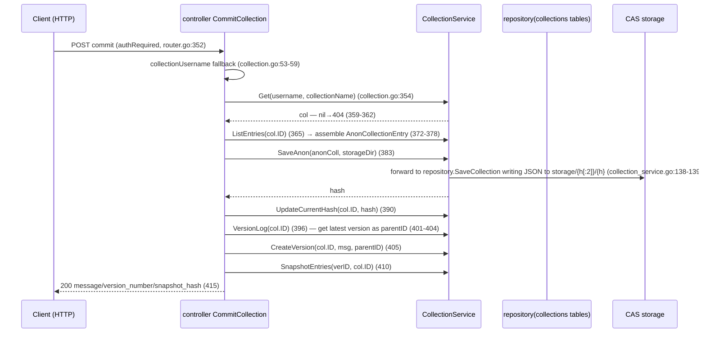

# Connection 03: controller ↔ service (business calls)

- **Modules involved**: `../modules/05-controller.md` and `../modules/06-service.md`
- **Code locations**: A side `back/internal/controller/` (file.go, collection.go, share.go, sync.go, anon.go, node_share.go, peer_pull.go etc.); B side `back/internal/service/` (file_service.go, collection_service.go, share_service.go, sync_service.go, anon_service.go, nodeshare.go, peerpull.go, pin_service.go etc.); sole assembly point at `back/internal/router/router.go:121-213` and `back/internal/router/peerjs_routes.go:38-47` (the latter triggered by `back/cmd/server/main.go:162,182`)
- **Direction**: A→B one-way. The channel is an **in-process synchronous function call** (same process, same module package, no network/no queue/no message middleware); data and errors flow back via return values `(T, error)` / `(T1, T2, error)`. Exception: `PeerPuller.Start/StartCollection` synchronously returns a task snapshot within the handler, then the service's background goroutine continues to advance (async execution, sync return; see §2.3).

## 1. Connection Method

**Channel type: in-process function call**. Controller does not directly import repository (M2 layer-discipline, `back/internal/service/collection_service.go:1-4` header comment); all business read/write goes through service package methods; controller only passes parameters and maps errors to status codes (`../modules/05-controller.md` §1.1).

### 1.1 When/who establishes the connection

One-time assembly at process startup, unchanged thereafter:

1. `main.go` first constructs services requiring external dependencies: `NewNodeShare(cfg, storageDir)` (`back/internal/service/nodeshare.go:224-245`) and `NewPeerPuller(cfg.DownloadDir)` (`back/internal/service/peerpull.go:116-127`), injected via `router.SetNodeShare(share)` / `router.SetPeerPuller(puller)` (`back/cmd/server/main.go:162,182`).
2. `main.go:236` calls `router.SetupRouter(cfg)`; `SetupRouter` internally constructs remaining service singletons and injects into controller:
   - `controller.InitFileController(fileSvc)` (`router.go:121-122`), `InitCollectionController(service.NewCollectionService())` (`:126`), `InitShareController(service.NewShareService())` (`:127`), `InitAnonController(service.NewAnonService(cfg))` (`:148`);
   - `syncCtrl := controller.NewSyncController(syncSvc)` (`:211-213`, SyncService reuses the same `UniversalDownloader`);
   - `SetNodeShare`/`SetPeerPuller` internally call `controller.InitNodeShareController` / `controller.InitPeerPuller` (`peerjs_routes.go:40-42,45-47`).
3. Assembly absence semantics: when not injected (nil), relevant endpoints return 503 (see §3 "half-open state").

### 1.2 Dependency Injection Checklist (package-level globals + Init*, or struct fields)

| Controller side holds | Type | Injection point | Primary consumer handler |
|---|---|---|---|
| `fileSvc` | `*service.FileService` | `InitFileController` (`back/internal/controller/file.go:30-36`) | all of file.go |
| `collSvc` | `*service.CollectionService` | `InitCollectionController` (`back/internal/controller/collection.go:38-44`) | all of collection.go; file.go's `DiffVersions` (`file.go:276-287`) |
| `shareSvc` | `*service.ShareService` | `InitShareController` (`back/internal/controller/share.go:13-19`) | all of share.go |
| `anonSvc` | `*service.AnonService` | `InitAnonController` (`back/internal/controller/anon.go:16-21`) | all of anon.go |
| `nodeShareSvc` | `*service.NodeShare` | `InitNodeShareController` (`back/internal/controller/node_share.go:36-43`) | all of node_share.go |
| `peerPuller` | `*service.PeerPuller` | `InitPeerPuller` (`back/internal/controller/peer_pull.go:23-30`) | all of peer_pull.go |
| `SyncController.syncSvc` | `*service.SyncService` | `NewSyncController` (`back/internal/controller/sync.go:12-18`) | all of sync.go |

> Exception (not part of this connection): controller also holds `*transport.PeerJSService` (`peerShareSvc`, requests shared manifest from peer, `back/internal/controller/node_market.go:41`; `forwardPeer`, port forwarding) and `*downloader.UniversalDownloader` (`back/internal/controller/download.go:31`) — two **cross-service injections**, see `../modules/05-controller.md` §6 and [06-service-transport.md](06-service-transport.md), [09-controller-downloader.md](09-controller-downloader.md).

### 1.3 Parameter Format and Call Conventions

- No proprietary protocol frames; all are ordinary Go method signatures: service exposes domain methods (`Upload(reader, filename)`, `Create(username, name, ...)`, `GetCollectionVisibleTo(hash, requester)`, `Start(peer, hash, ...)` etc.); controller passes HTTP-parsed parameters through unchanged.
- Controller reads shared config from gin context and passes to service: `storageDir := c.MustGet("storageDir").(string)` (injected at `router.go:75-79`; consumption points `collection.go:171/382/494`, `anon.go` has none — anon's storageDir comes from service's own cfg). `owner` identity taken from `nodestate.GetOperator()` (`anon.go:49-51,97,141,239,317`).
- `SyncController` is the only struct-based controller (`sync.go:12-18`); the rest are package-level function handlers + package-level global pointers.

### 1.4 Authentication Method

This connection is in-process; **no self-authentication**; authentication is split into two layers on upstream/downstream:

1. **HTTP entry middleware** (`back/internal/router/auth_middleware.go`): `AuthOptional` passes anonymously and sets `authenticated=false` (`:29-53`); `AuthRequired` with no valid Bearer token → 401 (`:57-82`). Mount points: `/peerjs/share*` (`peerjs_routes.go:111-113`), `/p2p/pull` three write endpoints (`router.go:250-253`), `PUT /anon/collections/:hash/visibility` (`router.go:327`), file/collection/share write endpoints (`router.go:330-383`). When `RegistrationServer` is not configured, `AuthRequired` internally passes (local single-machine mode, `auth_middleware.go:26,57-61`).
2. **Service-layer visibility gate**: anonymous collection reads uniformly go through `GetCollectionVisibleTo(hash, requester)`; unauthorized access is **equivalent to non-existent** (returns 404 not 403, `back/internal/service/anon_service.go:207-218`); `UpdateCollectionVisibility` only Owner (or historical ownerless collections) can modify (`anon_service.go:239-242`); upload size limits distinguished by authentication status (`MaxUploadBytes` reads `c.Get("authenticated")`, `back/internal/service/file_service.go:837-842`).

### 1.5 Error Semantics → HTTP Status Code Mapping (exclusive points)

Controller is the "error translation layer": service error types determine status codes, pattern as follows:

| Service returns | HTTP mapping | Representative code |
|---|---|---|
| `(nil, nil)` — not found | 404 | `VerifyFile` meta==nil (`file.go:189-193`); `GetCollection` col==nil (`collection.go:164-167`); `GetStatus` no sync state (`sync.go:47-51`) |
| Sentinel error `ErrStorageDisabled` | 403 | `errors.Is` check (`file.go:57-61`; definition `file_service.go:27-30`) |
| Sentinel error `ErrFileAlreadyExists` | 200 + `already_exists:true` (idempotent success) | `errors.Is` check (`file.go:62-72`; `file_service.go:561-564`) |
| Input/validation errors (service layer text convention) | 400 | anon error text matching (`anon.go:56-65,98-106,319-326`); `PutNodeShare`/`PostNodeShareFiles` validation failure (`node_share.go:88-93,125-129`); `StartPull` parameter error (`peer_pull.go:58-63`) |
| Collection name conflict and other creation errors | 409 | `CreateCollection` any error uniformly 409 (`collection.go:93-96`, duplicate semantics in godoc `:63`) |
| Remote peer errors (share frame request failure) | 502 | `StartPullCollection`'s `RequestShares` failure (`peer_pull.go:86-90`) |
| Injection absence (nil) | 503 | `nodeShareSvc==nil` (`node_share.go:49-52,79-82,112-115`); `peerPuller==nil` (`peer_pull.go:34-37,44-47,74-77,164-167`) |
| Other unclassified errors | 500 | Upload (`file.go:73-77`), collection query (`collection.go:110-114`), share creation (`share.go:37-41`) etc. |
| Known exception: `SaveToDisk`'s **input validation errors also map to 500** | 500 | `sync.go:32-35` (path traversal etc. should be 400, this endpoint not differentiated) |

## 2. Timing

### 2.1 Normal Path Main Timing (`POST /files/upload`)

```mermaid
sequenceDiagram
  participant C as Client (HTTP multipart)
  participant R as router(gin dispatch+auth)
  participant K as controller UploadFile
  participant S as FileService
  participant FS as CAS storage storage/{h[:2]}/{h}
  participant DB as repository(file_meta/file_providers)

  C->>R: POST /files/upload (authRequired)
  R->>K: router.go:334 → file.go:39
  K->>S: MaxUploadBytes(c) (file.go:42; file_service.go:837-842)
  K->>K: http.MaxBytesReader length limit (file.go:43)
  K->>K: c.Request.FormFile("file") (file.go:46) — fail→400 (47-51)
  K->>S: Upload(file, header.Filename) (file.go:55)
  S->>S: storageEnable check → ErrStorageDisabled (file_service.go:526-530)
  S->>FS: temp file + TeeReader, compute SHA256 while writing (file_service.go:540-548)
  S->>DB: GetFileMeta(hash) dedup check (file_service.go:561)
  alt already exists
    S-->>K: existing, ErrFileAlreadyExists (562-564)
  else not found
    S->>FS: copyInto: storage/{h[:2]}/{h} (566-574)
    S->>DB: InsertFileMeta + InsertFileProvider("local") (585-593)
    S-->>K: meta, nil
  end
  alt errors.Is(ErrStorageDisabled)
    K-->>C: 403 "storage is disabled" (file.go:57-61)
  else errors.Is(ErrFileAlreadyExists)
    K-->>C: 200 already_exists=true (file.go:62-72)
  else other err
    K-->>C: 500 err.Error() (file.go:73-77)
  else success
    K-->>C: 201 hash/size/mime/filename (file.go:79-86)
  end
```

Step-by-step explanation:

1. **Routing and authentication**: `SetupRouter` registers `files.POST("/upload", authRequired, controller.UploadFile)` (`router.go:334`); token validation done in middleware (`auth_middleware.go:57-82`).
2. **Size limit front-loaded**: `fileSvc.MaxUploadBytes(c)` takes limit by authentication status (`file.go:42`; `file_service.go:837-842`, authenticated 100MB / anonymous 10MB); `http.MaxBytesReader` wraps the request body (`file.go:43`) — **limits size, not time** (see §3 "timeout").
3. **Form parsing**: `c.Request.FormFile("file")` failure → 400 `file is required` (`file.go:46-51`).
4. **Main call**: `fileSvc.Upload(file, header.Filename)` (`file.go:55`). Inside service: `storageEnable` false → `ErrStorageDisabled` (`file_service.go:526-530`); temp file + `TeeReader` computing SHA256 as written (`:540-548`); first `GetFileMeta(hash)` dedup — if exists, directly return `existing + ErrFileAlreadyExists` (`:561-564`); otherwise `copyInto` writes CAS (`:566-574`) → `InsertFileMeta` (`:585-588`) → `InsertFileProvider("local", relPath)` (`:590-593`).
5. **Error → status code**: `errors.Is(err, service.ErrStorageDisabled)` → 403 (`file.go:57-61`); `errors.Is(err, service.ErrFileAlreadyExists)` → 200 + `already_exists` (`:62-72`); others → 500 (`:73-77`); success → 201 + hash/size/mime/filename (`:79-86`).

### 2.2 Composite Orchestration Timing (`POST /collections/:id/:coll/commit`, multiple service calls within one handler)



Step-by-step explanation:

1. `collectionUsername` fallback: gin sub-route parameter is actually `:id` but handler uniformly reads `:username`; fallback avoids empty-username dirty rows (`collection.go:46-59` comment: bug exposed by 2026-08-19 test.sh).
2. First step `collSvc.Get` (`collection.go:354`) confirms collection exists; nil → 404 (`:359-362`).
3. `collSvc.ListEntries` gets workspace entries (`:365`) → converts to `AnonCollectionEntry` (including providers, `:372-378`).
4. `collSvc.SaveAnon` writes content-addressed JSON to CAS (`:383`; `collection_service.go:138-139` forwards `repository.SaveCollection`) — **disk write happens at the service layer**; controller only passes `storageDir`.
5. `UpdateCurrentHash` updates CID pointer (`:390`); `VersionLog` gets parentID (`:396-404`); `CreateVersion` + `SnapshotEntries` preserves version history (`:405-413`).
6. Any service call failure midway → 500 (`:384-387,390-393,397-399,406-409,410-413` each branch). Success → 200 (`:415`).

### 2.3 Async Variant Timing (`POST /p2p/pull`, sync return + background execution)

```mermaid
sequenceDiagram
  participant C as Client (HTTP)
  participant K as controller StartPull
  participant P as PeerPuller
  participant X as transport PeerJSService (OpenStream data plane)
  participant FS as DownloadDir/pulled/*.part

  C->>K: POST /p2p/pull {peer, hash, name?, path?} (authRequired, router.go:251)
  K->>K: peer/hash required check — fail→400 (peer_pull.go:54-57)
  K->>P: Start(peer, hash, name, path, "") (peer_pull.go:58)
  P->>P: hash validity + source injected check (peerpull.go:147-152)
  P->>P: create job(ID/status) + register cancel (160-179) → return snapshot (182-183)
  K-->>C: 200 job snapshot (peer_pull.go:64) — handler returns
  Note over P,X,FS: background goroutine run(ctx, job) continues (peerpull.go:297-401)
  P->>P: concurrency gate sem(3) — wait for slot/cancellable (299-305)
  P->>P: isLocal(hash) already local → Skipped+Done (308-315)
  P->>X: OpenStream(peer, hash, 0, -1) (318) — fail→PullFailed (318-321)
  P->>FS: write .part + compute SHA256 + progress update (333-351, 404-435)
  P->>P: recompute hash compare — mismatch→delete .part+Failed (371-376)
  P->>FS: rename .part → final name (378)
  P->>P: register(target) → file_index.Create register (384-395)
  P->>P: finish sets terminal state (idempotent) (466-489)
```

Step-by-step explanation:

1. **Input validation**: `req.Peer=="" || req.Hash==""` → 400 (`peer_pull.go:54-57`); controller side doesn't validate hash format, delegates to service.
2. **Sync return**: `peerPuller.Start(...)` validates `isSHA256Hex` and `source` injection (`peerpull.go:147-152`) then immediately creates task, registers `context.WithCancel` (`:160-179`) and returns snapshot (`:182-183`); handler immediately returns 200 job (`peer_pull.go:64`) — **HTTP request doesn't wait for download completion**.
3. **Background execution** (`run`, `peerpull.go:297-401`): concurrency gate `sem` (max 3, `:57,299-305`) → same hash already local directly skipped (content-addressed dedup, `:308-315`) → `OpenStream` failure sets `PullFailed` (`:318-321`) → streaming write `.part` while computing SHA256 (`:333-351`; `copyWithProgress` checks `ctx.Err()` every 64KB block, `:404-410`) → **recompute hash before disk write**, mismatch deletes `.part` and sets Failed (`:371-376`) → `rename` to formal name (`:378`) → register `file_index` (`:384-395`; registration failure still reports Done + error hint, `:386-393`).
4. **Cancellation**: `CancelPull` → `peerPuller.Cancel` (`peer_pull.go:175-179`) = `cancel()` + `Close(reader)` (`peerpull.go:273-294`); blocking `Read` immediately returns → task set to `PullCancelled`.

## 3. Case Handling

| Exception/Edge Case | Behavior & Rationale (code location) | Description |
|---|---|---|
| **Timeout** | This connection is in-process synchronous call, **no self-timeout**; all limits come from upstream/downstream: ① HTTP server only sets `ReadHeaderTimeout: 15s` (`back/cmd/server/main.go:250-253`), no `ReadTimeout/WriteTimeout` → slow uploads/slow responses have no global time limit; upload only has `MaxBytesReader` size limit (`file.go:42-44`); ② Outbound URL pull `ResolveURL` uses `http.DefaultClient` (no Timeout, `file_service.go:365-377`) → when peer hangs, this handler may block for a long time; ③ Download path `anon.go:186` uses request ctx to call `universalDownloader.Download`; per-fetcher timeout is handled by the downloader (`router.go:200-207`, `DownloadTimeoutSecs` default 30s, see [09-controller-downloader.md](09-controller-downloader.md) §3); ④ `SyncService.saveFile` uses `context.Background()` (`sync_service.go:131`) → `SaveToDisk` has no overall timeout, per-file depends on downloader timeout (`:64-72` failure only logs that file and continues); ⑤ Pull task async execution, `copyWithProgress` checks ctx per block (`peerpull.go:404-410`). | Controller timeout feel = request hangs until downstream fails; `/p2p/pull` returns async so frontend doesn't wait for transfer. |
| **Disconnect / Reconnect** | This connection has no persistent connections; each request creates a new call; "disconnect" only exists at the outer layer: ① Request ctx propagation — anon download uses `c.Request.Context()` as ctx (`anon.go:185-186`); client disconnect immediately aborts; ② Provider fallback — `ReadFile` tries local/http providers one by one (`file_service.go:807-832`); ③ Pull task peer disconnect → `OpenStream` failure sets `PullFailed` (`peerpull.go:318-321`); task remains in table for query (`List`/`Get`, `:248-268`); ④ "Reconnect" = frontend re-sends request; `isLocal` hit skips download (`:308-315`). | No session recovery; failure info flows back to frontend via task table `Error` field (`peer_pull.go:38-39`). |
| **Duplicate / Concurrent** | ① Upload duplicate: first `GetFileMeta` dedup → `ErrFileAlreadyExists` → 200 + `already_exists` (`file.go:62-72`; `file_service.go:561-564`). ② Concurrent same-hash upload: no lock; two requests both miss simultaneously write to disk each; `InsertFileMeta` is pure INSERT (no ON CONFLICT, `back/internal/repository/file_repo.go:48-55`) — Upload path primary key conflict returns 500 (`file_service.go:585-588`); RegisterLocal path ignores error (`:251-259`); `InsertFileProvider` appends a row each time (`file_repo.go:81-84`) → provider rows accumulate (harmless under content addressing, same note in 09 doc). ③ Collection duplicate creation → 409 (`collection.go:93-96`); `AddEntry` uses `GetOrCreate` (`collection.go:223`; `collection_service.go:57-59`). ④ NodeShare: `mu` mutex protection scope (`nodeshare.go:327,383`); `ScopePatch` pointer semantics prevent full overwrite (`:159-170`); `SetFilesShared` batch limit 1000 (`:388-391`); level cache TTL 10s (`:71-78`). ⑤ PeerPuller: concurrency gate 3 (`peerpull.go:57,299-305`); `finish` idempotent (`:466-489`); task table limit 200 only drops finished tasks (`:492-514`); `Cancel` on finished task returns error (`:280-283`); `StartCollection` single-entry failure doesn't abort the whole batch (`:190-210`). | Correctness mainly relies on content addressing + pre-write hash verification; concurrent side effects are the known provider row accumulation. |
| **Data missing or validation failure** | Missing → 404: `VerifyFile` meta==nil (`file.go:189-193`); `GetCollection` col==nil (`collection.go:164-167`); `RemoveEntry`/`GetVersionLog` col==nil (`:263-266,436-439`); `DownloadCollectionFile` col/entry missing or no available provider (`:289-306,326`); anon unauthorized/non-existent uniformly 404 (`anon.go:141-145,163-167,239-244`); `AccessShare` token invalid/expired → 404 (`share.go:61-65`); `GetStatus` no sync state → 404 (`sync.go:47-51`). Validation failure → 400: bind failure, invalid hash (`file.go:177-181,208-212,244-248`), visibility/type whitelist (`collection.go:526-529`; `share.go:32-35`), missing fields (`peer_pull.go:54-57`; `sync.go:27-30`). Service-side validation: anon path/hash/providers (`anon_service.go:111-122,281-297`); `GetCollectionByHash` invalid hash → not-found (`:173-176`), bad JSON (`:185-188`), version<1 (`:189-192`); NodeShare validation failure **rejects entire batch** (`nodeshare.go:324-377,382-432`); PeerPuller invalid hash (`peerpull.go:147-149`) and `targetPath` path cleaning double-safety (`:441-463`); SyncService path traversal rejection (`sync_service.go:33-35,112-123`). Content validation: PeerPuller recomputes SHA256 before write, mismatch → Failed (`:371-376`); download pipeline recomputation see 09 doc. | 404 uniformly expresses "non-existent/unauthorized", doesn't reveal permission tier existence (`anon_service.go:203-218` comment). |
| **Auth failure** | HTTP entry: `AuthRequired` with no valid token → 401 (`auth_middleware.go:57-82`); mount points `/peerjs/share*` (`peerjs_routes.go:111-113`), `/p2p/pull` write endpoints (`router.go:250-253`), `/anon/collections/:hash/visibility` (`router.go:327`) etc. When `RegistrationServer` not configured → middleware passes (`auth_middleware.go:26,57-61`). Service layer: `GetCollectionVisibleTo` unauthorized → 404 (`anon_service.go:207-218`); `UpdateCollectionVisibility` only Owner can modify (`:239-242`); fork source must be visible (`anon.go:239-244`) and inherits permissions (`:274-282`). Identity sources: `nodestate.GetOperator()` (local operator, `anon.go:49-51` etc.) and gin context `authenticated/username` (`auth_middleware.go:32-52`; `file_service.go:838`). | This connection has no internal auth parameters; "auth failure" is entirely absorbed as 401/404 before/within reaching service. |
| **Half-open state** | ① Injection absence (nil) → 503 "not enabled": `nodeShareSvc==nil` (`node_share.go:49-52,79-82,112-115`), `peerPuller==nil` (`peer_pull.go:34-37,44-47,74-77,164-167`). ② Service exists but dependency missing: `peerPuller.source==nil` → `Start`/`FetchManifest` reports "pull source not configured" → 400 (`peerpull.go:150-152,224-226`). ③ NodeShare not `Enable`'d → `SnapshotFor` returns empty snapshot (legitimate business state, `nodeshare.go:553-572`). ④ Peer half-open: `RequestShares` failure → 502 (`peer_pull.go:86-90`); manifest cannot be retrieved → 404 (`:118-129,136-141`); `OpenStream` failure → `PullFailed` (`peerpull.go:318-321`). | Half-open is modeled as three observable states: "endpoint unavailable (503)" / "service has no content (empty snapshot)" / "task failed (Failed)". |
| **Process restart** | All service singletons and controller package-level globals rebuilt by `SetupRouter` (`router.go:121-128,148,213`) and main injection (`main.go:162,182`; `peerjs_routes.go:38-47`) — missed injection returns to the "half-open" row's 503. Persistent state recovery: ① NodeShare's `share_scope.json` atomic write (temp file + rename, `nodeshare.go:519-541`); restart reads file (`:224-245`); on corruption falls back to environment variables as "never saved" (`:471-517`); ② PeerPuller task table is pure memory, lost on restart (`peerpull.go:57-61,107-127`); already-written `pulled` files preserved; ③ CAS files and SQLite metadata persist; uploaded/registered collections and files remain after restart (`file_service.go`, `anon_service.go:140-160`). | No "session recovery" concept; post-restart state is rebuilt from persistence layers (CAS/SQLite/two JSON files). |
| **Parameter missing / bind failure** | `ShouldBindJSON` failure uniformly 400 (`file.go:99-103,133-137,156-160,234-238,271-275`, `collection.go:80-83`, `share.go:28-31`, `anon.go:44-47,93-96,232-235,312-315`, `sync.go:22-25`, `node_share.go:84-87,121-124`, `peer_pull.go:54-57,82-85,171-174`); required field defaults checked per endpoint (`file.go:239-243`, `peer_pull.go:54-57`, `sync.go:27-30`). | 400 is the unified standard for "request body problems", distinct from business errors (404/409/500). |
| **Fragility of error text matching** | `anon.go` uses `strings.Contains(err.Error(), ...)` to distinguish 400/404/500 (`anon.go:55-65,98-106,319-326`); `node_share.go:88-93` maps service validation errors uniformly to 400. | Service layer uses text conventions instead of sentinel errors; service-layer wording changes would alter status code semantics (`../modules/06-service.md` §5 doesn't document this convention, it's a known implementation detail). |

## 4. Related Documents

- Connection documents (same directory):
  - [02-router-controller.md](02-router-controller.md): router→controller assembly surface. All `Init*` injections for this connection happen in `SetupRouter` (`router.go:121-213`); authentication middleware (401) and `storageDir` context injection (`router.go:75-79`) are also on this surface.
  - [04-service-repository.md](04-service-repository.md): downstream of this connection — service delegates SQLite read/write to repository (`collection_service.go` transparently forwards entire file; `file_service.go:585-593`).
  - [06-service-transport.md](06-service-transport.md): service→transport data plane. NodeShare as share frame data source/download gate (`main.go:156-158`) and PeerPuller's `OpenStream` data plane (`main.go:167-182`) all unfold after this connection.
  - [09-controller-downloader.md](09-controller-downloader.md): controller→downloader. Anonymous collection file download (`anon.go:186`) and `SyncService.saveFile` (`sync_service.go:132-135`) reuse the same `UniversalDownloader` instance (assembly `router.go:199-213`); `DownloadCollectionFile` goes through `DownloadBySHA256Internal` on this surface (`collection.go:307-314`).
  - [10-controller-storage.md](10-controller-storage.md): controller→storage. `storageDir` extracted from gin context and passed to service (`collection.go:171/382/494`; injected at `router.go:75-79`); actual disk write happens at the service layer (`file_service.go:566-574`, `anon_service.go:140-149`).
  - [01-frontend-backend.md](01-frontend-backend.md): frontend reuses this gin engine via `/ws/peer` admin frame internal forwarding (`router.go:396-415`); therefore "HTTP direct call" and "browser admin frame" ultimately go through the same set of controller→service calls.
- Module documents: `../modules/05-controller.md` (HTTP handler surface; §1.2 dependency injection checklist, §1.3 upload flow, §5 boundaries and pitfalls), `../modules/06-service.md` (business orchestration layer; nine service components and their responsibilities, own persistent files), `../modules/04-router.md` (assembly and middleware), `../modules/02-repository.md` (SQLite tables and `file_repo.go` INSERT semantics), `../modules/08-downloader.md` (download pipeline timeout/verification, downstream of this connection's download path).
