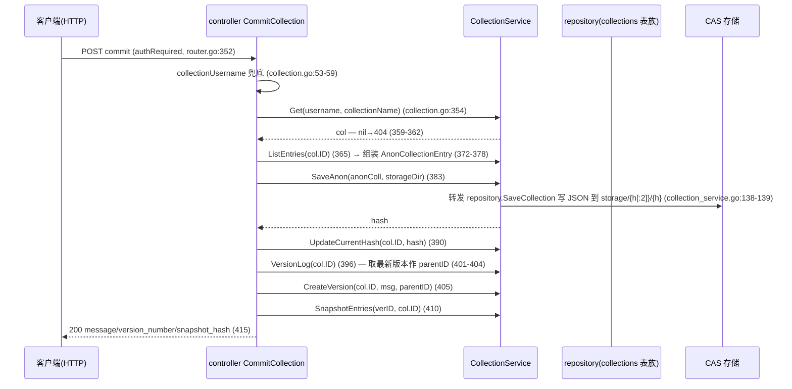

# 连接 03：controller ↔ service（业务调用）

- **涉及模块**：`../modules/05-controller.md` 与 `../modules/06-service.md`
- **代码位置**：A 侧 `back/internal/controller/`（file.go、collection.go、share.go、sync.go、anon.go、node_share.go、peer_pull.go 等）；B 侧 `back/internal/service/`（file_service.go、collection_service.go、share_service.go、sync_service.go、anon_service.go、nodeshare.go、peerpull.go、pin_service.go 等）；唯一装配点在 `back/internal/router/router.go:121-213` 与 `back/internal/router/peerjs_routes.go:38-47`（后者由 `back/cmd/server/main.go:162,182` 触发）
- **方向**：A→B 单向。通道是**进程内同步函数调用**（同进程、同模块包，无网络/无队列/无消息中间件）；数据与错误经返回值 `(T, error)` / `(T1, T2, error)` 回流。例外：`PeerPuller.Start/StartCollection` 在 handler 内同步返回任务快照后，由 service 后台 goroutine 继续推进（异步执行、同步返回，见 §2.3）。

## 1. 连接方式

**通道类型：进程内函数调用**。controller 不直接 import repository（M2 收层纪律，`back/internal/service/collection_service.go:1-4` 头注释），业务读写一律经 service 包的方法转发；controller 只传参、按错误映射状态码（`../modules/05-controller.md` §1.1）。

### 1.1 连接何时建立、由谁建立

进程启动时一次性装配，之后不变：

1. `main.go` 先构造需要外部依赖的 service：`NewNodeShare(cfg, storageDir)`（`back/internal/service/nodeshare.go:224-245`）与 `NewPeerPuller(cfg.DownloadDir)`（`back/internal/service/peerpull.go:116-127`），经 `router.SetNodeShare(share)` / `router.SetPeerPuller(puller)` 转发注入（`back/cmd/server/main.go:162,182`）。
2. `main.go:236` 调 `router.SetupRouter(cfg)`；`SetupRouter` 内构造其余 service 单例并注入 controller：
   - `controller.InitFileController(fileSvc)`（`router.go:121-122`）、`InitCollectionController(service.NewCollectionService())`（`:126`）、`InitShareController(service.NewShareService())`（`:127`）、`InitAnonController(service.NewAnonService(cfg))`（`:148`）；
   - `syncCtrl := controller.NewSyncController(syncSvc)`（`:211-213`，SyncService 复用同一 `UniversalDownloader`）；
   - `SetNodeShare`/`SetPeerPuller` 内部再调 `controller.InitNodeShareController` / `controller.InitPeerPuller`（`peerjs_routes.go:40-42,45-47`）。
3. 装配缺位语义：未注入（nil）时相关端点回 503（见 §3「半开状态」）。

### 1.2 依赖注入清单（包级全局 + Init*，或结构体字段）

| controller 侧持有 | 类型 | 注入点 | 主要消费 handler |
|---|---|---|---|
| `fileSvc` | `*service.FileService` | `InitFileController`（`back/internal/controller/file.go:30-36`） | file.go 全部 |
| `collSvc` | `*service.CollectionService` | `InitCollectionController`（`back/internal/controller/collection.go:38-44`） | collection.go 全部；file.go 的 `DiffVersions`（`file.go:276-287`） |
| `shareSvc` | `*service.ShareService` | `InitShareController`（`back/internal/controller/share.go:13-19`） | share.go 全部 |
| `anonSvc` | `*service.AnonService` | `InitAnonController`（`back/internal/controller/anon.go:16-21`） | anon.go 全部 |
| `nodeShareSvc` | `*service.NodeShare` | `InitNodeShareController`（`back/internal/controller/node_share.go:36-43`） | node_share.go 全部 |
| `peerPuller` | `*service.PeerPuller` | `InitPeerPuller`（`back/internal/controller/peer_pull.go:23-30`） | peer_pull.go 全部 |
| `SyncController.syncSvc` | `*service.SyncService` | `NewSyncController`（`back/internal/controller/sync.go:12-18`） | sync.go 全部 |

> 例外（不属于本连接）：controller 还持有 `*transport.PeerJSService`（`peerShareSvc`，问对端要共享清单，`back/internal/controller/node_market.go:41`；`forwardPeer`，端口转发）与 `*downloader.UniversalDownloader`（`back/internal/controller/download.go:31`）两处**跨过 service 的注入**，见 `../modules/05-controller.md` §6 与 [06-service-transport.md](06-service-transport.md)、[09-controller-downloader.md](09-controller-downloader.md)。

### 1.3 参数格式与调用约定

- 无自有协议帧，全部为普通 Go 方法签名：service 暴露领域方法（`Upload(reader, filename)`、`Create(username, name, ...)`、`GetCollectionVisibleTo(hash, requester)`、`Start(peer, hash, ...)` 等），controller 把 HTTP 解析出的参数原样传入。
- controller 从 gin context 取共享配置再传给 service：`storageDir := c.MustGet("storageDir").(string)`（注入于 `router.go:75-79`；消费点 `collection.go:171/382/494`、`anon.go` 无——anon 的 storageDir 来自 service 自持 cfg）。`owner` 身份取自 `nodestate.GetOperator()`（`anon.go:49-51,97,141,239,317`）。
- `SyncController` 是唯一结构体式 controller（`sync.go:12-18`）；其余为包级函数 handler + 包级全局指针。

### 1.4 鉴权方式

本连接为进程内调用，**无自身鉴权**；鉴权分两层落在上下游：

1. **HTTP 入口中间件**（`back/internal/router/auth_middleware.go`）：`AuthOptional` 匿名放行并打 `authenticated=false`（`:29-53`）；`AuthRequired` 无有效 Bearer token → 401（`:57-82`）。挂载点：`/peerjs/share*`（`peerjs_routes.go:111-113`）、`/p2p/pull` 三个写端点（`router.go:250-253`）、`PUT /anon/collections/:hash/visibility`（`router.go:327`）、文件/集合/分享写端点（`router.go:330-383`）。未配置 `RegistrationServer` 时 `AuthRequired` 内部放行（本地单机模式，`auth_middleware.go:26,57-61`）。
2. **service 层可见性闸门**：匿名集合读取统一走 `GetCollectionVisibleTo(hash, requester)`，越权**等价于不存在**（回 404 而非 403，`back/internal/service/anon_service.go:207-218`）；`UpdateCollectionVisibility` 只有 Owner（或历史无主集合）能改（`anon_service.go:239-242`）；上传体积上限按认证状态区分（`MaxUploadBytes` 读 `c.Get("authenticated")`，`back/internal/service/file_service.go:837-842`）。

### 1.5 错误语义 → HTTP 状态码映射（专属要点）

controller 是「错误翻译层」：service 的错误类型决定状态码，模式如下：

| service 返回 | HTTP 映射 | 代表代码 |
|---|---|---|
| `(nil, nil)`——未找到 | 404 | `VerifyFile` meta==nil（`file.go:189-193`）；`GetCollection` col==nil（`collection.go:164-167`）；`GetStatus` 无同步状态（`sync.go:47-51`） |
| 哨兵错误 `ErrStorageDisabled` | 403 | `errors.Is` 判定（`file.go:57-61`；定义 `file_service.go:27-30`） |
| 哨兵错误 `ErrFileAlreadyExists` | 200 + `already_exists:true`（幂等成功） | `errors.Is` 判定（`file.go:62-72`；`file_service.go:561-564`） |
| 输入/校验类错误（服务层文本约定） | 400 | anon 错误文本匹配（`anon.go:56-65,98-106,319-326`）；`PutNodeShare`/`PostNodeShareFiles` 校验失败（`node_share.go:88-93,125-129`）；`StartPull` 参数错误（`peer_pull.go:58-63`） |
| 集合重名等创建错误 | 409 | `CreateCollection` 任何错误一律 409（`collection.go:93-96`，重复语义见 godoc `:63`） |
| 远端对端错误（share 帧请求失败） | 502 | `StartPullCollection` 的 `RequestShares` 失败（`peer_pull.go:86-90`） |
| 注入缺位（nil） | 503 | `nodeShareSvc==nil`（`node_share.go:49-52,79-82,112-115`）；`peerPuller==nil`（`peer_pull.go:34-37,44-47,74-77,164-167`） |
| 其余未分类 error | 500 | 上传（`file.go:73-77`）、集合查询（`collection.go:110-114`）、分享创建（`share.go:37-41`）等 |
| 已知例外：`SaveToDisk` 的**输入校验错误也映射 500** | 500 | `sync.go:32-35`（路径穿越等本应 400，该端点未细分） |

## 2. 时序

### 2.1 正常路径主时序（`POST /files/upload`）

```mermaid
sequenceDiagram
  participant C as 客户端(HTTP multipart)
  participant R as router(gin 分发+认证)
  participant K as controller UploadFile
  participant S as FileService
  participant FS as CAS 存储 storage/{h[:2]}/{h}
  participant DB as repository(file_meta/file_providers)

  C->>R: POST /files/upload (authRequired)
  R->>K: router.go:334 → file.go:39
  K->>S: MaxUploadBytes(c) (file.go:42; file_service.go:837-842)
  K->>K: http.MaxBytesReader 限长 (file.go:43)
  K->>K: c.Request.FormFile("file") (file.go:46) — 失败→400 (47-51)
  K->>S: Upload(file, header.Filename) (file.go:55)
  S->>S: storageEnable 检查 → ErrStorageDisabled (file_service.go:526-530)
  S->>FS: 临时文件 + TeeReader 边写边算 SHA256 (file_service.go:540-548)
  S->>DB: GetFileMeta(hash) 查重 (file_service.go:561)
  alt 已存在
    S-->>K: existing, ErrFileAlreadyExists (562-564)
  else 不存在
    S->>FS: copyInto: storage/{h[:2]}/{h} (566-574)
    S->>DB: InsertFileMeta + InsertFileProvider("local") (585-593)
    S-->>K: meta, nil
  end
  alt errors.Is(ErrStorageDisabled)
    K-->>C: 403 "storage is disabled" (file.go:57-61)
  else errors.Is(ErrFileAlreadyExists)
    K-->>C: 200 already_exists=true (file.go:62-72)
  else 其他 err
    K-->>C: 500 err.Error() (file.go:73-77)
  else 成功
    K-->>C: 201 hash/size/mime/filename (file.go:79-86)
  end
```

逐步骤说明：

1. **路由与认证**：`SetupRouter` 注册 `files.POST("/upload", authRequired, controller.UploadFile)`（`router.go:334`）；token 校验在中间件完成（`auth_middleware.go:57-82`）。
2. **限长前置**：`fileSvc.MaxUploadBytes(c)` 按认证状态取上限（`file.go:42`；`file_service.go:837-842`，认证 100MB / 匿名 10MB），`http.MaxBytesReader` 包住请求体（`file.go:43`）——**限体积、不限时间**（见 §3「超时」）。
3. **表单解析**：`c.Request.FormFile("file")` 失败 → 400 `file is required`（`file.go:46-51`）。
4. **主调用**：`fileSvc.Upload(file, header.Filename)`（`file.go:55`）。service 内：`storageEnable` 为假 → `ErrStorageDisabled`（`file_service.go:526-530`）；临时文件 + `TeeReader` 边写边算 SHA256（`:540-548`）；先 `GetFileMeta(hash)` 查重——已存在直接返回 `existing + ErrFileAlreadyExists`（`:561-564`）；否则 `copyInto` 写 CAS（`:566-574`）→ `InsertFileMeta`（`:585-588`）→ `InsertFileProvider("local", relPath)`（`:590-593`）。
5. **错误→状态码**：`errors.Is(err, service.ErrStorageDisabled)` → 403（`file.go:57-61`）；`errors.Is(err, service.ErrFileAlreadyExists)` → 200 + `already_exists`（`:62-72`）；其余 → 500（`:73-77`）；成功 → 201 + hash/size/mime/filename（`:79-86`）。

### 2.2 组合编排时序（`POST /collections/:id/:coll/commit`，一个 handler 内多次调 service）



逐步骤说明：

1. `collectionUsername` 兜底：gin 子路由参数实为 `:id` 而 handler 统一读 `:username`，兜底避免空用户名脏行（`collection.go:46-59` 注释：2026-08-19 test.sh 暴露的 bug）。
2. 第一步 `collSvc.Get`（`collection.go:354`）确认集合存在，nil → 404（`:359-362`）。
3. `collSvc.ListEntries` 取工作区条目（`:365`）→ 转成 `AnonCollectionEntry`（含 providers，`:372-378`）。
4. `collSvc.SaveAnon` 把内容寻址 JSON 落 CAS（`:383`；`collection_service.go:138-139` 转发 `repository.SaveCollection`）——**落盘发生在 service 层**，controller 只传 `storageDir`。
5. `UpdateCurrentHash` 更新 CID 指针（`:390`）；`VersionLog` 取 parentID（`:396-404`）；`CreateVersion` + `SnapshotEntries` 保留版本历史（`:405-413`）。
6. 中途任何 service 调用失败 → 500（`:384-387,390-393,397-399,406-409,410-413` 各分支）。成功 → 200（`:415`）。

### 2.3 异步变体时序（`POST /p2p/pull`，同步返回 + 后台执行）

```mermaid
sequenceDiagram
  participant C as 客户端(HTTP)
  participant K as controller StartPull
  participant P as PeerPuller
  participant X as transport PeerJSService (OpenStream 数据面)
  participant FS as DownloadDir/pulled/*.part

  C->>K: POST /p2p/pull {peer, hash, name?, path?} (authRequired, router.go:251)
  K->>K: peer/hash 必填校验 — 失败→400 (peer_pull.go:54-57)
  K->>P: Start(peer, hash, name, path, "") (peer_pull.go:58)
  P->>P: hash 合法性 + source 已注入检查 (peerpull.go:147-152)
  P->>P: 建 job(ID/状态) + 注册 cancel (160-179) → 返回快照 (182-183)
  K-->>C: 200 job 快照 (peer_pull.go:64) — handler 返回
  Note over P,X,FS: 后台 goroutine run(ctx, job) 继续（peerpull.go:297-401）
  P->>P: 并发闸 sem(3) — 等名额/可取消 (299-305)
  P->>P: isLocal(hash) 本地已有 → Skipped+Done (308-315)
  P->>X: OpenStream(peer, hash, 0, -1) (318) — 失败→PullFailed (318-321)
  P->>FS: 写 .part + 边算 SHA256 + 进度更新 (333-351, 404-435)
  P->>P: 复算 hash 比对 — 不符→删 .part+Failed (371-376)
  P->>FS: rename .part → 正式名 (378)
  P->>P: register(target) → file_index.Create 登记 (384-395)
  P->>P: finish 置终态（幂等） (466-489)
```

逐步骤说明：

1. **入参校验**：`req.Peer=="" || req.Hash==""` → 400（`peer_pull.go:54-57`）；controller 侧不校验 hash 格式，交给 service。
2. **同步返回**：`peerPuller.Start(...)` 校验 `isSHA256Hex` 与 `source` 注入（`peerpull.go:147-152`）后立刻建任务、注册 `context.WithCancel`（`:160-179`）并返回快照（`:182-183`）；handler 随即回 200 job（`peer_pull.go:64`）——**HTTP 请求不等下载完成**。
3. **后台执行**（`run`，`peerpull.go:297-401`）：并发闸 `sem`（上限 3，`:57,299-305`）→ 本地已有同 hash 直接跳过（内容寻址去重，`:308-315`）→ `OpenStream` 失败置 `PullFailed`（`:318-321`）→ 流式写 `.part` 并边算 SHA256（`:333-351`；`copyWithProgress` 每 64KB 块检查 `ctx.Err()`，`:404-410`）→ **落盘前复算 hash**，不符删 `.part` 置 Failed（`:371-376`）→ `rename` 成正式名（`:378`）→ 登记 `file_index`（`:384-395`，登记失败仍报 Done + 错误提示，`:386-393`）。
4. **取消**：`CancelPull` → `peerPuller.Cancel`（`peer_pull.go:175-179`）= `cancel()` + `Close(reader)`（`peerpull.go:273-294`），阻塞中的 `Read` 立刻返回 → 任务置 `PullCancelled`。

## 3. 情况处理

| 异常/边界场景 | 行为与依据（代码位置） | 说明 |
|---|---|---|
| **超时** | 本连接是进程内同步调用，**无自身超时**；上限全部来自上下游：① HTTP 服务器只设 `ReadHeaderTimeout: 15s`（`back/cmd/server/main.go:250-253`），无 `ReadTimeout/WriteTimeout` → 慢上传/慢响应没有全局时间上限，上传只有 `MaxBytesReader` 体积上限（`file.go:42-44`）；② 出站 URL 拉取 `ResolveURL` 用 `http.DefaultClient`（无 Timeout，`file_service.go:365-377`）→ 对端挂起时该 handler 可能长期阻塞；③ 下载路径 `anon.go:186` 用请求 ctx 调 `universalDownloader.Download`，per-fetcher 超时由下载器兜底（`router.go:200-207`，`DownloadTimeoutSecs` 默认 30s，同 [09-controller-downloader.md](09-controller-downloader.md) §3）；④ `SyncService.saveFile` 用 `context.Background()`（`sync_service.go:131`）→ `SaveToDisk` 无整体超时，逐文件依赖下载器超时（`:64-72` 失败只记该文件继续）；⑤ 拉取任务异步执行，`copyWithProgress` 每块检查 ctx（`peerpull.go:404-410`）。 | controller 超时观感 = 请求挂起直到下游失败；`/p2p/pull` 因异步返回不会让前端等传输。 |
| **断连 / 重连** | 本连接无长连接，每次请求新建调用；「断连」只存在于外层：① 请求 ctx 传导——anon 下载以 `c.Request.Context()` 为 ctx（`anon.go:185-186`），客户端断开即中止；② provider 回退——`ReadFile` 按 local/http provider 逐条尝试（`file_service.go:807-832`）；③ 拉取任务对端断开 → `OpenStream` 失败置 `PullFailed`（`peerpull.go:318-321`），任务留在表里可查（`List`/`Get`，`:248-268`）；④ 「重连」= 前端重新发请求；`isLocal` 命中则跳过下载（`:308-315`）。 | 无会话恢复；失败信息经任务表 `Error` 字段回流前端（`peer_pull.go:38-39`）。 |
| **重复 / 并发** | ① 上传重复：先 `GetFileMeta` 查重 → `ErrFileAlreadyExists` → 200 + `already_exists`（`file.go:62-72`；`file_service.go:561-564`）。② 并发同 hash 上传：无锁，两请求同时未命中时各自写盘；`InsertFileMeta` 为纯 INSERT（无 ON CONFLICT，`back/internal/repository/file_repo.go:48-55`）——Upload 路径主键冲突会回 500（`file_service.go:585-588`），RegisterLocal 路径忽略错误（`:251-259`）；`InsertFileProvider` 每次追加行（`file_repo.go:81-84`）→ provider 行累积（内容寻址下无害，09 文档同注）。③ 集合重复创建 → 409（`collection.go:93-96`）；`AddEntry` 用 `GetOrCreate`（`collection.go:223`；`collection_service.go:57-59`）。④ NodeShare：`mu` 互斥保护范围（`nodeshare.go:327,383`）；`ScopePatch` 指针语义防全量覆盖（`:159-170`）；`SetFilesShared` 批量上限 1000（`:388-391`）；级别缓存 TTL 10s（`:71-78`）。⑤ PeerPuller：并发闸 3（`peerpull.go:57,299-305`）；`finish` 幂等（`:466-489`）；任务表上限 200 只丢已结束任务（`:492-514`）；`Cancel` 已结束任务报错（`:280-283`）；`StartCollection` 单条目失败不中断整批（`:190-210`）。 | 正确性主要靠内容寻址 + 落盘前 hash 校验；并发副作用是已知的 provider 行累积。 |
| **数据缺失或校验失败** | 缺失 → 404：`VerifyFile` meta==nil（`file.go:189-193`）；`GetCollection` col==nil（`collection.go:164-167`）；`RemoveEntry`/`GetVersionLog` col==nil（`:263-266,436-439`）；`DownloadCollectionFile` col/entry 缺失或无可用 provider（`:289-306,326`）；anon 越权/不存在统一 404（`anon.go:141-145,163-167,239-244`）；`AccessShare` token 无效/过期 → 404（`share.go:61-65`）；`GetStatus` 无同步状态 → 404（`sync.go:47-51`）。校验失败 → 400：bind 失败、hash 非法（`file.go:177-181,208-212,244-248`）、visibility/type 白名单（`collection.go:526-529`；`share.go:32-35`）、缺字段（`peer_pull.go:54-57`；`sync.go:27-30`）。service 侧校验：anon 路径/hash/providers（`anon_service.go:111-122,281-297`）；`GetCollectionByHash` 非法 hash → not-found（`:173-176`）、坏 JSON（`:185-188`）、版本<1（`:189-192`）；NodeShare 校验失败**整批拒绝**（`nodeshare.go:324-377,382-432`）；PeerPuller hash 非法（`peerpull.go:147-149`）与 `targetPath` 路径清洗双保险（`:441-463`）；SyncService 路径穿越拒绝（`sync_service.go:33-35,112-123`）。内容校验：PeerPuller 落盘前复算 SHA256 不符 → Failed（`:371-376`）；下载管线复算见 09 文档。 | 404 统一表达「不存在/越权」，不泄露权限档位存在性（`anon_service.go:203-218` 注释）。 |
| **鉴权失败** | HTTP 入口：`AuthRequired` 无有效 token → 401（`auth_middleware.go:57-82`）；挂载点 `/peerjs/share*`（`peerjs_routes.go:111-113`）、`/p2p/pull` 写端点（`router.go:250-253`）、`/anon/collections/:hash/visibility`（`router.go:327`）等。未配 `RegistrationServer` → 中间件放行（`auth_middleware.go:26,57-61`）。service 层：`GetCollectionVisibleTo` 越权 → 404（`anon_service.go:207-218`）；`UpdateCollectionVisibility` 仅 Owner 可改（`:239-242`）；fork 源必须可见（`anon.go:239-244`）且继承权限（`:274-282`）。身份来源：`nodestate.GetOperator()`（本机 operator，`anon.go:49-51` 等）与 gin context `authenticated/username`（`auth_middleware.go:32-52`；`file_service.go:838`）。 | 本连接内部无鉴权参数；「鉴权失败」全部在触达 service 之前/之内被 401/404 吸收。 |
| **半开状态** | ① 注入缺位（nil）→ 503「未启用」：`nodeShareSvc==nil`（`node_share.go:49-52,79-82,112-115`）、`peerPuller==nil`（`peer_pull.go:34-37,44-47,74-77,164-167`）。② 服务在但依赖缺：`peerPuller.source==nil` → `Start`/`FetchManifest` 报「pull source not configured」→ 400（`peerpull.go:150-152,224-226`）。③ NodeShare 未 `Enable` → `SnapshotFor` 返回空快照（合法业务状态，`nodeshare.go:553-572`）。④ 对端半开：`RequestShares` 失败 → 502（`peer_pull.go:86-90`）；manifest 取不回 → 404（`:118-129,136-141`）；`OpenStream` 失败 → `PullFailed`（`peerpull.go:318-321`）。 | 半开被建模成「端点不可用（503）/ 服务无内容（空快照）/ 任务失败（Failed）」三种可观察状态。 |
| **进程重启** | 全部 service 单例与 controller 包级全局由 `SetupRouter` 重建（`router.go:121-128,148,213`）与 main 注入（`main.go:162,182`；`peerjs_routes.go:38-47`）——漏注入即回到「半开」行的 503。持久态恢复：① NodeShare 的 `share_scope.json` 原子写（临时文件+rename，`nodeshare.go:519-541`），重启以文件为准（`:224-245`），损坏时按「未保存过」回退环境变量（`:471-517`）；② PeerPuller 任务表纯内存，重启丢失（`peerpull.go:57-61,107-127`），已落盘 `pulled` 文件保留；③ CAS 文件与 SQLite 元数据持久，重启后上传/登记的集合与文件仍在（`file_service.go`、`anon_service.go:140-160`）。 | 无「恢复会话」概念；重启后状态由持久层（CAS/SQLite/两个 JSON）重建。 |
| **参数缺失 / 绑定失败** | `ShouldBindJSON` 失败一律 400（`file.go:99-103,133-137,156-160,234-238,271-275`、`collection.go:80-83`、`share.go:28-31`、`anon.go:44-47,93-96,232-235,312-315`、`sync.go:22-25`、`node_share.go:84-87,121-124`、`peer_pull.go:54-57,82-85,171-174`）；必填字段缺省按端点分别校验（`file.go:239-243`、`peer_pull.go:54-57`、`sync.go:27-30`）。 | 400 是「请求体问题」的统一口径，与业务错误（404/409/500）区分。 |
| **错误文本匹配的脆弱性** | `anon.go` 用 `strings.Contains(err.Error(), ...)` 区分 400/404/500（`anon.go:55-65,98-106,319-326`）；`node_share.go:88-93` 把 service 校验错误一律 400。 | 服务层未用哨兵错误而是文本约定，服务层措辞改动会改变状态码口径（`../modules/06-service.md` §5 未记录此约定，属已知实现细节）。 |

## 4. 相关文档

- 连接文档（同目录）：
  - [02-router-controller.md](02-router-controller.md)：router→controller 装配面。本连接的全部 `Init*` 注入发生在 `SetupRouter`（`router.go:121-213`）；认证中间件（401）与 `storageDir` context 注入（`router.go:75-79`）也在该面。
  - [04-service-repository.md](04-service-repository.md)：本连接的下游——service 把 SQLite 读写委托 repository（`collection_service.go` 全文件透明转发；`file_service.go:585-593`）。
  - [06-service-transport.md](06-service-transport.md)：service→transport 数据面。NodeShare 作 share 帧数据源/下载门禁（`main.go:156-158`）、PeerPuller 的 `OpenStream` 数据面（`main.go:167-182`）都在本连接之后展开。
  - [09-controller-downloader.md](09-controller-downloader.md)：controller→downloader。匿名集合文件下载（`anon.go:186`）与 `SyncService.saveFile`（`sync_service.go:132-135`）复用同一 `UniversalDownloader` 实例（装配 `router.go:199-213`）；`DownloadCollectionFile` 经 `DownloadBySHA256Internal` 走该面（`collection.go:307-314`）。
  - [10-controller-storage.md](10-controller-storage.md)：controller→storage。`storageDir` 从 gin context 取出传 service（`collection.go:171/382/494`；注入 `router.go:75-79`）；落盘实际发生在 service 层（`file_service.go:566-574`、`anon_service.go:140-149`）。
  - [01-frontend-backend.md](01-frontend-backend.md)：前端经 `/ws/peer` 的 admin 帧内部转发复用本 gin engine（`router.go:396-415`），因此「HTTP 直调」与「浏览器 admin 帧」最终走同一批 controller→service 调用。
- 模块文档：`../modules/05-controller.md`（HTTP 处理器面；§1.2 依赖注入清单、§1.3 上传流程、§5 边界与坑）、`../modules/06-service.md`（业务编排层；九个服务组件与各自职责、自有持久化文件）、`../modules/04-router.md`（装配与中间件）、`../modules/02-repository.md`（SQLite 表与 `file_repo.go` 的 INSERT 语义）、`../modules/08-downloader.md`（下载管线超时/校验，本连接下载路径的下游）。
