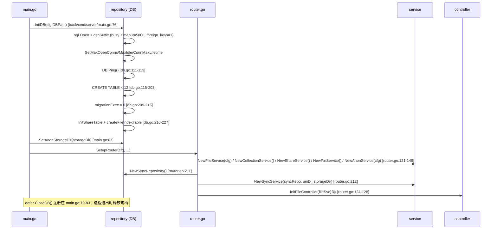

# 连接 04：service ↔ repository（DB 读写）

- **涉及模块**：[../modules/06-service.md](../modules/06-service.md) 与 [../modules/02-repository.md](../modules/02-repository.md)
- **代码位置**：A 侧 `back/internal/service/`（collection_service.go / share_service.go / pin_service.go / file_service.go / sync_service.go / anon_service.go）；B 侧 `back/internal/repository/`（db.go / file_repo.go / collection_repo.go / share_repo.go / sync_repo.go / pin_repo.go / anon_repo.go / file_index_repo.go）
- **方向**：**A→B 单向**。service 包 import repository 包调用其包级函数；repository 从不回调 service，也没有 service 接口作为参数。**无 B→A**。唯一例外是 transport 包（非 A 侧）也直接调用 `repository.UpsertFileIndex`（见 [11-transport-storage.md](11-transport-storage.md)），但那是本连接外的另一条 A→B 通道。

## 1. 连接方式

### 1.1 通道与调用形态

- **进程内函数调用**，无网络协议、无队列、无 IPC。B 侧绝大多数是**包级函数**（`repository.GetFileMeta`、`repository.InsertFileMeta`……），不是接口或结构体方法——service 用 `import "peerdrive/internal/repository"` 后直接点包名调用（`back/internal/service/collection_service.go:7-10`、`back/internal/service/file_service.go:22`）。
- **唯一结构体化例外**：`SyncRepository` 是空结构体（`back/internal/repository/sync_repo.go:10-15`），由 router 装配时 `repository.NewSyncRepository()` 实例化后注入 `service.NewSyncService`（`back/internal/router/router.go:211-212`）。这是为了让 `SyncService` 可以依赖注入测试替身，形态上没有带来能力差异。
- **共享句柄**：真正与 SQLite 交互的句柄是 B 侧的包级全局变量 `var DB *sql.DB`（`back/internal/repository/db.go:35`）。A 侧不持有 `*sql.DB`，全部通过 B 侧函数间接访问。整个进程只有这一份 DB 句柄，没有连接/句柄传递，也没有 `BeginTx(ctx,...)` 从上层下传。
- **参数/返回格式**：Go 原生类型 + `peerdrive/internal/model` 中的领域结构体（`model.FileMeta`、`model.Collection`、`model.ShareLink`、`model.IPFSPin`、`model.AnonCollection`……）。repository 保留类型别名（`FileTypeBlob = model.FileTypeBlob`，`back/internal/repository/db.go:28-33`）以兼容 service 侧的 `repository.FileTypeBlob` 写法（`back/internal/service/file_service.go:583`）。
- **查询参数化**：全部走 `?` 占位 + 显式参数，无字符串拼接——包括 `WHERE hash = ?`、`WHERE token = ?`、`WHERE collection_hash = ?` 等；`LIKE` 也用 `"%"+q+"%"` 拼在参数值里而不是语句里（`back/internal/repository/collection_repo.go:141-143`）。
- **鉴权**：本层**没有鉴权概念**。repository 不感知调用者身份，`GetShareByToken` 只校验 token 是否在有效期（`back/internal/repository/share_repo.go:43-57`，`expires_at > datetime('now')`），不校验请求者是谁。鉴权发生在 A 侧上游的 controller/middleware 层，本连接的入参已经是"已被上层放行的业务参数"。
- **可见性**：集合的 `visibility`（public/unlisted/restricted）是**数据字段**而非鉴权字段——`ListPublicCollections` 的 `WHERE visibility = 'public'` 过滤（`back/internal/repository/collection_repo.go:141`）是数据面裁剪，不是访问控制；跨用户读仍可能在别的层放通。

### 1.2 连接建立与生命周期（一次性、启动期）

- **何时建立**：进程启动阶段、装配任何 service 之前一次性完成。`main.go` 顺序：`repository.InitDB(cfg.DBPath)` → `defer repository.CloseDB()` → `repository.SetAnonStorageDir(storageDir)`（`back/cmd/server/main.go:76-87`）。之后所有 service 的构造（`NewFileService(cfg)` 等，`back/internal/router/router.go:121-148`）都不再触碰 DB。
- **为什么必须在 service 之前**：service 构造是廉价的（只保存 `cfg/storageDir`），但 repository 的建表/迁移必须完成，否则首次 CRUD 就会打到空库。`InitDB` 内部在打开后立即 `DB.Ping()`（`back/internal/repository/db.go:111-113`）——因为 `sql.Open` 是惰性的，不 Ping 就不知道路径/驱动是否真的可用。
- **驱动二选一（编译期）**：`cgo` 时注册 `sqlite3`（mattn/go-sqlite3），`!cgo` 时注册 `sqlite`（modernc.org/sqlite）（`back/internal/repository/db_driver_cgo.go:14-16`、`back/internal/repository/db_driver_pure.go:15-17`）。仓库发布流程对所有平台用 `CGO_ENABLED=0` 交叉编译（`db_driver_cgo.go:7-12` 注释），无 cgo 时 mattn 会退化成 stub 导致"启动就死在 InitDB 建表"，所以驱动名不能写死。
- **DSN 后缀**：`dsn()`（`back/internal/repository/db.go:79-84`）把 `dsnSuffix()` 拼到 dbPath 后。两个驱动语法不同：cgo 用 `?_busy_timeout=5000&_foreign_keys=1`，pure 用 `?_pragma=busy_timeout(5000)&_pragma=foreign_keys(1)`（`db_driver_cgo.go:29`、`db_driver_pure.go:22`）。内存库和 `file:`/`data:` URI 前缀跳过后缀，避免破坏 URI 结构。
- **`busy_timeout` 为什么必须有**：SQLite 默认写锁冲突时立刻返回 `database is locked`。本进程是**并发写**的（HTTP 登记 / 上传落库 / BT 完成回调 / file_index 游标同步同时进行），没有它就只能靠运气——单跑永远不复现，并发一上来才偶发 500。5 秒足够覆盖正常事务时长（`db_driver_cgo.go:21-24` 注释）。
- **`foreign_keys` 为什么显式开**：SQLite 默认关闭外键，schema 里写了 `ON DELETE CASCADE`（collection_entries → collections 等）；不开这些级联全是纸面约束——删了合集，条目成孤儿（`db_driver_cgo.go:26-28` 注释）。
- **连接池**：`isMemoryDB`（`back/internal/repository/db.go:71-73`，判定 `:memory:` 或 `file::memory:`）走不同参数——内存库每条连接是独立空库，所以 `SetMaxOpenConns(1)` / `SetMaxIdleConns(1)` / `SetConnMaxLifetime(0)`；文件库 `SetMaxOpenConns(8)` / `SetMaxIdleConns(4)` / `SetConnMaxLifetime(30*time.Minute)`（`back/internal/repository/db.go:98-106`）。注释明确"SQLite 上并发写冲突交 busy_timeout 排队"。
- **schema 与迁移**：一次 `CREATE TABLE IF NOT EXISTS` 覆盖 12 张表（`back/internal/repository/db.go:115-203`），随后 `migrationExec` 幂等 `ALTER` 补列（`db.go:209-215`），最后 `InitShareTable()` + `createFileIndexTable()`（`db.go:216-227`）。迁移错误处理：`duplicate column` 只记 debug，其他错误记 warn 留痕（`back/internal/repository/db.go:231-241`，L9 修复"静默忽略所有 ALTER 错误"）。
- **关闭**：`CloseDB` 关 DB 并置 nil，幂等（`back/internal/repository/db.go:45-52`）。注释点明它是为测试存在的——Windows 上删不掉被打开的 db 文件，测试清理需要它；生产靠 `main.go` 的 defer。

### 1.3 事务边界（全部落在 B 侧，只有两处显式 `Begin`）

repository 里的 CRUD **绝大多数是单语句 autocommit**，只有两个函数显式 `DB.Begin()` + `defer tx.Rollback()`：

1. **`RestoreVersionEntries`**（`back/internal/repository/collection_repo.go:338-360`）：`DELETE FROM collection_entries WHERE collection_id=?` 再逐条 re-insert 版本快照，必须在同一事务里——先删后插之间崩溃就丢条目。这是集合回滚唯一的原子性保障。
2. **`UpsertFileIndex`**（`back/internal/repository/file_index_repo.go:42-68`）：`SELECT COALESCE(MAX(seq),0)+1` 取游标 + `INSERT ... ON CONFLICT DO UPDATE`，注释明确"M10：两步必须同事务，否则并发下会拿到重复 seq；SQLite 单写者保证事务内单调"（`file_index_repo.go:39-41`）。这是 file_index 增量同步 cursor 单调递增的唯一保障。

除此之外**没有 service 级事务**：`FileService.Upload` 是先 `InsertFileMeta` 再 `InsertFileProvider`（`back/internal/service/file_service.go:585-593`），两步之间崩溃会留下"有元数据没 provider"的半登记行——但 `ListAllFiles` 用 `LEFT JOIN`，半登记行仍能列出（只是无可用 provider），所以这是可接受的最终一致。service 层不持有 `*sql.Tx`，也没有把事务句柄传给 repository 的接口。

`Delete`（`back/internal/service/file_service.go:618-645`）是唯一一处 service **直接** `repository.DB.Exec`（`:641-642`，`DELETE FROM file_providers` + `DELETE FROM file_meta`）——这是 M2 收层尚未完全收口的遗留点：两步删除没有事务包裹，也绕过了 repository 的函数封装。

### 1.4 `InsertFileMeta` 与 `file_index` 的分工（两套索引互不填充）

这是最容易读错的一点，专门写清楚：

| | `file_meta` + `file_providers`（旧） | `file_index`（新） |
|---|---|---|
| 写入方 | `repository.InsertFileMeta`（`back/internal/repository/file_repo.go:47-55`，自动 `hashutil.SHA256ToCID` 补 `cid`）+ `InsertFileProvider`（`:81-87`） | `repository.UpsertFileIndex`（`back/internal/repository/file_index_repo.go:42-68`） |
| 写路径调用方 | `FileService.Upload`（`file_service.go:585-593`）、`ImportGatewayData`（`:71-77`）、`RegisterBTFile`（`:107-117`）、`PinService.InsertMeta`（`pin_service.go:37-45`）、`SaveCollection`（`anon_repo.go:52-60`） | `transport.FileIndexService.Create`（`back/internal/transport/file_index.go:238`）、`Complete`（`:461`）、`PeerPuller` 落盘后 |
| 语义 | **内容元数据 + 多 provider 副本**（hash 是 PK；provider 是"本地文件路径 / http URL / sha256"三种来源之一，查询按 local 优先排序 `file_repo.go:62`） | **sha256 → 绝对路径映射 + 单调 seq 游标**（供 P2P `sync` verb 增量同步；`deleted` tombstone 只经 `SyncSince` 暴露，`file_index_repo.go:101-117`） |
| 消费者 | HTTP 列表/下载/可见性（`ListAllFiles`、`GetFileProviders`、`ListAnonCollections`） | P2P 索引同步（`GetFileIndex` / `ListFileIndex` / `ListFileIndexSince` / `DeleteFileIndex`）、共享清单（`main.go:148-153`） |
| 关系 | **两套独立注册表，互不填充、无 1:1 镜像、无同步 job** | 同上 |

这个分离有可执行证据：`back/internal/repository/separation_proof_test.go:47-77` 断言"旧路径文件只进旧表"（file_meta=1/file_providers=1 行，`GetFileIndex` 查不到）、"新路径文件不写旧表"（file_meta=0/file_providers=0 行）、"两表行数对称"。注释明确这是把 M2 架构事实"固定为可执行证据"，否则任何"BT 下载的文件对端能拉到"的说法都需要重新证明。

实践含义：**一次上传如果只走了 `FileService.Upload`（旧路径），对端按 hash 是查不到的**——要走 P2P 路径（transport 的 create/upload/sync verb）才会进 `file_index`。这是 `file_index` 独立存在的代价，也是 README「SQLite 持久化 + seq 游标增量」那句的实现基础。

### 1.5 读/写限额（防全表物化）

M11 之后 B 侧所有 `List*` 都带 LIMIT：`ListCollections` 1000（`collection_repo.go:118`）、`SearchCollections` 100（`:173`）、`ListCollectionEntries` 10000（`:298`）、`GetVersionEntries` 10000（`:319`）、`ListShares` 100（`share_repo.go:76`）、`ListPins` 1000（`pin_repo.go:43`）、`GetSyncFiles` 1000（`sync_repo.go:69`）、`ListAllFiles` 1000（`file_repo.go:119`）、`ListFileIndex` 1000 默认（`file_index_repo.go:87`）、`ListFileIndexSince` 1000（`:112`）、`ListAnonCollections` 1000（`anon_repo.go:101`）。注释一致标注"前端分页未实现"——超过上限会静默截断，前端拿不到总数。

## 2. 时序

### 2.1 启动装配时序



### 2.2 典型读路径（HTTP → DB）

以 `/collections/{username}/{name}` 查询为例：

```
controller.Collection.Get
  → service.CollectionService.Get(username, name)        [back/internal/service/collection_service.go:19-21]
    → repository.GetCollection(username, name)           [back/internal/repository/collection_repo.go:161-168]
      → DB.QueryRow(SELECT ... WHERE username=? AND collection_name=?)
      → model.ScanCollection(rows)                       [back/internal/model/collection.go]
      → sql.ErrNoRows → return (nil, nil)                [collection_repo.go:164-166]
```

关键点：service 层是**透明转发**（`collection_service.go:1-4` 注释："方法名与 repository 一一对应，仅做透明转发（未来缓存/事务放这里）"），不做参数变换。查询未命中统一走 `(nil, nil)` 约定，由 controller 决定返回 404 还是空列表。

### 2.3 典型写路径（文件上传：落盘 + 两次 DB 写）

`FileService.Upload`（`back/internal/service/file_service.go:520-597`，关键段）：

1. `os.Create(tmpName)` 写临时文件 → `hashFile` 算 sha256 → `repository.GetFileMeta(hash)` 查重（`file_service.go:560-564`），命中返回 `ErrFileAlreadyExists`。
2. `s.copyInto(s.allowedRoots(), tmpName, fullPath)` 在允许根内拷贝到 `storageDir/<hash[:2]>/<hash>`（`:571-574`）。**注意不再 `os.Rename`**——源在系统临时目录，rename 会跟着 dst 父目录上的软链走（`:568-570` 注释）。
3. `repository.InsertFileMeta(meta)`（`:585-588`），Type 取 `repository.FileTypeBlob`。
4. `repository.InsertFileProvider(hash, "local", relPath)`（`:590-593`）。

第 3、4 步**不在同一事务里**，也**不写 `file_index`**（见 §1.4 分工）。错误处理不对称：Upload 路径把两步错误都包成 `%w` 返回（`:586-592`），而 `ImportGatewayData` 用 `_ =` 静默忽略（`file_service.go:71-77`）、`RegisterBTFile` 只 `log.LogWarn`（`:113-116`）——这是历史遗留的差异，Upload 是"主路径"所以最严格。

### 2.4 事务路径（file_index 增量游标）

`transport.FileIndexService.Create`（`back/internal/transport/file_index.go:205-244`）调用 `repository.UpsertFileIndex`：

```
transport.FileIndexService.Create(path)                     [file_index.go:205]
  → s.OpenAllowed(path) / f.Stat() / RejectHardlink         [file_index.go:213-229]（TOCTOU 防御，只解析一次）
  → hashReader(f) → h, abs, size
  → repository.UpsertFileIndex(h, abs, name, size, false)  [file_index.go:238]
      → DB.Begin()                                          [file_index_repo.go:46]
      → defer tx.Rollback()
      → SELECT COALESCE(MAX(seq),0)+1 FROM file_index       [file_index_repo.go:48-52]
      → INSERT ... ON CONFLICT(hash) DO UPDATE SET path,name,size,deleted,seq,updated_at
                                                            [file_index_repo.go:54-61]
      → tx.Commit()
      → return seq
  → return FileInfo{Hash, Path, Name, Size, Seq}
```

增量同步侧的读：`ListFileIndexSince(since)`（`back/internal/repository/file_index_repo.go:101-117`）用 `WHERE seq > ? ORDER BY seq ASC LIMIT 1000`，是 `sync` verb 让对端"只拉增量"的底层查询（README:「SQLite 持久化 + seq 游标增量」）。`DeleteFileIndex`（`:120-122`）不是物理删除，而是 `UpsertFileIndex(hash, "", "", 0, true)` 写 tombstone——读侧 `GetFileIndex` 用 `WHERE hash=? AND deleted=0` 过滤（`:71-75`），tombstone 只在 `SyncSince` 里对对端暴露，这样对端也能感知删除事件。

### 2.5 集合回滚事务

`service.CollectionService.RestoreVersion`（`back/internal/service/collection_service.go:126-128`）→ `repository.RestoreVersionEntries`（`back/internal/repository/collection_repo.go:338-360`）：

```
RestoreVersionEntries(versionID, collectionID)
  → entries, err := GetVersionEntries(versionID)            [collection_repo.go:318-335]
  → tx, err := DB.Begin()                                   [collection_repo.go:341]
  → defer tx.Rollback()
  → tx.Exec(DELETE FROM collection_entries WHERE collection_id=?)
  → for each entry: tx.Exec(INSERT INTO collection_entries (...providers_json) VALUES (...))
  → tx.Commit()
```

这是 §1.3 列出的两处显式事务之一；先删后插之间没有事务就会丢条目。

### 2.6 同步保存（多文件 + 逐条状态回写，无事务）

`SyncService.SaveToDisk`（`back/internal/service/sync_service.go:31-75`）：

```
SyncService.SaveToDisk(req)
  → 拒绝含 ".." 的 LocalPath                                  [sync_service.go:33-35]
  → repository.GetAnonCollectionByHash(req.CollectionHash, storageDir)  [sync_service.go:43]
  → s.filterFiles(entries, include, exclude)                  [sync_service.go:49]
  → s.syncRepo.UpsertSyncState(syncState)   INSERT ... ON CONFLICT DO UPDATE  [sync_service.go:58]
  → s.syncRepo.ClearSyncFiles(collectionHash)                 [sync_service.go:61]
  → for each entry:
      → s.saveFile(...)（经 downloader 取数 + os.WriteFile）   [sync_service.go:112-139]
      → s.syncRepo.UpsertFileSyncState(hash, path, true/false)  [sync_service.go:68-70]
```

整段**没有事务**：单文件失败只把该文件的 `is_saved=0` 写回去（`:68`），其余文件继续。这是有意的最终一致——`SaveToDisk` 的返回值只表示"调度完成"，不保证全部成功，进度靠 `GetSyncFiles` 查 `is_saved` 判定（`sync_service.go:87-109`）。`isSavedInt int` 扫描后 `f.IsSaved = isSavedInt == 1`（`sync_repo.go:78`）是把 SQLite INTEGER 0/1 转回 Go bool 的显式转换点。

## 3. 情况处理

| 异常/边界场景 | 行为与依据（代码位置） | 说明 |
|---|---|---|
| **超时（写锁排队）** | 没有应用层超时；`busy_timeout=5000` 通过 DSN 后缀交给 SQLite——写锁冲突时排队最多 5 秒，超时后返回 `database is locked`（`back/internal/repository/db_driver_cgo.go:21-29`、`db_driver_pure.go:19-22`）。读锁不排队（WAL 模式）。 | 5 秒对正常事务足够；覆盖不到的是"某条 DDL 卡住"这类真实故障——那时表现为 controller 返回 500，而不是本层挂死。 |
| **超时（查询耗时）** | 无 per-query 超时；靠 B 侧统一 LIMIT 控制物化量（`collection_repo.go:118/173/298/319`、`share_repo.go:76`、`pin_repo.go:43`、`sync_repo.go:69`、`file_repo.go:119`、`file_index_repo.go:87/112`、`anon_repo.go:101`）。超限静默截断。 | 前端分页未实现，截断对用户不可见（模块 02 §5 已点名）。 |
| **断连 / 重连** | **不适用——本地文件 DB 无网络断连语义**。仅有连接池层面的回收：文件库 `SetConnMaxLifetime(30*time.Minute)`（`db.go:98-106`），到期连接被丢弃后下次查询重新打开。磁盘故障（磁盘满/路径不可写）在 `InitDB` 的 `Ping` 就暴露（`db.go:111-113`），运行时磁盘故障表现为 CRUD 返回 `err` 而非重连。 | 无运行时重建句柄逻辑；进程必须重启才能拿到新 DB 路径。 |
| **重复 / 并发（写冲突）** | ①`file_meta.hash` 是 PK，重复 `InsertFileMeta` 返回 PK 冲突错误（`file_repo.go:47-55`）；Upload 侧先 `GetFileMeta` 查重再插（`file_service.go:560-564`），但**查重与插入之间有 race**——并发同 hash 上传会有一方拿到 PK 冲突。②其余 upsert 走 `ON CONFLICT ... DO UPDATE`：`UpsertSyncState`（`sync_repo.go:18-32`）、`UpsertFileSyncState`（`:53-62`）、`InsertPin`（`pin_repo.go:15-27`）、`AddCollectionEntry`（`collection_repo.go:191-198`）、`UpsertFileIndex`（`file_index_repo.go:54-61`）——重复调用是幂等的。③`GetOrCreateCollection`（`collection_repo.go:99-107`）是 read-then-insert，未包事务，并发同 `(username, collection_name)` 会有 race，靠 `UNIQUE(username, collection_name)` 约束兜底（`db.go:159`）——一方拿到唯一约束错误。 | 唯一有单调性要求的 seq 用 §1.3 的事务解决（M10 修复）。其他并发写是"谁赢谁写"，靠 PK/UNIQUE 约束而不是锁。 |
| **数据缺失或校验失败** | ①查询未命中统一 `(nil, nil)`：`GetFileMeta`（`file_repo.go:22-24`）、`GetFileMetaByCID`（`:38-40`）、`GetCollection`（`collection_repo.go:164-166`）、`GetSyncState`（`sync_repo.go:40-42`）、`GetPin`（`pin_repo.go:59-61`）、`GetFileIndex`（`file_index_repo.go:71-75`）。②`GetAnonCollectionByHash` 拒绝非 64-hex 的 hash（`hashutil.IsValidSHA256`，`anon_repo.go:68-70`——注释：未校验的 `hash[:2]` 会 panic 或越界读），拒绝 `version < 1`，JSON 损坏返回 error 不 panic。③`GetShareByToken` 对过期 token 静默返回空行（`share_repo.go:47` 的 `expires_at > datetime('now')`），不区分"不存在"和"已过期"。④`ListAnonCollections` 对磁盘上读不出来的行 `continue` 跳过（`anon_repo.go:108`），不整体失败。 | `(nil, nil)` 约定把"业务上不存在"与"底层错误"区分开，caller 可安全 `if x == nil`。但代价是 caller 忘记判 nil 会 nil-deref（service 层多数是透明转发，不判）。 |
| **鉴权失败** | **本层无鉴权**——repository 不感知调用者，没有 401/403 语义。唯一近似鉴权的是分享 token 的时间窗校验（`share_repo.go:43-57`）：token 不存在或已过期都返回空行，controller 层再决定 404 还是 403。集合的 `visibility` 是数据字段（`ListPublicCollections` 的 `WHERE visibility='public'`），不是访问控制。 | 鉴权职责在 A 侧上游（controller/middleware）；本连接假设入参已被放行。PSK/身份校验在 transport 层（见 [06-service-transport.md](06-service-transport.md)）。 |
| **半开状态（DB 句柄不可用）** | `Ping()` 是唯一探针：`DB == nil` 时返回 `"database not initialized"`（`db.go:58-63`），供 `/ready` 探针用（模块 02 §3.I，`back/internal/router/router.go:124`）。但 CRUD 函数**没有 nil 守卫**——`DB == nil` 时调用 `DB.QueryRow`/`DB.Exec` 会 nil-pointer panic。`CloseDB` 之后（`db.go:45-52` 置 nil）任何 CRUD 都会 panic，只有测试环境会主动 close。另外 `SaveCollection` 未设 `anonStorageDir` 时回退到调用方传入的 `storageDir`（`anon_repo.go:20-22`、`:25-61`），而 `SetAnonStorageDir` 是 main 装配期的一次性调用（`main.go:87`）——漏调不会 panic，但会用回退路径，行为分叉。 | 半开状态的实际表现是 **panic 而不是 error**——这是本连接最尖锐的边界：没有防御性检查，靠"启动期一定 InitDB、运行期一定不 CloseDB"的约定维持。 |
| **半开状态（数据不完整）** | ①`Upload` 的 `InsertFileMeta` 成功但 `InsertFileProvider` 失败会留下"有元数据没 provider"的半登记行（`file_service.go:585-593`，无事务包裹）——`ListAllFiles` 用 `LEFT JOIN` 仍能列出（只是无可用 provider，`file_repo.go:96-136`），最终一致。②`SaveCollection` / `ImportGatewayData` / `RegisterBTFile` 用 `_ =` 或 `log.LogWarn` **静默忽略**这两步的写入错误（`anon_repo.go:52-60`、`file_service.go:71-77`、`:113-116`）——文件已落盘但元数据未登记，对端按 hash 查不到。 | 这些静默忽略是 M2 收层前的历史代码，注释里已点出"原逻辑内联在 controller、全忽略错误"。修复方向是把错误上传，但当前不做（否则 BT/网关下载会因偶发 DB 抖动整批失败）。 |
| **进程重启** | ①SQLite 是磁盘文件，`DBPath` 来自配置（`main.go:76`），schema/迁移幂等重跑（`migrationExec` 容忍 `duplicate column`，`db.go:231-241`）。②`file_index` 的 `seq` 持久化在表里，`MAX(seq)+1` 跨重启单调（`file_index_repo.go:48-52`）——增量同步从对端保存的上游 seq 继续，不重头拉。③`share_links.expires_at`、`ipfs_pins.pinned_at` 等都是 `DATETIME DEFAULT CURRENT_TIMESTAMP`，重启后仍在。④内存库（`:memory:`）重启即丢，仅限测试路径。⑤`CloseDB` 必须在 Windows 上调用才能删除 db 文件（`db.go:37-44` 注释）——生产靠 `main.go:79-83` 的 defer。⑥service 侧自有持久化（`joined_nodes.json` / `share_scope.json`）由模块 06 自行读回，与本连接无关。 | 无内存缓存需要失效：repository 不做缓存（`collection_service.go:3-4` 注释"未来缓存/事务放这里"——目前还没放）。`file_index` 的索引内容另有 transport 侧的 `FileIndexService` 在启动时按需读表，无预热步骤。 |
| **数据损坏 / 迁移失败** | `migrationExec` 对 `duplicate column` 只记 debug，**其他错误记 warn 但不 return**（`db.go:233-241`）——迁移失败不会中止启动，会继续跑在旧 schema 上，表现为后续 CRUD 报 `no such column`。建表失败（`CREATE TABLE` 的 `DB.Exec(schema)`）会 return error 中止启动（`db.go:201-203`）。 | 这是刻意权衡：迁移错误多数是"已应用"的无害重复，但真实 IO 故障也不能让整个进程起不来。代价是"静默降级到旧 schema"，靠日志排查。 |

## 4. 相关文档

- [03-controller-service.md](03-controller-service.md)：上游——controller 只依赖 service 的 M2 收层纪律，以及本连接的"service 透明转发"从何而来。
- [06-service-transport.md](06-service-transport.md)：service 的另一条 A→B 通道（NodeShare/NodeDirectory/PeerPuller ↔ transport），PeerPuller 落盘后经 transport 写 `file_index`（见 §1.4 分工）。
- [11-transport-storage.md](11-transport-storage.md)：transport 直接调用 `repository.UpsertFileIndex` / `GetFileIndex` / `ListFileIndexSince` 的相邻面（`back/internal/transport/file_index.go:238/461/531/547/570/575`）——本连接的 `file_index` 写入方其实多数在 transport 而不是 service。
- [09-controller-downloader.md](09-controller-downloader.md)：下载完成路径触发 `RegisterBTFile` / `ImportGatewayData` 向 `file_meta` + `file_providers` 写入的时机（`back/internal/service/file_service.go:85-119`、`:60-79`）。
- [10-controller-storage.md](10-controller-storage.md)：内容寻址落盘布局 `storageDir/<hash 前 2 位>/<hash>` 与 `InsertFileMeta` 登记的双写关系；路径安全边界（`file_service.go:126-177`）。
- [../modules/02-repository.md](../modules/02-repository.md)：B 侧模块文档——12 张表清单、约束与格式约定、"何时储存"全景。
- [../modules/06-service.md](../modules/06-service.md)：A 侧模块文档——九个服务组件、M2 收层纪律、本层自有持久化文件（`joined_nodes.json` / `share_scope.json`）为什么不进 SQLite。
- [../modules/01-config.md](../modules/01-config.md)：`cfg.DBPath` / `cfg.StorageDir` / `cfg.DownloadDir` 的来源与默认值（决定 `InitDB` 打开哪里）。
- [../modules/14-nodestate.md](../modules/14-nodestate.md)：与 DB 无关的节点状态持久化对照（哪些状态故意不进 SQLite）。
