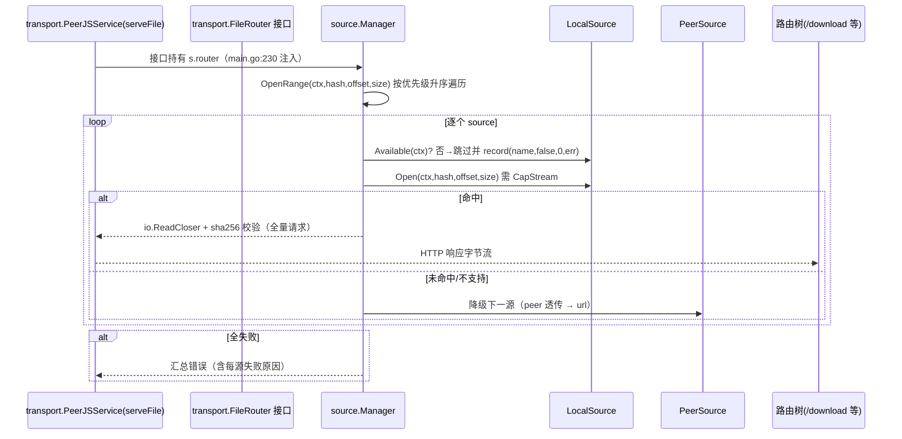

# 连接 05：router ↔ source（来源管理注入与端点）

- **涉及模块**：`../modules/04-router.md` 与 `../modules/07-source.md`
- **代码位置**：A 侧 `back/internal/router/source_routes.go`、`back/internal/router/router.go`；B 侧 `back/internal/source/manager.go`、`back/internal/source/source.go`；装配点 `back/cmd/server/main.go:217-232`
- **方向**：双向——A→B 是**包级注入 + HTTP 端点调用**（管理面）；B→A 的运行时数据面经 `transport.FileRouter` 接口**反向**回到 router 注册的路由树（transport 依赖 source 实现的接口，不反向 import source 包）

## 1. 连接方式

**通道类型：进程内函数调用**（无独立网络通道）。三层接线：

1. **装配注入**（`back/cmd/server/main.go:217-232`，在 `SetupRouter` **之前**）：
   - `mgr := source.New()`
   - `mgr.Register(source.NewLocalSource(storageDir, peerjsSvc.FileIndex()))`
   - `mgr.Register(source.NewPeerSource(peerjsSvc))`
   - `if cfg.URLSourceTemplate != "" { mgr.Register(source.NewURLSource(cfg.URLSourceTemplate, nil)) }`
   - `router.SetSourceManager(mgr)` → 写入 router 包级变量（`back/internal/router/source_routes.go:16-22`）
   - `peerjsSvc.SetFileRouter(mgr)` → transport 侧接口装配（`back/internal/transport/peerjs_service.go:535-537`）
2. **控制面注入**（`back/internal/router/router.go`，在 `SetupRouter` **之内**，故晚于 1）：
   - `BTControl`：`router.go:153` `sourceManager.SetBTControl(source.NewBTControl(btClient))`
   - `IPFSControl`：`router.go:192` `sourceManager.SetIPFSControl(source.NewIPFSControl(ipfsProv, cfg.StorageDir))`
   - `registerSourceRoutes(r, authRequired)`：`router.go:418`
3. **管理端点**（`back/internal/router/source_routes.go`，`sourceManager == nil` 时整段跳过，`:25-28`）：

| 端点 | 鉴权 | 目标方法 |
|------|------|----------|
| `GET /sources` | **无** | `Manager.Snapshot()` → `{sources:[{name,type,priority,capabilities,stream,available,stats}]}`（`:29-31`） |
| `POST /sources/:name/priority` | **无** | `Manager.SetPriority(name, body.priority)`，未知源→404（`:32-45`） |
| `POST /sources/local/add` | `authRequired` | `LocalControl.AddLocalFile(path)` → 201 `{hash,size,filename,path}`（`:50-79`） |
| `POST /sources/local/write` | `authRequired`（multipart `file`） | `LocalControl.WriteFile(header.Filename, file)` → 201（`:80-108`） |
| `POST /sources/bt/torrent`、`/bt/magnet`、`GET /bt/downloads`、`GET /bt/download/:infohash`、`POST /bt/download/:infohash/pause|resume`、`DELETE /bt/download/:infohash` | `authRequired` | `Manager.GetBTControl()`（`:111-212`） |
| `POST /sources/ipfs/pin/:cid`、`DELETE /sources/ipfs/pin/:cid`、`GET /sources/ipfs/pins`、`GET /sources/ipfs/gateways` | `authRequired` | `Manager.GetIPFSControl()`（`:214-264`） |

**协议帧/参数格式**：JSON body + multipart 表单；无自有二进制帧。`Manager` 内部数据结构（`back/internal/source/manager.go:28-39`）：`mu sync.RWMutex` + `sources []Source`（**按优先级升序，变更时 `sortLocked` 重排**，`:131-136`）+ `stats map[string]*Stats` + 按实例持有的 `btControl/ipfsControl`（历史背景见 `:33-36` 注释——此前误用包级全局 var 导致多实例共享）。

**鉴权方式**：读端点与优先级调整**不带鉴权**（直接挂在 `r` 根路径），仅"写内容"与"控制 BT/IPFS"的端点挂 `authRequired`。

**何时建立/由谁建立**：main 在启动期建立一次（先 source.Manager 并 Register，再注入 router 与 transport，最后 `SetupRouter`）；无惰性初始化、无显式关闭析构（`Manager` 不持有常驻 goroutine，健康检查是每次路由时的软状态调用 `s.Available(ctx)`）。

## 2. 时序

### 2.1 启动装配时序（顺序敏感）

```
main.go
  ├─ storage.NewFileIndex() → AddReadRoot(storageDir)         # peerjsSvc.FileIndex() 的数据来源
  ├─ transport.NewPeerJSService → peerjsSvc                   # 此时 s.router 仍为 nil
  ├─ NodeDirectory / NodeShare 装配（SetShareProvider 等）
  │
  ├─ mgr := source.New()                                        # 217
  │   ├─ Register(NewLocalSource(storageDir, peerjsSvc.FileIndex()))   # 218  → CapFile+CapStream
  │   ├─ Register(NewPeerSource(peerjsSvc))                       # 221  → peer 透传
  │   └─ if cfg.URLSourceTemplate != "" Register(NewURLSource(tmpl,nil))  # 225（模板空则不注册）
  ├─ router.SetSourceManager(mgr)                               # 228  → source_routes 可见
  ├─ peerjsSvc.SetFileRouter(mgr)                               # 230  → 数据面反向可用
  │
  └─ router.SetupRouter(cfg)                                     # 420
      ├─ controller.InitBTController(btSvc)                     # 146
      ├─ sourceManager.SetBTControl(NewBTControl(btClient))     # 153（晚于 SetSourceManager）
      ├─ sourceManager.SetIPFSControl(NewIPFSControl(...))      # 192
      └─ registerSourceRoutes(r, authRequired)                  # 418（sourceManager==nil → return）
```

关键点：`SetBTControl/SetIPFSControl` 在 `SetupRouter` **内部**才注入，`SetSourceManager` 在**外部**。因此 `registerSourceRoutes`（`:418`）必然跑在两个控制面注入之后，`GetBTControl()/GetIPFSControl()` 在端点首呼时即可用；若 BT 被禁用（`BTDHTEnabled=false`）则该控制面保持 nil，BT 端点返回 501。

### 2.2 数据面反向路由时序（B→A→B）



要点（`back/internal/source/manager.go:9-14`、`:145-160`、`:289-309`）：

- `Available()==false` 的 source 直接跳过（**软健康检查**，非熔断）；
- 按**优先级升序**尝试，`local` 命中即返回（内容寻址本地权威），未命中降级 `peer → url`（默认注册顺序即 main.go:218/221/225）；
- `OpenRange` 只走 `CapStream`；`OpenAny` 允许降级到 `CapFile` 整体拉取（大文件必须走 CapStream，全量 buffer 有 OOM 风险——`back/internal/source/source.go:9-15`）；
- 每次尝试 `record(name, ok, n, err)` 更新 `Stats`（`LastAt/Success/Bytes/Fail/LastErr`），全失败返回**含每源失败原因**的汇总错误。

## 3. 情况处理

| 异常/边界场景 | 行为与依据 | 说明 |
|--------------|-----------|------|
| **超时** | source 端点无显式超时控制，`authRequired` 亦不注入 timeout；超时依赖上游 `gin` 与 `ctx` | 读端点 `Snapshot()` 会遍历各源调 `Available(context.Background())`（`:271-287`）——**该遍历不受请求 ctx 约束**，可能因某源健康检查阻塞而拖慢 |
| **断连/重连** | 不适用（进程内函数调用，无连接对象） | `PeerSource.Available()` 反映 peer 在线状态，离线时路由自动跳过该源 |
| **重复/并发** | `Register` 重名拒绝返回 `source %q already registered`（`:47-59`）；全部读写在 `mu` 保护下，`Get/SetPriority/GetBTControl` 读锁、`Register/Unregister/SetBTControl` 写锁（`:77-129`） | 控制面按实例持有而非包级全局（`:33-36` 历史注释），多 Manager 互不干扰 |
| **数据缺失或校验失败** | 全量请求（`offset==0 && size<0`）的实现**必须做 sha256 校验**（`source.go:60-62`）；`Manager` 全失败时返回汇总错误而非首个错误 | `Available()` 语义：local=目录可读，peer=有在线连接，url=最近成功/可 ping（`source.go:55-57`） |
| **鉴权失败** | 控制面端点经 `authRequired` 拦截 → 401；但 `GET /sources` 与 `POST /sources/:name/priority` **不带鉴权**（`:29-45`） | 未授权者可读源快照与改优先级——**建议按敏感面收敛鉴权**（代码未做防护） |
| **半开状态** | `sourceManager == nil` → `registerSourceRoutes` 整段 `return`，端点全不注册（`:25-28`） | `SetupRouter` 在装配**之前**被调用会导致所有 `/sources/*` 路由 404；`URLSourceTemplate` 为空则 url 源不存在，`SetPriority("url", n)` 返回 404 `source "url" not registered`（`:117-129`） |
| **进程重启** | **不持久化**：`Manager` 的 `sources` 列表、优先级运行时调整（`SetPriority`）、`Stats` 统计、`BTControl/IPFSControl` 注入全部随进程丢失 | 重启后优先级回到 `NewLocalSource/NewPeerSource/NewURLSource` 构造时的默认值；`GET /sources` 统计从零开始 |

## 4. 相关文档

- [04-router.md](../modules/04-router.md) —— router 装配、中间件链、admin verb 转发
- [07-source.md](../modules/07-source.md) —— Source 接口、四类实现、Manager 路由算法
- [02-router-controller.md](02-router-controller.md) —— HTTP 分发与 `authRequired` 语义
- [11-transport-storage.md](11-transport-storage.md) —— `PeerSource` 经 `FileIndex` 落盘与流式读
- [06-service-transport.md](06-service-transport.md) —— `transport.FileRouter` 接口解耦的由来（避免 import 环，装配在 cmd/server/main）