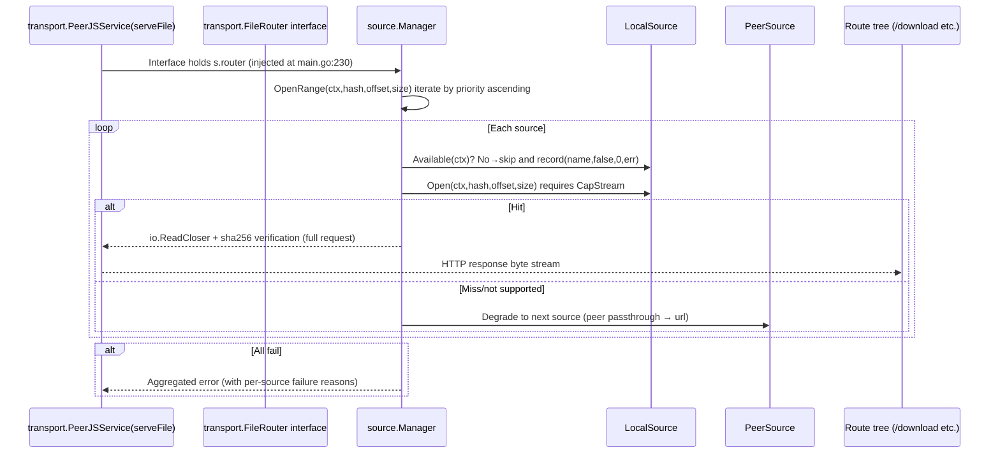

# Connection 05: router ↔ source (source management injection and endpoints)

- **Modules involved**: `../modules/04-router.md` and `../modules/07-source.md`
- **Code locations**: A side `back/internal/router/source_routes.go`, `back/internal/router/router.go`; B side `back/internal/source/manager.go`, `back/internal/source/source.go`; assembly point `back/cmd/server/main.go:217-232`
- **Direction**: bidirectional — A→B is **package-level injection + HTTP endpoint calls** (management plane); B→A runtime data plane goes through `transport.FileRouter` interface **backwards** into router's registered route tree (transport depends on the interface implemented by source, doesn't import source package in reverse)

## 1. Connection Method

**Channel type: in-process function call** (no independent network channel). Three-layer wiring:

1. **Assembly injection** (`back/cmd/server/main.go:217-232`, before `SetupRouter`):
   - `mgr := source.New()`
   - `mgr.Register(source.NewLocalSource(storageDir, peerjsSvc.FileIndex()))`
   - `mgr.Register(source.NewPeerSource(peerjsSvc))`
   - `if cfg.URLSourceTemplate != "" { mgr.Register(source.NewURLSource(cfg.URLSourceTemplate, nil)) }`
   - `router.SetSourceManager(mgr)` → writes to router package-level variable (`back/internal/router/source_routes.go:16-22`)
   - `peerjsSvc.SetFileRouter(mgr)` → transport side interface assembly (`back/internal/transport/peerjs_service.go:535-537`)
2. **Control plane injection** (`back/internal/router/router.go`, inside `SetupRouter`, hence later than 1):
   - `BTControl`: `router.go:153` `sourceManager.SetBTControl(source.NewBTControl(btClient))`
   - `IPFSControl`: `router.go:192` `sourceManager.SetIPFSControl(source.NewIPFSControl(ipfsProv, cfg.StorageDir))`
   - `registerSourceRoutes(r, authRequired)`: `router.go:418`
3. **Management endpoints** (`back/internal/router/source_routes.go`, entire block skipped when `sourceManager == nil`, `:25-28`):

| Endpoint | Auth | Target method |
|------|------|----------|
| `GET /sources` | **None** | `Manager.Snapshot()` → `{sources:[{name,type,priority,capabilities,stream,available,stats}]}` (`:29-31`) |
| `POST /sources/:name/priority` | **None** | `Manager.SetPriority(name, body.priority)`, unknown source→404 (`:32-45`) |
| `POST /sources/local/add` | `authRequired` | `LocalControl.AddLocalFile(path)` → 201 `{hash,size,filename,path}` (`:50-79`) |
| `POST /sources/local/write` | `authRequired` (multipart `file`) | `LocalControl.WriteFile(header.Filename, file)` → 201 (`:80-108`) |
| `POST /sources/bt/torrent`, `/bt/magnet`, `GET /bt/downloads`, `GET /bt/download/:infohash`, `POST /bt/download/:infohash/pause|resume`, `DELETE /bt/download/:infohash` | `authRequired` | `Manager.GetBTControl()` (`:111-212`) |
| `POST /sources/ipfs/pin/:cid`, `DELETE /sources/ipfs/pin/:cid`, `GET /sources/ipfs/pins`, `GET /sources/ipfs/gateways` | `authRequired` | `Manager.GetIPFSControl()` (`:214-264`) |

**Protocol frames/parameter format**: JSON body + multipart form; no proprietary binary frames. `Manager` internal data structure (`back/internal/source/manager.go:28-39`): `mu sync.RWMutex` + `sources []Source` (**sorted by priority ascending, `sortLocked` re-sorts on change**, `:131-136`) + `stats map[string]*Stats` + per-instance `btControl/ipfsControl` (historical background in `:33-36` comment — previously misused package-level global var causing multi-instance sharing).

**Authentication method**: Read endpoints and priority adjustment **have no auth** (mounted directly on `r` root path); only "write content" and "control BT/IPFS" endpoints have `authRequired`.

**When established/who establishes**: main establishes once during startup (first source.Manager and Register, then inject into router and transport, finally `SetupRouter`); no lazy initialization, no explicit close/destruction (`Manager` doesn't hold resident goroutines; health checks are soft state calls `s.Available(ctx)` on each route).

## 2. Timing

### 2.1 Startup Assembly Timing (order-sensitive)

```
main.go
  ├─ storage.NewFileIndex() → AddReadRoot(storageDir)         # data source for peerjsSvc.FileIndex()
  ├─ transport.NewPeerJSService → peerjsSvc                   # s.router is still nil at this point
  ├─ NodeDirectory / NodeShare assembly (SetShareProvider etc.)
  │
  ├─ mgr := source.New()                                        # 217
  │   ├─ Register(NewLocalSource(storageDir, peerjsSvc.FileIndex()))   # 218  → CapFile+CapStream
  │   ├─ Register(NewPeerSource(peerjsSvc))                       # 221  → peer passthrough
  │   └─ if cfg.URLSourceTemplate != "" Register(NewURLSource(tmpl,nil))  # 225 (not registered if template empty)
  ├─ router.SetSourceManager(mgr)                               # 228  → source_routes visible
  ├─ peerjsSvc.SetFileRouter(mgr)                               # 230  → data plane reverse available
  │
  └─ router.SetupRouter(cfg)                                     # 420
      ├─ controller.InitBTController(btSvc)                     # 146
      ├─ sourceManager.SetBTControl(NewBTControl(btClient))     # 153 (later than SetSourceManager)
      ├─ sourceManager.SetIPFSControl(NewIPFSControl(...))      # 192
      └─ registerSourceRoutes(r, authRequired)                  # 418 (sourceManager==nil → return)
```

Key point: `SetBTControl/SetIPFSControl` are injected inside `SetupRouter`, `SetSourceManager` is outside. Therefore `registerSourceRoutes` (`:418`) necessarily runs after the two control plane injections; `GetBTControl()/GetIPFSControl()` are available at endpoint first call; if BT is disabled (`BTDHTEnabled=false`), that control plane remains nil, and BT endpoints return 501.

### 2.2 Data Plane Reverse Routing Timing (B→A→B)



Key points (`back/internal/source/manager.go:9-14`, `:145-160`, `:289-309`):

- Source with `Available()==false` is directly skipped (**soft health check**, not circuit breaker);
- Try in **priority ascending order**, `local` hit returns immediately (content-addressed local authoritative), miss degrades `peer → url` (default registration order is main.go:218/221/225);
- `OpenRange` only uses `CapStream`; `OpenAny` allows degradation to `CapFile` for full pull (large files must use CapStream, full buffer has OOM risk — `back/internal/source/source.go:9-15`);
- Each attempt calls `record(name, ok, n, err)` to update `Stats` (`LastAt/Success/Bytes/Fail/LastErr`); all fail returns aggregated error **with per-source failure reasons**.

## 3. Case Handling

| Exception/Edge Case | Behavior & Rationale | Description |
|--------------|-----------|------|
| **Timeout** | Source endpoints have no explicit timeout control; `authRequired` also doesn't inject timeout; timeout relies on upstream `gin` and `ctx` | Read endpoint `Snapshot()` iterates all sources calling `Available(context.Background())` (`:271-287`) — **this iteration is not constrained by request ctx**, may be slowed down if a source health check blocks |
| **Disconnect/Reconnect** | Not applicable (in-process function call, no connection object) | `PeerSource.Available()` reflects peer online status; automatically skipped when offline |
| **Duplicate/Concurrent** | `Register` rejects duplicate names returning `source %q already registered` (`:47-59`); all read/write under `mu` protection, `Get/SetPriority/GetBTControl` read lock, `Register/Unregister/SetBTControl` write lock (`:77-129`) | Control plane held per instance rather than package-level global (`:33-36` historical comment); multiple Managers don't interfere |
| **Data missing or validation failure** | Full requests (`offset==0 && size<0`) **must do sha256 verification** (`source.go:60-62`); `Manager` all fail returns aggregated error rather than first error | `Available()` semantics: local=directory readable, peer=has online connection, url=recently successful/pingable (`source.go:55-57`) |
| **Auth failure** | Control plane endpoints intercepted by `authRequired` → 401; but `GET /sources` and `POST /sources/:name/priority` **have no auth** (`:29-45`) | Unauthorized users can read source snapshots and change priorities — **recommend tightening auth as sensitive surface** (code doesn't implement protection) |
| **Half-open state** | `sourceManager == nil` → `registerSourceRoutes` entire block `return`, no endpoints registered (`:25-28`) | `SetupRouter` called **before** assembly would cause all `/sources/*` routes to 404; empty `URLSourceTemplate` means url source doesn't exist, `SetPriority("url", n)` returns 404 `source "url" not registered` (`:117-129`) |
| **Process restart** | **Not persisted**: `Manager`'s `sources` list, priority runtime adjustments (`SetPriority`), `Stats` statistics, `BTControl/IPFSControl` injection all lost with process | After restart, priorities return to defaults from `NewLocalSource/NewPeerSource/NewURLSource` construction; `GET /sources` statistics start from zero |

## 4. Related Documents

- [04-router.md](../modules/04-router.md) —— router assembly, middleware chain, admin verb forwarding
- [07-source.md](../modules/07-source.md) —— Source interface, four implementations, Manager routing algorithm
- [02-router-controller.md](02-router-controller.md) —— HTTP dispatch and `authRequired` semantics
- [11-transport-storage.md](11-transport-storage.md) —— `PeerSource` disk write via `FileIndex` and streaming read
- [06-service-transport.md](06-service-transport.md) —— Origin of `transport.FileRouter` interface decoupling (avoiding import cycles, assembly in cmd/server/main)
