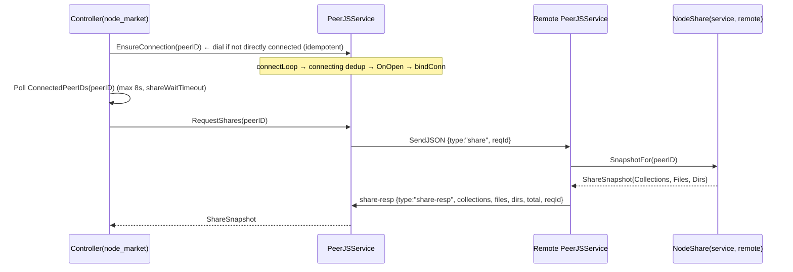
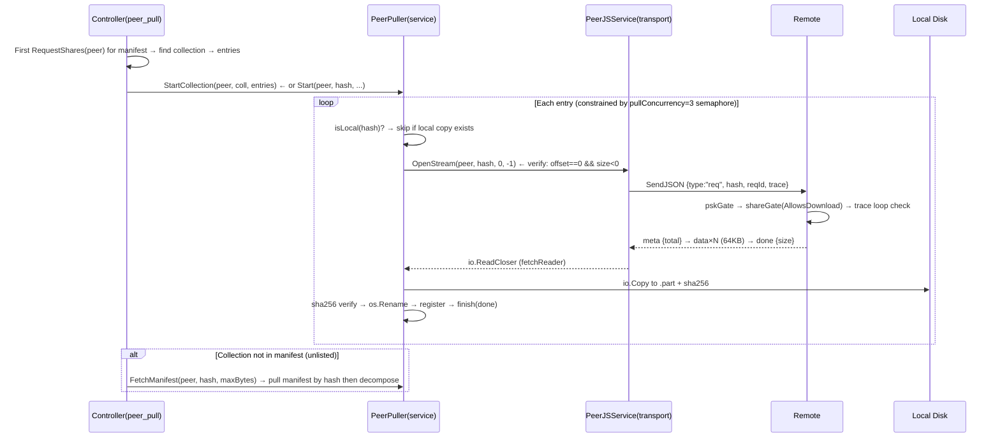
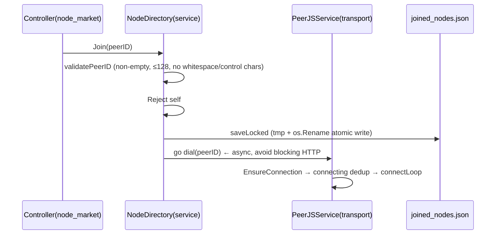
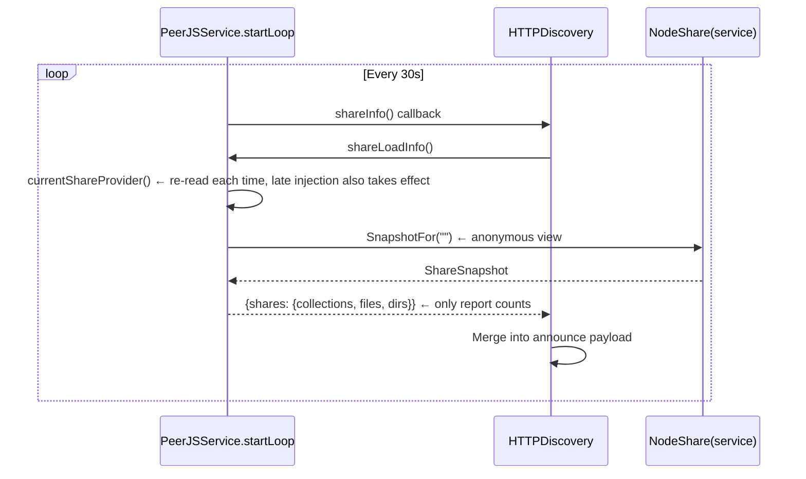
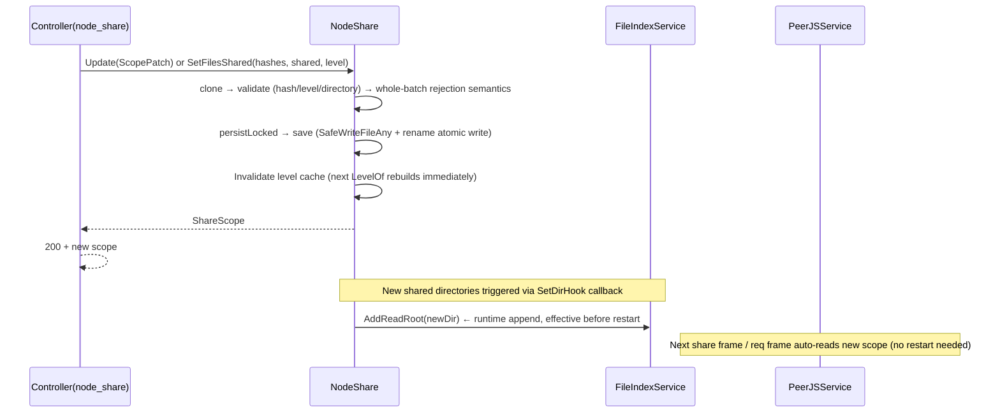

# Connection 06: service ↔ transport

- **Modules involved**: `service` (`NodeShare` / `NodeDirectory` / `PeerPuller`) ↔ `transport` (`PeerJSService` / `FileIndexService` / `HTTPDiscovery`)
- **Code locations**: `back/internal/service/` (`nodeshare.go` / `node_directory.go` / `peerpull.go`) ↔ `back/internal/transport/` (`share.go` / `outbound.go` / `inbound.go` / `file_index.go` / `psk.go` / `pull.go` / `conn.go`); assembly concentrated in `back/internal/serverapp/app.go:94-182`
- **Direction**: bidirectional — service consumes transport's transfer capabilities (pull files, send share frames); transport calls back to service through injected callbacks (answer share frames, gate req frames, provide announce summaries, register readable roots)

## 1. Connection Method

The two layers are **dependency-injection coupling between two modules in the same process**, with no shared database, no RPC, only three interfaces + six callbacks "welded" together in `main.go`. Assembly order: `transport.NewPeerJSService` → `peerjsSvc.Start()` → `SetShareProvider` / `SetShareGate` / `SetShareSummary` → `SetSource(peerjsSvc)` / `SetFileAccess` / `SetFileRouter` (`back/internal/serverapp/app.go:94-182`).

### 1.1 Control Plane / Data Plane Division

- **Control plane (service-driven, via HTTP REST + DataChannel metadata verbs)**: shared scope CRUD (`/peerjs/share*` → `NodeShare`), node market (`/peerjs/nodes*` → `NodeDirectory`), pull tasks (`/p2p/pull*` → `PeerPuller`). Control plane verbs on DataChannel are `share`/`share-resp`, `sync`/`sync-resp`, `list`/`info`/`create`/`delete` (one-shot JSON responses, with 15s timeout on `requestVerb`, `back/internal/transport/outbound.go:29`).
- **Data plane (transport-driven)**: actual byte streams only flow within transport — `req` → `meta` → `data×N` → `done`/`err` (`bindConn` message pump in `back/internal/transport/conn.go:177-183` dispatches by verb+reqId). Service-layer `PeerPuller` only gets an `io.ReadCloser` to `io.Copy` to `.part` then rename.
- **The boundary between the two planes is a single function**: `PullSource.OpenStream(peerID, hash, offset, size) (io.ReadCloser, error)` (`back/internal/service/peerpull.go:88-90`). Service defines the interface, transport implements it; the reader service receives is already streaming with integrity verification (see §2.3).

### 1.2 Assembly Order and "Late Injection"

`main.go`'s assembly order deliberately puts `Start()` before `SetXxx` (`back/internal/serverapp/app.go:110` before `back/internal/serverapp/app.go:156`):

```
L97   peerjsSvc = NewPeerJSService(cfg, storageDir)
L105  peerjsSvc.FileIndex().AddReadRoot(storageDir)          // add readable roots outside write boundary
L106-107  loop AddReadRoot(cfg.ShareDirs...)
L110  peerjsSvc.Start()                                      // signaling connects, starts announcing; shareProvider is still nil at this point
L120-125  nodeDir assembly: SetSelfID / SetConnected / SetDial; peerjsSvc.SetExtraPeers(nodeDir.JoinedPeerIDs)
L134-158  share assembly: SetDirHook / SetAnonAccess / SetFileLister / SetFileInfoReader
          → SetShareProvider(share.SnapshotFor) → SetShareGate(share)
L159  nodeDir.SetShareSummary(share.Summary)                 // announce summary data source
L167-175  puller assembly: SetSource(peerjsSvc) → SetFileAccess(isLocal, register)
L233  peerjsSvc.SetFileRouter(mgr)                           // local→peer→URL template routing
```

Why Start can be before injection: `shareProvider`/`shareGate` are protected by `shareMu` (`back/internal/transport/share.go:71-82`) for read/write; `shareLoadInfo()` re-reads on each callback (`back/internal/transport/share.go:136-149`), so late injection takes effect on the next announce heartbeat — this is the key design of "assembly order sensitive but late injection still safe" (`back/internal/transport/peerjs_service.go:266-267` comment: unconditionally register `shareLoadInfo`, re-read provider).

### 1.3 Six Injection Points

| # | Direction | Injection point | Actual argument | Location |
|---|---|---|---|---|
| 1 | service → transport | `PeerJSService.SetShareProvider(func(peerID) ShareSnapshot)` | `NodeShare.SnapshotFor` | `back/internal/serverapp/app.go:156` |
| 2 | service → transport | `PeerJSService.SetShareGate(ShareGate)` | `NodeShare` (implements `AllowsDownload`) | `back/internal/serverapp/app.go:158` |
| 3 | service → transport | `NodeDirectory.SetShareSummary(func() NodeShares)` | `NodeShare.Summary` | `back/internal/serverapp/app.go:159` |
| 4 | service → transport | `PeerJSService.SetExtraPeers(func() []string)` | `NodeDirectory.JoinedPeerIDs` | `back/internal/serverapp/app.go:124` |
| 5 | service → transport | `FileIndexService.AddReadRoot(dir)` | Triggered by `NodeShare.SetDirHook` callback (runtime new shared directories) | `back/internal/serverapp/app.go:138-142` |
| 6 | transport → service | `PeerPuller.SetSource(PullSource)` + `SetFileAccess(isLocal, register)` | `PeerJSService.OpenStream` + `FileIndexService.Info`/`Create` | `back/internal/serverapp/app.go:168-181` |

(Additionally, `NodeDirectory.SetSelfID` / `SetConnected` / `SetDial` three assemblies, which are "market state → transport layer" information synchronization, not cross-plane callbacks.)

### 1.4 The "Seam" Formed by Three Interfaces

- **`ShareProvider func(peerID string) ShareSnapshot`** (`back/internal/transport/share.go:68-75`): data source for share frames. The input parameter is the **requester node ID** — friends can see private entries (`NodeShare.SnapshotFor` uses it to filter `isFriend`, `back/internal/service/nodeshare.go:553-572`). `""` = anonymous view; `shareLoadInfo()` uses it for announce heartbeat summaries, avoiding "some querter happens to be a friend and private entry counts get reported" (`back/internal/transport/share.go:125-149`).
- **`ShareGate.AllowsDownload(peerID, hash, self) bool`** (`back/internal/transport/share.go:95-97`): gate for req frames. **Only private blocks** — public / unlisted / **undeclared** all pass through (`back/internal/service/nodeshare.go:594-610` comment: content-addressed retrieval is existing behavior, PSK is the real access gate; "must declare to fetch" would make even self-check "upload→fetch by hash to verify" fail). `self=true` = local channel (`IsLocal()`, `back/internal/transport/share.go:120-123`), always passes.
- **`PullSource.OpenStream(peerID, hash, offset, size) (io.ReadCloser, error)`** (`back/internal/service/peerpull.go:88-90`): the only data plane exit, implemented by `PeerJSService.OpenStream` (`back/internal/transport/outbound.go:120-122`).

### 1.5 Runtime Mutable State

- **`share_scope.json`** (`back/internal/service/nodeshare.go:69`): shared scope runtime state. Environment variables `PEERDRIVE_SHARE_*` are only **initial values for first startup** (`scopeFromConfig` seeding, `back/internal/service/nodeshare.go:251-270`); changing environment variables afterwards won't revert already-selected scopes. PUT `/peerjs/share` goes through `Update` (`back/internal/service/nodeshare.go:327-377`) for partial updates → `persistLocked` → `save` (`back/internal/service/nodeshare.go:522-541`, `SafeWriteFileAny` + `os.Rename` atomic write). **Every change immediately invalidates the level cache** (`levelCacheTTL=10s`, `back/internal/service/nodeshare.go:71-78`); only external new files wait for expiry — otherwise when sharing a directory first, then putting files in it, new files would be treated as "undeclared" (default downloadable) and silently leak private.
- **`joined_nodes.json`** (`back/internal/service/node_directory.go:37`): list of joined nodes. `Join` persists first then `go d.dial(peerID)` (`back/internal/service/node_directory.go:164-187`, async to avoid blocking HTTP); `Leave` only removes+persists, **does not actively disconnect** (in-progress transfers unaffected, `back/internal/service/node_directory.go:191-209`). After signaling reconnect, `startLoop` reads `extraPeers()` to auto-reconnect (`back/internal/transport/peerjs_service.go:234-243`).

### 1.6 Read/Write Boundaries of File Index

`FileIndexService` clearly separates "write boundary" and "read boundary" (`back/internal/transport/file_index.go:33-41`):

- **Write boundary** = only `rootDir` (`uploadDir`, H2 safety boundary) — peers using `create` can only register files here.
- **Read boundary** = `rootDir + readRoots` (`readRoots` appended via `AddReadRoot`) — `PEERDRIVE_SHARE_DIRS` and shared directories added by `NodeShare.SetDirHook` all go here.

Without `AddReadRoot`, you'd get "manifest lists them, peer pulls but read failed" — registration side allows it, read side judges it unauthorized (`back/internal/serverapp/app.go:99-104` comment). Reading uses `pathutil.SafeOpenAny` (`back/internal/transport/file_index.go:124-131`), delegating path resolution to the kernel to avoid TOCTOU window of "validate then open".

## 2. Timing

### 2.1 Assembly Timing (one-time at startup)

```mermaid
sequenceDiagram
    participant Main as main.go
    participant T as PeerJSService(transport)
    participant FI as FileIndexService
    participant ND as NodeDirectory(service)
    participant NS as NodeShare(service)
    participant PP as PeerPuller(service)
    participant SM as source.Manager

    Main->>T: NewPeerJSService(cfg, storageDir)
    Main->>FI: AddReadRoot(storageDir + ShareDirs...)
    Main->>T: Start()  ← signaling connects; shareProvider=nil at this point
    Main->>ND: NewNodeDirectory + SetSelfID/Connected/Dial
    Main->>T: SetExtraPeers(ND.JoinedPeerIDs)
    Main->>NS: NewNodeShare(cfg, storageDir)
    Main->>NS: SetDirHook / SetAnonAccess / SetFileLister / SetFileInfoReader
    Main->>T: SetShareProvider(NS.SnapshotFor)   ← shareMu allows late injection
    Main->>T: SetShareGate(NS)
    Main->>ND: SetShareSummary(NS.Summary)
    Main->>PP: NewPeerPuller(cfg.DownloadDir)
    Main->>PP: SetSource(T)                       ← transport satisfies PullSource
    Main->>PP: SetFileAccess(T.FileIndex().Info, T.FileIndex().Create)
    Main->>T: SetFileRouter(SM)
    Main->>T: next announce heartbeat → shareLoadInfo → SnapshotFor("")
```

### 2.2 Shared Manifest Query (service → transport → service loop)



Remote `serveShare` (`back/internal/transport/share.go:157-171`) forces nil slices to `[]` (frontend list rendering doesn't need null checks); `total` is computed by server and sent down. Empty snapshot is a **legitimate business state** (other side hasn't shared anything), not an error — frontend directly renders "this node has no shared content".

### 2.3 Cross-node Pull (service → transport data plane)



**Integrity verification only done on "full requests"**: `verify := offset == 0 && size < 0` (`back/internal/transport/outbound.go:127-245` `OpenStreamFrom` comment), because chunked requests can't do end-to-end verification. fetchReader checks `f.received != r.Size` on `done` frame to detect truncation (`back/internal/transport/outbound.go:461-475`); `maxPeerFetchSize = 8GB` (H6, `back/internal/transport/outbound.go:115`) prevents malicious peer declaring huge size causing OOM.

### 2.4 Join Node (service → transport dial)



`Leave` only deletes persistence, doesn't actively disconnect (`back/internal/service/node_directory.go:191-209`) — in-progress transfers must be preserved. `Market()` does **double fallback**: first pulls online list from discovery server, then supplements joined but offline nodes (`back/internal/service/node_directory.go:252-269`), otherwise users would think "my added nodes disappeared". Sorting: `Connected > Joined > Online > PeerID` (stable UI).

### 2.5 Announce Heartbeat (transport → service reverse)



`Summary()` (`back/internal/service/nodeshare.go:575-582`) is just a counting wrapper around `Snapshot()`; `NodeDirectory.Self()` also calls it to fill this node's "my shares" card (`back/internal/service/node_directory.go:305-312`) — **self doesn't go through discovery server**.

### 2.6 Shared Scope Runtime Change (HTTP PUT → state → cache → transport)



## 3. Case Handling

| Case | Trigger condition | Handling strategy | Code location |
|---|---|---|---|
| **Timeout** | Four types of timeout semantics coexist | `verbWaitTimeout=15s` (share/info etc. one-shot JSON); `fetchIdleTimeout=5min` is **chunk interval** not total duration (large files slowly streaming won't falsely report failure); `pullTimeout=5min` (URL-pull overall); `http.Server.ReadHeaderTimeout=15s` (Slowloris protection) | `back/internal/transport/outbound.go:29` / `outbound.go:250` / `back/internal/transport/pull.go:35` |
| **Disconnect/Reconnect** | Signaling WS drops, WebRTC disconnects, network jitter | `startLoop` 2s→60s exponential backoff reconnect; `connectLoop` uses `connecting` map for dedup (same peerID won't open two); `dedupConn` keeps one by connection UUID lexicographic order (bidirectional mutual dials won't miss connections, `fakeSession` exception); `onIncomingConnection` must wait for OnOpen before `bindConn` (early registration would give FetchFromPeer an unready connection) | `back/internal/transport/peerjs_service.go:184-311` / `conn.go:213-226` / `peerjs_service.go:471-481` |
| **Duplicate/Concurrent** | Same hash pulled multiple times, multi-source concurrent, same peer dual connections | `pullConcurrency=3` semaphore + `pullMaxJobs=200` proactive cleanup of finished old tasks; `PeerPuller.isLocal` hit skips directly (no duplicate pull of existing local copies); `StartCollection` per-entry isolation (single failure doesn't affect others); `connectLoop`'s `connecting` map dedup; `fetchState.done` uses `select default` to guarantee close idempotency | `back/internal/service/peerpull.go:57-61` / `peerpull.go:297-401` / `back/internal/transport/outbound.go:461-475` |
| **Data missing or validation failure** | Remote does done early (truncation), hash mismatch, exceeds `maxPeerFetchSize`, target path unauthorized | fetchReader checks `f.received != r.Size` on `done` frame; `hashMatchesSHA256` fallback (full requests only); `targetPath` uses `Join+sanitize+abs+prefix check` double insurance against path traversal; `sanitizeRelPath` strips empty segments/`.`/`..`/abs prefix/Windows control chars | `back/internal/transport/outbound.go:461-475` / `back/internal/service/peerpull.go:441-463` / `peerpull.go:531-560` |
| **Auth failure** | PSK not passed, private accessed by non-friend, unauthorized non-local request | `pskGate` runs **before** inbound verb dispatch (only blocks `servedVerbs` set: req/create/upload/list/share/info/delete/sync/pull/fwd-*); local sessions exempt; `shareGate` at `serveFile` step 2 (after hash validation, before trace loop detection); PSK protects "nodes that set it" from inbound access, is **symmetric** (my PSK doesn't block my outbound requests to public nodes) | `back/internal/transport/psk.go:94-113` / `back/internal/transport/inbound.go:73-77` |
| **Half-open state** | Client cancels, connection disconnects, `.part` written halfway | `PeerPuller.Cancel` **simultaneously** `cancel()` and `closer.Close()` (comment: cancel alone isn't enough — Read might be waiting for next chunk); `fetchReader.Close` → `finish(ErrClosedPipe)`; disk write goes `.part` → `os.Rename` atomic replacement (crash doesn't leave half-finished product); `persistLocked` / `saveLocked` both use tmp + `os.Rename` (no half-truncated JSON on power loss) | `back/internal/service/peerpull.go:273-294` / `back/internal/transport/outbound.go:382-419` / `back/internal/service/nodeshare.go:522-541` |
| **Process restart** | Process killed, power loss, deployment upgrade | `share_scope.json` + `joined_nodes.json` both atomic write; `NewNodeShare` first `load()` persisted scope, otherwise `scopeFromConfig` seeds (**file is authoritative**, env vars are just initial values); `startLoop` auto-reconnects signaling; `JoinedPeerIDs` makes "joined" nodes auto-redial after reconnect (equal status with static `PEERDRIVE_PEERJS_PEERS`); `FileIndexService.reapUploads` 5min tick cleans 10min idle chunked upload sessions (prevent disk exhaustion) | `back/internal/service/nodeshare.go:224-245` / `back/internal/service/node_directory.go:108-161` / `back/internal/transport/peerjs_service.go:234-243` / `back/internal/transport/file_index.go:139-172` |

**Additional notes** (outside table, to avoid cramming too much in tables):

- **Trace loop prevention**: `dcReq.Trace []string` (`back/internal/transport/conn.go:55`); `serveFile` appends `s.ID()` to `fwdTrace` (`inbound.go:78-86`); outbound `PeerSource` reads `TraceKey` from ctx and appends to `dcReq.Trace`. Any trace containing self → `"loop detected"`. This is the key to discovering A↔B mutual forwarding.
- **Level cache semantics**: `levelMapLocked` merges Files (hash direct record) → Dirs (path prefix inheritance) → Collections (hash inheritance); restricted collections (visibility not public) automatically downgraded to private (`back/internal/service/nodeshare.go:636-645`). Multiple sources hitting same hash take the **most permissive** (`model.LoosestLevel`) — this is the correct semantics of "I checked public but got directory-hit as private, result can still download".
- **`file_index` index limit exceeded**: `share.SetFileLister` limit 1000 (`back/internal/serverapp/app.go:148-150`); checked files rely on `SetFileInfoReader` hash-based fallback (`back/internal/serverapp/app.go:151-153`), otherwise "I checked but it didn't take effect".
- **`FileIndexService.Close` must be called by tests** (`back/internal/transport/file_index.go:174-191`): unclosed handles on Windows would prevent `t.TempDir()` cleanup; same leak on Linux but invisible (only discovered on real Windows machine 2026-09-20).

## 4. Related Documents

- Same directory:
  - [05-router-source.md](05-router-source.md) —— How upstream source system includes `PeerJSService` in routing (dual of `SetFileRouter`)
  - [07-transport-peerjs.md](07-transport-peerjs.md) —— transport module connection with peerjs engine (this document covers both sides of the seam, 07 goes deep into transport internal frame protocol)
  - [09-controller-downloader.md](09-controller-downloader.md) —— controller-side download entry point
  - [10-controller-storage.md](10-controller-storage.md) —— controller-side file index endpoints
  - [11-transport-storage.md](11-transport-storage.md) —— transport connection with local storage
- Module documents:
  - [../modules/06-service.md](../modules/06-service.md) —— service module overview
  - [../modules/09-transport.md](../modules/09-transport.md) —— transport module overview
  - [../modules/10-peerjs.md](../modules/10-peerjs.md) —— peerjs protocol engine (transport internal implementation)

## 5. Delivery Notes

- **File path**: `doc/design/connections/06-service-transport.md`
- **One-liner**: service layer (`NodeShare` / `NodeDirectory` / `PeerPuller`) and transport layer (`PeerJSService` / `FileIndexService`) are connected via three interfaces (`ShareProvider` / `ShareGate` / `PullSource.OpenStream`) + six `SetXxx` callbacks in `main.go` assembly; the division is **control plane in service, data plane in transport**, runtime mutable state (`share_scope.json` / `joined_nodes.json`) persists with atomic write and immediately invalidates cache, no restart needed.
- **Key code references**:
  - `back/internal/transport/share.go:68-104` —— `SetShareProvider` / `ShareGate` interface definitions and `shareMu` protection
  - `back/internal/service/nodeshare.go:553-610` —— `SnapshotFor(peerID)` friend filtering, `AllowsDownload` private gate
  - `back/internal/service/peerpull.go:88-90` + `back/internal/transport/outbound.go:120-122` —— `PullSource.OpenStream` interface and transport implementation (only data plane exit)
  - `back/internal/serverapp/app.go:110-182` —— assembly order: Start() before all Set injections, `shareLoadInfo` re-reads provider each time ensuring late injection takes effect
- **Unverified items**:
  - `NodeShare.persistLocked` (`nodeshare.go:435`) whether it explicitly clears `s.levels` / `s.levelsAt` not directly read; this document infers "change immediately invalidates" from `save` comments and `Update` comments.
  - `back/internal/transport/conn.go:250-477` (message pump, `cleanupConn`, `OnClose` cleanup path) not read; disconnect/half-open state cleanup details based on `peerjs_service.go` and `outbound.go` comments.
  - `back/internal/transport/inbound.go:181-442` (`serve*` other verbs, `uploadWorker`) not read; PSK gate order and `serveFile` 6-step flow reconstructed from file header comments + summary information.
  - `back/internal/controller/peer_pull.go:161-180` (Cancel endpoint) not read; Cancel's **service-layer behavior** (cancel+close double insurance) comes from `peerpull.go:273-294`.
