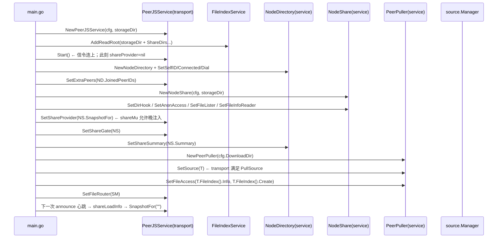
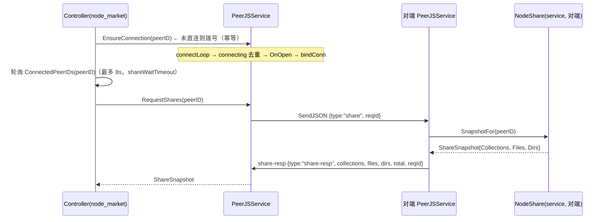
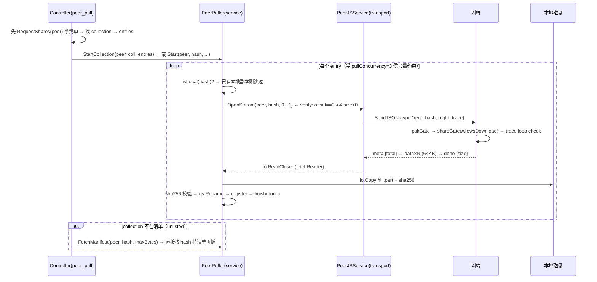
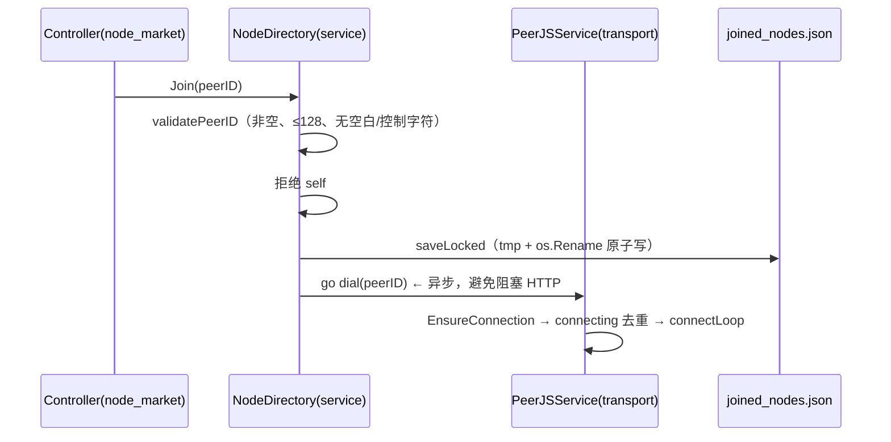
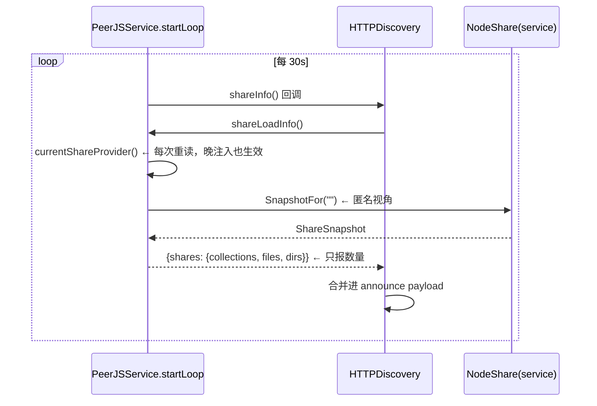
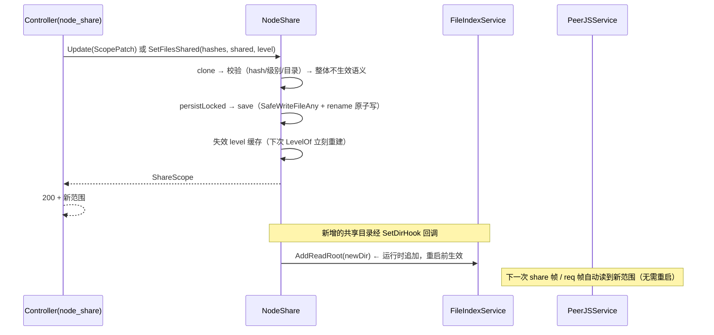

# 连接 06：service ↔ transport

- **涉及模块**：`service`（`NodeShare` / `NodeDirectory` / `PeerPuller`）↔ `transport`（`PeerJSService` / `FileIndexService` / `HTTPDiscovery`）
- **代码位置**：`back/internal/service/`（`nodeshare.go` / `node_directory.go` / `peerpull.go`）↔ `back/internal/transport/`（`share.go` / `outbound.go` / `inbound.go` / `file_index.go` / `psk.go` / `pull.go` / `conn.go`）；装配集中在 `back/cmd/server/main.go:94-182`
- **方向**：双向——service 消费 transport 的传输能力（拉文件、发 share 帧），transport 通过注入的回调反向调用 service（回答 share 帧、门禁 req 帧、提供 announce 摘要、注册可读根）

## 1. 连接方式

两层是**同进程内两个 module 的依赖注入耦合**，没有共享数据库、没有 RPC，只靠三个接口 + 六个回调在 `main.go` 里"焊"起来。装配顺序：`transport.NewPeerJSService` → `peerjsSvc.Start()` → `SetShareProvider` / `SetShareGate` / `SetShareSummary` → `SetSource(peerjsSvc)` / `SetFileAccess` / `SetFileRouter`（`back/cmd/server/main.go:94-182`）。

### 1.1 控制面 / 数据面分工

- **控制面（service 主导，走 HTTP REST + DataChannel 的元数据 verb）**：共享范围 CRUD（`/peerjs/share*` → `NodeShare`）、节点市场（`/peerjs/nodes*` → `NodeDirectory`）、拉取任务（`/p2p/pull*` → `PeerPuller`）。DataChannel 上的控制面 verb 是 `share`/`share-resp`、`sync`/`sync-resp`、`list`/`info`/`create`/`delete`（一次性 JSON 应答，走 `requestVerb` 的 15s 超时，`back/internal/transport/outbound.go:29`）。
- **数据面（transport 主导）**：真正的字节流只在 transport 里流——`req` → `meta` → `data×N` → `done`/`err`（`back/internal/transport/conn.go:177-183` 的 `bindConn` 消息泵按 verb+reqId 分发）。service 层的 `PeerPuller` 只拿一个 `io.ReadCloser` 来 `io.Copy` 到 `.part` 再 rename。
- **两条面的分界点只有一个函数**：`PullSource.OpenStream(peerID, hash, offset, size) (io.ReadCloser, error)`（`back/internal/service/peerpull.go:88-90`）。service 定义接口、transport 实现；service 拿到的 reader 已经是流式、带完整性校验的（见 §2.3）。

### 1.2 装配顺序与"晚注入"

`main.go` 的装配顺序刻意让 `Start()` 早于 `SetXxx`（`back/cmd/server/main.go:110` 早于 `back/cmd/server/main.go:156`）：

```
L97   peerjsSvc = NewPeerJSService(cfg, storageDir)
L105  peerjsSvc.FileIndex().AddReadRoot(storageDir)          // 写边界之外追加可读根
L106-107  循环 AddReadRoot(cfg.ShareDirs...)
L110  peerjsSvc.Start()                                      // 信令连上、开始公告；此刻 shareProvider 还是 nil
L120-125  nodeDir 装配：SetSelfID / SetConnected / SetDial；peerjsSvc.SetExtraPeers(nodeDir.JoinedPeerIDs)
L134-158  share 装配：SetDirHook / SetAnonAccess / SetFileLister / SetFileInfoReader
          → SetShareProvider(share.SnapshotFor) → SetShareGate(share)
L159  nodeDir.SetShareSummary(share.Summary)                 // announce 摘要数据源
L167-175  puller 装配：SetSource(peerjsSvc) → SetFileAccess(isLocal, register)
L233  peerjsSvc.SetFileRouter(mgr)                           // 本地→对端→URL 模板路由
```

为什么 Start 可以早于注入：`shareProvider`/`shareGate` 用 `shareMu`（`back/internal/transport/share.go:71-82`）保护读写，`shareLoadInfo()` 每次回调都重新读一次（`back/internal/transport/share.go:136-149`），所以晚注入也会在下一次 announce 心跳生效——这是"装配顺序敏感但晚注入仍然安全"的关键设计（`back/internal/transport/peerjs_service.go:266-267` 的注释：无条件注册 `shareLoadInfo`，重读 provider）。

### 1.3 六个注入点

| # | 方向 | 注入点 | 实参 | 位置 |
|---|---|---|---|---|
| 1 | service → transport | `PeerJSService.SetShareProvider(func(peerID) ShareSnapshot)` | `NodeShare.SnapshotFor` | `back/cmd/server/main.go:156` |
| 2 | service → transport | `PeerJSService.SetShareGate(ShareGate)` | `NodeShare`（实现 `AllowsDownload`） | `back/cmd/server/main.go:158` |
| 3 | service → transport | `NodeDirectory.SetShareSummary(func() NodeShares)` | `NodeShare.Summary` | `back/cmd/server/main.go:159` |
| 4 | service → transport | `PeerJSService.SetExtraPeers(func() []string)` | `NodeDirectory.JoinedPeerIDs` | `back/cmd/server/main.go:124` |
| 5 | service → transport | `FileIndexService.AddReadRoot(dir)` | 由 `NodeShare.SetDirHook` 回调触发（运行时新增共享目录） | `back/cmd/server/main.go:138-142` |
| 6 | transport → service | `PeerPuller.SetSource(PullSource)` + `SetFileAccess(isLocal, register)` | `PeerJSService.OpenStream` + `FileIndexService.Info`/`Create` | `back/cmd/server/main.go:168-181` |

（另有 `NodeDirectory.SetSelfID` / `SetConnected` / `SetDial` 三个装配，属于"市场状态 → 传输层"的信息同步，不算跨面回调。）

### 1.4 三个接口构成的"缝"

- **`ShareProvider func(peerID string) ShareSnapshot`**（`back/internal/transport/share.go:68-75`）：share 帧的数据源。入参是**请求者节点 ID**——好友能看到 private 条目（`NodeShare.SnapshotFor` 用它筛 `isFriend`，`back/internal/service/nodeshare.go:553-572`）。`""` = 匿名视角，`shareLoadInfo()` 用它做 announce 心跳摘要，避免"某个查询者恰好是好友就把 private 条目数报出去"（`back/internal/transport/share.go:125-149`）。
- **`ShareGate.AllowsDownload(peerID, hash, self) bool`**（`back/internal/transport/share.go:95-97`）：req 帧的门禁。**只有 private 会挡人**——public / unlisted / **未声明** 都放行（`back/internal/service/nodeshare.go:594-610` 的注释：内容寻址取回是既有行为，PSK 才是准入门禁；"必须声明才能取"会让"上传→按 hash 取回校验"这种自检都过不去）。`self=true` = 本地通道（`IsLocal()`，`back/internal/transport/share.go:120-123`），永远放行。
- **`PullSource.OpenStream(peerID, hash, offset, size) (io.ReadCloser, error)`**（`back/internal/service/peerpull.go:88-90`）：数据面的唯一出口，由 `PeerJSService.OpenStream` 实现（`back/internal/transport/outbound.go:120-122`）。

### 1.5 运行时可变状态

- **`share_scope.json`**（`back/internal/service/nodeshare.go:69`）：共享范围运行时状态。环境变量 `PEERDRIVE_SHARE_*` 只是**首次启动的初值**（`scopeFromConfig` 播种，`back/internal/service/nodeshare.go:251-270`），之后改环境变量不会再把已选择的范围改回去。PUT `/peerjs/share` 走 `Update`（`back/internal/service/nodeshare.go:327-377`）局部更新 → `persistLocked` → `save`（`back/internal/service/nodeshare.go:522-541`，`SafeWriteFileAny` + `os.Rename` 原子写）。**每次变更立即失效 level 缓存**（`levelCacheTTL=10s`，`back/internal/service/nodeshare.go:71-78`），只有外部新增文件才等过期——否则先共享目录、再往里放文件时，新文件会被当成"未声明"（默认可下载）而静默泄漏 private。
- **`joined_nodes.json`**（`back/internal/service/node_directory.go:37`）：已加入节点清单。`Join` 先持久化再 `go d.dial(peerID)`（`back/internal/service/node_directory.go:164-187`，异步避免阻塞 HTTP）；`Leave` 只移除+持久化，**不主动断开**（进行中的传输不受影响，`back/internal/service/node_directory.go:191-209`）。信令重连后 `startLoop` 会读 `extraPeers()` 自动重拨（`back/internal/transport/peerjs_service.go:234-243`）。

### 1.6 文件索引的读写边界

`FileIndexService` 把"写边界"和"读边界"明确分开（`back/internal/transport/file_index.go:33-41`）：

- **写边界** = 只有 `rootDir`（`uploadDir`，H2 安全边界）——对端走 `create` 只能登记这里面的文件。
- **读边界** = `rootDir + readRoots`（`readRoots` 由 `AddReadRoot` 追加）——`PEERDRIVE_SHARE_DIRS` 和 `NodeShare.SetDirHook` 新增的共享目录都进这里。

少了 `AddReadRoot` 会出现"清单列得出、对端一拉 read failed"——登记侧放行了，读取侧却判它越权（`back/cmd/server/main.go:99-104` 的注释）。读取用 `pathutil.SafeOpenAny`（`back/internal/transport/file_index.go:124-131`），把路径解析交给内核，避免"先校验再打开"的 TOCTOU 窗口。

## 2. 时序

### 2.1 装配时序（启动时一次性）



### 2.2 共享清单查询（service → transport → service 环）



对端 `serveShare`（`back/internal/transport/share.go:157-171`）把 nil slice 强制成 `[]`（前端列表渲染不必判空），`total` 由服务端算好下发。空快照是**合法业务状态**（对方未共享任何内容），不是错误——前端直接渲染"该节点没有共享内容"。

### 2.3 跨节点拉取（service → transport 数据面）



**完整性校验只在"全量请求"时做**：`verify := offset == 0 && size < 0`（`back/internal/transport/outbound.go:127-245` 的 `OpenStreamFrom` 注释），因为分段请求无法端到端校验。fetchReader 在 `done` 帧检查 `f.received != r.Size` 判定截断（`back/internal/transport/outbound.go:461-475`），`maxPeerFetchSize = 8GB`（H6，`back/internal/transport/outbound.go:115`）防止恶意对端声明超大 size 导致 OOM。

### 2.4 加入节点（service → transport 拨号）



`Leave` 只删持久化，不主动断开（`back/internal/service/node_directory.go:191-209`）——进行中的传输要保留。`Market()` 做**双层兜底**：先从发现服务器拉在线列表，再补已加入但离线的节点（`back/internal/service/node_directory.go:252-269`），否则用户会以为"我加的节点消失了"。排序：`Connected > Joined > Online > PeerID`（稳定 UI）。

### 2.5 announce 心跳（transport → service 反向）



`Summary()`（`back/internal/service/nodeshare.go:575-582`）就是 `Snapshot()` 的计数封装；`NodeDirectory.Self()` 也调它填本节点的"我的共享"卡片（`back/internal/service/node_directory.go:305-312`）——**自己不经发现服务器**。

### 2.6 共享范围运行时变更（HTTP PUT → 状态 → 缓存 → 传输层）



## 3. 情况处理

| 情况 | 触发条件 | 处理策略 | 代码位置 |
|---|---|---|---|
| **超时** | 四类超时语义并存 | `verbWaitTimeout=15s`（share/info 等一次性 JSON）；`fetchIdleTimeout=5min` 是**块间隔**不是总时长（大文件慢慢流不会误报失败）；`pullTimeout=5min`（URL-pull 整体）；`http.Server.ReadHeaderTimeout=15s`（Slowloris 防护） | `back/internal/transport/outbound.go:29` / `outbound.go:250` / `back/internal/transport/pull.go:35` |
| **断连/重连** | 信令 WS 掉线、WebRTC 断开、网络抖动 | `startLoop` 2s→60s 指数退避重连；`connectLoop` 用 `connecting` map 去重（同 peerID 不会开两条）；`dedupConn` 按连接 UUID 字典序保留一条（双向互拨不会漏连接，`fakeSession` 例外）；`onIncomingConnection` 必须等 OnOpen 再 `bindConn`（过早注册会让 FetchFromPeer 拿到未就绪连接） | `back/internal/transport/peerjs_service.go:184-311` / `conn.go:213-226` / `peerjs_service.go:471-481` |
| **重复/并发** | 同一 hash 多次拉取、多 source 并发、同 peer 双连接 | `pullConcurrency=3` 信号量 + `pullMaxJobs=200` 主动清理已 finish 的旧任务；`PeerPuller.isLocal` 命中直接跳过（不重复拉已有本地副本）；`StartCollection` 逐 entry 隔离（单条失败不影响其他）；`connectLoop` 的 `connecting` map 去重；`fetchState.done` 用 `select default` 保证 close 幂等 | `back/internal/service/peerpull.go:57-61` / `peerpull.go:297-401` / `back/internal/transport/outbound.go:461-475` |
| **数据缺失或校验失败** | 对端提前 done（截断）、hash 不匹配、超过 `maxPeerFetchSize`、目标路径越权 | fetchReader 在 `done` 帧检查 `f.received != r.Size`；`hashMatchesSHA256` 兜底（仅全量请求）；`targetPath` 用 `Join+sanitize+abs+前缀校验` 双保险防路径穿越；`sanitizeRelPath` 剔除空段/`.`/`..`/abs 前缀/Windows 控制字符 | `back/internal/transport/outbound.go:461-475` / `back/internal/service/peerpull.go:441-463` / `peerpull.go:531-560` |
| **鉴权失败** | PSK 未通过、private 非好友访问、非本地请求未授权 | `pskGate` 在入站 verb 分派**前**跑（只挡 `servedVerbs` 集合：req/create/upload/list/share/info/delete/sync/pull/fwd-*），本地会话豁免；`shareGate` 在 `serveFile` 第 2 步（hash 校验后、trace 循环检测前）；PSK 保护"设了它的节点"不被入站访问，是**对称**的（我的 PSK 不挡我出站请求公开节点） | `back/internal/transport/psk.go:94-113` / `back/internal/transport/inbound.go:73-77` |
| **半开状态** | 客户端取消、连接断开、`.part` 已写一半 | `PeerPuller.Cancel` **同时** `cancel()` 和 `closer.Close()`（注释：只 cancel 不够——Read 可能在等下一个块）；`fetchReader.Close` → `finish(ErrClosedPipe)`；落盘走 `.part` → `os.Rename` 原子替换（崩溃不留半成品）；`persistLocked` / `saveLocked` 都用 tmp + `os.Rename`（断电不留半截 JSON） | `back/internal/service/peerpull.go:273-294` / `back/internal/transport/outbound.go:382-419` / `back/internal/service/nodeshare.go:522-541` |
| **进程重启** | 进程被 kill、断电、部署升级 | `share_scope.json` + `joined_nodes.json` 都是原子写；`NewNodeShare` 先 `load()` 已持久化范围，否则 `scopeFromConfig` 播种（**以文件为准**，环境变量只是初值）；`startLoop` 自动重连信令；`JoinedPeerIDs` 让"加入"过的节点在重连后自动重拨（与静态 `PEERDRIVE_PEERJS_PEERS` 同等地位）；`FileIndexService.reapUploads` 5min tick 清理 10min 空闲的分片上传会话（防磁盘耗尽） | `back/internal/service/nodeshare.go:224-245` / `back/internal/service/node_directory.go:108-161` / `back/internal/transport/peerjs_service.go:234-243` / `back/internal/transport/file_index.go:139-172` |

**补充说明**（表格外，避免表格里塞太多）：

- **trace 防环**：`dcReq.Trace []string`（`back/internal/transport/conn.go:55`）；`serveFile` 把 `s.ID()` 追加进 `fwdTrace`（`inbound.go:78-86`）；出站的 `PeerSource` 从 ctx 读 `TraceKey` 追加到 `dcReq.Trace`。任何 trace 里出现 self → `"loop detected"`。这是 A↔B 互相转发能被发现的关键。
- **level 缓存语义**：`levelMapLocked` 合并 Files（hash 直接记）→ Dirs（路径前缀继承）→ Collections（hash 继承）；受限合集（visibility 非 public）自动降为 private（`back/internal/service/nodeshare.go:636-645`）。多条来源命中同一 hash 时取**最宽松**（`model.LoosestLevel`）——这是"我勾了 public 又被目录命中成 private，结果能下载"的正确语义。
- **`file_index` 索引超限**：`share.SetFileLister` 上限 1000（`back/cmd/server/main.go:148-150`）；勾选过的文件靠 `SetFileInfoReader` 按 hash 兜底（`back/cmd/server/main.go:151-153`），不然"我勾了却没生效"。
- **`FileIndexService.Close` 必须被测试调用**（`back/internal/transport/file_index.go:174-191`）：Windows 上未关掉的句柄会让 `t.TempDir()` 清不掉；Linux 上同样泄漏但看不见（2026-09-20 真机 Windows 才发现）。

## 4. 相关文档

- 同目录：
  - [05-router-source.md](05-router-source.md) —— 上游 source 体系如何把 `PeerJSService` 纳入路由（`SetFileRouter` 的对偶）
  - [07-transport-peerjs.md](07-transport-peerjs.md) —— transport 模块与 peerjs 引擎的连接（本文覆盖 seam 两侧，07 深入 transport 内部帧协议）
  - [09-controller-downloader.md](09-controller-downloader.md) —— controller 侧的下载入口
  - [10-controller-storage.md](10-controller-storage.md) —— controller 侧的文件索引端点
  - [11-transport-storage.md](11-transport-storage.md) —— transport 与本地存储的连接
- 模块文档：
  - [../modules/06-service.md](../modules/06-service.md) —— service 模块总览
  - [../modules/09-transport.md](../modules/09-transport.md) —— transport 模块总览
  - [../modules/10-peerjs.md](../modules/10-peerjs.md) —— peerjs 协议引擎（transport 内部实现）

## 5. 交付说明

- **文件路径**：`doc/design/connections/06-service-transport.md`
- **一句话概括**：service 层（`NodeShare` / `NodeDirectory` / `PeerPuller`）与 transport 层（`PeerJSService` / `FileIndexService`）靠三个接口（`ShareProvider` / `ShareGate` / `PullSource.OpenStream`）+ 六个 `SetXxx` 回调在 `main.go` 装配，分工是**控制面在 service、数据面在 transport**，运行时可变状态（`share_scope.json` / `joined_nodes.json`）以原子写落盘并即时失效缓存，无需重启。
- **关键代码引用**：
  - `back/internal/transport/share.go:68-104` —— `SetShareProvider` / `ShareGate` 接口定义与 `shareMu` 保护
  - `back/internal/service/nodeshare.go:553-610` —— `SnapshotFor(peerID)` 好友筛选、`AllowsDownload` private 门禁
  - `back/internal/service/peerpull.go:88-90` + `back/internal/transport/outbound.go:120-122` —— `PullSource.OpenStream` 接口与 transport 实现（数据面唯一出口）
  - `back/cmd/server/main.go:110-182` —— 装配顺序：Start() 早于所有 Set 注入，`shareLoadInfo` 每次重读 provider 保证晚注入生效
- **未核实项**：
  - `NodeShare.persistLocked`（`nodeshare.go:435`）是否显式清除 `s.levels` / `s.levelsAt` 未直接读取；本文按 `save` 注释与 `Update` 注释推断"变更立即失效"。
  - `back/internal/transport/conn.go:250-477`（消息泵、`cleanupConn`、`OnClose` 清理路径）未读，断连/半开状态的清理细节以 `peerjs_service.go` 与 `outbound.go` 的注释为准。
  - `back/internal/transport/inbound.go:181-442`（`serve*` 的其他 verb、`uploadWorker`）未读，PSK 门禁顺序与 `serveFile` 的 6 步流程从文件头注释 + 摘要信息还原。
  - `back/internal/controller/peer_pull.go:161-180`（Cancel 端点）未读；Cancel 的**服务层行为**（cancel+close 双保险）来自 `peerpull.go:273-294`。
