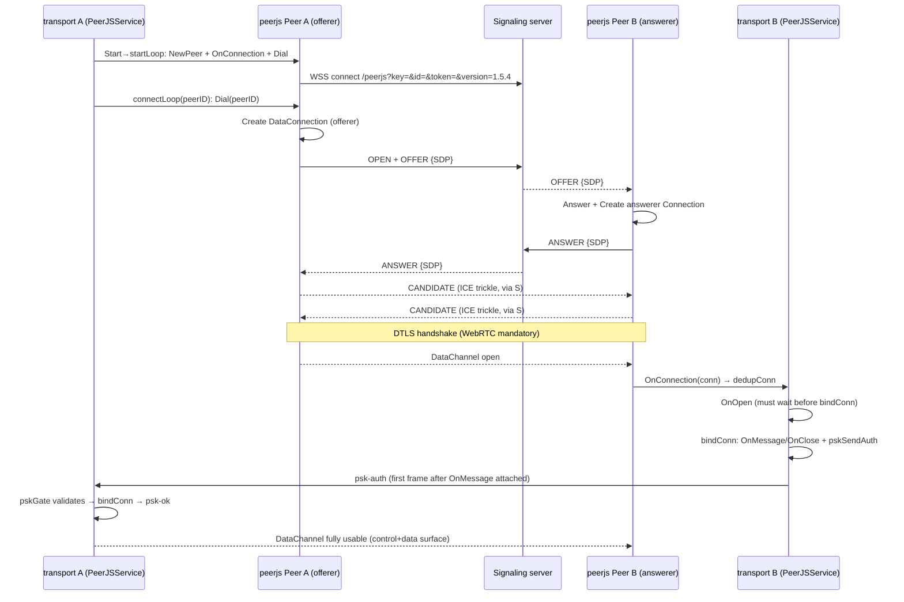
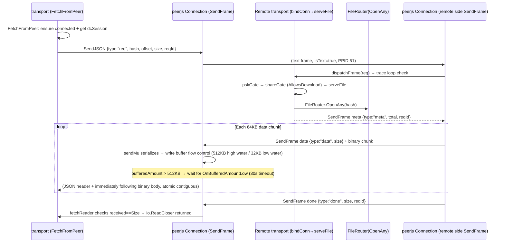
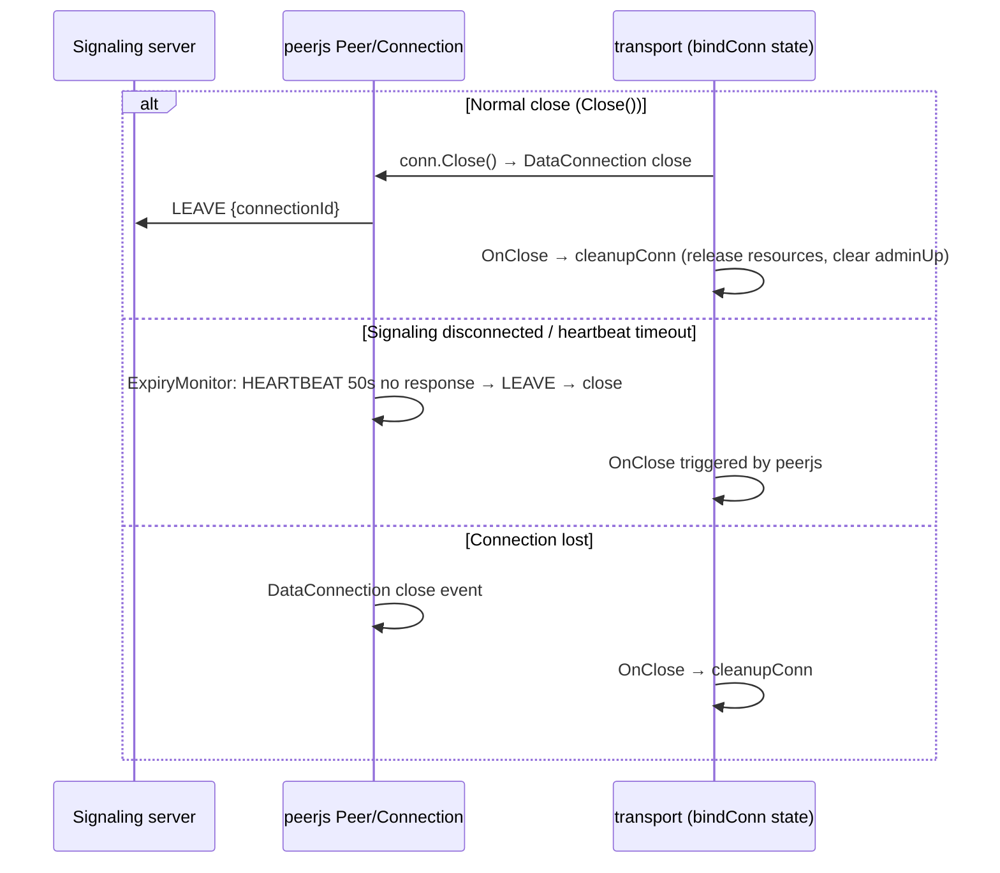

# Connection 07: transport ↔ peerjs (protocol engine)

- **Modules involved**: `../modules/09-transport.md` and `../modules/10-peerjs.md`
- **Code locations**: A side `back/internal/transport/` (`peerjs_service.go` assembly layer + `conn.go` frame protocol/dispatch + `rtc_session.go` adapter + `ws_session.go`'s `Session` interface); B side `back/peerjs/` (`peer.go` signaling client / `connection.go` DataConnection / `message.go` messages and payloads / `signaller.go` abstraction / `transport.go` Frame and DataChannel abstraction); library assembly point `back/go.mod:7,160` (`require github.com/Hana-ame/go-peerjs v0.0.0` + `replace ... => ./peerjs`); service assembly point `back/internal/serverapp/app.go` (`peerjsSvc.Start()/Close()`, see `../modules/09-transport.md` §1 and `how-to-connect.md` startup timing)
- **Direction**: bidirectional (in-process calls + DataChannel full duplex; offerer/answerer have no direction distinction, the same Session carries both inbound and outbound roles, `peerjs_service.go:13-14`)

## 1. Connection Method

**Channel type: in-process object graph calls (two layers)**. transport and peerjs compile into the same binary (`back/go.mod:7,160` replace local directory); PeerJSService directly holds `*peerjs.Peer` (`peerjs_service.go:38-41,26`). Only two network surfaces externally, both established by peerjs engine, consumed by transport:

- **Signal surface (control, WSS)**: `peerjs.Peer` connects via `peerJSSignaller` to `wss://host:port/peerjs?key=&id=&token=&version=1.5.4` (`back/peerjs/peer.go:396-443`, URL assembly 410-427; version constant `peer.go:22`), sends/receives OFFER/ANSWER/CANDIDATE/LEAVE/EXPIRE/HEARTBEAT (`message.go:18-28`). Details of this surface with the signaling server are in [08-transport-signalserver.md](08-transport-signalserver.md); this connection only describes how transport drives it.
- **Data surface (DataChannel)**: `peerjs.Connection` wraps a WebRTC DataConnection (`connection.go:19-57`); after SDP/ICE exchanged via signal surface, data flows over pion DataChannel; `Connection` only depends on `DataChannel` interface (`transport.go:15-26`), not bound to pion's concrete types.

**Data surface bridge (A side adapter)**: `rtcSession` (`rtc_session.go:11-39`) adapts `*peerjs.Connection` to transport's `Session` interface (`ws_session.go:22-29`: `ID()/SendJSON/SendFrame/OnMessage/OnClose/Close`). Adaptation rationale (`rtc_session.go:7-10`): `Connection.ID` is the signaling routing key (connectionId), semantically different from session identifier (remote peer id) and field names conflict; adapter consolidates the difference at service layer. Key mappings: `ID()` = `c.PeerID` (remote id, `rtc_session.go:20`); `ConnID()` = `c.ID` (connection-level UUID, **both ends see the same value**, `rtc_session.go:24`, dedup key for same peer, see `conn.go:196-226`); `SendJSON/SendFrame` pass through `Connection` (26-28); `OnMessage` passes `peerjs.Frame` (30); `DataChannel()` exposes underlying for serveFile write buffer flow control (38-39, WSSession doesn't have this capability).

**Protocol frame format** (data surface, library defines transport primitives, business frames defined by transport):

- `Frame{IsText, Data}` (`transport.go:5-10`): `IsText=true` is text frame (JSON control header, SCTP PPID 51), `false` is binary frame (data chunk, PPID 53) — `Connection.Send` sends binary, `SendText` sends text (`connection.go:91-113`); sending in reverse causes the other end to swallow the control header as a data chunk.
- `SendFrame` atomically sends "JSON header + immediately following binary body" (`connection.go:125-166`): `sendMu` serializes to prevent header/body interleaving under concurrency; built-in write buffer flow control (wait for low water mark broadcast when `bufferedAmount > 512KB`, slow consumer 30s timeout, connection close exits immediately). Flow control callback registered once at `attach` (`connection.go:12-17,297-304`) — pion's `OnBufferedAmountLow` is a replacement-style callback; concurrent registration overwrites each other causing deadlock.
- Business frame protocol (req/meta/data/done/err + create/upload/list/info/delete/sync + admin/fwd-*/psk-*) defined by transport in `conn.go:13-26` header comment; library doesn't manage semantics (`back/peerjs/README.md:126-136`).

**Authentication method**: signal side relies on URL query `key` + `id` + `token` (`peer.go:410-427`; token randomly generated when not specified, `peer.go:345-347`); `ID-TAKEN`/`ERROR` only logged (`peer.go:201-213`). Data surface admission handled by transport-layer PSK gate (`psk.go`) — `psk-auth` is the **first frame** sent by local end via this connection after establishment (`psk.go:57-71`, must attach OnMessage first then send, `conn.go:250-259`); library itself has no business authentication, data surface encryption guaranteed by WebRTC's mandatory DTLS (`psk.go:16-17`).

**When/who establishes**: process startup `main` calls `peerjsSvc.Start()` (`peerjs_service.go:147-149`) → goroutine `startLoop` (184-311) internally calls `peerjs.NewPeer(s.id, opts)` (205) + `p.OnConnection(s.onIncomingConnection)` (206) + `p.Dial(s.ctx)` (210); after signaling connects, dials each peer via `connectLoop` per config `PEERDRIVE_PEERJS_PEERS` and `extraPeers()` (225-243); discovery callback `onDiscoveredPeer` also triggers dialing (326-341, subject to MAX_PEERS budget, 345-363). Each remote connection established by `connectLoop` (active, offerer) or `onIncomingConnection` (passive, answerer); both paths only create one full-duplex Session and hang the same set of roles via `bindConn` (`peerjs_service.go:13-14`).

## 2. Timing

### 2.1 Connection Establishment Timing (A actively dials B, offerer/answerer negotiation)

Key code points: A offerer `startLoop:225-243` → `Dial` (`peer.go:183-184`); signal messages OFFER/ANSWER/CANDIDATE (`message.go:18-24`); B answerer `onIncomingConnection:471-481` → `dedupConn:213-226` (duplicate remote connections by UUID keep lexicographic order, `fakeSession` exception); **must wait for `OnOpen` before `bindConn`** (`onIncomingConnection:474-480` comment: early registration of `OnClose` would cause FetchFromPeer to get a connection not yet ready); PSK is first frame, **`pskSendAuth` before `pskOnAck` attach**, and `pskSendAuth` must be after `bindConn`'s OnMessage is attached (`conn.go:250-259` comment, otherwise ACK may arrive before handler attached and silently disappear); **admin verb only allows `c.ID()=="local"`** (`admin.go:136-140`), so WebRTC connections receiving admin frames immediately return err.

### 2.2 Data Transfer Timing (fetch: req → meta → data×N → done)

Step-by-step explanation:

1. **First frame type**: `req` must be a text frame (`IsText=true`), `Connection.SendText` (`connection.go:109-113`); `Connection.Send` sends binary (`:91-99`) — sending in reverse makes the other end treat control header as data chunk.
2. **Atomic sending**: `SendFrame` acquires `sendMu` before writing header then writing body (`connection.go:129-133`), ensuring concurrent send doesn't interleave header-body.
3. **Write buffer flow control**: `bufferedAmount > 512KB` high water blocks (`connection.go:140-142`), waits for `OnBufferedAmountLow` broadcast (32KB, `connection.go:297-304`); **must register callback only once** at `attach` (`connection.go:12-17,297-304` comment: pion's `OnBufferedAmountLow` is replacement-style, concurrent registration overwrites causing deadlock).
4. **Timeout semantics**: 30s is **chunk interval timeout** (slow consumer), not total duration; `fetchIdleTimeout=5min` is the timeout for not receiving next chunk on consumer side (`outbound.go:250`).
5. **Frame protocol three hard constraints** (documented in `back/internal/transport/conn.go:20-24` header comment and enforced by `back/internal/transport/test_integration_test.go:10-43`): ① headers are text frames, chunks are binary frames; ② header and chunk must be atomically contiguous (can't be interleaved with others); ③ `reqId` field names must align exactly, or request hangs until timeout (error: "no errors, just silent misalignment").

### 2.3 Disconnect and Cleanup Timing

- Heartbeat / expiry: the node side is just `heartbeatLoop` — a ticker at `opts.PingInterval` sending HEARTBEAT, exiting when the signaling drops (`back/peerjs/peer.go:483-500`). ⚠️ The old `heartbeats` map + `expiryGracePeriod=50s` + LEAVE-on-expiry described here before 2026-10-06 **no longer exists**; expiration is now the signaling server's job (`back/signalserver/signalserver.go:38-39` `heartbeatTTL` / `queueTTL`).
- `cleanupConn`: removes connection, deletes temp files, triggers close handlers, cleans up admin upload placeholders.
- `Close()`: `s.ctx` cancel → `startLoop` exits → close all connections (`peerjs_service.go:163-178`); peerjs side `Peer.Close` sends LEAVE (`peer.go:195-209`).
- `dedupConn`: same remote peer's bidirectional connections (A dials B, B also dials A) keep one by connection UUID lexicographic order, the other enters `fakes` marked (not real close, preserves signaling side state); `real` is non-fake first-registered connection (for fetching, `conn.go:196-226`).

### 2.4 Step-by-Step Explanation

1. **Startup**: `main` calls `peerjsSvc.Start()` (`peerjs_service.go:147-149`); `startLoop` in goroutine: signal connect (exponential backoff 2s→60s, `:195-198`) → `NewPeer` → register `OnConnection` → `Dial` → dial configured + discovered peers (respecting MAX_PEERS budget, `:345-363`).
2. **Offerer path**: `connectLoop` (`:225-243`) calls `Dial(peerID)` → peerjs creates DataConnection → sends OFFER → receives ANSWER → ICE trickling → DTLS → DataChannel open → `OnOpen` → `bindConn`.
3. **Answerer path**: `onIncomingConnection` (`:471-481`) → `dedupConn` → **wait for `OnOpen`** → `bindConn`. Waiting for OnOpen is mandatory: early registration of `OnClose` would cause `FetchFromPeer` to get a connection not yet ready (comments at `:474-480` record this historical issue).
4. **PSK bidirectional authentication**: local and remote both `bindConn` → first `pskSendAuth` → wait for `psk-ok`/`psk-err` (5s timeout, `psk.go:38-44`); only when `psk-authenticated` is set does inbound verb dispatch proceed (`inbound.go:73-77` `servedVerbs` gate).
5. **Inbound dispatch**: `dispatchFrame` (`conn.go:177-183`) parses JSON header → switch verb → `req` calls `serveFile`; **control verbs (share/info/sync/create/upload/list/delete/admin) synchronously process** (pump function must not block), only `req` asynchronously (`go`) to avoid blocking frame pump.
6. **Forwarding**: `fwd-stream` (`conn.go:20-22`) carries `fwdTrace`/`fwdFrom`; when trace contains self → `"loop detected"` (`inbound.go:78-86`). This is the key to detecting A↔B mutual forwarding.
7. **Teardown**: three triggers for `cleanupConn` — normal `Close()`, signaling expiry LEAVE, DataConnection close; all funnel to the same `OnClose` handler.

### 2.5 Frame Protocol Three Hard Constraints (documented in comments, enforced by tests)

Documented in `back/internal/transport/conn.go:20-24` header comment, enforced by `back/internal/transport/test_integration_test.go:10-43`:

1. Data headers are text frames, data chunks are binary frames — sending in reverse makes the other end treat control header as data chunk (silent misalignment).
2. Data headers and chunks must be atomically contiguous (`SendFrame`'s `sendMu` guarantees, `connection.go:129-133`); interleaved sending with other frames on the connection causes confusion in "latest data header" single-slot routing.
3. Field names must align exactly — `reqId` must be `reqId`, not `req_id`; if the other end can't parse, request hangs until timeout (`fetchIdleTimeout=5min`).

These three are "won't error if violated, just silently misalign"; this is the highest-cost part of this connection and has its own integration test guard.

## 3. Case Handling

| Scenario | Behavior and Rationale | Code Location |
|------|-----------|--------|
| **Timeout** | heartbeat every 5s (`opts.PingInterval`, `back/peerjs/peer.go:55`, `peer.go:483-500`); ⚠️ the old "30s±5s + 50s expiry LEAVE+close" no longer exists — expiry is the signaling server's (`back/signalserver/signalserver.go:38-39` `heartbeatTTL`); write buffer flow control 512KB high water block, low water broadcast wait 30s timeout (`connection.go:140-142`); PSK authentication 5s timeout (`psk.go:38-44`); req fetch: meta wait (bounded by verbWaitTimeout=15s) + data frame interval 5min (`outbound.go:250`) + total size cap 8GB (H6) | `back/peerjs/peer.go:55,483-500`, `connection.go:140-142`, `psk.go:38-44`, `outbound.go:250` |
| **Disconnect** | Three triggers funnel to same OnClose→cleanupConn: normal Close (Peer.Close sends LEAVE), expiry LEAVE, DataConnection close. cleanupConn releases temp files, admin upload placeholders, triggers close handler. startLoop reconnects signaling with 2s→60s exponential backoff, re-dials all peers. | `peerjs_service.go:163-178`, `peerjs_service.go:195-198`, `peer.go:195-209` |
| **Reconnect** | startLoop reconnects signaling with backoff (2s→60s, `:195-198`); after reconnect, redials configured peers + discovered peers (respecting MAX_PEERS budget, `:345-363`); dedupConn handles bidirectional mutual dials (A dials B, B dials A) by keeping one by connection UUID lexicographic order, the other marked as `fakeSession` (not real close, preserves signaling side state, `conn.go:196-226`). | `peerjs_service.go:184-311`, `conn.go:196-226` |
| **Duplicate** | DedupConn: same peer duplicate remote connections (UUID-based) keep one, the other marked fake (`conn.go:196-226`); `sending` map prevents duplicate dialing of same peer (`:30-31,228-248`); `fetchState.done` uses `select default` for close idempotency (`outbound.go:461-475`); `sendMu` serializes send to prevent header-body interleaving under concurrency (`connection.go:129-133`). | `conn.go:30-31,196-226,228-248`, `outbound.go:461-475`, `connection.go:129-133` |
| **Data missing/validation failure** | hash validation: 64-char hex (`inbound.go:61-63`); shareGate returns 403 when private not allowed (`inbound.go:73-77`); meta size > `maxPeerFetchSize`(8GB) returns 413 (H6, `outbound.go:115,196-201`); done received bytes mismatch returns err frame (truncation, `outbound.go:461-475`); SHA256 mismatch on full request deletes half-finished `.part` and returns Failed (`peerpull.go:371-376`); `ID-TAKEN`/`ERROR` only logged, not retried (`peer.go:201-213`). | `inbound.go:61-77`, `outbound.go:115,196-201,461-475`, `peerpull.go:371-376`, `peer.go:201-213` |
| **Auth failure** | PSK gate: inbound `servedVerbs`(req/create/upload/list/share/info/delete/sync/pull/fwd-*) first check `psk-authenticated`, unauthenticated returns 401 (`inbound.go:73-77`); PSK is symmetric, only protects "nodes that set it" (`psk.go:16-17`); local sessions exempt (local channel, `share.go:120-123`); admin verb only allows `c.ID()=="local"` (`admin.go:136-140`) — WebRTC connections receiving admin frames immediately return err (prevents permission surface exposure). | `inbound.go:73-77`, `psk.go:16-17`, `share.go:120-123`, `admin.go:136-140` |
| **Half-open state** | Flow control half-open: `bufferedAmount > 512KB` blocks, waits for `OnBufferedAmountLow` broadcast; 30s timeout returns error, doesn't keep waiting; connection close immediately exits wait (`connection.go:140-142`); **callback must be registered once at attach** (pion's `OnBufferedAmountLow` is replacement-style, concurrent registration overwrites each other causing deadlock, `connection.go:12-17,297-304`). PSK half-open: `psk-authenticated` not set but connection still alive, all `servedVerbs` return 401 (won't hang). Fetch half-open: `fetchState.done` closed immediately exits read loop, prevents reader blocking forever after disconnect (`outbound.go:461-475`). | `connection.go:140-142`, `connection.go:12-17,297-304`, `inbound.go:73-77`, `outbound.go:461-475` |
| **Process restart** | No persistent sessions: all WebRTC DataChannel connections lost on restart, Peer/Connection/connection map all cleared; peerjs library is a local Go module (`back/go.mod:160` replace), restart just re-executes `NewPeer`+`Dial`; signaling server side only has `ID-TAKEN` conflict (logs only, no retry, `peer.go:201-213`). Local state (connection map, fetches, adminUp temp files) all in memory, cleaned by cleanupConn on disconnect; no "resume after restart" semantics. | `peerjs_service.go:163-178,184-311`, `back/go.mod:7,160`, `peer.go:201-213` |

## 4. Related Documents

- Same directory:
  - [08-transport-signalserver.md](08-transport-signalserver.md): signal surface counterpart (details of OFFER/ANSWER/CANDIDATE/HEARTBEAT exchange with signaling server), this connection only describes how transport drives peerjs.
  - [06-service-transport.md](06-service-transport.md): upstream — control/data plane division (share frames in service, byte stream in transport), six injection points and `PullSource.OpenStream`.
  - [11-transport-storage.md](11-transport-storage.md): downstream — frame final destination (req → serveFile → FileRouter → local disk).
  - [01-frontend-backend.md](01-frontend-backend.md): WSSession and rtcSession implement the same `Session` interface, reuse the same frame protocol (`ws_session.go:22-29,31-34`); `BindLocal` and DataChannel connections share `bindConn` dispatch (`peerjs_service.go:313-319`).
  - [12-frontend-signalserver.md](12-frontend-signalserver.md): browser-side peerjs is the counterpart implementation for OFFER→ANSWER→CANDIDATE negotiation; this library needs to interoperate with its `serialization:"raw"` (`connection.go:339-346`).
  - [06-service-transport.md](06-service-transport.md): upstream — `EnsureConnection`/`extraPeers` (node market "join node") triggers this connection's `connectLoop` (`peerjs_service.go:512-529`).
  - [05-router-source.md](05-router-source.md): serveFile multi-source routing `FileRouter` returns data frames via `Session.SendFrame` (`inbound.go:46-51,93-104`).
  - [11-transport-storage.md](11-transport-storage.md): this connection's data surface frame final destination — pull/upload disk write and file_index registration.
  - [13-media-node-ech.md](13-media-node-ech.md): same `go-peerjs` library, independent frame family (url/keepalive), no data surface interaction.
- Module documents: `../modules/09-transport.md` (session state machine, frame protocol and 3 hard constraints, connection lifecycle, H5/H6/M5-M9 fixes, in-memory state listing), `../modules/10-peerjs.md` (three-layer structure Signaller/Peer/Connection, signaling protocol details, flow control and singleton low water mark, 13 boundaries and pitfalls).
