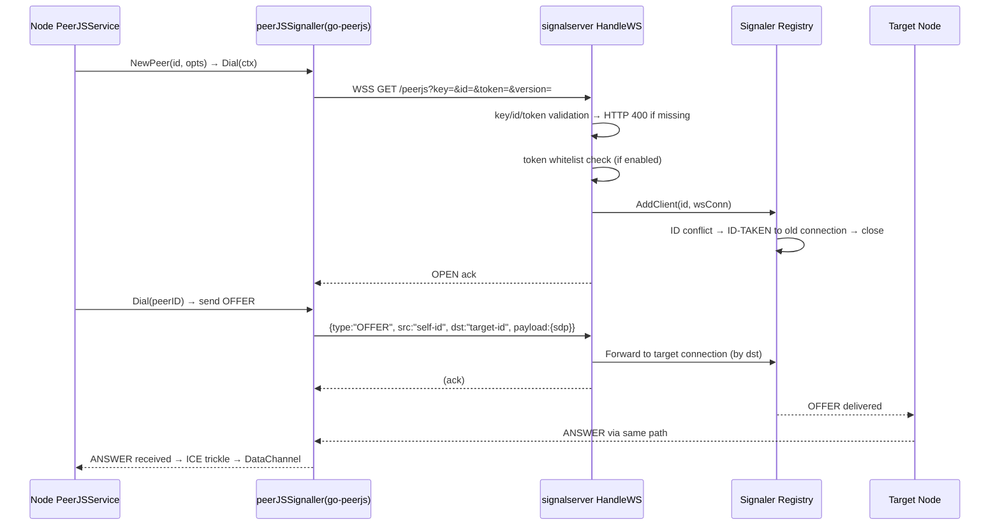
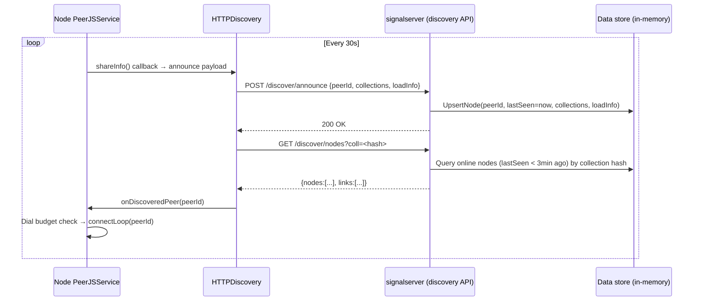

# Connection 08: transport ↔ signalserver (signaling discovery)

- **Modules involved**: `../modules/09-transport.md` and `../modules/11-signalserver.md`
- **Code locations**: A side `back/internal/transport/` (`peerjs_service.go` signaling lifecycle + discovery assembly; `http_discovery.go` / `mqtt_discovery.go` discovery clients) + `back/peerjs/` (go-peerjs signaling client library, module 10); B side `back/signalserver/signalserver.go` (+ assembly `back/signalserver/cmd/peersignal/main.go`)
- **Direction**: bidirectional. Two surfaces: **signaling surface** (A↔B: node registration WS, OFFER/ANSWER/CANDIDATE forwarded by dst, LEAVE, HEARTBEAT bidirectional flow, `signalserver.go:10-15`); **discovery surface** (mostly A→B HTTP queries: announce reporting + nodes polling, B returns online node list to trigger A's interconnection)

## 1. Connection Method

This connection is an overlay of "one signaling WS + one discovery HTTP", both actively established by A side (node side):

### 1.1 Signal Surface (Node Registration + Room Forwarding) — WebSocket, PeerJS Compatible Protocol

- **Channel**: A side connects via go-peerjs library's `peerJSSignaller` (implementation of `Signaller` interface in `back/peerjs/signaller.go:12-30`, `back/peerjs/peer.go:351-369`) to B side's `HandleWS` (`back/signalserver/signalserver.go:246-296`).
- **URL/Parameters**: `wss://{host}:{port}/{path}peerjs?key=&id=&token=&version=` (`back/peerjs/peer.go:410-427`; `path` defaults to `/`, `peer.go:336-338`). `key` comes from `PEERDRIVE_PEERJS_KEY` (default `pd-signal-b9447b406828e500`, `back/internal/config/config.go:20,212`); `id` comes from `PEERDRIVE_PEERJS_ID`, when not configured generates local random `peerdrive-<randHex8>` (32bit, `back/internal/transport/peerjs_service.go:113-117,548-552`); `token` randomly generated by client (`back/peerjs/peer.go:345-347,372-374`).
- **Protocol frames**: `{type, src, dst, payload}` text JSON, **server overwrites src** with connector's id (`back/signalserver/signalserver.go:12,309`); types `OPEN/LEAVE/OFFER/ANSWER/CANDIDATE/EXPIRE/HEARTBEAT/ID-TAKEN/ERROR` (`back/peerjs/message.go:18-28`). This connection only forwards SDP/ICE, **doesn't touch data surface** — after WebRTC DataChannel established, nodes connect directly, no longer via signaling (`back/internal/transport/peerjs_service.go:3-14` header comment; `back/peerjs/peer.go:27-29`).
- **Authentication**: Three locks checked sequentially at WS upgrade — ① `id/token/key` any missing → HTTP 400 (`signalserver.go:250-253`); ② `key != s.key` → 400 (`signalserver.go:254-257`); ③ token whitelist enabled (`cmd/peersignal/main.go:25,31-33`'s `-tokens` → `WithTokenWhitelist`, `signalserver.go:57-75`) and token not in list → 400 (`signalserver.go:258-263`). Empty whitelist = no restriction (default, compatible with public deployments, `signalserver.go:57-64`).
- **Establishment timing**: Initiated by A side's `PeerJSService.Start()` (`peerjs_service.go:147-149`) → `startLoop` internally calls `peerjs.NewPeer(s.id, opts)` + `p.Dial(s.ctx)` (`peerjs_service.go:205-210`); `opts` filled from config Host/Port/Secure/Key, empty values fall back to default signaling (`config.DefaultSignalHost/Port/Key`, `peerjs_service.go:190-204`). Signal disconnection handled by startLoop full-round reconnect (H7, see §3 disconnect/reconnect).

### 1.2 Discovery Surface (announce + discover/nodes) — HTTP REST, Public No Auth

- **Channel**: A side `HTTPDiscovery` (`back/internal/transport/http_discovery.go`) → B side discovery API (`signalserver.go:449-638`); created after signaling connection succeeds, persists across signaling reconnects without rebuilding (`peerjs_service.go:245-272` and header comment).
- **Interfaces**:
  - `POST {baseURL}/discover/announce`: body `{peerId, collections[], nodeType:"go-persistent", loadInfo, peers}` (`http_discovery.go:103-117`; server-side `HandleAnnounce` `signalserver.go:449-528`);
  - `GET {baseURL}/discover/nodes?coll=<hash>`: query online nodes by collection, returns `{nodes:[{peerId,lastSeen,nodeType,loadInfo,collections}], links:[...]}` (`http_discovery.go:136-170`; server-side `HandleNodes` `signalserver.go:568-638`);
  - Server also provides `POST /discover/leave` (`signalserver.go:531-559`), `GET /peerjs/id` (`signalserver.go:236-243`), `/status`, `/` dashboard (`signalserver.go:672-752`; assembly `cmd/peersignal/main.go:37-47`) — **node clients don't call leave** (no references in entire transport, offline relies on heartbeat expiry), browser panel reuses `/peerjs/id` and `/discover/nodes` (see connection 12).
- **Authentication**: Discovery endpoints are **public, no auth** — "the purpose of discovery is to let anyone find nodes, whitelist only constrains signaling surface" (`signalserver.go:62-64` comment); all REST endpoints open CORS fully `Access-Control-Allow-Origin: *` and short-circuit OPTIONS preflight (`signalserver.go:209-234`).
- **Fallback bypass**: MQTT discovery only enabled when `DiscoverURL` is empty (`peerjs_service.go:273-283`) — `MQTTDiscovery` connects to public broker, subscribes/publishes by collection hash sharded topics (`back/internal/transport/mqtt_discovery.go:64-99,119-172`), **doesn't go through signalserver**; HTTP priority over MQTT assembly in `peerjs_service.go:245-283`. HTTP discovery's online nodes go through `onDiscoveredPeer` → dial budget check → `connectLoop` interconnection (`peerjs_service.go:326-341`).

## 2. Timing

### 2.1 Signal Surface: Node Registration and OFFER Room Forwarding

Key points:
1. **Registration**: `Dial` connects WSS (`peer.go:396-443`), server assigns client id from URL parameter; `AddClient` checks for conflicts; if same id already registered, sends `ID-TAKEN` to old connection and closes it (`signalserver.go:10-15,309`).
2. **Forwarding**: All OFFER/ANSWER/CANDIDATE messages are forwarded by `dst` field to the target connection in the registry; **not broadcast**, not stored, not encrypted (signaling only routes SDP/ICE).
3. **Session persistence**: `HandleWS` sets `SetReadDeadline(60s)` + per-read 60s extension (`signalserver.go:268-275`); disconnect triggers `RemoveClient` and closes connections for that node.

### 2.2 Discovery Surface: Announce + Polling

Key points:
1. **Announce**: Every 30s heartbeat; `lastSeen` updated server-side; online threshold is 3 minutes (`signalserver.go:15-16`).
2. **Polling**: Node polls `/discover/nodes?coll=<hash>` for nodes sharing the same collection; server returns nodes whose `lastSeen` is within 3 minutes.
3. **Interconnection**: Discovered peers go through `onDiscoveredPeer` → dial budget check (`MAX_PEERS`) → `connectLoop`.
4. **Load info**: `loadInfo` contains share counts (collections/files/dirs) so nodes can filter by content relevance before dialing.

### 2.3 Step-by-step explanation

1. **Startup**: `PeerJSService.Start()` (`peerjs_service.go:147-149`) → `startLoop` (`:184-311`) → `peerjs.NewPeer` + `Dial` → signaling WS connects.
2. **Signaling reconnect**: WS disconnect → `startLoop` detects → 2s→60s exponential backoff → reconnect → `AddClient` re-registers → re-dial all configured + discovered peers.
3. **Discovery setup**: After signaling connects, `startLoop` creates `HTTPDiscovery` (or `MQTTDiscovery` if `DiscoverURL` empty) → `shareInfo()` callback wired → first announce sent.
4. **Heartbeat loop**: Every 30s, announce updated share info; poll `/discover/nodes` for each of node's collections; discovered peers trigger `onDiscoveredPeer`.
5. **Dial budget**: `MAX_PEERS` (default 10, `peerjs_service.go:345-363`) limits total connections; budget check before `connectLoop`.

## 3. Case Handling

| Scenario | Behavior and Rationale | Code Location |
|------|-----------|--------|
| **Timeout** | Signaling WS read deadline 60s per read (`signalserver.go:268-275`); heartbeat 30s±5s, 50s no response triggers LEAVE (`peer.go:530-610`); discovery HTTP requests have no explicit timeout (rely on upstream ctx/gin); MQTT discovery topic messages are fire-and-forget (no ACK). | `signalserver.go:268-275`, `peer.go:530-610` |
| **Disconnect** | Signaling WS disconnect: `startLoop` detects via read error → exponential backoff 2s→60s reconnect; registry `RemoveClient` on disconnect; discovery client persists across signaling reconnect (not rebuilt, `peerjs_service.go:245-272`). Node offline (no heartbeat for 3min): removed from discovery store, no longer returned by `/discover/nodes`. | `peerjs_service.go:184-311`, `signalserver.go:268-275`, `signalserver.go:15-16` |
| **Reconnect** | `startLoop` reconnects with backoff; after reconnect, re-registers via `AddClient`, re-dials all configured peers + previously discovered peers; discovery client is reused (not recreated); `onDiscoveredPeer` fires for any nodes returned by `/discover/nodes` that aren't already connected. | `peerjs_service.go:184-311`, `peerjs_service.go:245-272,326-341` |
| **Duplicate** | ID conflict: `AddClient` detects duplicate → sends `ID-TAKEN` to old connection → closes old connection; new connection takes over. Duplicate dial: `connectLoop`'s `sending` map prevents duplicate dialing of same peer (`peerjs_service.go:30-31,228-248`); `dedupConn` handles bidirectional mutual dials. | `signalserver.go:10-15,309`, `peerjs_service.go:30-31,228-248` |
| **Data missing or validation failure** | Signaling: missing key/id/token → HTTP 400; wrong key → 400; token not in whitelist → 400. Discovery: unknown collection hash → empty `nodes` array (not an error); server-side `HandleAnnounce` accepts any peerId (no validation). | `signalserver.go:250-263`, `signalserver.go:449-528` |
| **Auth failure** | Signaling surface: three locks (key match, id/token presence, token whitelist) all at WS upgrade → 400 on failure. Discovery surface: **no auth** — "discovery's purpose is to let anyone find nodes" (`signalserver.go:62-64`); CORS fully open (`Access-Control-Allow-Origin: *`). | `signalserver.go:250-263,57-75,62-64,209-234` |
| **Half-open state** | Signaling half-open: WS connected but client not yet registered (between connection and `AddClient`) — messages sent during this window are dropped (no buffering). Discovery half-open: `HTTPDiscovery` created after signaling connects; if discovery API is down, announce silently fails (logged, not fatal); discovery results from stale data may trigger unnecessary dial attempts (budget check protects). | `peerjs_service.go:245-272`, `signalserver.go:246-296` |
| **Process restart** | No persistent state: all WS connections lost; registry (in-memory) cleared; discovery store (in-memory) cleared; node must re-register and re-announce from scratch. Configuration (key, host, port, discover URL) from env vars — unchanged on restart. `share_scope.json` and `joined_nodes.json` persist separately (see connection 06). | `peerjs_service.go:184-311`, `back/cmd/server/main.go:105-182` |

## 4. Related Documents

- Same directory:
  - [07-transport-peerjs.md](07-transport-peerjs.md): counterpart signal surface (details of OFFER/ANSWER/CANDIDATE exchange); this connection only describes how transport drives peerjs.
  - [01-frontend-backend.md](01-frontend-backend.md): local WS session (id="local") is **unrelated** to this connection — local sessions go through router's `/ws/peer`, not via signalserver; signaling/discovery only serves node-to-node and panel→node (module 11 §6 related explanation).
  - [09-controller-downloader.md](09-controller-downloader.md): no direct relationship — download pipeline doesn't go through signaling/discovery (module 09-transport.md §6 has same conclusion).
- Module documents: `../modules/09-transport.md` (§1 discovery chain "HTTP priority MQTT", `startLoop`/`connectLoop` lifecycle, `onDiscoveredPeer` budget; §2-3 in-memory state and discovery payload); `../modules/11-signalserver.md` (§1 signaling/discovery main flow, §5 boundaries and pitfalls H3/send failure/token whitelist/janitor); `../modules/10-peerjs.md` (signaling client side protocol, `Dial/dialWS/readLoop/heartbeatLoop`, H7 done); `../modules/01-config.md` (`PEERDRIVE_PEERJS_HOST/PORT/KEY/DISCOVER_URL/RESENCE` etc. determining node's default self-hosted instance target, `config.go:18-22,54-58,210-223`).
