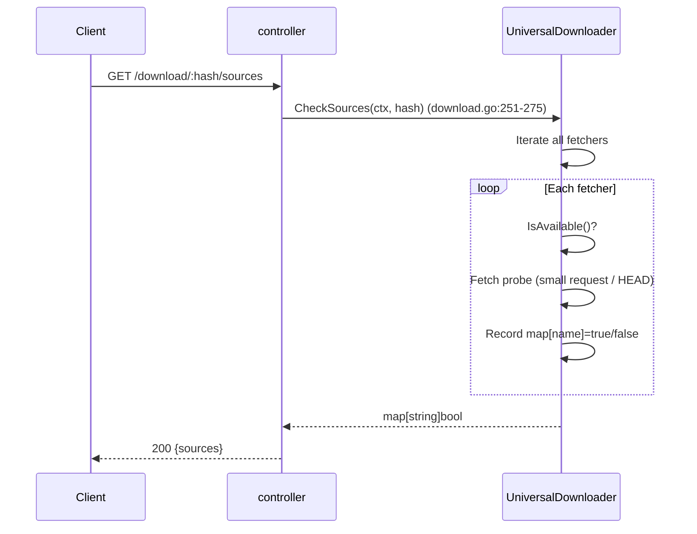
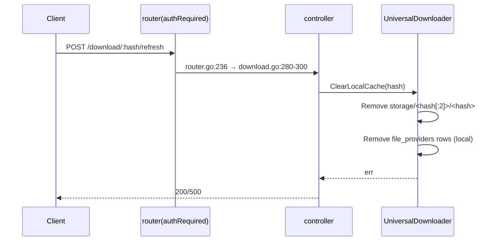
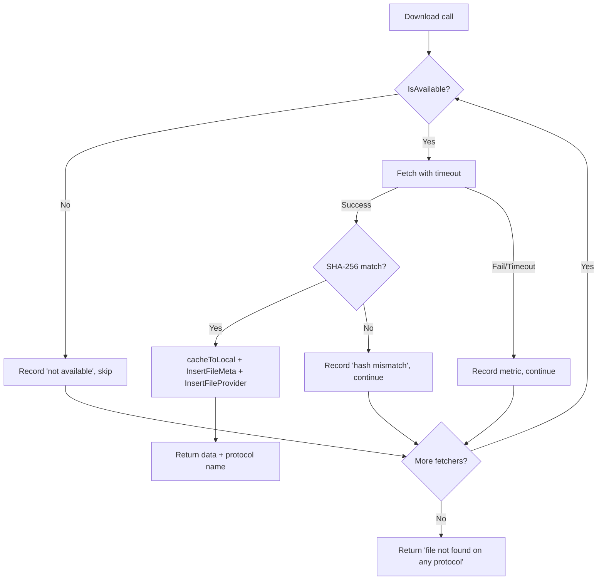
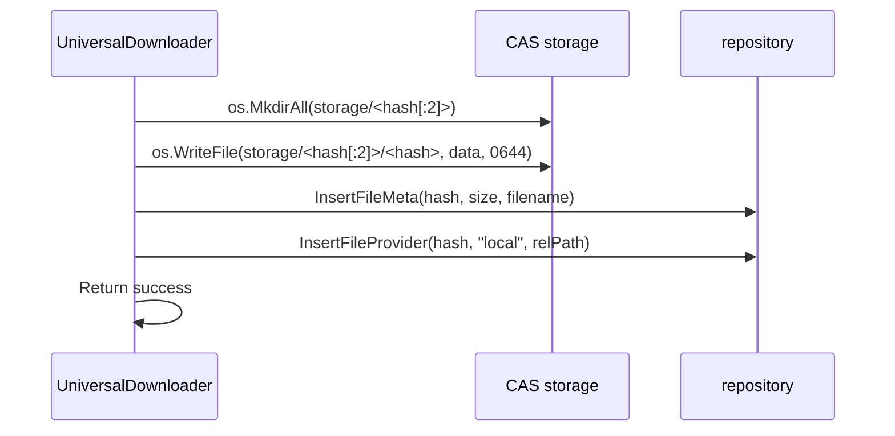
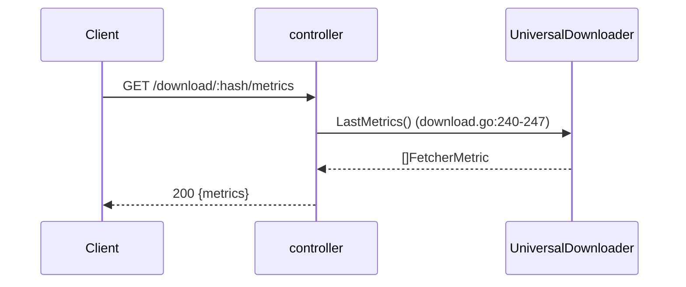

# Connection 09: controller ↔ downloader (multi-protocol download)

- **Modules involved**: `../modules/05-controller.md` and `../modules/08-downloader.md`
- **Code locations**: A side `back/internal/controller/download.go`; B side `back/internal/downloader/universal_downloader.go`; sole assembly point `back/internal/router/router.go:199-213`
- **Direction**: A→B one-way (in-process synchronous function call, no network channel/no message queue; data and results flow back via return value triple `(data []byte, protocol string, err error)`, `universal_downloader.go:305`)

## 1. Connection Method

**Channel type: in-process function call**. Controller side holds package-level global pointer `var universalDownloader *downloader.UniversalDownloader` (`back/internal/controller/download.go:31-32`), injected by router in `SetupRouter`:

- **Injection point**: `router.SetupRouter` calls `downloader.NewUniversalDownloader(btSvc, cfg.StorageDir, cfg.DownloadOrder, downloadTimeout, ipfsProv)` per config to construct singleton (`back/internal/router/router.go:201-207`), then `controller.InitUniversalDownloader(uniDownloader)` injects (`router.go:208`). Same instance also injected to `SyncService` for reuse (`router.go:211-213`; `back/internal/service/sync_service.go:16-19, 132-135`), resident for process lifetime.
- **Sibling injection dependency**: `InitIPFSProvider` (ipfsgw protocol gateway source, can be nil, `download.go:41-43`; assembly at `router.go:183-197`); BT DHT service pre-built per `cfg.BTDHTEnabled` (`router.go:137-145`).
- **Protocol frames/parameter format**: No proprietary protocol frames, all ordinary function signatures:
  - `Download(ctx context.Context, hash string) (data []byte, protocol string, err error)` —— main call (`universal_downloader.go:305-367`);
  - `CheckSources(ctx, hash) map[string]bool` —— source availability probe (`:405-425`);
  - `ClearLocalCache(hash)` —— force clear cache and re-pull (`:428-447`);
  - `LastMetrics() []FetcherMetric` —— recent attempt records (`:370-374`).
  - Each protocol backend uniformly implements `ProtocolFetcher` interface: `Name() / Fetch(ctx, hash) ([]byte, error) / IsAvailable()` (`:57-61`).
- **Authentication method**: This connection is in-process, **no own authentication**; all auth is at HTTP entry and upstream: `POST /download/:hash/refresh` has `AuthRequired` (`router.go:236`; middleware `router.go:112-119`), read endpoints open; anonymous collection download goes through `anonSvc.GetCollectionVisibleTo` visibility gate before reaching downloader (`back/internal/controller/anon.go:163-167`). Token validation semantics in module 05 §5.
- **Multi-protocol fallback priority**: `local → ipfsgw → btdht → http` (`universal_downloader.go:3-8` header comment; default when order empty is same, `:271-273`). Config default `PEERDRIVE_DOWNLOAD_ORDER="local,ipfsgw,btdht,http"` (`back/internal/config/config.go`). **2026-10-07: the bogus `"ipfs"` entry was removed** — it had not been in the fetcher registry since the libp2p stack was deleted (commit a5b090d), so every startup logged `downloader: unknown protocol "ipfs" in order, skipping` (`universal_downloader.go:275-299`). The default now matches the registry exactly, so the documented string and the effective order agree.
- **When/who establishes**: Established by router once at process startup (no lazy initialization, no close/destruction; module itself doesn't hold resident goroutines, IPFS gateway race goroutine exits on channel collection, `back/internal/provider/ipfs.go:73-93`).

## 2. Timing

### 2.1 Normal Path Main Timing (`GET /download/:hash`)

```mermaid
sequenceDiagram
  participant C as Client(HTTP)
  participant R as router(gin routing)
  participant K as controller UniversalDownload
  participant D as UniversalDownloader
  participant F as ProtocolFetcher(local/ipfsgw/btdht/http)
  participant DB as repository(file_providers/file_meta)
  participant FS as CAS storage

  C->>R: GET /download/:hash
  R->>K: router.go:234 → download.go:207
  K->>K: IsValidSHA256 validation (download.go:208-212); nil injection guard (213-216)
  K->>D: Download(ctx, hash) (download.go:219)
  D->>D: IsStrictSHA256 re-validate (universal_downloader.go:308-310)
  loop Per priority, each fetcher (318-331)
    D->>D: IsAvailable()? No→record "not available" skip (319-327)
    D->>F: context.WithTimeout(ctx, d.timeout) → Fetch(ctx, hash) (330-331)
    alt Fetch success
      D->>D: Recompute SHA-256 compare (336-347)
      alt Hash mismatch
        D->>D: Record "hash mismatch", treat as failure, continue to next protocol
      else Hash matches
        D->>FS: cacheToLocal: write storage/<hash[:2]>/<hash> (349, 378-398)
        D->>DB: InsertFileMeta + InsertFileProvider("local") (390-397)
        D-->>K: return data, fetcher.Name(), nil (351-356)
      end
    else Fetch failure/timeout
      D->>D: Record metric, continue to next protocol (358-364)
    end
  end
  D-->>K: err "file not found on any protocol" (366)
  K-->>C: err→404 {error} (download.go:220-223); success→X-Protocol header + 200 octet-stream (225-226)
```

### 2.2 Step-by-step Explanation

1. **Routing dispatch**: `SetupRouter` registers `r.GET("/download/:hash", controller.UniversalDownload)` (`router.go:234`); no authentication.
2. **Input validation**: `download.go:208-212` checks `IsValidSHA256(c.Param("hash"))`; invalid → 404.
3. **Injection check**: `download.go:213-216` checks `universalDownloader == nil` → 503.
4. **Main call**: `download.go:219` calls `universalDownloader.Download(c.Request.Context(), hash)`.
5. **Internal fetcher iteration**: `universal_downloader.go:308-310` re-validates hash with `IsStrictSHA256`; then iterates fetchers in priority order (`:318-331`):
   - `IsAvailable()` returns false → record "not available" and skip (`:319-327`).
   - `Fetch(ctx, hash)` called with `context.WithTimeout(ctx, d.timeout)` (`:330-331`).
   - On success: recompute SHA-256 and compare (`:336-347`); mismatch → treat as failure; match → `cacheToLocal` writes to CAS (`:349,378-398`) + `InsertFileMeta` + `InsertFileProvider("local")` (`:390-397`).
   - On failure/timeout: record metric and continue to next protocol (`:358-364`).
6. **All fail**: returns `"file not found on any protocol"` (`:366`).
7. **Response**: `download.go:220-223` error → 404 `{error}`; `download.go:225-226` success → `X-Protocol` header + 200 octet-stream.

### 2.3 Step-by-step: Source Probe (`GET /download/:hash/sources`)



### 2.4 Step-by-step: Cache Refresh (`POST /download/:hash/refresh`)



### 2.5 Step-by-step: Multi-protocol fallback decision tree



### 2.6 Step-by-step: CacheToLocal double-write



### 2.7 Step-by-step: LastMetrics reporting



## 3. Case Handling

| Case | Trigger condition | Handling strategy | Code location |
|---|---|---|---|
| **Timeout** | Download timeout per fetcher; probe timeout; refresh timeout | Each fetcher's `Fetch` wrapped with `context.WithTimeout(ctx, d.timeout)` (`universal_downloader.go:330-331`); default timeout from `cfg.DownloadTimeoutSecs` (`router.go:204`); `CheckSources` uses same ctx; `ClearLocalCache` is local file operation, no network timeout. | `universal_downloader.go:330-331`, `router.go:204` |
| **Disconnect/Reconnect** | Network interruption during fetch; BT DHT disconnect | `Fetch` returns error on network failure; `UniversalDownloader` continues to next protocol; no reconnect logic — each fetcher manages its own connection lifecycle (BT DHT has internal reconnect; HTTP fetcher creates new request each time). | `universal_downloader.go:358-364` |
| **Duplicate/Concurrent** | Same hash downloaded concurrently | No mutex on `Download`; concurrent calls to same hash may write to same CAS path simultaneously; `cacheToLocal` uses `os.WriteFile` (not atomic); concurrent `InsertFileMeta` has no ON CONFLICT → PK conflict → 500 (see connection 04 §3). `CheckSources` is read-only, no conflict. | `universal_downloader.go:349,378-398`, `file_repo.go:47-55` |
| **Data missing or validation failure** | Hash invalid; not found on any protocol; hash mismatch | Input validation: `IsValidSHA256` at controller (`download.go:208-212`), `IsStrictSHA256` at downloader (`universal_downloader.go:308-310`); all fetchers fail → `"file not found on any protocol"` (`:366`); hash mismatch → treated as failure, continue to next protocol (`:336-347`). | `download.go:208-212`, `universal_downloader.go:308-310,336-347,366` |
| **Auth failure** | `POST /download/:hash/refresh` without token | `AuthRequired` middleware at router level (`router.go:236`); 401 on failure. Read endpoints (`GET /download/:hash`, `/sources`, `/metrics`) have no auth. | `router.go:112-119,236` |
| **Half-open state** | `universalDownloader == nil` (not injected); fetcher unavailable | `download.go:213-216` checks nil → 503; `IsAvailable()` returns false → skip fetcher; BT DHT not enabled (`cfg.BTDHTEnabled=false`) → btdht fetcher not registered; ipfsgw provider nil → ipfsgw fetcher not registered. | `download.go:213-216`, `router.go:183-197,137-145` |
| **Process restart** | Process killed/restarted | No persistence: `LastMetrics()` is in-memory, lost on restart; `file_meta`/`file_providers` rows persist in SQLite; CAS files persist on disk; after restart, `InsertFileMeta` may re-insert (PK conflict → 500). | `universal_downloader.go:370-374` |

## 4. Related Documents

- Connection documents (same directory):
  - [03-controller-service.md](03-controller-service.md): controller→service M2 layer discipline; this connection's downloader bypasses service layer to directly access repository.
  - [04-service-repository.md](04-service-repository.md): downstream — service's transparent forwarding to repository; this connection's `InsertFileMeta`/`InsertFileProvider` goes through same repository functions.
  - [10-controller-storage.md](10-controller-storage.md): CAS disk layout `storageDir/<hash[:2]>/<hash>` (controller gets `storageDir` from gin context, `router.go:75-79`; downloader reads/writes same layout, `universal_downloader.go:379-397`).
  - [01-frontend-backend.md](01-frontend-backend.md): frontend file download main path goes through local WS `req` verb (transport `serveFile`/FileRouter), **not through downloader**; downloader only reachable indirectly from frontend via local WS admin frame forwarding to anon/sha256 endpoints (`router.go:215-223,396-415`; `anon.go:186`).
  - [03-controller-service.md](03-controller-service.md): service reuses same downloader instance — `SyncController → SyncService.saveFile → downloader.Download` pulls collection files (`sync_service.go:130-135`; assembly `router.go:211-213`).
  - [04-service-repository.md](04-service-repository.md): downloader **bypasses service layer to directly access repository** for `file_meta`/`file_providers` read/write (`universal_downloader.go:90-105, 378-398, 441-445`; `file_repo.go:48-93`) — this connection's data plane depends on that delegation boundary.
  - [10-controller-storage.md](10-controller-storage.md): CAS disk layout `storageDir/<hash[:2]>/<hash>` (controller gets `storageDir` from gin context, `router.go:75-79`; downloader reads/writes same layout, `universal_downloader.go:379-397`).
  - [01-frontend-backend.md](01-frontend-backend.md): frontend file download main path goes through local WS `req` verb (transport `serveFile`/FileRouter), **not through downloader**; downloader only reachable indirectly from frontend via local WS admin frame forwarding to anon/sha256 endpoints (`router.go:215-223,396-415`; `anon.go:186`).
- Module documents: `../modules/05-controller.md` (HTTP handler surface; §4.4 download order/timeout constraints, §4.3 response headers), `../modules/08-downloader.md` (downloader internal logic, storage, boundaries and pitfalls, including btdht/ipfsgw/http sub-protocol details).
