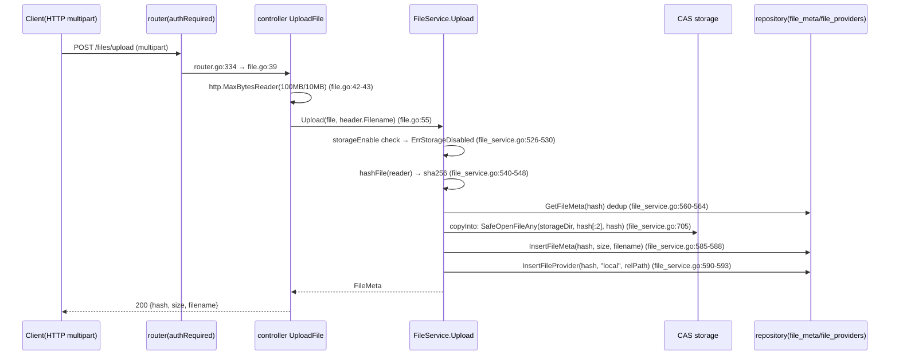
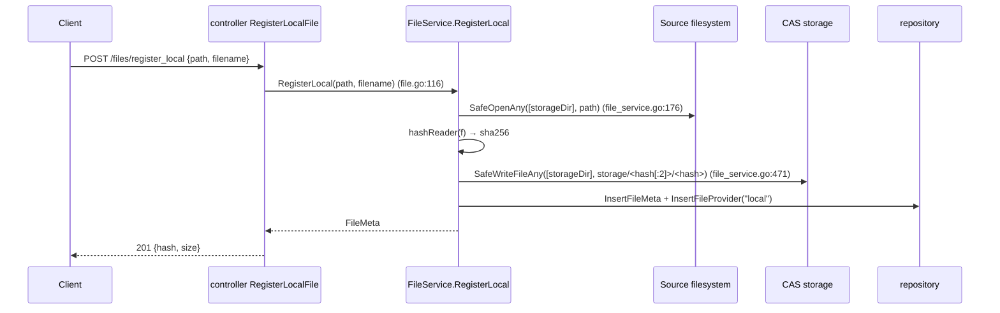
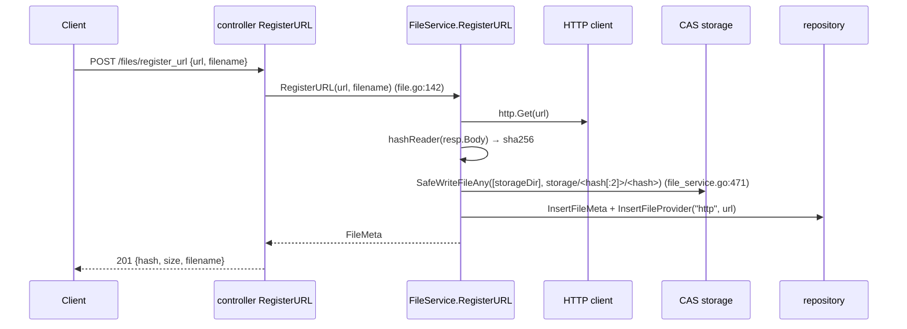
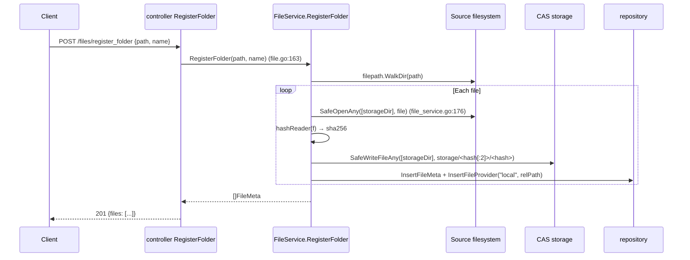
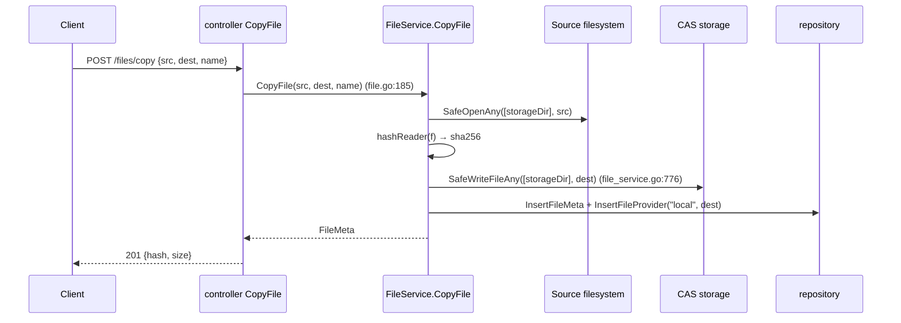
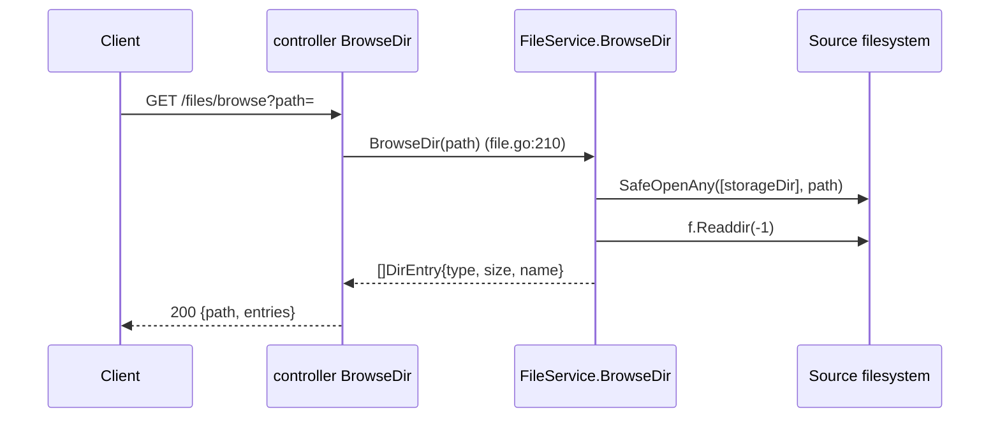
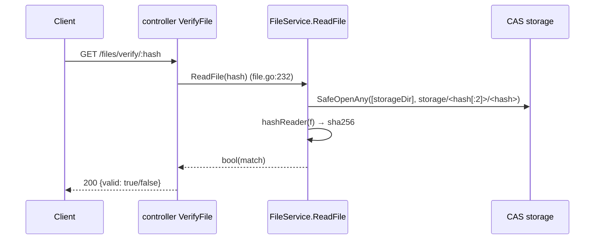
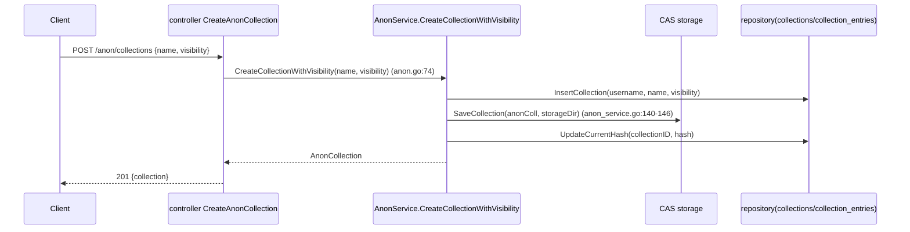
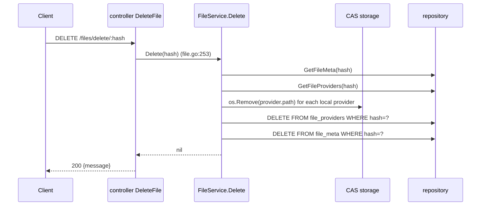
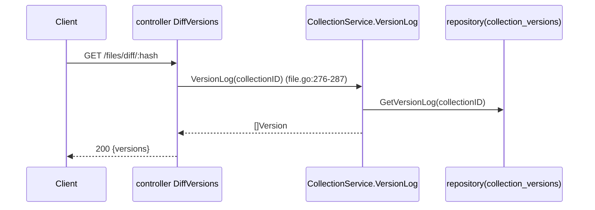

# Connection 10: controller ↔ storage (upload write-to-disk)

- **Modules involved**: `../modules/05-controller.md` and `../modules/03-storage.md`
- **Code locations**: A side `back/internal/controller/file.go` (`UploadFile`, `RegisterLocalFile`, `RegisterURL`, `RegisterFolder`, `DeleteFile`, `CopyFile`, `BrowseDir`, `VerifyFile`), `back/internal/controller/anon.go` (`CreateAnonCollection`, `ForkAnonCollection`, `CommitAnonCollection`, `SetAnonCollectionVisibility`); B side (disk CAS) write concentrated in `back/internal/service/file_service.go` (`Upload`/`RegisterLocal`/`RegisterURL`/`RegisterFolder`/`Delete`/`CopyFile`/`BrowseDir`/`ReadFile`/`ImportGatewayData`/`RegisterBTFile`) and `back/internal/service/anon_service.go` (`CreateCollectionWithVisibility` etc. writing JSON collection files); safety foundation `back/internal/pathutil/safewrite.go`, `safeopen.go`, `hardlink.go`, `reserved.go`, `scoped.go`, `rootprobe.go`, `unsaferoot.go`
- **Direction**: A→B one-way write + bidirectional read. Controller itself **never directly opens filesystem** — always forwarded through `FileService` (see connection 03 doc M2 layer discipline); "storage" is the disk CAS directory `storage/<hash[:2]>/<hash>` (`back/internal/service/file_service.go:466-467,566-567`), written by HTTP upload, also written by `anon_service` for collection JSON, also read by transport's `LocalSource`

## 1. Connection Method

**Channel type: in-process function call + local filesystem**. Controller indirectly writes to disk CAS through `*service.FileService` methods, itself doesn't import `pathutil`; service layer is the responsible layer for "deciding where and how to write" (`back/internal/service/file_service.go:32-45`'s `FileService.storageDir/storageEnable/cfg` three fields injected once in `NewFileService`, then unchanged).

### 1.1 Path Form (Content-Addressed)

All blob writes follow fixed CAS layout: `<storageDir>/<hash[:2]>/<hash>` (`back/internal/service/file_service.go:469,566,796`).

- `storageDir` from `config.StorageDir` (`back/internal/config/config.go:29,191`), default `./storage`, overridden by `PEERDRIVE_STORAGE` (`back/internal/serverapp/app.go:58`); when `PEERDRIVE_STORAGE_ENABLE=false` all write paths return `ErrStorageDisabled` (`file_service.go:526-530`; definition `:28`).
- Anonymous collections use same CAS (`anon_service.go:140-146`), just content is JSON not blob.
- Prefix bucketing `hash[:2]` ensures max ~67.66M files per directory, avoiding single-directory entry explosion.

### 1.2 Write Primitives (`pathutil` layer)

Service layer imports four safety primitives from `pathutil`:

| Primitive | Location | Usage |
|---|---|---|
| `SafeWriteFileAny(roots, path, data, perm)` | `back/internal/pathutil/safewrite.go:125-135` | `RegisterURL` CAS write (`file_service.go:471`), `CopyFile` dest write (`file_service.go:776`) |
| `SafeOpenFileAny(roots, path, flag, perm)` | `safewrite.go:141-160` | `Upload`'s `copyInto` CAS write (`file_service.go:705`) |
| `SafeOpenAny(roots, path)` | `back/internal/pathutil/safeopen.go:76-94` | `RegisterLocal` source file read (`file_service.go:176`) |
| `SafeMkdirAllAny` / `SafeRemoveAny` / `SafeRemoveAllAny` | `safewrite.go:163-193` | Directory maintenance; this connection's `Delete` still uses `os.Remove` (see §3 "TOCTOU window") |

The common skeleton of primitives is `pickRoot → withRoot → scopedOps` (`safewrite.go:31-103`):

1. `pickRoot` string-layer defense (`safewrite.go:31-83`): rejects NUL bytes, Windows reserved device names (`CON/PRN/AUX/NUL/COM1..9/LPT1..9`, see `back/internal/pathutil/reserved.go:24-60`), `..` escape, absolute paths, empty roots, cross-drive.
2. `withRoot` opens `os.Root` (`safewrite.go:89-103`; Linux uses `openat2(RESOLVE_BENEATH)`, other platforms use directory handle + `O_NOFOLLOW` per-segment confirmation, see `safeopen.go:11-24` header comment) — "resolution and writing completed once by kernel", any symlink escaping allowed root fails at open.
3. Degradation escape valve: when `os.Root` can't open and filesystem doesn't support (9P/SMB/DrvFs etc.), operator explicitly sets `PEERDRIVE_ROOT_FALLBACK=1` to fall back to path-based operations (`back/internal/pathutil/rootprobe.go:47-55,80-82`), continuous warning logs (`rootprobe.go:48-51`); disabled by default, TOCTOU window won't silently regress.
4. Startup volume root check: `PEERDRIVE_STORAGE=/` (or `C:\`) judged as misconfiguration by `UnsafeRoots` and exits directly (`back/internal/serverapp/app.go:294-331`), unless explicitly set `PEERDRIVE_ALLOW_UNSAFE_ROOT=1` (`app.go:440`). Judgment logic in `back/internal/pathutil/unsaferoot.go:20-44`.

### 1.3 Authentication Method

Controller layer doesn't authenticate — decided by router middleware per endpoint: `/files/upload`, `/files/register_local`, `/files/register_url`, `/files/register_folder`, `/files/delete/:hash`, `/files/copy`, `/files/diff` all `authRequired` (`back/internal/router/router.go:334-342`); `/files/verify/:hash` and `/files/browse` open anonymously (`router.go:338-339`). Upload size limits by auth status: authenticated 100MB / anonymous 10MB (`file_service.go:837-842`; `config.go:45-46,198-199`), wrapped with `http.MaxBytesReader` at controller entry (`file.go:42-43`).

### 1.4 Parameters and Error Conventions

- Parameters: `Upload(reader, filename)`, `RegisterLocal(path, filename)`, `RegisterURL(url, filename)`, `RegisterFolder(path, name)`, `Delete(hash)`, `CopyFile(src, dest, name)`, `BrowseDir(path)`, `ReadFile(hash)`, `ImportGatewayData(data, hash, filename)`, `RegisterBTFile(hash, size, filename, relPath)` — all ordinary function signatures, no protocol frames.
- Errors: `ErrStorageDisabled` for storage disabled; `ErrFileAlreadyExists` for duplicate upload; sentinel errors for path safety violations; `os.ErrNotExist` for missing files.
- Return values: metadata structs (`model.FileMeta`), path strings, hash strings — no binary protocol.

## 2. Timing

### 2.1 Normal Path: HTTP Upload → CAS

### 2.2 Register Local File

### 2.3 Register URL

### 2.4 Register Folder

### 2.5 Copy File

### 2.6 Browse Directory

### 2.7 Verify File

### 2.8 Anonymous Collection Create → CAS

### 2.9 Delete File

### 2.10 Diff Versions

## 3. Case Handling

| Case | Trigger condition | Handling strategy | Code location |
|---|---|---|---|
| **Timeout** | Upload size limit; URL fetch timeout; folder walk duration | Upload: `http.MaxBytesReader` limits size (100MB/10MB), no time limit (`file.go:42-43`); URL: `http.DefaultClient` (no timeout, `file_service.go:365-377`); folder: no timeout, walks all files synchronously; `storageEnable=false` returns `ErrStorageDisabled` immediately. | `file.go:42-43`, `file_service.go:365-377,526-530` |
| **Disconnect/Reconnect** | Upload interrupted; URL fetch fails | Upload: partial data lost, no retry (client must re-upload); URL: `http.Get` returns error, service propagates; no session recovery. | `file_service.go:520-597` |
| **Duplicate/Concurrent** | Same hash upload concurrent; concurrent register | `GetFileMeta` dedup check-then-insert race (`file_service.go:560-564`); concurrent same-hash upload: both miss dedup, both write to disk, `InsertFileMeta` PK conflict → 500 (no ON CONFLICT, `file_repo.go:47-55`); `InsertFileProvider` appends each time (harmless). | `file_service.go:560-564`, `file_repo.go:47-55` |
| **Data missing or validation failure** | Invalid path; missing file; invalid hash; empty directory | Path safety: `pickRoot` rejects `..`, absolute paths, reserved names (`safewrite.go:31-83`); missing file: `os.ErrNotExist` → 404; invalid hash: 400; empty directory: BrowseDir returns empty entries. | `safewrite.go:31-83`, `file_service.go:526-530` |
| **Auth failure** | Upload/delete/copy/register without token | `authRequired` middleware → 401 (`router.go:334-342`); verify/browse open anonymously. | `router.go:112-119,334-342` |
| **Half-open state** | `storageEnable=false`; `fileSvc==nil`; missing provider | `storageEnable=false` → `ErrStorageDisabled` → 403 (`file_service.go:526-530`); `fileSvc==nil` shouldn't happen (injected at startup); missing provider: `ReadFile` tries all providers, all miss → 404. | `file_service.go:526-530,807-832` |
| **TOCTOU window** | `Delete` uses `os.Remove` not `SafeRemove` | `Delete` (`file_service.go:618-645`) uses bare `os.Remove` for provider paths and bare `DB.Exec` for DB deletes — no transaction wrapper; crash between steps leaves orphan data. Path is fully hash-determined (no injection surface), so risk is low but inconsistent with `Upload`'s `SafeOpenFileAny` approach. | `file_service.go:618-645` |
| **Process restart** | Process killed/restarted | All state persists: CAS files on disk, SQLite metadata in DB, `storageDir` from config. No in-memory state to recover. | `file_service.go:32-45` |

## 4. Related Documents

- Connection documents (same directory):
  - [03-controller-service.md](03-controller-service.md): M2 layer discipline — controller doesn't import repository, all business through service; this connection documents the storage-specific paths.
  - [04-service-repository.md](04-service-repository.md): `InsertFileMeta` has no ON CONFLICT, concurrent PK conflict → 500; this connection's upload path depends on that convention.
  - [09-controller-downloader.md](09-controller-downloader.md): Cross-node pull pipeline does hash recomputation before disk write (controller doesn't duplicate); after pull completes calls `FileService.RegisterBTFile` (`file_service.go:85-119`) or `ImportGatewayData` (`:60-79`) to register in CAS — both paths use bare `os.WriteFile`, inconsistent with `Upload`'s `SafeOpenFileAny` (path fully hash-determined, no injection surface).
  - [11-transport-storage.md](11-transport-storage.md): Transport-side read/write of CAS (this connection only covers controller→service→storage surface).
  - [01-frontend-backend.md](01-frontend-backend.md): Frontend via admin frames or HTTP direct calls `/files/upload` all ultimately reach this connection.
- Module documents:
  - `../modules/05-controller.md`: HTTP handler surface, §1.2 dependency injection checklist (`fileSvc` injected by `InitFileController`, `file.go:30-36`).
  - `../modules/03-storage.md`: CAS layout and `pathutil` safety foundation (`pickRoot`/`withRoot`/`scopedOps`/`os.Root` degradation).
  - `../modules/06-service.md`: Business orchestration layer, §FileService covers all service methods of this connection.
  - `../modules/02-repository.md`: SQLite tables and `file_repo.go` INSERT semantics (`InsertFileMeta` no `ON CONFLICT`, concurrent PK conflict → 500).
