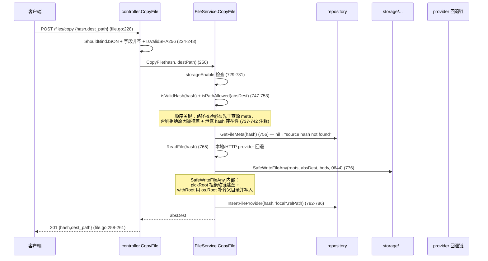
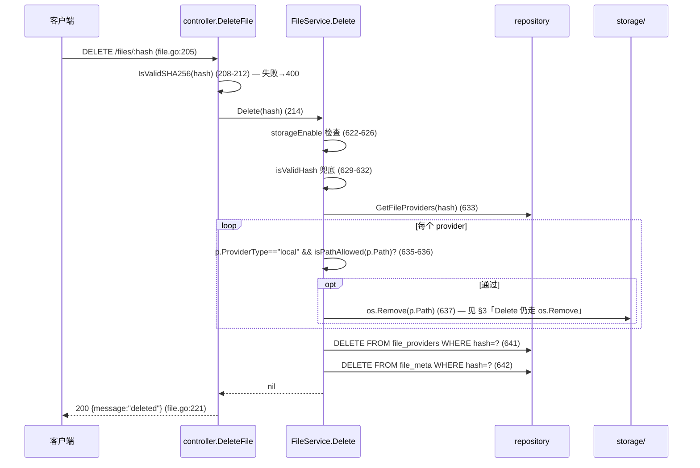
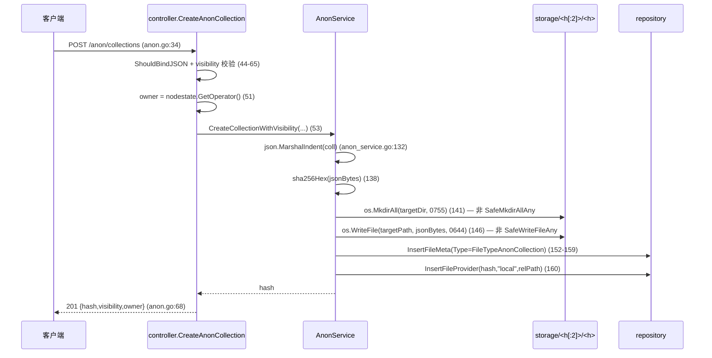

# 连接 10：controller ↔ storage（上传写盘）

- **涉及模块**：`../modules/05-controller.md` 与 `../modules/03-storage.md`
- **代码位置**：A 侧 `back/internal/controller/file.go`（`UploadFile`、`RegisterLocalFile`、`RegisterURL`、`RegisterFolder`、`DeleteFile`、`CopyFile`、`BrowseDir`、`VerifyFile`）、`back/internal/controller/anon.go`（`CreateAnonCollection`、`ForkAnonCollection`、`CommitAnonCollection`、`SetAnonCollectionVisibility`）；B 侧（磁盘 CAS）落盘集中在 `back/internal/service/file_service.go`（`Upload`/`RegisterLocal`/`RegisterURL`/`RegisterFolder`/`Delete`/`CopyFile`/`BrowseDir`/`ReadFile`/`ImportGatewayData`/`RegisterBTFile`）与 `back/internal/service/anon_service.go`（`CreateCollectionWithVisibility` 等落 JSON 集合文件）；安全底座 `back/internal/pathutil/safewrite.go`、`safeopen.go`、`hardlink.go`、`reserved.go`、`scoped.go`、`rootprobe.go`、`unsaferoot.go`
- **方向**：A→B 单向写 + 双向读。controller 本身**从不直接打开文件系统**——一律经 `FileService` 转发（见 03 连接文档 M2 收层纪律）；「storage」是磁盘上的 CAS 目录 `storage/<hash[:2]>/<hash>`（`back/internal/service/file_service.go:466-467,566-567`），既被 HTTP 上传写入、也被 `anon_service` 写集合 JSON、被 `transport` 的 `LocalSource` 读出

## 1. 连接方式

**通道类型：进程内函数调用 + 本地文件系统**。controller 通过 `*service.FileService` 方法间接写入磁盘 CAS，自身不 import `pathutil`；service 层才是「决定写哪儿、怎么写」的责任层（`back/internal/service/file_service.go:32-45` 的 `FileService.storageDir/storageEnable/cfg` 三字段在 `NewFileService` 一次性注入，之后不变）。

### 1.1 路径形态（内容寻址）

所有 blob 落盘遵循固定 CAS 布局：`<storageDir>/<hash[:2]>/<hash>`（`back/internal/service/file_service.go:469,566,796`）。

- `storageDir` 来自 `config.StorageDir`（`back/internal/config/config.go:29,191`），默认 `./storage`，由 `PEERDRIVE_STORAGE` 覆盖（`back/cmd/server/main.go:58`）；`PEERDRIVE_STORAGE_ENABLE=false` 时所有写路径返回 `ErrStorageDisabled`（`file_service.go:526-530`；定义 `:28`）。
- 匿名集合也是同一套 CAS（`anon_service.go:140-146`），只是内容是 JSON 不是 blob。
- 前缀分桶 `hash[:2]` 保证单目录最多 ~6766 万文件，避免单目录条目爆炸。

### 1.2 写入原语（`pathutil` 层）

service 层从 `pathutil` 导入四个安全原语：

| 原语 | 位置 | 用途 |
|---|---|---|
| `SafeWriteFileAny(roots, path, data, perm)` | `back/internal/pathutil/safewrite.go:125-135` | `RegisterURL` 落 CAS（`file_service.go:471`）、`CopyFile` 落 dest（`file_service.go:776`） |
| `SafeOpenFileAny(roots, path, flag, perm)` | `safewrite.go:141-160` | `Upload` 的 `copyInto` 写 CAS（`file_service.go:705`） |
| `SafeOpenAny(roots, path)` | `back/internal/pathutil/safeopen.go:76-94` | `RegisterLocal` 读源文件（`file_service.go:176`） |
| `SafeMkdirAllAny` / `SafeRemoveAny` / `SafeRemoveAllAny` | `safewrite.go:163-193` | 目录维护；本连接 `Delete` 仍用 `os.Remove`（见 §3「TOCTOU 窗口」） |

原语的共同骨架是 `pickRoot → withRoot → scopedOps`（`safewrite.go:31-103`）：

1. `pickRoot` 字符串层防线（`safewrite.go:31-83`）：拒绝 NUL 字节、Windows 保留设备名（`CON/PRN/AUX/NUL/COM1..9/LPT1..9`，见 `back/internal/pathutil/reserved.go:24-60`）、`..` 逃逸、绝对路径、空根、跨盘。
2. `withRoot` 打开 `os.Root`（`safewrite.go:89-103`；Linux 走 `openat2(RESOLVE_BENEATH)`，其他平台走目录句柄 + `O_NOFOLLOW` 逐段确认，见 `safeopen.go:11-24` 头注释）——「解析与写入由内核一次完成」，任何逃出允许根的软链在 open 时失败。
3. 降级逃生阀：`os.Root` 打不开且文件系统不支持时（9P/SMB/DrvFs 等），运营者显式设 `PEERDRIVE_ROOT_FALLBACK=1` 才退回按路径操作（`back/internal/pathutil/rootprobe.go:47-55,80-82`），日志持续告警（`rootprobe.go:48-51`）；默认关闭，TOCTOU 窗口不会静默回归。
4. 启动期卷根检查：`PEERDRIVE_STORAGE=/`（或 `C:\`）会被 `UnsafeRoots` 判为误配置直接退出（`back/cmd/server/main.go:294-331`），除非显式设 `PEERDRIVE_ALLOW_UNSAFE_ROOT=1`（`main.go:317-318`）。判定逻辑见 `back/internal/pathutil/unsaferoot.go:20-44`。

### 1.3 鉴权方式

controller 层不鉴权——由 router 的中间件按端点决定：`/files/upload`、`/files/register_local`、`/files/register_url`、`/files/register_folder`、`/files/delete/:hash`、`/files/copy`、`/files/diff` 全部 `authRequired`（`back/internal/router/router.go:334-342`）；`/files/verify/:hash` 与 `/files/browse` 匿名开放（`router.go:338-339`）。上传体积上限按认证状态区分：认证 100MB / 匿名 10MB（`file_service.go:837-842`；`config.go:45-46,198-199`），用 `http.MaxBytesReader` 在 controller 入口包住请求体（`file.go:42-43`）。

### 1.4 参数与错误约定

- 参数：`Upload(reader, filename)`、`RegisterLocal(path, filename)`、`RegisterURL(rawURL, filename)`、`RegisterFolder(folderPath)`、`CopyFile(hash, destPath)`、`Delete(hash)`、`BrowseDir(dirPath)`（`file_service.go:522,180,431,280,725,618,648`）；全部以 `(T, error)` 或 `(T1, T2, ..., error)` 返回，无自定义协议帧。
- 错误：两个哨兵错误 `ErrStorageDisabled`（`file_service.go:28`）与 `ErrFileAlreadyExists`（`:29`）由 controller 用 `errors.Is` 判定 → 403 / 200+`already_exists:true`（`file.go:57-72`）；其余错误 500（`file.go:73-77`）。

### 1.5 文件名 sanitize

**上传路径不 sanitize**：`header.Filename`（multipart 头里客户端自报）原样存入 `meta.Filename`（`file.go:84`；`file_service.go:582`），CAS 路径用 hash 而非 filename，因此脏 filename（含 `../`、含 `CON.txt`、含 Unicode）不会造成路径穿越——但也意味着 `file_meta.filename` 列可以存任意字符串，前端展示时需要自行处理。

- `RegisterURL` 的 filename 来自 `Content-Disposition`（`filename*=` 先，`filename=` 后）→ URL basename（`file_service.go:403-424`），同样未 sanitize，但同样只落元数据不落路径。
- `RegisterLocal` 的 filename 为空时回退 `filepath.Base(absPath)`（`file_service.go:245-247`），仍不 sanitize。
- 唯一被 sanitize 的**写入路径**是 `CopyFile` 的 `destPath`：先 `isPathAllowed`（`file_service.go:743-753`），再由 `SafeWriteFileAny` 内的 `pickRoot` 做字符串层拒绝（NUL/保留名/`..`/绝对路径，`safewrite.go:31-83`），最后由 `os.Root` 做文件系统层强制（`safewrite.go:89-103`）。

## 2. 时序

### 2.1 主路径：`POST /files/upload`（multipart → CAS → DB）

```mermaid
sequenceDiagram
  participant C as 客户端(multipart)
  participant R as router(authRequired)
  participant K as controller.UploadFile
  participant S as FileService.Upload
  participant OS as 系统临时目录
  participant FS as storage/<h[:2]>/<h>
  participant DB as repository(file_meta/file_providers)

  C->>R: POST /files/upload (router.go:334)
  R->>K: file.go:39
  K->>S: MaxUploadBytes(c) (file.go:42)
  K->>K: http.MaxBytesReader 限长 (file.go:43)
  K->>K: c.Request.FormFile("file") (file.go:46) — 失败→400 (47-51)
  K->>S: Upload(file, header.Filename) (file.go:55)
  S->>S: storageEnable==false → ErrStorageDisabled (file_service.go:526-530)
  S->>OS: os.CreateTemp("","peerdrive-upload-*") (540-538)
  S->>OS: TeeReader(reader,sha256) + io.Copy(tmpFile,tee) (540-547)
  S->>S: 边写边算 SHA256；size=sizeOfCopy (542-548)
  S->>OS: tmpFile.Seek(0); ReadFull 512B (550-553)
  S->>S: http.DetectContentType + mime.TypeByExtension 兜底 (553-558)
  S->>OS: tmpFile.Close() (559)
  S->>DB: GetFileMeta(hash) 查重 (561)
  alt 已存在
    S-->>K: existing, ErrFileAlreadyExists (562-564)
  else 不存在
    S->>S: relPath=hash[:2]+"/"+hash; fullPath=join(storageDir,relPath) (566-567)
    S->>S: copyInto(roots, tmpName, fullPath) (571-574)
    S->>FS: SafeOpenFileAny(O_CREATE|O_TRUNC|O_WRONLY,0644) (705)
    S->>FS: io.Copy(output,input) + output.Close() (709-715)
    S->>DB: InsertFileMeta(meta) (585-588)
    S->>DB: InsertFileProvider(hash,"local",relPath) (590-593)
    S-->>K: meta, nil
  end
  alt errors.Is(ErrStorageDisabled)
    K-->>C: 403 (file.go:57-61)
  else errors.Is(ErrFileAlreadyExists)
    K-->>C: 200 already_exists=true (file.go:62-72)
  else 其他 err
    K-->>C: 500 (file.go:73-77)
  else 成功
    K-->>C: 201 hash/size/mime/filename (file.go:79-86)
  end
  Note over S: defer os.Remove(tmpName) 兜底 (file_service.go:538)
```

逐步说明（关键调用与代码位置）：

1. **限长前置**（`file.go:42-44`）：`MaxUploadBytes(c)` 读 gin context 的 `authenticated` 标志（`file_service.go:837-842`），`http.MaxBytesReader` 包住 body——只限体积、不限时间（见 §3「超时」）。
2. **表单解析**（`file.go:46-52`）：`FormFile("file")` 失败 → 400 `file is required`；`defer file.Close()`。
3. **临时文件 + 边写边哈希**（`file_service.go:540-548`）：`os.CreateTemp("","peerdrive-upload-*")` 落到**系统临时目录**（如 `/tmp`），不在允许根内——这是后续不能直接 `os.Rename` 的原因（见 §3「跨设备 rename」）。`io.TeeReader(reader, hasher)` 边写边算 SHA256，单次 IO 完成 hash 与落盘。
4. **MIME 探测**（`:550-558`）：读前 512 字节做魔数嗅探；若是 `application/octet-stream` 再按扩展名查 `mime.TypeByExtension` 兜底。
5. **查重**（`:561-564`）：`GetFileMeta(hash)` 命中 → 直接返回 `existing + ErrFileAlreadyExists`——**不删临时文件之前的临时文件会被 `defer` 清理**（`:538`）。这是内容寻址幂等的核心。
6. **落盘**（`:566-574` + `copyInto` 在 `:699-717`）：`relPath=hash[:2]+"/"+hash`，`fullPath=join(storageDir,relPath)`；用 `SafeOpenFileAny`（非 `os.Rename`）在允许根上开 `os.Root`，`O_CREATE|O_TRUNC|O_WRONLY` + `0644`；`io.Copy(output,input)` 后 `Close`。父目录 `hash[:2]` 在 `SafeOpenFileAny` 内部通过 `mkdirParent` 自动补齐（`safewrite.go:147-151`）。
7. **DB 登记**（`:585-593`）：`InsertFileMeta` + `InsertFileProvider("local", relPath)`——失败回 500，**但 CAS 文件已落盘**（不一致窗口，见 §3）。
8. **错误→状态码**（`file.go:57-86`）：`ErrStorageDisabled`→403、`ErrFileAlreadyExists`→200+`already_exists`、其他→500、成功→201。

### 2.2 变体：`POST /files/register_local`（读已存在本地文件登记）

```mermaid
sequenceDiagram
  participant C as 客户端
  participant K as controller.RegisterLocalFile
  participant S as FileService.RegisterLocal
  participant FS as storage/share/download 根
  participant DB as repository

  C->>K: POST /files/register_local {path,filename} (file.go:127)
  K->>K: ShouldBindJSON (133) — 失败→400
  K->>S: RegisterLocal(path, filename) (139)
  S->>S: storageEnable 检查 (184-188) → ErrStorageDisabled
  S->>S: absPath = IsAbs? path : join(storageDir,path) (190-193)
  S->>S: isPathAllowed(absPath) (197) — 不在允许根内→"path outside storage root"
  S->>FS: openAllowed → SafeOpenAny(roots, absPath) (202; 176)
  S->>FS: f.Stat() (fstat 已打开 fd) (211-215)
  S->>S: RejectHardlink(absPath, f) (222) — nlink>1 → 拒绝
  S->>S: sha256.New + io.Copy(h,f) (227-232)
  S->>S: f.Seek(0) + ReadFull 512B + DetectContentType (234-242)
  S->>DB: GetFileMeta(hash) (249) — 不存在→InsertFileMeta (251-258)
  S->>DB: InsertFileProvider(hash,"local",absPath) (261)
  S->>DB: UpsertFileIndex(hash,absPath,filename,size,false) (271-273) — 失败只告警
  S-->>K: hash
  K-->>C: 200 {hash, filename} (file.go:147)
```

关键点：

1. **允许根三重**（`file_service.go:140-161`）：`storageDir ∪ PEERDRIVE_SHARE_DIRS ∪ DownloadDir`，全部 `EvalSymlinks` 真实化后再判定——否则 `~/Downloads → /mnt/c/...` 这种软链会让判定与打开永远对不上。
2. **`openAllowed` 不退回 `os.Open`**（`:170-177`）：注释明确写了「TOCTOU 窗口」——「校验之后、打开之前被换成软链」。
3. **fstat 而非 lstat**（`:209-215`）：对**已打开的 fd** 取属性，不再按路径 stat 一次，少一次路径解析少一个窗口。
4. **硬链接拒绝**（`:218-225`；实现 `back/internal/pathutil/hardlink.go:37-51`）：传入 `*os.File` 而非 `FileInfo`——Windows 上只有句柄能问出 `NumberOfLinks`（`hardlink.go:33-36` 注释）。`nlink>1` 一律拒绝，除非 `PEERDRIVE_ALLOW_HARDLINKS=1`（`hardlink.go:20-22`）。理由：硬链接没有方向，同 inode 在允许根内有一个名、在外面还有另一个名时路径判定看不出来。
5. **登记三写**（`:251-273`）：`InsertFileMeta`（如不存在）→ `InsertFileProvider` → `UpsertFileIndex`（失败只告警）。`file_index` 是「本节点能对外提供什么文件」的唯一真源（`:263-270` 注释详述），缺了它网盘 UI 能看到、对端 share 帧拿不到。

### 2.3 变体：`POST /files/register_url`（从 URL 拉取登记）

```mermaid
sequenceDiagram
  participant C as 客户端
  participant K as controller.RegisterURL
  participant S as FileService.RegisterURL
  participant NET as HTTP 对端
  participant FS as storage/<h[:2]>/<h>
  participant DB as repository

  C->>K: POST /files/register_url {url,filename} (file.go:93)
  K->>K: ShouldBindJSON + url 非空 (99-108) — 失败→400
  K->>S: RegisterURL(url, filename) (110)
  S->>S: ResolveURL(url, followRedirects=true) (435)
  S->>NET: http.DefaultClient.Get(url) (file_service.go:374)
  NET-->>S: body, Content-Type, Content-Disposition (374-400)
  S->>S: sha256.Sum256(body); DetectContentType; 提取 filename (392-424)
  S->>DB: GetFileMeta(hash) (444) — 不存在→InsertFileMeta (446-458)
  S->>DB: InsertFileProvider(hash,"http",rawURL) (461-465)
  S->>S: storageEnable? (468)
  alt 已开启
    S->>FS: SafeWriteFileAny(roots, fullPath, body, 0644) (471) — 失败只告警
  end
  S-->>K: meta
  K-->>C: 201 hash/size/mime/filename (file.go:118-123)
```

关键点：

1. **`ResolveURL` 不写盘**（`:361-428`）：只拉取 + 算 hash + 检测 MIME + 提取 filename；写盘与 DB 登记在 `RegisterURL` 主体完成。
2. **重定向策略**：`followRedirects=true` 用 `http.DefaultClient`（自动跟随 301/302，`file_service.go:365-372`）；`false` 时 `CheckRedirect` 返回 `ErrUseLastResponse`（`:367-371`）。**无 Timeout**（见 §3「超时」）。
3. **写盘非致命**（`:467-474`）：`storageEnable` 为假或 `SafeWriteFileAny` 失败都只告警——因为 provider 是 `"http"` 类型，对端可通过 URL 拉取，本节点没有本地副本是合法状态。
4. **Content-Disposition 文件名解析**（`:402-424`）：先尝试 RFC 6266 `filename*=`（percent-decode），再退到 `filename=`，最后退到 URL basename。注意 `percentUnescape` 是自实现的简易解码器（`:490-505`），不解 `%` 后非 hex 字符（原样保留）。

### 2.4 变体：`POST /files/copy`（storage 内复制）



关键点：**不用 `os.MkdirAll + os.WriteFile`**——两步都会跟着 dst 父目录上的软链走到根外，而 `isPathAllowed` 是在它们之前判的，中间是 TOCTOU 窗口（`file_service.go:770-775` 注释）。`SafeWriteFileAny` 用 `os.Root` 把「父目录补齐 + 写文件」合成一次（`safewrite.go:125-135`）。

### 2.5 变体：`DELETE /files/:hash`（删除 blob）



关键点：删除**不遍历 CAS**（`storage/<h[:2]>/<h>`），而是按 `file_providers` 记录的路径删——因为文件可能被复制到别的路径。`os.Remove` 之前先 `isPathAllowed` 兜底，防止历史数据里有根外 provider 路径（`file_service.go:627-637` 注释）。**`os.Remove` 未改 `SafeRemoveAny` 是已知窗口**，见 §3。

### 2.6 匿名集合落盘（`anon_service.CreateCollectionWithVisibility`）



⚠️ **已知不一致**：`anon_service.go` 的集合 JSON 落盘仍用裸 `os.MkdirAll` + `os.WriteFile`（`anon_service.go:141,146,373,377`），未走 `SafeWriteFileAny`/`SafeMkdirAllAny`。因 CAS 路径完全由 hash 决定（无外部输入，无软链注入点），实际风险低；但与 `file_service.go` 已收敛的写法不一致，属已知技术债。

## 3. 情况处理

| 异常/边界场景 | 行为与依据（代码位置） | 说明 |
|---|---|---|
| **超时** | 本连接是进程内同步函数调用，**无自身超时**；上限全部来自上游：① HTTP 服务器只设 `ReadHeaderTimeout:15s`（`back/cmd/server/main.go:250-253`），无 `ReadTimeout/WriteTimeout` → 慢上传没有全局时间上限；② `http.MaxBytesReader` 只限体积、不限时间（`file.go:42-43`）；③ `ResolveURL` 用 `http.DefaultClient` 无 Timeout（`file_service.go:365-372`）→ 对端挂起时该 handler 长期阻塞；④ 写入路径无超时：`os.CreateTemp`/`SafeOpenFileAny`/`io.Copy` 全部依赖底层 OS 调用，磁盘挂起时无中断。 | 「超时」只能从客户端/反向代理层加；controller 无主动超时机制。 |
| **断连 / 重连** | 本连接无长连接，每次请求新建调用；「断连」只存在于外层 HTTP：① `Upload` 读 `c.Request.Body` 时客户端断开 → `io.Copy` 返回错误 → 临时文件被 `defer os.Remove` 清理（`file_service.go:538`），CAS 无残留；② 客户端重发 → 走 `ErrFileAlreadyExists` 幂等路径（`file.go:62-72`）；③ DB 写入与 CAS 写入非事务——见 §3「重复/并发」的「DB 写失败但 CAS 已落盘」窗口。 | 无会话恢复；幂等靠内容寻址 + hash 查重。 |
| **重复 / 并发** | ① 上传重复：`GetFileMeta(hash)` 命中 → `ErrFileAlreadyExists` → 200 + `already_exists:true`（`file.go:62-72`；`file_service.go:561-564`）。② 并发同 hash 上传：无锁，两请求同时未命中时各自写盘；`InsertFileMeta` 是纯 INSERT 无 `ON CONFLICT`（`back/internal/repository/file_repo.go:48-55`），主键冲突时 `InsertFileMeta` 返回 error → 500（`file_service.go:585-588`），**但 CAS 文件已写入且被覆盖**（第二次 `copyInto` 用 `O_TRUNC`，内容一致所以无数据错误，但 DB 缺记录）。`InsertFileProvider` 每次追加行（`file_repo.go:81-84`）→ provider 行累积（内容寻址下无害）。③ `RegisterLocal` 路径忽略 `InsertFileMeta` 错误（`file_service.go:251-259`）→ 主键冲突时 provider 仍会追加。④ `RegisterFolder` 遍历中任一文件失败 → 返回 `results`（已成功的部分）+ err（`file_service.go:350-353`），不中断整批。⑤ `CopyFile` 并发：`SafeWriteFileAny` 用 `O_TRUNC`，后写覆盖先写，DB 追加 provider 行。 | 正确性主要靠内容寻址；并发副作用是已知 provider 行累积与「CAS 已写、DB 未登记」窗口。 |
| **数据缺失或校验失败** | 缺失 → 404：`VerifyFile` meta==nil（`file.go:189-193`）；`RegisterURL` 对端返回非 200（`file_service.go:381-384`）；`CopyFile` source hash not found（`:760-762`）。校验失败 → 400：`IsValidSHA256(hash)` 拒绝（`file.go:177-181,208-212,244-248`）；`isPathAllowed` 拒绝 `path outside storage root`（`file_service.go:197-200,300-303,663-667,743-753`）；`RejectHardlink` 拒绝 `nlink>1`（`file_service.go:222-225`；`hardlink.go:48-49`）。TOCTOU 拒绝：`SafeWriteFileAny`/`SafeOpenAny` 在 `pickRoot` 阶段拒绝 NUL/保留名/`..`/绝对路径（`safewrite.go:31-83`），在 `withRoot` 阶段拒绝跟随软链逃逸（`safewrite.go:89-103`）。内容校验：上传路径**不做落盘后复算**——hash 是边写边算的（`file_service.go:541-548`），与落盘数据同源；落盘前的复算只在跨节点拉取管线做（`transport` 层，见 07 连接文档）。 | 400 统一表达「请求/路径问题」；CAS 路径完全由 hash 决定，无注入面。 |
| **鉴权失败** | HTTP 入口：`authRequired` 中间件无有效 Bearer token → 401（`back/internal/router/auth_middleware.go:57-82`）；挂载点 `/files/upload`（`router.go:334`）、`/files/register_local`（`:335`）、`/files/register_url`（`:336`）、`/files/register_folder`（`:337`）、`/files/delete/:hash`（`:340`）、`/files/copy`（`:341`）、`/files/diff`（`:342`）。未配 `RegistrationServer` → 中间件放行（`auth_middleware.go:26,57-61`）。匿名开放端点：`/files/verify/:hash`、`/files/browse`（`router.go:338-339`）——但 `BrowseDir` 内部仍做 `isPathAllowed`（`file_service.go:663-667`）。service 层无自身鉴权——身份（owner）由 controller 从 `nodestate.GetOperator()` 取（`anon.go:51,97,141,239,317`）传入。 | 本连接内部无鉴权参数；「鉴权失败」在触达 service 之前被 401 吸收。 |
| **半开状态** | ① `storageEnable==false` → `ErrStorageDisabled` → 403：`Upload`（`file_service.go:526-530`）、`RegisterLocal`（`:184-188`）、`RegisterFolder`（`:284-288`）、`Delete`（`:622-626`）、`CopyFile`（`:729-731`）、`BrowseDir`（`:652-656`）；controller 在 `file.go:57-61` 用 `errors.Is` 判定。② `storageDir==""` → 配置缺失，`allowedRoots()` 返回 nil（`file_service.go:141-143`）→ `isPathAllowed` 恒 false → 所有路径操作报 `path outside storage root`。③ `os.Root` 打不开且未开逃生阀 → `openRootOrFallback` 返回错误（`rootprobe.go:30-57`）→ `SafeWriteFileAny`/`SafeOpenFileAny` 失败 → 500；错误消息经 `ExplainRootFailure` 翻译为可操作提示（`rootprobe.go:113-128`）。④ 卷根配置 → 启动期 `UnsafeRoots` 检查直接退出（`main.go:317-331`），除非 `PEERDRIVE_ALLOW_UNSAFE_ROOT=1`。 | 半开被建模成「端点不可用（403）/ 路径全拒 / 文件系统不支持（500）」三种可观察状态；启动期配置错误直接 fail-fast。 |
| **进程重启** | ① `FileService` 单例由 `SetupRouter` 重建（`back/internal/router/router.go:121-122`）——无「恢复会话」概念，重启后状态由持久层（CAS 文件 + SQLite）重建。② CAS 文件与 SQLite 元数据持久：`InsertFileMeta`/`InsertFileProvider` 写入 SQLite（`back/internal/repository/file_repo.go`），`SafeWriteFileAny` 写入磁盘；重启后 `Verify`/`ListAll` 仍能读到（`file_service.go:600-615,122-124`）。③ 匿名集合 JSON 也持久在 CAS（`anon_service.go:141-149`），`GetCollectionByHash` 读回（`:178-180`）。④ 临时文件不持久：`os.CreateTemp` 落系统临时目录，进程崩溃时被 `defer os.Remove` 清理（正常路径），异常退出时可能残留 `/tmp/peerdrive-upload-*`——无启动期清理逻辑。⑤ `file_index` 持久在 SQLite（`UpsertFileIndex`，`file_service.go:271`），重启后 share 帧仍能看到登记过的文件。 | 无会话恢复；重启后状态完全由 CAS + SQLite 重建。残留临时文件是唯一已知脏状态。 |
| **TOCTOU 窗口（专属要点）** | 全部写入路径已收敛到 `os.Root`（`safewrite.go:11-14,89-103`），消除「校验之后、打开之前被换成软链」的窗口。**例外**：`Delete` 仍用 `os.Remove(p.Path)`（`file_service.go:637`），未改 `SafeRemoveAny`（`safewrite.go:176-183`）——注释（`file_service.go:627-628`）承认这是兜底，但未真正收敛；`DeleteFile` 在 `isPathAllowed` 通过后到 `os.Remove` 之间仍有窗口。`anon_service.go` 的集合 JSON 落盘也用裸 `os.WriteFile`（见 §2.6）。`ImportGatewayData`（`file_service.go:65-68`）与 `RegisterBTFile`（`:91-103`）也用 `os.MkdirAll + os.WriteFile/os.Create`——但两者路径完全由 hash 决定，无外部输入。 | 「收敛到 os.Root」是写路径的架构决策；`Delete` 与 anon 集合落盘是已知未收敛点。 |
| **跨设备 rename（专属要点）** | `Upload` 原本可能用 `os.Rename(tmpName, fullPath)` 把临时文件移到 CAS——**已废弃**（`file_service.go:568-574` 注释详述）：源在系统临时目录（`/tmp`），目标在 `storageDir`（可能在另一块盘），`os.Rename` 跨设备失败（`EXDEV`），且 rename 会跟着 dst 父目录上的软链走（TOCTOU）。改为 `copyInto`：在允许根内 `SafeOpenFileAny` 打开目标 + `io.Copy` 拷过去（`file_service.go:699-717`），顺带不再需要跨设备兜底分支。 | 这是 2026-09-20 写路径 TOCTOU 收尾的产物（`file_service.go:719-721` 注释：旧 `copyFile` 函数已删除）。 |
| **文件名 sanitize（专属要点）** | 上传/URL 注册路径的 filename **只做元数据、不入路径**，CAS 用 hash 命名（`file_service.go:566-567,582`），因此脏 filename 不会造成路径穿越；但 `file_meta.filename` 列可以存任意字符串（含 `../`、Unicode、保留设备名），前端展示时需要自行处理。`CopyFile` 的 `destPath` 是唯一进入路径的 filename，经 `isPathAllowed` + `SafeWriteFileAny`（`pickRoot` 拒绝 NUL/保留名/`..`/绝对路径）双重保护（`file_service.go:743-753,776`）。**未核实**：是否需要对 `file_meta.filename` 列做入库前清洗（当前未做）。 | CAS 设计使 filename 成为纯展示字段，sanitize 需求低；但存储层未做防御性清洗。 |
| **硬链接拒绝（专属要点）** | `RegisterLocal` 在读文件后调 `pathutil.RejectHardlink(absPath, f)`（`file_service.go:222`），`nlink>1` 一律拒绝（`hardlink.go:48-49`），除非 `PEERDRIVE_ALLOW_HARDLINKS=1`（`hardlink.go:20-22`）。理由：硬链接没有方向，同 inode 在允许根内有一个名、在外面还有另一个名时路径判定看不出来（`hardlink.go:26-31` 注释）。**例外**：`Upload` 路径不做硬链接检查——临时文件是新建的，`nlink` 必然为 1。`RegisterFolder` 复用 `RegisterLocal`（`file_service.go:339`），所以自动继承检查。 | 硬链接检查是 defense-in-depth；误伤场景（pnpm node_modules、git alternates）由逃生阀覆盖。 |
| **DB 写失败但 CAS 已落盘（专属要点）** | `Upload` 在 `copyInto` 成功后才 `InsertFileMeta`（`file_service.go:571-588`）——若 DB 写入失败，CAS 文件已存在但 DB 无记录。后果：① `Verify`/`ListAll` 查不到（`file_service.go:604` 只查 DB）；② 下次上传同内容会再写一次（`GetFileMeta` 未命中），`copyInto` 用 `O_TRUNC` 覆盖，DB 重试；③ provider 不会登记 → 对端无法通过 share 帧拉取。`RegisterLocal` 路径忽略 `InsertFileMeta` 错误（`file_service.go:251-259`），后果相同但更隐蔽。**未核实**：是否有启动期对账逻辑扫描 CAS 与 SQLite 的差异。 | 非事务的「先写 CAS 再写 DB」是有意的取舍（CAS 是 source of truth），但缺对账机制。 |

## 4. 相关文档

- 连接文档（同目录）：
  - [03-controller-service.md](03-controller-service.md)：controller→service 装配面。本连接全部写路径都先经 `fileSvc.Upload`/`RegisterLocal`/`RegisterURL` 等调用（`file.go:55,110,139,162,214,250`），由 service 再调 `pathutil` 落盘。该文档 §2.1 主时序与本文档 §2.1 同源，但视角不同（前者看 controller↔service 边界，后者看 service↔storage 边界）。
  - [02-router-controller.md](02-router-controller.md)：router→controller 装配面。`/files/*` 路由注册（`router.go:331-342`）、`authRequired` 中间件挂载、`storageDir` context 注入（`router.go:75-79`）都在该面。
  - [04-service-repository.md](04-service-repository.md)：service→repository 面。本连接 CAS 落盘之后的 `InsertFileMeta`/`InsertFileProvider`/`UpsertFileIndex`（`file_service.go:585-593,251-273,782-786`）都在该面。
  - [07-transport-peerjs.md](07-transport-peerjs.md) / [06-service-transport.md](06-service-transport.md)：transport 侧也用同一套 CAS 布局，`LocalSource` 从 `storageDir` 读 blob（`back/cmd/server/main.go:218`）；`transport.FileIndexService.Create` 与 `service.FileService.RegisterLocal` 共用同一份 `pathutil.RejectHardlink`（`hardlink.go:3-9` 注释）。
  - [09-controller-downloader.md](09-controller-downloader.md)：跨节点拉取管线在落盘前做 hash 复算（controller 侧不重复）；拉取完成后调用 `FileService.RegisterBTFile`（`file_service.go:85-119`）或 `ImportGatewayData`（`:60-79`）登记到 CAS——两条路径都用裸 `os.WriteFile`，与 `Upload` 的 `SafeOpenFileAny` 写法不一致（路径完全由 hash 决定，无注入面）。
  - [11-transport-storage.md](11-transport-storage.md)：transport 侧对 CAS 的读/写面（本连接只覆盖 controller→service→storage 面）。
  - [01-frontend-backend.md](01-frontend-backend.md)：前端经 admin 帧或 HTTP 直调 `/files/upload` 最终都走到本连接。
- 模块文档：
  - `../modules/05-controller.md`：HTTP 处理器面，§1.2 依赖注入清单（`fileSvc` 由 `InitFileController` 注入，`file.go:30-36`）。
  - `../modules/03-storage.md`：CAS 布局与 `pathutil` 安全底座（`pickRoot`/`withRoot`/`scopedOps`/`os.Root` 降级）。
  - `../modules/06-service.md`：业务编排层，§FileService 段落覆盖本连接全部 service 方法。
  - `../modules/02-repository.md`：SQLite 表与 `file_repo.go` 的 INSERT 语义（`InsertFileMeta` 无 `ON CONFLICT`，并发主键冲突 → 500）。
