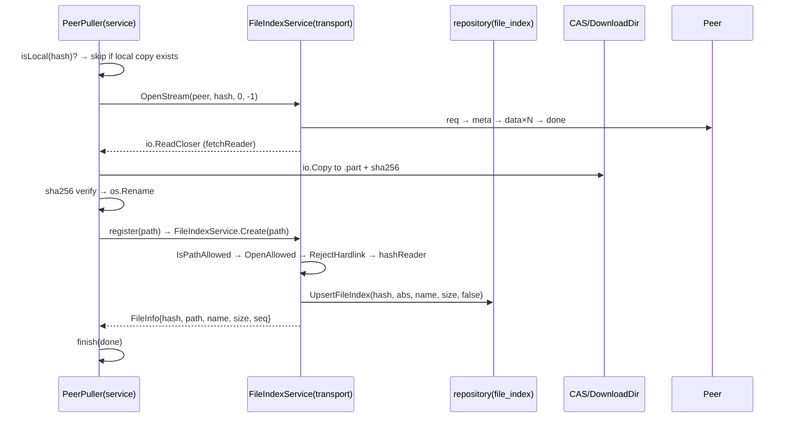
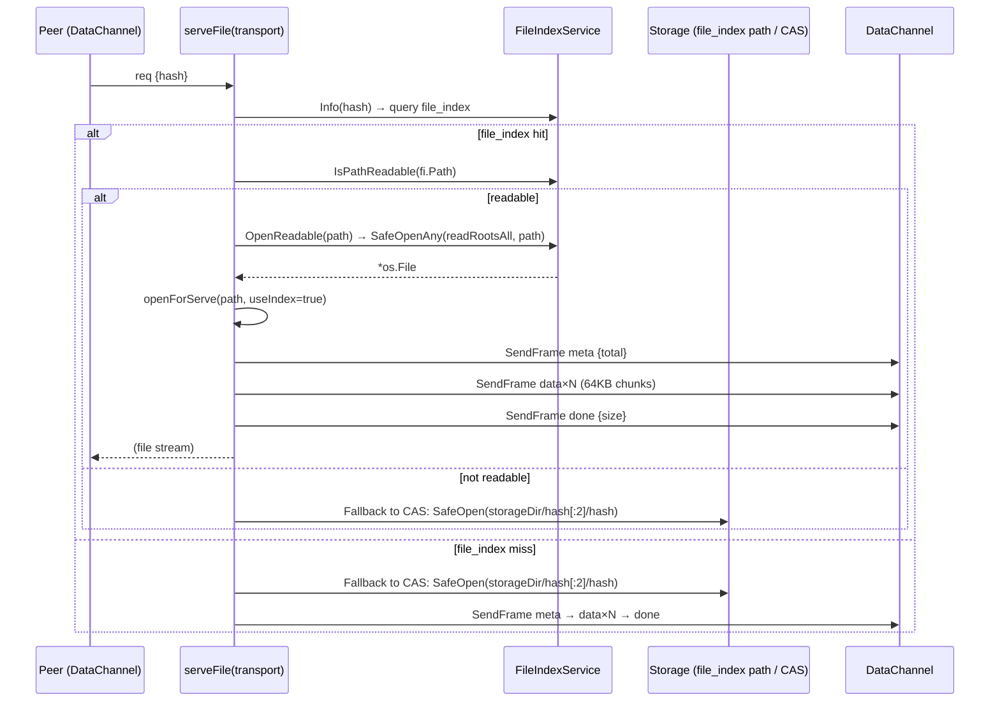
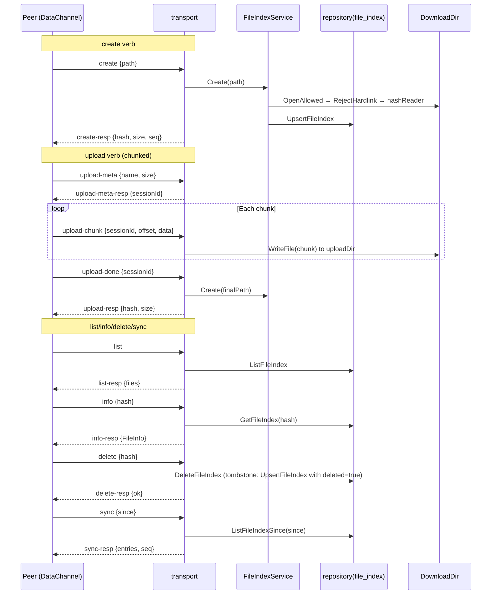
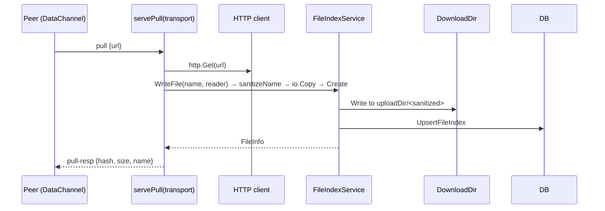

# Connection 11: transport ↔ storage (P2P pull write-to-disk)

- **Modules involved**: `../modules/09-transport.md` and `../modules/03-storage.md` (`file_index` metadata persisted via SQLite through `../modules/02-repository.md`)
- **Code locations**: A side (transport) `back/internal/transport/file_index.go` (`FileIndexService`: dual-track root boundaries + create/upload/list/info/delete/sync six verbs), `back/internal/transport/outbound.go` (outbound `OpenStream`/`fetchReader`, pull-side streaming read + sha256 fallback), `back/internal/transport/inbound.go` (inbound `serveFile`: file_index hit priority + CAS fallback), `back/internal/transport/pull.go` (URL origin pull `servePull`); B side (storage) `back/internal/pathutil/` (`Within`/`SafeOpen`/`RejectHardlink` safety judgment and read open), `back/internal/repository/file_index_repo.go` (`file_index` table + monotonic `seq` transaction); bridge assembly `back/internal/serverapp/app.go:99-108,134-182`, business orchestration `back/internal/service/peerpull.go` (`PeerPuller`: concurrency gate → dedup → `.part` → rename → register)
- **Direction**: Bidirectional. **A→B (pull write-to-disk)**: Pull stream writes to `<DownloadDir>/pulled/…part`, verified then renamed and registered via `FileIndexService.Create` into `file_index`. **B→A (external serving)**: `serveFile` queries `file_index` by hash for path, passes `IsPathReadable` boundary then `SafeOpenAny` reads out, sends back to peer via DataChannel. Both sides share same `file_index`, "save" and "share" are two sides of the same file (`back/internal/service/peerpull.go:18-25`).

## 1. Connection Method

**Channel type: in-process function call + one WebRTC data stream**. Storage is not an independent process, `FileIndexService` is a field of `PeerJSService` (`back/internal/transport/peerjs_service.go:127`), both compile into same binary; cross-node transfer uses DataChannel established by transport (see [07-transport-peerjs.md](07-transport-peerjs.md)), this connection only describes **frame landing and storage surface interaction**.

**A→B three landing points** (by call depth, outer to inner):

1. **Business orchestration bridge (service → transport)**: `PeerPuller` doesn't directly hold `file_index`, but accesses via two injected closures (`back/internal/service/peerpull.go:132-138`) — `isLocal(hash)` checks if local already has same content, `register(path)` registers after disk write. Assembly point `back/internal/serverapp/app.go:167-182`: `SetSource(peerjsSvc)` (pull source = transport's `OpenStream`), `SetFileAccess` two closure bodies call `peerjsSvc.FileIndex().Info(hash)` (:170-173) and `peerjsSvc.FileIndex().Create(path)` (:174-181) respectively. This layer decouples "what business layer wants" from "how storage layer gives", integration tests can replace closures (`back/test/integration/peer_pull_test.go:74-88`).
2. **Disk write → registration (transport)**: `FileIndexService.Create` (`back/internal/transport/file_index.go:205-244`) does four things — `IsPathAllowed` boundary rejects paths outside root (:206-208, `pathutil.Within(s.rootDir, path)`, :72-78); `OpenAllowed` = `pathutil.SafeOpen(s.rootDir, path)` (:135-137, single resolution eliminates TOCTOU, see `back/internal/pathutil/safeopen.go:41-72`); `pathutil.RejectHardlink(path, f)` rejects hardlinks (:227-232, **must pass already-opened handle**, Windows can only get `NumberOfLinks` from handle, `back/internal/pathutil/hardlink.go:20-22`); `hashReader(f)` streams sha256 calculation (:233) then `repository.UpsertFileIndex(h, abs, name, size, false)` (:242). Note :209-213 comment — **open first, then get attributes from fd**, old approach resolved path twice creating TOCTOU window.
3. **URL origin pull disk write (transport → transport)**: `servePull` (`back/internal/transport/pull.go:43-74`) handles peer's `pull` verb, `fetchIntoIndex` (:101-134) HTTP GET then `s.fileIndex.WriteFile(name, &limitedPuller{...})` (:134) writes to uploadDir and reuses `Create` for registration; `WriteFile` (`back/internal/transport/file_index.go:250-278`) streams `io.Copy` to target assembled from `sanitizeName(name)`, write failure/close failure/registration failure all `os.Remove` to recover half-finished product (:264,268,273).

**B→A one read-back path**: `serveFile` (`back/internal/transport/inbound.go:66-184`) queries `s.fileIndex.Info` by `req.Hash` (:109) → if hit then `s.fileIndex.IsPathReadable(fi.Path)` (:113) passes **read boundary** (note: not `IsPathAllowed`: latter only recognizes download directory, when operator sets shared directory outside download directory, using it would judge legitimate files as unauthorized, falling back to non-existent CAS copy, `back/internal/source/local.go:70-80` has same comment) → `openForServe(path, useIndex=true)` (:216-224) → `s.fileIndex.OpenReadable` = `pathutil.SafeOpenAny(readRootsAll, path)` (`back/internal/transport/file_index.go:129-131`). Miss or path unreadable → fallback to content-addressed copy `filepath.Join(storageDir, hash[:2], hash)` (:107,191) using `pathutil.SafeOpen` to open.

**Dual-track root boundaries (most critical design of this connection)**: `FileIndexService` holds two sets of roots simultaneously, and **only adds, never removes**:

- `rootDir` (constructor param = `cfg.DownloadDir`): write boundary. `writeRoots()` always `[rootDir]` (`back/internal/transport/file_index.go:76-82`), `Create`/`WriteFile`/upload sessions all only recognize it. Without this constraint, peer could register any absolute path into index via `create` verb, then read via `req` (H2, :37-40 and :203-204 comments).
- `readRoots` (`AddReadRoot` appends, struct field :39-40): read boundary. `readRootsAll()` = `[rootDir] ∪ readRoots` (:114-123). `IsPathReadable`/`OpenReadable` recognize it (:110,129-131). Two sets **cannot be merged**: roots that allow registration if simultaneously used for reading would allow peer to register then read any file outside download directory.

**Bridge assembly**: `back/internal/serverapp/app.go:99-108,134-182` — `NewFileIndexService(cfg.DownloadDir)` creates `FileIndexService` with `rootDir = cfg.DownloadDir`; `peerjsSvc.FileIndex().AddReadRoot(storageDir)` and loop `AddReadRoot(cfg.ShareDirs...)` append read roots outside write boundary; `share.SetDirHook` callback triggers `AddReadRoot` at runtime for newly shared directories.

**Read/write boundaries of file index**:
- **Write boundary** = only `rootDir` (`uploadDir`, H2 safety boundary) — peer using `create` can only register files here.
- **Read boundary** = `rootDir + readRoots` (`readRoots` appended via `AddReadRoot`) — `PEERDRIVE_SHARE_DIRS` and shared directories added by `NodeShare.SetDirHook` all go here.

Without `AddReadRoot`, you'd get "manifest lists them, peer pulls but read failed" — registration side allows, read side judges unauthorized (`back/internal/serverapp/app.go:99-104` comment). Reading uses `pathutil.SafeOpenAny` (`back/internal/transport/file_index.go:124-131`), delegating path resolution to kernel to avoid TOCTOU window of "validate then open".

## 2. Timing

### 2.1 Normal Path: P2P Pull → Disk Write → Registration

### 2.2 Step-by-step Explanation

1. **Pull initiation**: `PeerPuller.Start` (`peerpull.go:132-138`) calls `isLocal(hash)` closure → `peerjsSvc.FileIndex().Info(hash)` checks if local copy exists; if yes, skip directly (content-addressed dedup, `peerpull.go:308-315`).
2. **Stream fetch**: `PeerPuller` calls `OpenStream(peer, hash, 0, -1)` → transport's `fetchReader` (`outbound.go:127-245`) sends `req` frame, receives `meta`/`data`/`done` frames, returns `io.ReadCloser`.
3. **Disk write**: `PeerPuller.run` (`peerpull.go:297-401`) writes to `.part` file while computing SHA-256; **recomputes SHA-256 before disk write**, mismatch deletes `.part` and sets Failed (`peerpull.go:371-376`).
4. **Atomic rename**: `os.Rename` from `.part` to final name (`peerpull.go:378`) — atomic replacement, crash doesn't leave half-finished product.
5. **Registration**: `register(path)` closure → `peerjsSvc.FileIndex().Create(path)` (`peerpull.go:174-181`) → `FileIndexService.Create` (`file_index.go:205-244`) does four things:
   - `IsPathAllowed` boundary check (`pathutil.Within(s.rootDir, path)`, :72-78)
   - `OpenAllowed` = `pathutil.SafeOpen` (single resolution, eliminates TOCTOU)
   - `pathutil.RejectHardlink` rejects hardlinks (must pass opened handle)
   - `hashReader(f)` streams SHA-256 calculation → `repository.UpsertFileIndex`
6. **Transaction**: `UpsertFileIndex` (`file_index_repo.go:42-68`) uses `DB.Begin()` + `defer tx.Rollback()`: `SELECT COALESCE(MAX(seq),0)+1` gets cursor + `INSERT ... ON CONFLICT DO UPDATE`. Comment: "M10: two steps must be in same transaction, otherwise concurrency yields duplicate seq; SQLite single-writer guarantees monotonicity within transaction."
7. **Finish**: `PeerPuller.finish` (`peerpull.go:466-489`) sets task to Done, idempotent.

### 2.3 Normal Path: serveFile (read from storage)

### 2.4 Step-by-step: serveFile path decision

1. **Query file_index**: `s.fileIndex.Info(hash)` (`inbound.go:109`) — queries `file_index` table for path.
2. **Check read boundary**: `s.fileIndex.IsPathReadable(fi.Path)` (`inbound.go:113`) — checks if path is within `readRootsAll()` (note: not `IsPathAllowed`, which only checks write boundary).
3. **Open via read roots**: `openForServe(path, useIndex=true)` → `s.fileIndex.OpenReadable(path)` → `pathutil.SafeOpenAny(readRootsAll, path)` (`file_index.go:129-131`).
4. **Fallback to CAS**: If file_index miss or path unreadable → `filepath.Join(storageDir, hash[:2], hash)` (`inbound.go:107,191`) → `pathutil.SafeOpen`.
5. **Stream**: `openForServe` returns `io.ReadCloser` + `total` size; `serveFile` sends `meta`/`data`/`done` frames via DataChannel.

### 2.5 Step-by-step: create/upload/list/info/delete/sync verbs

### 2.6 Step-by-step: servePull (URL origin pull)

## 3. Case Handling

| Case | Trigger condition | Handling strategy | Code location |
|---|---|---|---|
| **Timeout** | Pull timeout; URL pull timeout; upload timeout | Pull: `fetchIdleTimeout=5min` (chunk interval, `outbound.go:250`); total size cap `maxPeerFetchSize=8GB` (H6, `outbound.go:115`); URL pull: `pullTimeout=5min` overall (`pull.go:35`); upload: no explicit timeout, relies on DataChannel keepalive. | `outbound.go:250,115`, `pull.go:35` |
| **Disconnect/Reconnect** | DataChannel disconnect during pull; peer disconnect during upload | Pull: `PeerPuller.Cancel` simultaneously `cancel()` and `closer.Close()` (`peerpull.go:273-294`); `fetchReader.Close` → `finish(ErrClosedPipe)`; disk write goes `.part` → `os.Rename` atomic replacement. Upload: upload sessions tracked in `activeUploads` map; `reapUploads` 5min tick cleans 10min idle sessions (`file_index.go:139-172`). | `peerpull.go:273-294`, `outbound.go:382-419`, `file_index.go:139-172` |
| **Duplicate/Concurrent** | Same hash pulled concurrently; concurrent create/upload | Pull: concurrency gate `sem` (max 3, `peerpull.go:57,299-305`); `isLocal` hit skips; `finish` idempotent (`peerpull.go:466-489`); `UpsertFileIndex` uses `ON CONFLICT DO UPDATE` (idempotent). Upload: `WriteFile` uses `sanitizeName(name)` to avoid path traversal; concurrent same-name uploads overwrite (no mutex). | `peerpull.go:57,299-305,466-489`, `file_index_repo.go:54-61` |
| **Data missing or validation failure** | Invalid hash; hash mismatch; exceeds maxPeerFetchSize; path traversal | Hash validation: 64-char hex (`inbound.go:61-63`); SHA-256 mismatch: full requests only, deletes `.part` and returns Failed (`peerpull.go:371-376`); `maxPeerFetchSize=8GB` returns 413 (`outbound.go:115,196-201`); path traversal: `sanitizeName` strips empty segments/`..`/abs prefix/Windows control chars; `targetPath` uses `Join+sanitize+abs+prefix check` double insurance. | `inbound.go:61-63`, `peerpull.go:371-376`, `outbound.go:115,196-201`, `peerpull.go:441-463` |
| **Auth failure** | PSK gate blocks; shareGate denies | `pskGate` runs before inbound verb dispatch (`inbound.go:73-77`); only blocks `servedVerbs` set; local sessions exempt; `shareGate` at `serveFile` step 2 (after hash validation, before trace loop detection). | `inbound.go:73-77`, `share.go:120-123` |
| **Half-open state** | `.part` written halfway; connection disconnect; upload session abandoned | Disk write: `.part` → `os.Rename` atomic replacement (crash doesn't leave half-finished); `persistLocked`/`saveLocked` both use tmp + `os.Rename`; upload sessions: `reapUploads` cleans 10min idle; fetch half-open: `fetchState.done` closed immediately exits read loop. | `peerpull.go:378`, `file_index.go:139-172`, `outbound.go:461-475` |
| **TOCTOU window** | Path resolution race | `OpenAllowed` = `pathutil.SafeOpen` single resolution (eliminates TOCTOU, `file_index.go:135-137`); `RejectHardlink` must pass opened handle (Windows can only get `NumberOfLinks` from handle, `hardlink.go:20-22`); `Delete` in service layer still uses bare `os.Remove` (see connection 10 §3). | `file_index.go:135-137,227-232`, `file_service.go:618-645` |
| **Process restart** | Process killed/restarted | `file_index` seq persists in DB; `MAX(seq)+1` monotonic across restarts; CAS files and SQLite metadata persist; upload sessions lost (in-memory `activeUploads`); `reapUploads` would clean on next startup; P2P `sync` verb continues from upstream seq saved by peer. | `file_index_repo.go:48-52`, `file_index.go:139-172` |

## 4. Related Documents

- Connection documents (same directory):
  - [06-service-transport.md](06-service-transport.md): service-side `PeerPuller` uses `FileIndexService.Create` to register; service doesn't directly hold `file_index`, accesses via injected closures.
  - [07-transport-peerjs.md](07-transport-peerjs.md): DataChannel frame protocol and flow control; this connection's frames use same transport primitives.
  - [04-service-repository.md](04-service-repository.md): `file_index` table structure, `UpsertFileIndex` transaction and seq monotonicity (M10), `ListFileIndexSince` incremental sync and tombstone.
  - [05-router-source.md](05-router-source.md): `LocalSource.resolvePath` and `serveFile` replicate same path decision (file_index priority + `IsPathReadable` + CAS fallback, `back/internal/source/local.go:70-80`); `FileRouter.OpenRange` is `serveFile`'s multi-source routing entry (`back/internal/transport/inbound.go:46-51,93-104`).
  - [09-controller-downloader.md](09-controller-downloader.md): P2P-side file registration/upload also via `FileIndexService.Create`, shares same root boundaries with P2P `create` verb (H2).
- Module documents:
  - `../modules/09-transport.md`: Frame protocol and verb full set (create/upload/list/info/download/sync/pull/req), `FileIndexService` interface, H1/H2/H5/H6 and M6/M7/M10 fixes.
  - `../modules/03-storage.md`: `pathutil` full picture (`Within`/`normalize`/`SafeOpen`/`SafeOpenAny`/write-side `Safe*Any`/`RejectHardlink`/`IsUnsafeRoot`/reserved device names/8.3 short names), content-addressed layout `storage/<hash[:2]>/<hash>`'s six consistency points.
  - `../modules/02-repository.md`: `file_index` table structure, `UpsertFileIndex` transaction seq monotonicity (M10), `ListFileIndexSince` incremental sync and tombstone.
  - `../modules/06-service.md`: `PeerPuller`'s task model (`PullJob`/`PullStatus`/`StartCollection`), concurrency gate and dedup, `.part→rename` atomic disk write and sha256 double verification.
