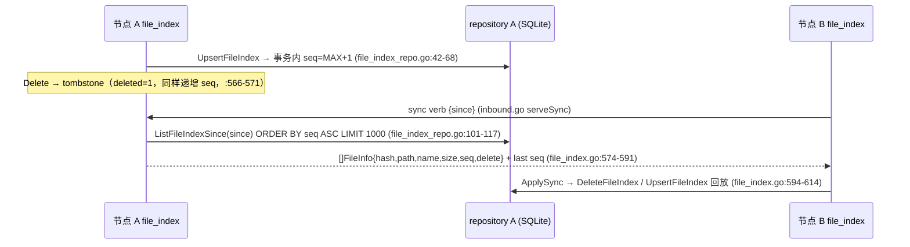

# 连接 11：transport ↔ storage（P2P 拉取落盘）

- **涉及模块**：`../modules/09-transport.md` 与 `../modules/03-storage.md`（`file_index` 元数据经 `../modules/02-repository.md` 的 SQLite 落盘）
- **代码位置**：A 侧（transport）`back/internal/transport/file_index.go`（`FileIndexService`：双轨根边界 + create/upload/list/info/delete/sync 六个 verb）、`back/internal/transport/outbound.go`（出站 `OpenStream`/`fetchReader`，拉取侧流式读 + sha256 兜底）、`back/internal/transport/inbound.go`（入站 `serveFile`：file_index 命中优先 + CAS 回退）、`back/internal/transport/pull.go`（URL 回源拉取 `servePull`）；B 侧（storage）`back/internal/pathutil/`（`Within`/`SafeOpen`/`RejectHardlink` 安全判定与读开口）、`back/internal/repository/file_index_repo.go`（`file_index` 表 + 单调 `seq` 事务）；桥接装配 `back/cmd/server/main.go:99-108,134-182`，业务编排 `back/internal/service/peerpull.go`（`PeerPuller`：并发闸 → 去重 → `.part` → rename → 登记）
- **方向**：双向。**A→B（拉取落盘）**：拉取流写入 `<DownloadDir>/pulled/…part`，校验后 rename 并经 `FileIndexService.Create` 登记进 `file_index`。**B→A（对外服务）**：`serveFile` 按 hash 查 `file_index` 拿路径、过 `IsPathReadable` 边界后 `SafeOpenAny` 读出，经 DataChannel 发回对端。两侧共用同一份 `file_index`，「保存」与「共享」是同一个文件的两面（`back/internal/service/peerpull.go:18-25`）。

## 1. 连接方式

**通道类型：进程内函数调用 + 一条 WebRTC 数据流**。storage 不是独立进程，`FileIndexService` 是 `PeerJSService` 的一个字段（`back/internal/transport/peerjs_service.go:127`），两者编译进同一二进制；跨节点传输走 transport 自己建立的 DataChannel（见 [07-transport-peerjs.md](07-transport-peerjs.md)），本连接只描述**帧落地之后与存储面之间的交互**。

**A→B 三条落点**（按调用深度由外向内）：

1. **业务编排桥（service → transport）**：`PeerPuller` 不直接持有 `file_index`，而是经两个注入闭包访问（`back/internal/service/peerpull.go:132-138`）——`isLocal(hash)` 判本地是否已有同内容、`register(path)` 落盘后登记。装配点 `back/cmd/server/main.go:167-182`：`SetSource(peerjsSvc)`（拉取源=transport 的 `OpenStream`）、`SetFileAccess` 两个闭包体分别调 `peerjsSvc.FileIndex().Info(hash)`（:170-173）与 `peerjsSvc.FileIndex().Create(path)`（:174-181）。这一层把「业务层要什么」与「存储层怎么给」解耦，集成测试可替换闭包（`back/test/integration/peer_pull_test.go:74-88`）。
2. **落盘 → 登记（transport）**：`FileIndexService.Create`（`back/internal/transport/file_index.go:205-244`）做四件事——`IsPathAllowed` 边界拒根外路径（:206-208，`pathutil.Within(s.rootDir, path)`，:72-78）；`OpenAllowed` = `pathutil.SafeOpen(s.rootDir, path)`（:135-137，一次解析消 TOCTOU，见 `back/internal/pathutil/safeopen.go:41-72`）；`pathutil.RejectHardlink(path, f)` 拒硬链接（:227-232，**必须传已打开句柄**，Windows 只能对着句柄拿 `NumberOfLinks`，`back/internal/pathutil/hardlink.go:20-22`）；`hashReader(f)` 流式算 sha256（:233）后 `repository.UpsertFileIndex(h, abs, name, size, false)`（:242）。注意 :209-213 的注释——**先打开、再对 fd 取属性**，旧写法两次解析路径有 TOCTOU 窗口。
3. **URL 回源落盘（transport → transport）**：`servePull`（`back/internal/transport/pull.go:43-74`）处理对端 `pull` verb，`fetchIntoIndex`（:101-134）HTTP GET 后经 `s.fileIndex.WriteFile(name, &limitedPuller{...})`（:134）写入 uploadDir 并复用 `Create` 登记；`WriteFile`（`back/internal/transport/file_index.go:250-278`）流式 `io.Copy` 到 `sanitizeName(name)` 拼出的目标，写失败/关失败/登记失败三处均 `os.Remove` 回收半成品（:264,268,273）。

**B→A 一条回读路径**：`serveFile`（`back/internal/transport/inbound.go:66-184`）按 `req.Hash` 查 `s.fileIndex.Info`（:109）→ 若命中则 `s.fileIndex.IsPathReadable(fi.Path)`（:113）过**读边界**（注意不是 `IsPathAllowed`：后者只认下载目录，运营者把共享目录设在下载目录之外时用它会把正当文件判成越权，回退到不存在的 CAS 副本，`back/internal/source/local.go:70-80` 有同一份注释）→ `openForServe(path, useIndex=true)`（:216-224）→ `s.fileIndex.OpenReadable` = `pathutil.SafeOpenAny(readRootsAll, path)`（`back/internal/transport/file_index.go:129-131`）。未命中或路径不可读 → 回退内容寻址副本 `filepath.Join(storageDir, hash[:2], hash)`（:107,191）用 `pathutil.SafeOpen` 打开。

**双轨根边界（本连接最关键的设计）**：`FileIndexService` 同时持两套根，且**只增不减**：

- `rootDir`（构造参数 = `cfg.DownloadDir`）：写边界。`writeRoots()` 恒为 `[rootDir]`（`back/internal/transport/file_index.go:76-82`），`Create`/`WriteFile`/上传会话都只认它。少了这个约束，对端经 `create` verb 就能把任意绝对路径登记进索引、再经 `req` 读到（H2，:37-40 与 :203-204 注释）。
- `readRoots`（`AddReadRoot` 追加，结构体字段 :39-40）：读边界。`readRootsAll()` = `[rootDir] ∪ readRoots`（:114-123）。`IsPathReadable`/`OpenReadable` 认它（:110,129-131）。两套**不能合并**：登记放行的根如果同时当读根，等于把「可写入」升级成「可共享」。`back/internal/transport/file_index_test.go:178-192` 有对应单测断言「可读 ≠ 可登记」。

**双轨注册：启动批 + 运行时 hook**：

- 启动批（`back/cmd/server/main.go:99-108`）：`peerjsSvc.FileIndex().AddReadRoot(storageDir)` + 遍历 `pathutil.SplitList(cfg.ShareDirs)` 逐个 `AddReadRoot`。少了这一步会出现「共享目录不在下载目录下 → 清单列得出、对端一拉 read failed」（:99-104 注释）。
- 运行时 hook（`back/cmd/server/main.go:134-142`）：`share.SetDirHook(func(dirs []string){ for _, d := range dirs { peerjsSvc.FileIndex().AddReadRoot(d) } })`。运行时新增的共享目录（管理台勾选 / `PUT /peerjs/share`）落 `storageDir/share_scope.json`，环境变量只是首次启动的初值（:131-133 注释）。`AddReadRoot` 本身幂等且线程安全（`sync.RWMutex`，:39-40,85-103；空串/纯空白忽略）。

**拉取侧流式读（不驻留内存）**：`PeerPuller.run` 调 `p.source.OpenStream(peer, hash, 0, -1)`（`back/internal/service/peerpull.go:317-319`）→ `PeerJSService.OpenStream`（`back/internal/transport/outbound.go:120-121`）→ `openStream` 发 `req` 帧并返回 `*fetchReader`（:200-244，`reqID` 用 UUID v4，:201-202；`f.q` 有界队列 8，:205）。`fetchReader.Read`（:290-361）从队列逐 64KB 块消费，`verify = (offset==0 && size<0)` 时边读边喂 sha256（:317-322,332-337）；`finish`（:365-379）EOF 时重算比对，不匹配报 `peerjs: content hash mismatch`。**传输层与落盘层各自独立校验一次**：`fetchReader` 校验「收到的等于 hash」，`PeerPuller` 再校验「写盘的等于 hash」（:368-376）——服务端 `serveFile` 的完整性只在「读回来」时做，落盘这一步必须自己验（:368-370 注释）。

**持久化（B 侧落盘）**：`file_index` 是 SQLite 表，字段 `hash(PK), path, name, size, deleted, seq, created_at, updated_at`（`back/internal/repository/file_index_repo.go:24-36`），外加 `idx_file_index_seq` 索引。**`seq` 在事务内取 `MAX(seq)+1`**（:42-68）：原实现 `SELECT MAX` 与 `INSERT` 分两次，database/sql 连接池并发写会拿到相同 MAX → seq 重复 → sync 游标错乱（M10，:39-41 注释）；现在合并进同一写事务，SQLite 单写者串行保证单调。`ListFileIndex`/`ListFileIndexSince` 都硬上限 1000（:80-81,103），防御远端 `limit`/`since` 触发全表物化内存 DoS。

**容量与上限**：拉取并发 3（`pullConcurrency`，`back/internal/service/peerpull.go:57`，`sem chan struct{}` 计数信号量 :105）、任务表上限 200（`pullMaxJobs` :61，`pruneLocked` 只丢已结束任务 :491-526）；拉取总字节上限 100MB（`pullMaxBytes`，`back/internal/transport/pull.go:32`，超限 `limitedPuller` 返错误而非静默截断 :140-163）；远端声明大小上限 8GB（`maxPeerFetchSize`，`back/internal/transport/outbound.go:115`）；上传单文件上限 8GB（`back/internal/transport/inbound.go:260`）；分片粒度 64KB（`uploadChunkSize`，`back/internal/transport/file_index.go:281`，与 `serveFile` 的 `chunkSize` 对齐 `back/internal/transport/inbound.go:25`）。

**鉴权**：本连接是进程内信任调用，**准入不在此层**——`pull`/`req` 帧的准入由 transport 侧承担（PSK 门禁 `psk.go` + `ShareGate` private 内容只给好友，`back/internal/transport/inbound.go:71-77`，见 [07-transport-peerjs.md](07-transport-peerjs.md) §3）。本层的安全职责是**边界收敛**：写侧 `IsPathAllowed` 限死根目录、读侧 `IsPathReadable` + `SafeOpenAny` 消 TOCTOU 与软链逃逸、`RejectHardlink` 堵链接数 > 1 的旁路。

## 2. 时序

### 2.1 拉取保存全链路（A 持内容 → B 拉取落盘并登记）

```mermaid
sequenceDiagram
  participant PC as PeerPuller (service)
  participant TO as transport A (出站)
  participant TB as transport B (入站 serveFile)
  participant IB as file_index B (storage)
  participant RP as repository B (SQLite)

  PC->>PC: Start(peer,hash,name,relPath) → 建 job → go run (peerpull.go:143-181)
  PC->>PC: sem 抢名额（并发=3，可被 ctx 打断）(peerpull.go:298-305)
  PC->>IB: isLocal(hash) → Info(hash) (peerpull.go:307-315; main.go:170-173)
  IB-->>PC: 命中 → job.Skipped=true, PullDone（去重跳过）
  IB-->>PC: 未命中 → 继续拉取
  PC->>TO: source.OpenStream(peer, hash, 0, -1) (peerpull.go:317-318)
  TO->>TB: SendJSON(req{hash,offset:0,size:-1,reqID}) (outbound.go:234)
  TB->>TB: hash 校验/ShareGate/trace 防环 (inbound.go:66-86)
  TB->>IB: fileIndex.Info(hash) (inbound.go:109)
  IB->>RP: GetFileIndex(hash) (file_index_repo.go:71-75)
  IB-->>TB: FileInfo{Path}
  TB->>TB: IsPathReadable(fi.Path) 读边界判定 (inbound.go:113)
  TB->>TB: openForServe→SafeOpenAny(readRootsAll) (inbound.go:125; file_index.go:129)
  TB-->>TO: meta{total} (inbound.go:156)
  loop 每 64KB
    TB-->>TO: SendFrame(data + 二进制块) (inbound.go:170)
    TO->>TO: fetchReader 边读边喂 sha256 (outbound.go:317-322)
  end
  TB-->>TO: done{size} (inbound.go:184)
  TO->>TO: routeResponse 完整性校验 done.Size==received (outbound.go:471-475)
  TO->>PC: fetchReader.Read → 块 → EOF 时重算 sha256 比对 (outbound.go:365-379)
  PC->>PC: copyWithProgress 写 <root>/pulled/<rel>.part (peerpull.go:343-351,404-435)
  PC->>PC: 二次校验 sum==hash，不等则删 .part + PullFailed (peerpull.go:368-376)
  PC->>PC: os.Rename(.part, target) 原子落正式名 (peerpull.go:377-382)
  PC->>IB: register(target) → Create(target) (peerpull.go:384-395)
  IB->>IB: IsPathAllowed → OpenAllowed → RejectHardlink → hashReader (file_index.go:206-242)
  IB->>RP: UpsertFileIndex(hash,path,name,size) 事务内取 seq (file_index_repo.go:42-68)
  RP-->>IB: seq（单调递增，sync 游标）
  IB-->>PC: FileInfo{Hash,Path,Name,Size,Seq}
  PC->>PC: finish(job, PullDone, "", ended) (peerpull.go:396-400)
```

逐步骤说明（代码依据）：

1. **并发闸与去重**：`run` 先 `select` 抢 `p.sem`（:298-305），被取消则直接 `PullCancelled`；抢到位后第一件事是 `isLocal`（:307-315）——内容寻址的核心红利是同内容不必重复下载，`job.Skipped=true` 后仍报 `PullDone`（前端可区分「跳过」与「下载完成」）。
2. **流式读与两级校验**：`copyWithProgress`（:404-435）64KB buf，`ctx.Err()` 每轮检查使取消即时生效；`job.Total` 在 meta 帧晚到时按块刷新（:420-425）。`fetchReader` 的 sha256 校验（`outbound.go:365-379`）与 `PeerPuller` 的落盘后校验（:368-376）是**两道独立防线**，任一不过都报 `PullFailed` 并删 `.part`。
3. **`.part` → rename 原子落盘**：`tmp := target + ".part"`（:343）与最终文件同目录，保证 `os.Rename` 是同文件系统原子操作——任何中途失败（`cpErr` :353-360、`closeErr` :362-365、hash 不匹配 :372-375、rename 失败 :378-381）都 `os.Remove(tmp)`，**不会留下半截「正式文件」**（:333 注释）。
4. **登记与「已保存未登记」的降级语义**：`register` 失败**不**报 `PullFailed`——文件已在盘上，报失败会把「保存成功」误报成失败，改成 `PullDone` + `Error="saved but not indexed: ..."` 提示（:384-393 注释）。
5. **持久化收尾**：`UpsertFileIndex` 在同一事务内 `SELECT COALESCE(MAX(seq),0)` + `INSERT ... ON CONFLICT DO UPDATE`（`file_index_repo.go:42-68`），返回新 `seq`。此后该文件进入 B 的「我的文件」，且 B 能把它继续 `serveFile` 给第三个节点（端到端断言见 `back/test/integration/peer_pull_test.go:116-121`）。

### 2.2 可读根注册双轨 + file_index 增量同步

```mermaid
sequenceDiagram
  participant M as main (启动装配)
  participant SH as NodeShare (管理台/HTTP)
  participant FI as FileIndexService (transport)
  peerjsSvc.FileIndex().AddReadRoot(d) (main.go:105-108)
  Note over FI: readRoots = [downloadDir] ∪ storageDir ∪ ShareDirs
  SH-->>FI: SetDirHook(dirs)（管理台勾选/PUT /peerjs/share）(main.go:138-142)
  loop 每个新增目录
    SH->>FI: AddReadRoot(d)（幂等+加锁，只增不减）(file_index.go:89-103)
  end
  Note over FI: 运行时新增根立即生效，无需重启
```



## 3. 情况处理

| 异常/边界场景 | 行为与依据（代码位置） | 说明 |
|---|---|---|
| **超时** | 拉取流式读：`fetchIdleTimeout` = 块间隔 5 分钟（`back/internal/transport/outbound.go:247-250`，定时器复用不重建 :294-304），超时 `fetchReader.Read` 报 `peerjs: fetch %s idle timeout`（:353-355）。URL 回源拉取：`pullTimeout` = 5 分钟（`back/internal/transport/pull.go:34-35`）。上传接收：连接级 `pendingUpload` 30s 无数据自动清空，防「发 upload 头不发数据」永久占用槽位（`back/internal/transport/inbound.go:304-311`，M6）。 | 超时语义是「块间隔」而非「总时长」：流式下 8GB 大文件总时长远超 5 分钟，总超时对大文件无意义（`outbound.go:247-249` 注释）；大文件活性由连接保活兜底。 |
| **断连 / 重连** | 拉取侧：`PeerPuller` 用 `OpenStream`（非 `FetchFromPeer`），**无自动重试**——连接中断使 `fetchReader` 报 `peerjs: connection closed` 类错误，任务落 `PullFailed`（`back/internal/service/peerpull.go:317-322,351-360`），已写 `.part` 被 `os.Remove`（:354,363）。对比重试封装：`FetchFromPeer` 才有恒最多 2 次重试（`back/internal/transport/outbound.go:141-181`），且只覆盖「连接去重窗口」这类瞬时错误（`isConnChurnErr` :186-194）。取消路径：`Cancel` 同时 `cancel ctx` **与** `Close` reader（`back/internal/service/peerpull.go:270-294`，:271-272 注释——只 cancel 不够，`Read` 可能正阻塞等下一块）。发送侧：`serveFile` 的写循环在 `c.SendFrame` 报错时退出（`back/internal/transport/inbound.go:164-172`），对端连接死亡由 transport 的 `connectLoop` 重拨（见 [07-transport-peerjs.md](07-transport-peerjs.md) §3）。 | 拉取任务**不做自动续传**：`.part` 每次从头写（`O_TRUNC`，:344），断线重拉代价=已传字节重新传输。断点续传只在**上传**侧有（`UploadSession` 位图按文件名复用，`back/internal/transport/file_index.go:283-307` 注释）。 |
| **重复 / 并发** | 内容去重：`isLocal(hash)` 命中即跳过，`job.Skipped=true` 仍报 `PullDone`（`back/internal/service/peerpull.go:307-315`）——内容寻址下同 hash 全局唯一，跳过后该文件仍可被 `serveFile` 服务。并发闸：`sem chan struct{}` 容量 3（:57,105），`run` 开头 `select` 抢名额可被 `ctx.Done()` 打断（:298-305）。任务表：`pullMaxJobs`=200，超限 `pruneLocked` 丢弃最老的**已结束**任务、运行中的永不丢（:61,491-526）。同名目标：`targetPath` 只做路径清洗与根内断言（:441-463），**无冲突后缀逻辑**——`os.Rename` 对已存在同名文件的行为是覆盖（**未逐一核实**，代码中未见 `-2/-3` 后缀处理）。索引侧幂等：`UpsertFileIndex` 用 `ON CONFLICT(hash) DO UPDATE`（`back/internal/repository/file_index_repo.go:54-60`），重复登记不报错、只更新 seq。分片幂等：`setBit` 已置位不重复计数（`back/internal/transport/file_index.go:501-518`）；`done=true` 后重复 `Complete` 直接返回缓存的 `doneInfo`（赋值 :468-471，字段语义 :302-303）。 | 「同内容」与「同名文件」是两回事：前者靠 hash 去重（安全），后者靠文件名（有覆盖风险）。`sanitizeRelPath`（:528-558）只保证不逃逸，不保证不撞名。 |
| **数据缺失或校验失败** | 三重校验：① 声明上限——meta `total` / data `size` > 8GB 直接 `failFetch`（`back/internal/transport/outbound.go:112-115,448-458`）；② 字节数——`done.Size` 必须等于已收字节，不等报 `incomplete transfer`（:471-475，防对端提前 `done` 把截断文件当成功）；③ 哈希——`fetchReader.finish` EOF 时重算 sha256 比对（:365-379），`PeerPuller` 落盘后再算一次（`back/internal/service/peerpull.go:368-376`）。路径越界：`Create` 的 `IsPathAllowed` 拒绝根外路径（`back/internal/transport/file_index.go:206-208`），登记失败时 `WriteFile` 已写的文件被 `os.Remove`（:273-275）。URL 回源：`guardPullURL` 只放 http/https、拒用户信息串、DNS 解析后逐 IP 过 SSRF 判定（`back/internal/transport/pull.go:167-200+`），重定向由 `CheckRedirect` 逐跳重新校验（:101-134 区间）；`limitedPuller` 超限返回**错误**而非截断（:140-163），避免静默得到半份文件。hash 字面校验一律 `hashutil.IsStrictSHA256`（`Info` `file_index.go:543-545`、`serveFile` `inbound.go:67`）。 | 「服务端声明的字节数」与「客户端实际收到的字节数」分居两端校验；哈希校验放在**落盘前后各一次**，因为 `serveFile` 的完整性只在读回时做（`peerpull.go:368-370` 注释）。 |
| **鉴权失败** | 本连接是进程内调用，**没有独立的鉴权层**——准入在 transport 侧：`req` 帧先过 `pskGate`（未出示密钥回 `PSK_REQUIRED`）与 `ShareGate`（private 内容只给好友，`back/internal/transport/inbound.go:71-77`）。本层承担的是**边界收敛**：写侧只认 `rootDir`（`file_index.go:72-82`，对端经 `create` 无法登记根外路径 :206-208）；读侧 `IsPathReadable` 用 `readRootsAll`（:110-123），历史库残留的根外 `Path` 在 `list/info/sync` 出口被 `redactDisallowedPath` 脱敏为空（`back/internal/transport/inbound.go:230-238`）；`serveFile` 判不可读则回退 CAS 副本（:107-115）。硬链接：`RejectHardlink` 拒链接数 > 1（`back/internal/transport/file_index.go:227-232`，`back/internal/pathutil/hardlink.go:37-52`）——路径判定看不出硬链接，只能数链接数（宁可少给）。 | 三层边界必须**完全一致**，否则出现「登记放行、清单列得出、唯独读取判越权 → 对端 read failed」的经典组合错误（`back/internal/pathutil/path.go:1-19` 包注释）。 |
| **半开状态** | `.part` 文件：所有失败分支都 `os.Remove(tmp)`（`back/internal/service/peerpull.go:354,363,373,379`），正常路径 rename 后不留 `.part`（:378）。**进程崩溃/被杀时 `.part` 会残留**：全仓仅 `peerpull.go:343` 一处生成 `.part`，未见启动期清扫逻辑（**未核实为设计缺口还是有意留待人工清理**）。上传会话半开：`UploadSession`（`back/internal/transport/file_index.go:283-307`）带 `last` 活动时间，`reapUploads` 每 5 分钟 tick、10 分钟空闲即 `Abort` 删目标文件（:139-172）；`aborted=true` 后 `WriteAt`/`Complete` 见之即错（:301，M7 竞态修复），`Abort` 幂等且**已完成的文件不删**（:475-490）。已登记文件的保护：`Complete` 里句柄置 nil 交调用方锁外关闭、置 `done`/`doneInfo`（:468-471，字段语义见 :302-303），避免 reap 与完成竞态删掉正在对外服务的文件。 | 拉取侧 `.part` 的清理是**同步失败分支内**的，没有独立 reap 协程；上传侧有完整 reap。两侧生命周期管理不对称。 |
| **进程重启** | 持久化：**`file_index` 表在 SQLite，重启后保留**（`back/internal/repository/file_index_repo.go:24-36`，DB 路径 `cfg.DBPath`，默认 `./peerdrive.db`）；哈希→绝对路径映射、单调 `seq`、tombstone 全都在。落盘文件：`<DownloadDir>/pulled/…` 在磁盘上，重启不动。**易失部分**：① `PeerPuller.jobs/cancels/closers` 全在内存 map（`back/internal/service/peerpull.go:97-113`），重启即丢——进行中的任务状态、取消句柄全消失，前端「传输」页清空（**未核实是否有任务持久化**）；② `FileIndexService.readRoots` 是内存 slice（`file_index.go:39-40`），重启后需**重新**走启动批 `AddReadRoot`（`back/cmd/server/main.go:105-108`）才恢复读边界——这就是为什么双轨注册必须是启动批而非只有运行时 hook；③ `UploadSession` 位图在内存，但注释说明进程重启后按文件大小重建位图 `[0,min(size,fsize)]` 视为已写、不精确由最终 sha256 兜底（:286-288）。优雅关停：`FileIndexService.Close`（:179-186）关 reap ticker；对端视角=一次断连重连（见 [07-transport-peerjs.md](07-transport-peerjs.md) §3「进程重启」）。 | 持久化边界清晰：**索引（SQLite）与文件（磁盘）持久，任务状态与读根内存态**。读根内存态靠启动批补齐，若某共享目录只在运行时经管理台加过、又没落 `share_scope.json`，重启后就丢了——但 `share_scope.json` 正是为此存在（`main.go:131-133` 注释）。 |
| **路径越界 / 穿越** | `sanitizeRelPath`（`back/internal/service/peerpull.go:528-558`）：统一分隔符 → 丢空段/`.`/`..`/绝对前缀 → 段内去控制字符、Windows 保留字符替 `_`；返回空串则 `targetPath` 回退 `name` → 再回退 `hash[:12]`（:442-448）。双保险：`targetPath` 在清洗后仍用 `filepath.Abs` 断言落在 `<root>/pulled/` 内（:449-461），逃逸报 `unsafe target path`。文件名字面净化：`sanitizeName` 拒 `""`/`.`/`..`/`/`/`\`（含 Windows 上 `Base("/")` 返回 `\` 的真机坑，`back/internal/transport/file_index.go:637-650`）。读开口：`SafeOpen` 先 normalize（Abs+Clean+尽力解析软链）再 `os.Root.Open` 逐段 `O_NOFOLLOW`（`back/internal/pathutil/safeopen.go:3-24,41-72`），任何会逃出根的软链在 open 时就失败。NUL 字节与 Windows 保留设备名在 `normalize` 层直接拒（`back/internal/pathutil/path.go:136-147`）。 | 「字符串层判定」与「内核层解析」分工：`Within` 负责语义包含判定（`path.go:85-113`），`SafeOpen` 负责无窗口打开；两者不能只留一个——前者会被字符串技巧绕过，后者会被 TOCTOU 窗口绕过。 |

## 4. 相关文档

- 连接文档（同目录）：
  - [07-transport-peerjs.md](07-transport-peerjs.md)：本连接的**传输底座**——`OpenStream`/`fetchReader` 的 req/meta/data/done 帧往返、DataChannel 流控、PSK 门禁、连接级去重与重连。本连接只描述帧落地后与存储面的交互。
  - [06-service-transport.md](06-service-transport.md)：上游装配——`PeerPuller.SetSource(peerjsSvc)` 把 transport 注入为拉取源（`back/cmd/server/main.go:167-168`），`SetPeerPuller` 交给 controller 供前端「保存」触发（:182）。
  - [09-controller-downloader.md](09-controller-downloader.md)：另一条落盘链路（HTTP 下载器）；本连接是 P2P 拉取链路，两者共享 `pathutil` 安全边界与内容寻址布局。
  - [10-controller-storage.md](10-controller-storage.md)：HTTP 侧的文件登记/上传同样经 `FileIndexService.Create`，与 P2P `create` verb 共用同一套根边界（H2）。
  - [05-router-source.md](05-router-source.md)：`LocalSource.resolvePath` 与 `serveFile` 复刻同一份路径决策（file_index 优先 + `IsPathReadable` + CAS 回退，`back/internal/source/local.go:70-80`）；`FileRouter.OpenRange` 是 `serveFile` 的多源路由口（`back/internal/transport/inbound.go:46-51,93-104`）。
- 模块文档：
  - `../modules/09-transport.md`：帧协议与 verb 全集（create/upload/list/info/download/sync/pull/req）、`FileIndexService` 接口、H1/H2/H5/H6 与 M6/M7/M10 修复。
  - `../modules/03-storage.md`：`pathutil` 全貌（`Within`/`normalize`/`SafeOpen`/`SafeOpenAny`/写侧 `Safe*Any`/`RejectHardlink`/`IsUnsafeRoot`/保留设备名/8.3 短名）、内容寻址布局 `storage/<hash[:2]>/<hash>` 的六处一致性。
  - `../modules/02-repository.md`：`file_index` 表结构、`UpsertFileIndex` 事务内 seq 单调性（M10）、`ListFileIndexSince` 增量同步与 tombstone。
  - `../modules/06-service.md`：`PeerPuller` 的任务模型（`PullJob`/`PullStatus`/`StartCollection`）、并发闸与去重、`.part→rename` 原子落盘与 sha256 双校验。
