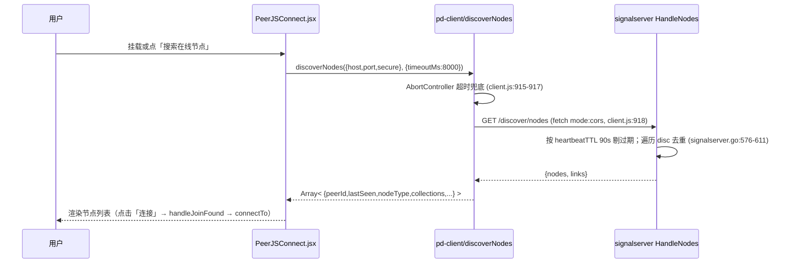
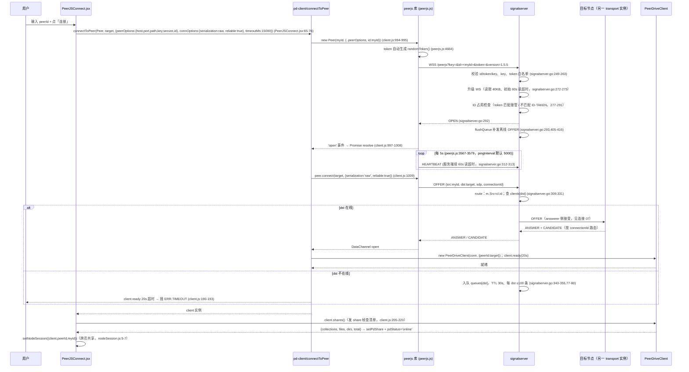

# 连接 12：frontend ↔ signalserver（消费端拨号）

- **涉及模块**：`../modules/13-frontend.md` 与 `../modules/11-signalserver.md`
- **代码位置**：A 侧 `front/src/lib/PeerJSConnect.jsx`（UI 组件 + `DEFAULT_SIG` + `connectTo`/`handleSearch`）与 `front/src/lib/pd-client/`（`connectToPeer` `client.js:987-1022`、`discoverNodes` `client.js:907-935`、`PeerDriveClient` 状态机 `client.js:121-...`、帧协议 `protocol.js:3-24`）；B 侧 `back/signalserver/signalserver.go`（`HandleWS` `:246-296`、`readLoop`/`route` `:298-356`、`HandleNodes` `:568-638`）
- **方向**：A→B 为主，分两条面：**信令面**（A 发起 WS 拨号 → B 转发 OFFER/ANSWER/CANDIDATE/HEARTBEAT → A 拿到 DataChannel 后转 P2P 与 B 解耦）；**发现面**（A→B 单次 HTTP `GET /discover/nodes`，B 回在线节点列表）。B→A 仅在 `handleDeadDst`/`removeClient` 广播 LEAVE 时发生（`signalserver.go:388-401, 426-446`），视为双向。

## 1. 连接方式

本连接是「一条信令 WS + 一条发现 HTTP」的叠加，**均由 A 侧（消费端浏览器）主动建立**，B 侧被动受理。与连接 08（transport↔signalserver）的差别：本连接 A 侧用**官方 peerjs 浏览器库**（不是 `back/peerjs` 的 go-peerjs 库），帧协议同构但实现独立，且**只拨号、不发 announce**。

### 1.1 信令面（消费端按 peer id 拨号）——WebSocket，PeerJS 兼容协议

- **通道**：`PeerJSConnect.jsx:58-88` 的 `connectTo(peerId)` 调 `connectToPeer(Peer, target, {peerOptions, connOptions, timeoutMs:15000})`（`PeerJSConnect.jsx:65-76`）；`connectToPeer`（`client.js:987-1022`）在浏览器内 `new Peer(myId, {...peerOptions, id: myId})` 建 PeerJS 客户端，等 `open` 事件后 `peer.connect(targetId, {serialization:'raw', reliable:true, ...connOptions})` 建出 DataConnection，再包一层 `PeerDriveClient`。B 侧 `HandleWS` 受理（`signalserver.go:246-296`）。
- **URL/参数**：`wss://{host}:{port}/{path}peerjs?key=&id=&token=&version=1.5.5`（`peerjs.js:3535-3541`，`version` 来自 `peerjs.js:3543`）。`host/port/path/key` 默认 `DEFAULT_SIG = {host:'peersignal.moonchan.xyz', port:443, path:'/', key:'pd-signal-b9447b406828e500', secure:true}`（`PeerJSConnect.jsx:11-17`），UI 上三个字段可覆写（`PeerJSConnect.jsx:144-157`），空串回落默认（`PeerJSConnect.jsx:67,68,70`）。**`id` 走 `getStableMyId()`**（`PeerJSConnect.jsx:19-31`）——localStorage `peerdrive.panel.v1` 里持久化，没有才生成 `pd-<ts36>-<rand6>`；这样重开面板身份不变，对端可识别为同一 peer。**`token` 由 peerjs 库自动生成**（`peerjs.js:4664` `randomToken()`），A 侧不透传——因为公共部署白名单为空（默认不限制），白名单只用于自托管可信节点（`signalserver.go:57-64`）。
- **协议帧**：与连接 08 完全一致——`{type, src, dst, payload}` 文本 JSON，服务端**覆盖 src** 为连接者 id（`signalserver.go:309`）；类型 `OPEN/LEAVE/OFFER/ANSWER/CANDIDATE/EXPIRE/HEARTBEAT/ID-TAKEN/ERROR`（`peerjs.js:3516-3527`）。本连接在信令面**只承载 WebRTC 握手**：DataChannel open 后 `PeerDriveClient` 直接在其上跑 peerdrive 帧协议（`protocol.js:3-24`），不再回信令。
- **鉴权**：三把锁在 B 侧 `HandleWS` 依次校验（`signalserver.go:249-263`）——① 缺 `id/token/key` 任一 → HTTP 400；② `key != s.key` → 400（消费端传 `DEFAULT_SIG.key` 或 UI 覆写值）；③ token 白名单启用（自托管部署配 `-tokens`）且 token 不在名单 → 400。公共部署白名单为空即不限制。**注意**：A 侧 token 是随机数（`peerjs.js:4664`），因此**消费端不能通过自托管信令的 token 白名单**——公共部署或把消费端 token 也加入名单才能用（`signalserver.go:62-64` 的「白名单只约束信令面」注释隐含这一点）。
- **建立时机**：两条路径都会触发——① 挂载即自动搜索 → 用户点搜索结果里的「连接」按钮（`PeerJSConnect.jsx:119-120, 123-128`）；② 用户手输 target peer id 后点「连接」（`PeerJSConnect.jsx:90, 198-199`）。信令 WS 断开**不由前端主动重连**——peerjs 库内部有 `_scheduleHeartbeat` 循环（`peerjs.js:3567-3579`），但 `_disconnected` 后 send 静默丢弃，前端**只能由用户重新点连接**（`PeerJSConnect.jsx` 全文无 reconnect；错误态见 `PeerJSConnect.jsx:84-87`）。

### 1.2 发现面（discoverNodes 查询在线节点）——HTTP REST，公开无鉴权

- **通道**：`PeerJSConnect.jsx:101-117` 的 `handleSearch` 调 `discoverNodes({host,port,secure}, {timeoutMs:8000})`（`client.js:907-935`）→ B 侧 `HandleNodes`（`signalserver.go:568-638`）。
- **接口**：`GET {scheme}://{host}:{port}/discover/nodes?coll=<hash>`——`coll` 空表示返回所有 collection 的节点（`signalserver.go:581-611`）；回 `{nodes:[{peerId,lastSeen,nodeType,collections,uptime,loadInfo}], links:[{source,target,lastSeen}]}`。
- **A 侧调用特点**：**消费端不 announce**（`PeerJSConnect.jsx` 全文无 `/discover/announce` 调用），只消费 B 侧节点端的 announce 结果——因此发现列表里**看不到消费端自己**，只能看到已 announce 的 go-persistent 节点（连接 08 §2.2 的 announce 循环）。挂载即自动触发一次搜索（`PeerJSConnect.jsx:119-120`），按钮留给手动刷新（`PeerJSConnect.jsx:163-167`）。
- **鉴权/CORS**：发现端**公开、不鉴权**；所有 REST 端点经 `allowCORS` 全放开 `Access-Control-Allow-Origin: *` 并短路 OPTIONS 预检（`signalserver.go:209-234`）。**这条全放开就是为了 A 侧的公共静态面板**——面板在 `file://` 时 origin 是 `null`、托管到 Pages/CDN 时又是另一个域，`GET /discover/nodes` 与 peerjs 库自动调的 `GET /peerjs/id` 都必然跨域（`signalserver.go:211-218` 的注释、`client.js:898-902` 与 `client.js:963-979` 的注释都点破了这一点）。

## 2. 时序

### 2.1 发现面：搜索在线节点

**逐步骤说明**：

1. **触发**：`PeerJSConnect.jsx:119-120` 的 `useEffect(() => { handleSearch(); }, [])` 挂载即自动搜索一次；按钮（`PeerJSConnect.jsx:163-167`）留给手动刷新，`disabled={searchStatus==='searching'}` 防重复点击。
2. **fetch**：`discoverNodes`（`client.js:907-935`）拼 URL：`https://{host}:{port||443}/discover/nodes`；`secure===false` 时用 `http`/`80`；`opts.coll` 非空追加 `?coll=<hash>`（消费端目前传空 coll，返回全房间，`PeerJSConnect.jsx:106-108`）。`AbortController` + `setTimeout(timeoutMs)` 硬超时（`client.js:915-917`），默认 8000ms（`client.js:912`）。
3. **服务端筛选**：`HandleNodes`（`signalserver.go:568-638`）——`heartbeatTTL=90s`（`signalserver.go:194`）cutoff 剔除过期节点；`type` 过滤可选；空 coll 时遍历所有 collection 去重收集（`signalserver.go:597-611`）；再收 graph 边（两端都活跃的边、字典序去重，`signalserver.go:612-634`）。
4. **回显**：UI 渲染 `foundNodes`（`PeerJSConnect.jsx:173-188`）：每行显示 `peerId / nodeType / collections 数量`，点「连接」→ `handleJoinFound(n.peerId)` → `connectTo(peerId)`（`PeerJSConnect.jsx:123-128`）。
5. **CORS 兜底**：CORS 失败在浏览器里只表现为 `TypeError` 且无状态码，`discoverNodes` 单独包一句明确提示并附 origin（`client.js:926-931`）——用户能一眼看出是信令未开 CORS，而不是「信令挂了」。

### 2.2 信令面：按 peer id 拨号并拿到 DataChannel

**逐步骤说明**：

1. **入口**：`handleConnect`（`PeerJSConnect.jsx:90`）或 `handleJoinFound`（`PeerJSConnect.jsx:123-128`）→ `connectTo(target)`（`PeerJSConnect.jsx:58-88`）；把 UI 上的 `sigHost/sigPort/sigKey` 与 `DEFAULT_SIG` 合并（UI 值优先、空串回落默认，`PeerJSConnect.jsx:67-71`），`id: myIdRef.current` 用稳定本机 id。
2. **PeerJS 客户端建立**：`connectToPeer`（`client.js:987-1022`）在浏览器内 `new PeerCtor(myId, {...peerOptions, id: myId})`（`client.js:994-995`）——**id 走位置参数**（`client.js:991-993` 的注释）：`peerjs@1.5.5` 会把 `options.id` 忽略（照样发 `GET /id`），只有 `new Peer(id, opts)` 才认；两个位置都给是为了兼容。等 `open` 事件（Promise.resolve）或 `error` 事件（Promise.reject，错误码 `ERR.CLOSED`，`client.js:997-1008`）。
3. **WS 建链与 id**：peerjs 库在 `start(id, token)`（`peerjs.js:3535-3541`）拼 `wss://host:port/path peerjs?key=&id=&token=&version=1.5.5`；token 由 `randomToken()` 生成（`peerjs.js:4664`）；`socket.onopen` 触发后 `_scheduleHeartbeat()` 起 5s 心跳（`peerjs.js:3567-3579`）。**消费端自带 id 时**（本例传了 `myIdRef.current`）peerjs 会跳过 `GET /peerjs/id` 随机 id 请求——`randomPeerId` 兜底（`client.js:980-985`）只在 `peerOptions.id` 缺省时用；这个跳过是**关键优化**，因为 `GET /id` 在 `file://` origin 下必然跨域（`client.js:963-979` 的注释专门讲这一坑）。
4. **服务端受理**：`HandleWS`（`signalserver.go:246-296`）——① 缺 `id/token/key` 任一 → 400（`signalserver.go:250-253`）；② `key` 不匹配 → 400（`signalserver.go:254-257`）；③ token 白名单启用且不在名单 → 400（`signalserver.go:258-263`）；④ 升级 WS，读限 40KB、初始 60s 读超时（`signalserver.go:272-275`）；⑤ **ID 占用检查**：同 id 已在线且 token 匹配 → 关旧连接接管；不匹配 → 回 `ID-TAKEN` 并关闭（`signalserver.go:277-291`）；⑥ 注册 `clients[id]`、回 `OPEN`、`flushQueue` 补发离线消息、起 `readLoop`（`signalserver.go:288-295`）。
5. **心跳保活**：peerjs 库 5s 一轮 `_scheduleHeartbeat`（`peerjs.js:3567-3579`），发送 `{type:'HEARTBEAT'}`；服务端 `readLoop` 收到任意消息都更新 `cl.last` 并续 60s 读超时（`signalserver.go:309-314`）。**A 侧不需要主动管理心跳**——全由 peerjs 库管，前端只感知 `peer.on('open'/'error'/'connection'/'disconnected')`。
6. **拨号与房间转发**：`peer.connect(targetId, {serialization:'raw', reliable:true})`（`client.js:1009`）——**serialization:'raw' 是硬约束**（`client.js:958-961`）：只有 raw 模式下 string 走文本帧、ArrayBuffer 走二进制帧，才能复刻 Go 侧「文本帧=JSON 头 / 二进制帧=数据块」的语义（`protocol.js:16-24`）。发起侧发 `OFFER`，服务端 `route`（`signalserver.go:329-356`）——先 `m.Src = cl.id`（309），出锁后 `dst.send`（333-334，10s 写超时兜底），失败走 `handleDeadDst`；不在线则入队（TTL 30s、每 dst ≤100，`signalserver.go:343-355,77-80`）。目标节点作为 answerer 走连接 07 的 `onIncomingConnection` → `bindConn`，回 ANSWER + CANDIDATE，最终 DataChannel open。
7. **就绪与本机身份**：`client.ready(opts.openTimeoutMs)`（`client.js:1012`；实现 `client.js:183-196`）等连接就绪——**注意**：`PeerJSConnect.jsx:75` 传的是 `timeoutMs:15000`，但 `connectToPeer` 只读 `opts.openTimeoutMs`（`client.js:1012`），该字段未传则回落 `DEFAULTS.openTimeoutMs = 20000`（`client.js:67-74`）——因此**实际生效的拨号超时是 20s 而非 15s**（未修 bug，见 §3「超时」行）。就绪后 `client._ownedPeer = peer`（`client.js:1011`）供 `localPeerId` getter 取「我是谁」（`client.js:178-180`，注释解释 `DataConnection.peer` 是**远端**不是自己）。
8. **拉清单**：`client.shares()`（`client.js:205-220`）发 `share` 帧，服务端回 `share-resp`（结构见 `protocol.js:10-11`）——`PeerDriveClient` 整理成 `{peerId, collections, files, dirs, total}` 返回。**空清单是合法结果**（对方没开共享），UI 显示「该节点没有共享内容」（`PeerJSConnect.jsx:266-268`）。
9. **会话落地**：`setNodeSession({client, peerId:target, myId:myIdRef.current})`（`PeerJSConnect.jsx:82`；`nodeSession.js:5-7`）——供节点控制页跨页共享；`onConnected?.(client, target)`（`PeerJSConnect.jsx:83`）触发「连接成功跳转」回调（`PeerJSConnect.jsx:33`）。

### 2.3 消费端 → 节点数据面（延伸说明，非本连接时序）

DataChannel open 后，`PeerDriveClient` 在**直连 WebRTC DataChannel** 上跑 peerdrive 帧协议（`protocol.js:3-24`、`client.js:19-37` 的注释「本包不认识 PeerJS」）：`psk-auth`（若对端开了 PSK 门禁，`protocol.js:65-79`）→ `share`（清单元数据）→ `req`/`data`/`done`（文件拉取）→ `upload`/`meta`/`uploaded`（上传）。**这些帧不再经过 signalserver**——本连接在时序上到 DataChannel open 就结束了。

## 3. 情况处理

| 异常/边界场景 | 行为与依据（代码位置） | 说明 |
|---|---|---|
| **超时** | ① 拨号总超时：`PeerJSConnect.jsx:75` 传 `timeoutMs:15000`，但 `connectToPeer` 只读 `opts.openTimeoutMs`（`client.js:1012`），未传则回落 `DEFAULTS.openTimeoutMs=20000`（`client.js:71`）——**实际生效是 20s，15s 是死参数**；超时抛 `PeerDriveError('连接未在 <t>ms 内建立', ERR.TIMEOUT)`（`client.js:190-193`）。② 发现请求 8s 硬超时：`AbortController + setTimeout` 中止 fetch（`client.js:912-917`），默认 8000ms。③ 服务端读超时：WS 初始 60s、每消息续期（`signalserver.go:272-275,312-313`），客户端 5s HEARTBEAT 续命（`peerjs.js:3567-3579`）；写超时服务端 10s（`signalserver.go:777`）。④ 帧级超时（数据面同源、非本连接）：`verbTimeoutMs=15000`、`idleTimeoutMs=120000`（`client.js:67-74`）。 | 拨号超时会同时触发 peerjs 库自身 `error` 事件与 `client.ready` 超时——两条路径都能把用户从「连接中」拉回错误态。`timeoutMs:15000` 的失效是**已知 bug**，改 `PeerJSConnect.jsx:75` 为 `openTimeoutMs:15000` 即可生效。 |
| **断连 / 重连** | ① 信令 WS 断：peerjs 库 `socket.onclose` 触发 `_cleanup()`、置 `_disconnected=true`、emit `Disconnected`（`peerjs.js:3551-3558`）；前端**没有自动重连逻辑**——`PeerJSConnect.jsx` 全文无 `reconnect`，`peer.on('error')` 只在 `connectToPeer` 内部一次就 `off`（`client.js:997-1008`），UI 只能显示错误态由用户重连。② DataChannel 断：`conn.on('close')` → `PeerDriveClient` 触发所有 pending request reject（`client.js:143-149` 的 `_closeErr` 路径、`client.js:190-193` 的 ready 超时兜底）。③ 服务端 → 客户端：`removeClient` 断开时向其余节点广播 `LEAVE`（`signalserver.go:418-447`），收方 peerjs 库按 `connectionId` 关掉对应 Connection。 | 消费端不像节点端有 `startLoop`/`connectLoop` 退避重连（连接 08 §2.1）——因为消费端是**按用户意图一次性拨号**的交互型客户端，没有「要一直连着 N 个节点」的稳态需求；断连后由用户重新点连接即可。 |
| **重复 / 并发** | ① 同 id 双连（多标签页 / 重开面板）：`myIdRef.current` 从 localStorage 取稳定 id（`PeerJSConnect.jsx:19-31`），B 侧 `HandleWS` 的 ID 占用检查——token 匹配则关旧连接接管（消费端每次 token 都是新随机数，**token 永不匹配**，所以必然是 `ID-TAKEN`）（`signalserver.go:277-291`）。② 并发搜索：`handleSearch` 无锁，`disabled={searchStatus==='searching'}` 禁用按钮防重复点击（`PeerJSConnect.jsx:164-167`）；已搜完后再点会发新 fetch 覆盖 `foundNodes`。③ 并发拨号：`connectTo` 每次 `setPdClient(client)` 覆盖旧实例但**不关闭旧连接**（`PeerJSConnect.jsx:77`）——用户切目标时旧 DataChannel 仍活着，需要手动点「断开」（`PeerJSConnect.jsx:200-203`）；这是**已知坑**（无自动清理）。④ 服务端并发写：`client.sendMu` 串行化（`signalserver.go:167,774-779`），路由出锁后写防持锁卡死（`signalserver.go:327-334`）。 | 双连的 `ID-TAKEN` 是消费端特有的表现：因为 token 每次都随机，多标签页打开同一面板会互相「踢」，用户体验是「刚连上就被断了」。 |
| **数据缺失或校验失败** | ① 拨号目标空：`connectTo` 入口 `if (!target) return`（`PeerJSConnect.jsx:59-60`）；「连接」按钮 `disabled={!targetPeerId.trim()}`（`PeerJSConnect.jsx:198`）。② WS 缺 `id/token/key`、key 不符 → 服务端 400 拒升级（`signalserver.go:249-263`），peerjs 库把错误转为 `peer.on('error')` → `connectToPeer` 抛 `ERR.CLOSED`（`client.js:1002-1005`）。③ 发现响应异常：`!res.ok` → `PeerDriveError('发现服务返回 HTTP <status>', ERR.PEER)`（`client.js:918-919`）；非数组返回 → 空数组（`client.js:921`）；解码异常 → CORS 提示（`client.js:922-931`）。④ 帧异常：`parseFrame` 遇非 JSON 或缺 type 返 `null`（`protocol.js:111-120`）——静默忽略而非报错（注释：同连接可能有别的用途的帧）；`shares()` 只校验 `frame.type === 'share-resp'`（`client.js:207-210`）；`sha256Hex` 校验失败回 `ERR.HASH_MISMATCH`（`client.js:46`）。⑤ 服务端防御（与消费端无关但同源）：announce body > 8KB 或 collections > 64 → 400（`signalserver.go:457,469-473`）；WS 读限 40KB（`signalserver.go:272`）。 | 消费端帧校验很「宽容」——`parseFrame` 忽略非法帧，这是为了让同一连接能承载 peerjs 库的其它内部消息。 |
| **鉴权失败** | 信令面：key 不符或 token 不在白名单 → 服务端 400 拒升级（`signalserver.go:254-263`），peerjs 库把错误转为 `peer.on('error')` → `connectToPeer` 抛 `ERR.CLOSED`（`client.js:1002-1005`）。ID 被占且 token 不匹配 → `ID-TAKEN` 消息（`signalserver.go:279-285`），peerjs 库内部 emit `IdTaken` 事件；前端 `connectToPeer` **不专门处理 `IdTaken`**（`client.js:997-1008` 只 catch `error`），表现为通用「信令失败」错误。**发现面无鉴权**：CORS 全放开（`signalserver.go:62-64,209-224`），任何浏览器都能查所有在线节点。**数据面 PSK 门禁不属本连接**：`PeerDriveClient` 可选传 `opts.psk`（`client.js:135-136,156-164`），若对端开了 `PEERDRIVE_PSK` 则**必须在第一帧**出示（`protocol.js:65-79`）；没出示或错了会被回 `psk-err` + `code=PSK_REQUIRED`（`ERR.PSK_REQUIRED`，`client.js:55`）。 | 消费端默认没有 PSK 输入 UI（`PeerJSConnect.jsx` 全文无 psk 相关字段）——连上开了门禁的节点会拿到 `PSK_REQUIRED` 错误；用户目前只能在节点控制页手动配置。 |
| **半开状态** | 服务端：目标 socket 半开但仍在 `clients` 表 → `route` 的 `dst.send` 失败 → `handleDeadDst` 摘除表项、清理 disc/peerLinks/peerStats/peerColls 残留、关连接、广播 `LEAVE`、并向消息发起方补发 `LEAVE`（`signalserver.go:319-328,360-402`——修复旧实现 `_ = dst.send(m)` 静默吞 OFFER/ANSWER 致发起方永久卡握手）。**这直接影响消费端拨号**：消费端 OFFER 发到离线目标后，若目标恰好「半开」在线，服务端会走死连接清理并向消费端补发 LEAVE，peerjs 库关掉该 Connection、`client.ready` 触发拒绝。发现半开：`heartbeatTTL=90s` 后 sweeper/查询剔除（`signalserver.go:114-160,576`），下次搜索自然看不到。 | 服务端 60s 读超时兜底「断连但没发 FIN」的死连接（`signalserver.go:272-275,312-313`）；消费端 HEARTBEAT 5s 一轮，正常连接持续续期。 |
| **进程重启** | 服务端：**纯内存态、无持久化、无优雅关闭 hook**（`signalserver.go:35-52`）——重启后 clients/queues/disc 全空；消费端发现列表变空（`nodes=[]`），已建立的 DataChannel **不受影响**（DataChannel 与信令无关，服务端重启不影响已建立的 P2P 连接），但信令断链后消费端无法再拨号新目标。消费端重启（浏览器刷新）：`localStorage` 保留 `myId`（`PeerJSConnect.jsx:19-31`），重开面板身份不变；但 `pdClient`/`pdStatus`/`pdShare`/`nodeSession` 全部**内存态丢失**——UI 回到 idle，用户需重新点连接；`setNodeSession` 的引用随刷新蒸发（`nodeSession.js` 全文是模块级变量）。 | 消费端的「重启恢复」= 用户重新点一次连接——设计上接受这个代价，因为交互型客户端不承担「一直挂着」的责任。 |

## 4. 相关文档

- 连接文档（同目录）：
  - [07-transport-peerjs.md](07-transport-peerjs.md)：本连接目标节点的**被动方**——`onIncomingConnection`（`peerjs_service.go:471-481`）接到消费端 OFFER 后由 `bindConn` 挂上 `rtcSession`；数据面 P2P 直连后不再经 signalserver。
  - [08-transport-signalserver.md](08-transport-signalserver.md)：**姊妹连接**——同一 signalserver 的另一条消费链：节点端用 go-peerjs 库做信令+发现；本连接 A 侧用官方 peerjs 库、只拨号不互发 announce；两边的帧协议、`HandleWS` 校验逻辑、CORS 配置完全共用。
  - [13-media-node-ech.md](13-media-node-ech.md)：`back/cmd/media-node` 注册到同一信令承载浏览器媒体 DataChannel，是消费端拨号的另一类目标（`nodeType:'media-node'`）。
  - [01-frontend-backend.md](01-frontend-backend.md)：本地 WS 会话（id="local"）与本连接**无关**——本地会话走 router 的 `/ws/peer`，不经 signalserver；信令/发现只服务节点间与「面板→节点」的 P2P 拨号。
- 模块文档：
  - `../modules/13-frontend.md`：`PeerJSConnect` 组件在 Settings/Plaza 的挂载点、`DEFAULT_SIG` 与 `pd-client` 的分工、`nodeSession` 跨页共享。
  - `../modules/11-signalserver.md`：`HandleWS` 校验链、`readLoop/route/hangleDeadDst`、`HandleNodes/HandleAnnounce`、`Start`/`sweepDiscovery` janitor、CORS 全放开的部署背景。
  - `../modules/10-peerjs.md`：go-peerjs 库（节点端用）与 peerjs 浏览器库（消费端用）是**两套独立实现**，帧协议同构；本连接的 A 侧走浏览器库、连接 08 的 A 侧走 go-peerjs。
  - `../modules/01-config.md`：`PEERDRIVE_PEERJS_HOST/PORT/KEY` 决定节点端默认指向的信令；消费端的 `DEFAULT_SIG`（`PeerJSConnect.jsx:11-17`）是硬编码副本，运维需要**手动保持同步**（配置与前端默认值脱节是本连接的已知风险）。
