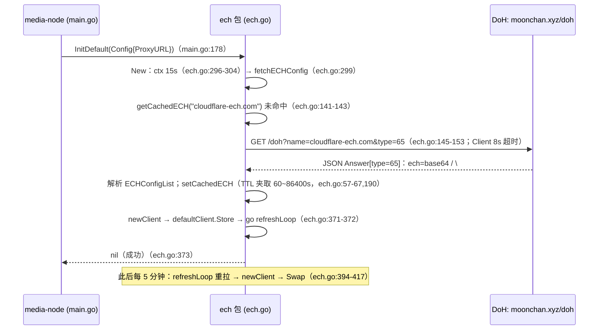
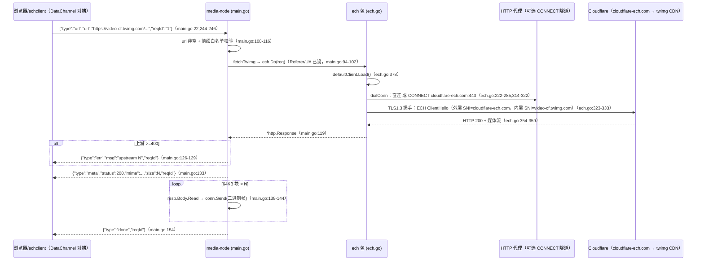
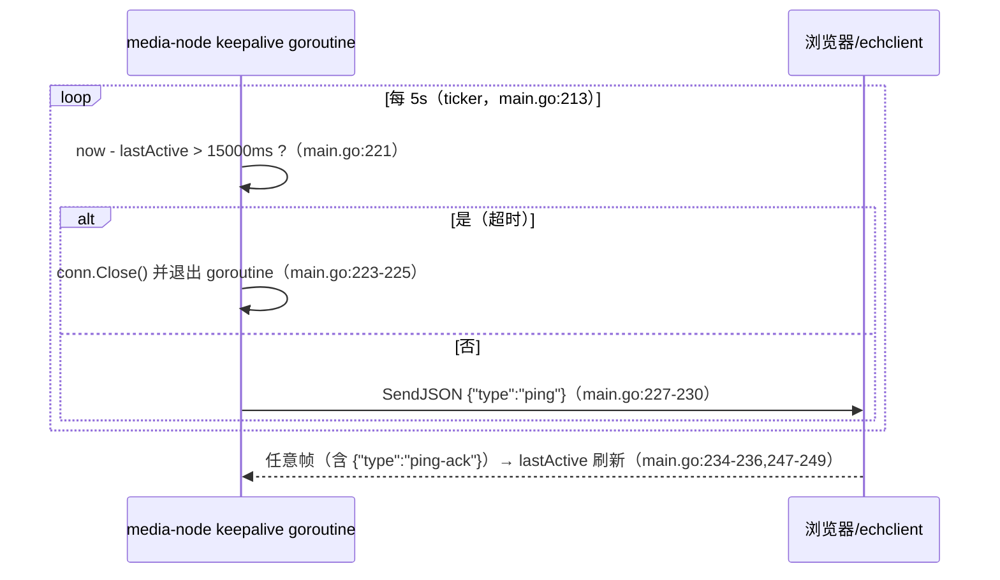

# 连接 13：media-node ↔ ech（ECH 媒体链）

- **涉及模块**：`../modules/12-media-node.md` 与 `../modules/12-media-node.md`（media-node 二进制与 ech 包**同属模块 12**、同一代码目录，本连接描述其内部接线，见 `doc/design/README.md:49`）
- **代码位置**：A 侧 `back/cmd/media-node/main.go`；B 侧 `back/ech/ech.go`
- **方向**：A→B 单向（进程内函数调用，无网络通道、无消息队列；数据与结论经返回值 `(*http.Response, error)` 回流，`back/ech/ech.go:354-359`；B 侧无任何回调 A 侧的接口）

## 1. 连接方式

**通道类型：进程内函数调用**。同一 Go 二进制内，A 侧直接 `import "peerdrive/ech"`（`back/cmd/media-node/main.go:47`）；B 侧是库（`package ech`，`back/ech/ech.go:1-11`），不是独立进程，不监听端口、无 IPC。连接分两个调用面：

1. **启动初始化面**：A 侧 `main()` 调 `ech.InitDefault(ech.Config{ProxyURL: proxyURL})`（`main.go:178`）。B 侧内部：`New` 建 15s 超时 ctx（`ech.go:296-304`）→ `fetchECHConfig` 经 DoH 拉取 ECH 配置（`ech.go:299,131-195`）→ `newClient` 构造 ECH transport → `defaultClient.Store` + 启动 `go refreshLoop`（`ech.go:371-372`）。失败返回 error，A 侧 `log.Fatalf` 直接退出（`main.go:179-180`）。
2. **请求面**：A 侧 `fetchTwimg` 构造带防盗链头的 `http.Request` 后调包级 `ech.Do(req)`（`main.go:94-102`）。B 侧 `Do` 加载全局 `defaultClient`（`ech.go:377-390`；media-node 因启动必调 `InitDefault`，实际总走已初始化路径，惰性初始化只是库级兜底，`ech.go:379-387`）。

**参数格式**：无自有协议帧，全部为普通 Go 函数签名：

- `ech.Config{DoHURL, ProxyURL, ShellDomain string}`（`ech.go:121-129`）。media-node 只设 `ProxyURL`（flag `-proxy`，空则读 `HTTPS_PROXY` 环境变量，`main.go:166,174`；B 侧 `effectiveProxy` 显式优先、否则取环境变量，`ech.go:214-220`）；`DoHURL`/`ShellDomain` 为空走默认 `https://moonchan.xyz/doh`（自托管 DoH，`ech.go:117-119`）与 `cloudflare-ech.com`（外壳域名，`ech.go:137-140,308-311`）。
- `InitDefault(cfg Config) error`（`ech.go:366-374`）；`Do(req *http.Request) (*http.Response, error)`（包级 `ech.go:377-390`，客户端方法 `ech.go:354-359`——`req.Host` 为空时置为 `req.URL.Host`，即真实目标域名，`ech.go:355-357`）。

**B 侧自建的内部通道（ECH 域前置的实际载体，供本连接语义参考）**：`newTransport` 构造的 `http.Transport` 以 `DialTLSContext` 拨 `cloudflare-ech.com:443`（直连或经 HTTP 代理 CONNECT 隧道，`ech.go:222-285,314-322`），TLS1.3 握手携带 `EncryptedClientHelloConfigList`（ECH 配置），`ServerName` 为真实目标域名 `video-cf.twimg.com`（`ech.go:323-333`）——GFW 只见外壳明文 SNI，Cloudflare 边缘按 ECH 内层 SNI 路由到 twitter CDN（`ech.go:1-8`、`main.go:8-14` 注释）。该 transport 与连接池 `MaxIdleConns:100 / IdleConnTimeout:90s`（`ech.go:336-338`）生命周期 = 当前生效的全局客户端（`defaultClient`，`ech.go:363`）。

**鉴权方式**：本连接（进程内调用）**无自身鉴权**；鉴权全部落在外部闸门：

- 上游防盗链：`Referer: https://x.com` + Chrome 120 UA 写死在请求头（`main.go:93,98-100`），不满足则上游回 4xx（`main.go:126-129` 转 err 帧）。
- DoH 端点公开、无鉴权（`ech.go:117-119`）。
- ECH 信任模型：信任 Cloudflare 边缘按 ECH 内层 SNI 路由（`ech.go:1-8` 注释）；ECH 只对 Cloudflare 托管域名有效（`main.go:14` 注释）。
- 信令侧 key 鉴权属于 [08-transport-signalserver.md](08-transport-signalserver.md)（`main.go:161-164,184-191`）。

**连接何时建立/由谁建立**：A 侧在 `main()` 启动时主动调用一次 `ech.InitDefault`（`main.go:177-180`）——进程常驻；此后 B 侧 `refreshLoop` 每 5 分钟自驱动重拉 ECH 配置并换新客户端（`ech.go:394-417`），不再经 A 侧。请求面每请求经 `fetchTwimg → ech.Do` 走同一全局客户端，TCP/TLS 连接由 transport 连接池按需建立/复用（`ech.go:313-341,336-338`）。

## 2. 时序

### 2.1 启动初始化：DoH 取 ECH 配置 → 全局客户端就绪

**逐步骤说明**：

1. **InitDefault 入口**：`main()` flag 解析后调 `ech.InitDefault`，仅传 `ProxyURL`（`main.go:174,178`）；`DoHURL`/`ShellDomain` 为空走默认（`ech.go:132-140`）。
2. **首拉**：`New` 建 15s 超时 ctx（`ech.go:296-304`）→ `fetchECHConfig` 先查进程内缓存 `getCachedECH`（`ech.go:141-143`，启动时必然未命中）。
3. **DoH 请求**：拼 `https://moonchan.xyz/doh?name=cloudflare-ech.com&type=65`（`ech.go:145`），`Accept: application/dns-json`（`ech.go:150`），`http.Client{Timeout: 8s}` + proxy transport（`ech.go:152,197-212`）。
4. **响应解析**：非 200 → 报错（`ech.go:158-160`）；JSON 解码 `dohResponse`（`ech.go:162-165`）；遍历 `Answer` 只取 type=65（`ech.go:167-170`），TTL≤0 按 300（`ech.go:171-174`）；`ech="..."` base64 或 `\# ...` 十六进制 wire 二选一解析（`ech.go:176-184`；wire 形式走 `parseSVCBWire` 取 key=5 的 ECH SvcParam，`ech.go:79-109`）。
5. **写缓存**：`setCachedECH(domain, cfgBytes, ttl)`，TTL 夹取到 `[60, 86400]` 秒（`ech.go:42-45,57-67,190`）。
6. **生效与常驻**：`newClient`（`ech.go:343-350`，`http.Client{Timeout: 0}` 大文件不限时，`ech.go:347`）→ `defaultClient.Store`（`ech.go:371`）→ `go refreshLoop(cfg)`（`ech.go:372`）→ 返回 nil，`main()` 继续打印「ECH 就绪」（`ech.go:373`；`main.go:181`）。
7. **每 5 分钟轮换**：`refreshLoop` ticker（`ech.go:396`）→ 10s ctx `fetchECHConfig`（`ech.go:404-405`）→ 失败仅 `continue` 保留旧客户端（`ech.go:407-409`）→ 成功 `newClient` + `defaultClient.Swap` + 旧 transport `CloseIdleConnections`（`ech.go:410-414`）——应对 Cloudflare 轮换 ECH 配置（`ech.go:394` 注释）。

### 2.2 请求处理：url 帧 → ECH 域前置 → 64KB 分块回传

**逐步骤说明**：

1. **收帧**：`conn.OnMessage` 收到文本帧，任何帧先刷新 `lastActive`（`main.go:234-236`）；JSON 解析失败或 `type` 为空 → 忽略（`main.go:241-242`）；`type=="url"` → `go serveRequest(conn, msg, chunkSize)`（`main.go:244-246`）。
2. **入参校验**：url 空 → err 帧 `"url required"`（`main.go:108-111`）；不以 `twimgURLPrefix`（`https://video-cf.twimg.com/`，`main.go:53-54`）开头 → err 帧——唯一允许的后端目标，防 SSRF（`main.go:112-116,50-51`）。
3. **构造请求**：`fetchTwimg` 用 GET，写死 `Referer: https://x.com` + Chrome 120 UA（防盗链，`main.go:93,95-100`）→ `ech.Do(req)`（`main.go:101`）。
4. **走全局客户端**：`ech.Do` 加载 `defaultClient`（`ech.go:378`；nil 则惰性 `New(Config{})` + CAS，`ech.go:379-387`）→ `Client.Do` 把 `req.Host` 置为真实目标域名（`ech.go:355-357`）→ `inner.Do`（`ech.go:358`）。
5. **拨外壳**：transport `DialTLSContext` 先 `SplitHostPort` 取真实域名（`ech.go:314-318`）→ `dialConn` 直连（拨号 10s 超时，`ech.go:224-227`）或代理 CONNECT 隧道（`ech.go:228-284`，CONNECT 非 200 报错，`ech.go:280-283`）连 `net.JoinHostPort(shellDomain, "443")`（`ech.go:319`）。
6. **ECH 握手**：`tls.Config{ServerName: 真实域名, EncryptedClientHelloConfigList: 缓存的 ECH 配置, MinVersion: TLS1.3, NextProtos: [h2, http/1.1]}`（`ech.go:323-328`）→ `tls.Client` + `HandshakeContext`（`ech.go:329-330`）。明文 SNI 是外壳，内层目标被 ECH 加密（`ech.go:1-8` 注释）。
7. **响应回流**：`*http.Response` 经返回值回到 `fetchTwimg`/`serveRequest`（`ech.go:358,389`；`main.go:119`）。上游 `>=400` → err 帧 `"upstream N"`（`main.go:126-129`）。
8. **meta 帧**：`guessMime`（上游 Content-Type 优先，否则按扩展名猜，`main.go:67-90,131`）+ `resp.ContentLength`（无该头为 -1，`main.go:132`）→ `SendJSON {"type":"meta",...}`（`main.go:133`）。
9. **分块回传**：64KB 缓冲循环 `resp.Body.Read`（`main.go:136`）→ 每块 `conn.Send`（库内即二进制帧 PPID 53，`back/peerjs/connection.go:90-101`，`main.go:141`）→ EOF 收尾发 `{"type":"done"}`（`main.go:146-154`）；流读错误 → err 帧（`main.go:149-151`）。每请求独立 goroutine（`main.go:246`），`reqId` 原样回显（`main.go:60,107,154`）。

### 2.3 并行面：应用层 keepalive（A 侧对 DataChannel 的保活，5s ping / 15s 无帧断开）

**逐步骤说明**：

1. **每连接一个 goroutine**：`OnConnection` 回调里初始化 `lastActive`（毫秒时间戳）与 `kaStop`，并启动 keepalive goroutine（`main.go:209-212`）。
2. **5s tick 判定**：`now - lastActive > 15000` → 判死，`conn.Close()`（`main.go:221-225`）——库内 `Close` 幂等且同步触发 `OnClose`（`back/peerjs/connection.go:175-198`），本端 `OnClose` 里 `close(kaStop)` 收尾 goroutine（`main.go:252-255`）；未超时则主动 `SendJSON {"type":"ping"}`（`main.go:227-230`），发送失败同样 `conn.Close()`（`main.go:228-229`）。
3. **对端回帧续命**：`OnMessage` 第一步刷新 `lastActive`——文本/二进制任何帧都算「对端还在」（`main.go:234-236`）；`ping-ack` 即 keepalive 响应（`main.go:247-249`）。注释明确「无 STUN 环境下 WebRTC 断线无 close 事件，必须靠超时感知」（`main.go:207-208`）。

## 3. 情况处理

| 异常/边界场景 | 行为与依据（代码位置） | 说明 |
|---|---|---|
| **超时** | 分层超时：① DoH 请求 `http.Client{Timeout: 8s}`（`ech.go:152`）+ transport `TLSHandshakeTimeout: 8s`（`ech.go:203`），超时/非 200/解码错 → `fetchECHConfig` 报错（`ech.go:154-160,186-188,194`）。② 拨号/代理 CONNECT `net.Dialer{Timeout: 10s}`（`ech.go:225,234`）；CONNECT 响应行读取超过 4096B 或读错即关（`ech.go:246-265`）。③ TLS 握手 `TLSHandshakeTimeout: 10s`（`ech.go:339`）+ `HandshakeContext` 受 ctx 控制（`ech.go:330`）。④ 数据面 15s 无帧踢（`main.go:221-225`）。启动首拉整体 ctx 15s（`ech.go:297`），失败 `log.Fatalf`（`main.go:179-180`）；刷新拉取 ctx 10s（`ech.go:404`），失败 `continue` 保留旧客户端（`ech.go:407-409`）。 | ECH `http.Client` 本体 `Timeout: 0`（大文件不限时，`ech.go:347`），媒体流无整体超时——悬挂由 DataChannel keepalive 兜底（`main.go:207-231`）；单次 fetch 超时 → err 帧回浏览器（`main.go:121-122,150-151`）。 |
| **断连 / 重连** | ECH 侧无持久连接：每个 HTTP 请求由 `DialTLSContext` 重新拨外壳（`ech.go:314-335`），连接池 `MaxIdleConns: 100 / IdleConnTimeout: 90s` 复用（`ech.go:336-338`），「重连」= 下一次 `ech.Do` 重新拨号；请求中途读流失败 → err 帧（`main.go:149-151`）。数据面：对端掉线无 close 事件 → 靠 15s 超时踢（`main.go:207-208,221-225`；库内另有 ICE `Disconnected/Failed/Closed` → `Close` 兜底，`back/peerjs/connection.go:244-251`）。浏览器可重发 `url` 请求——本端无会话状态，`serveRequest` 纯函数式（`main.go:104-156`）。 | 配置轮换时旧 transport `CloseIdleConnections`（`ech.go:412-414`），已建立的连接不受影响，在途请求继续。 |
| **重复 / 并发** | 多个 `url` 请求各自 `go serveRequest` 并发（`main.go:246`），每请求独立 fetch/流循环，`reqId` 仅回显——本端**不去重**，相同 reqId 重复请求并发执行，由浏览器端按 reqId 路由（`main.go:20-28` 注释）。ECH 配置缓存 `cacheMu` 互斥（`ech.go:38,47-55,57-67`）：并发首拉会各自 DoH（无单飞），`setCachedECH` 幂等覆盖（`ech.go:190`）；`defaultClient` 原子指针 + CAS 防重复初始化（`ech.go:363,385-387`）；`refreshLoop` 每 5 分钟 `Swap` 换挡（`ech.go:410-413`）。 | 数据面 `Ordered: true` 保序（`back/peerjs/connection.go:272-274`），但多请求块间可能交错，浏览器按「meta 后跟二进制块」状态机路由（`main.go:20-28` 注释；见 `../modules/12-media-node.md` §5）。 |
| **数据缺失或校验失败** | DoH 无 type=65 记录/无 `ech=` 参数 → `"no ECH config found"`（`ech.go:194`）；wire 截断/缺 key=5 → `parseSVCBWire` 各错误（`ech.go:79-109`）；解析错 → `"ECH parse error"`（`ech.go:186-188`）→ 启动时 `log.Fatalf`（`main.go:179-180`）。请求面：url 空（`main.go:108-111`）、前缀不符（`main.go:113-116`）、上游 `>=400`（`main.go:126-129`）、流读错（`main.go:149-151`）均回 err 帧。size 缺失：`ContentLength=-1` 照发 meta（`main.go:132`）。非法帧：非 JSON/type 空忽略（`main.go:241-242`）、二进制帧忽略（`main.go:237-239`）。 | mime 兜底：上游无 Content-Type 时按扩展名猜（`main.go:67-90`）。媒体流**无端到端校验**（不校验哈希），仅依赖 SCTP 保序传输（`main.go:135-154`）。 |
| **鉴权失败** | 本连接（进程内）无鉴权，失败发生在外部闸门：① 上游防盗链：Referer/UA 不符 → 403/4xx → err 帧 `"upstream N"`（`main.go:99-100,126-129`）。② ECH 握手失败（配置过期/外壳被识破 → `"TLS handshake"` 错误，`ech.go:330-333`）→ err 帧 `"fetch failed"`（`main.go:121-122`）。③ 代理 CONNECT 非 200（`ech.go:280-283`）。④ 信令 WS key/token 校验失败 → `Dial` 失败 `log.Fatalf`（`main.go:189,196-198`；细节见 [08-transport-signalserver.md](08-transport-signalserver.md) §1.1）。 | DoH 端点公开无鉴权（`ech.go:117-119`）；「鉴权」实质是 GFW 的 SNI 审查与上游防盗链两道外部闸门。 |
| **半开状态** | ① 数据面半开（对端掉线无 FIN）：keepalive 5s tick 发现 15s 无帧 → `conn.Close()`（`main.go:221-225`）；库内 `Close` 幂等、同步触发 `OnClose` → `close(kaStop)` 收尾（`main.go:252-255`；`back/peerjs/connection.go:175-198`）。② ECH 配置半失效（缓存未过期但 Cloudflare 已轮换）：本次握手失败 → err 帧，`refreshLoop` 每 5 分钟轮换兜底（`ech.go:394-417`）。③ 连接池半开 idle 连接：`IdleConnTimeout: 90s` 回收（`ech.go:338`）。④ 代理 CONNECT 半开：响应行不完整 → 读到 `\r\n\r\n` / 4096B 上限 / 读错即关（`ech.go:246-265`）。 | 握手失败即本次请求失败（`ech.go:330-333`）→ err 帧（`main.go:121-122`）；下次请求经 `DialTLSContext` 重新拨号（`ech.go:314-335`）。 |
| **进程重启** | ECH 缓存（`cache map[string]*echEntry`，`ech.go:37-40`）与 `defaultClient`（`ech.go:363`）均为纯内存态，重启清零 → `main()` 重新 `ech.InitDefault` 从头 DoH 拉取（`main.go:177-180` → `ech.go:296-303`），失败即 `log.Fatalf` 启动失败（`main.go:179-180`）。连接态（`lastActive`/`kaStop`/keepalive goroutine）随进程消失，在途 `serveRequest` 直接中断（`main.go:104-156`）；信令重新 `peer.Dial` 注册（`main.go:184-198`）。 | 模块定位「先行验证版」，无持久化、无断点续传（`main.go:1-6` 注释）；重启后媒体链从零冷启动。 |

## 4. 相关文档

- 连接文档（同目录）：
  - [08-transport-signalserver.md](08-transport-signalserver.md)：本连接 A 侧以固定 peer id 注册到同一信令 `peersignal.moonchan.xyz`（`main.go:161-164,184-199`），浏览器媒体 DataChannel 的 OFFER/ANSWER/CANDIDATE 协商消息经信令转发——本连接的数据面（2.2/2.3 的帧与 keepalive）承载于其上。
  - [07-transport-peerjs.md](07-transport-peerjs.md)：peerjs 库（模块 10）提供 DataChannel 文本/二进制帧原语（`back/peerjs/connection.go:90-123`）、幂等 Close（`connection.go:175-198`）、ICE 状态兜底清理（`connection.go:244-251`）与 `Ordered: true` 保序（`connection.go:272-274`）——本连接 A 侧的 `conn.Send/SendJSON/Close` 均依赖这些语义；media-node 经 `back/go.mod` 的 replace 复用同一库（模块 12 §依赖）。
  - [12-frontend-signalserver.md](12-frontend-signalserver.md)：浏览器端 peerdrive-media / `echclient` 经同一信令拨号 media-node 的 peer id（`back/cmd/echclient/main.go:34-49` 演示消费端视角：`Connect("media-node","media")`），是帧协议（`main.go:20-28` 注释）与 keepalive 的协商对端。
- 模块文档：`../modules/12-media-node.md`（本连接两侧同属该模块：§1 逻辑含 ECH 域前置机制与主要流程、§3 何时储存的刷新时机、§5 边界与坑含 keepalive/SSRF/防盗链/超时参数一览）、`../modules/10-peerjs.md`（DataChannel 传输原语与流控语义）、`../modules/11-signalserver.md`（信令通道，本连接数据面协商的载体）。
