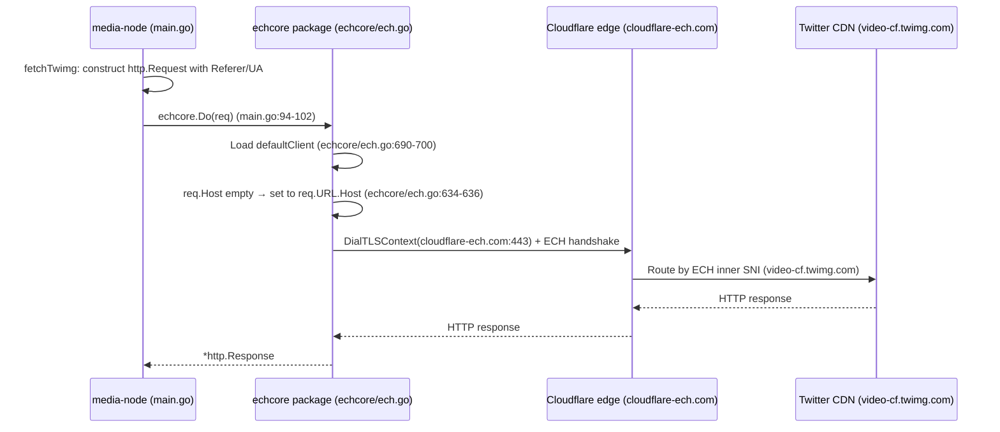
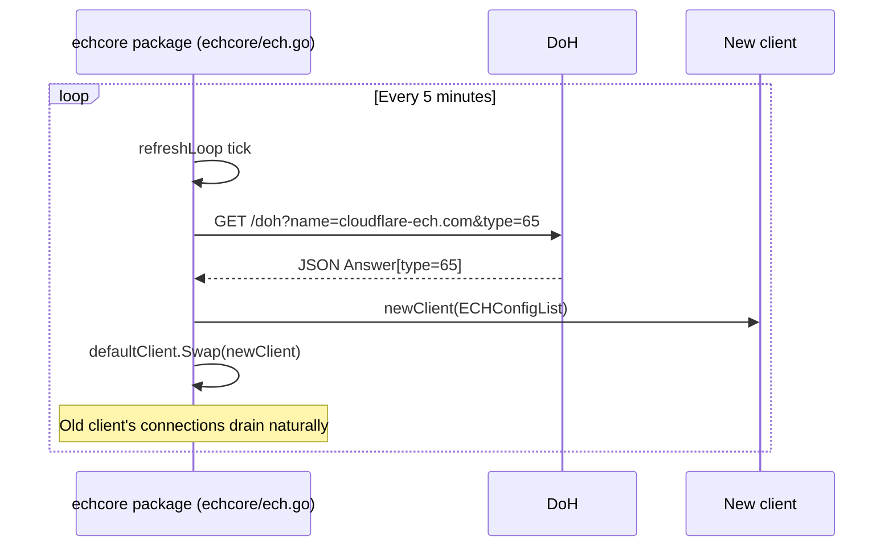
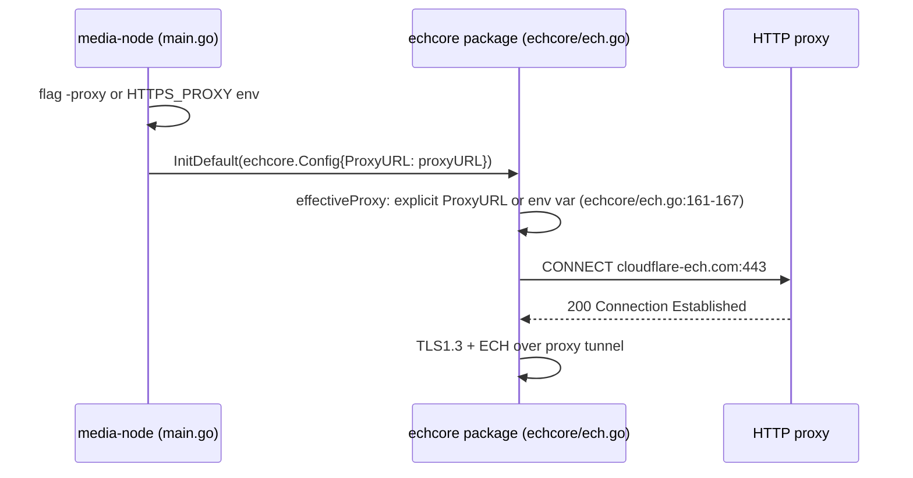

# Connection 13: media-node ↔ ech (ECH media chain)

- **Modules involved**: `../modules/12-media-node.md` and `../modules/12-media-node.md` (media-node binary and ech package **belong to same module 12**, same code directory, this connection describes internal wiring, see `doc/design/README.md:49`)
- **Code locations**: A side `back/cmd/media-node/main.go`; B side `back/internal/echcore/ech.go`
- **Direction**: A→B one-way (in-process function call, no network channel, no message queue; data and results flow back via return value `(*http.Response, error)`, `back/internal/echcore/ech.go:633-638`; B side has no callback to A side interface)

## 1. Connection Method

**Channel type: in-process function call**. In same Go binary, A side directly `import "peerdrive/internal/echcore"` (`back/cmd/media-node/main.go:47`); B side is a library (`package echcore`, `back/internal/echcore/ech.go:1-5`), not an independent process, doesn't listen on port, no IPC. Connection has two call surfaces:

1. **Startup initialization surface**: A side `main()` calls `echcore.InitDefault(echcore.Config{ProxyURL: proxyURL})` (`main.go:178`). B side internally: `New` creates 15s timeout ctx (`echcore/ech.go:603-613`) → `fetchECHConfig` fetches ECH config via DoH (`echcore/ech.go:190-202`) → `newClient` constructs ECH transport → `defaultClient.Store` + starts `go refreshLoop` (`echcore/ech.go:721-722`). Failure returns error, A side `log.Fatalf` exits directly (`main.go:179-180`).
2. **Request surface**: A side `fetchTwimg` constructs `http.Request` with anti-hotlink headers then calls package-level `echcore.Do(req)` (`main.go:94-102`). B side `Do` loads global `defaultClient` (`echcore/ech.go:690-700`; media-node always calls `InitDefault` at startup, so always takes initialized path, lazy initialization is just library-level fallback, `echcore/ech.go:655-688`).

**Parameter format**: No proprietary protocol frames, all ordinary Go function signatures:

- `echcore.Config{DoHURL, ProxyURL, ShellDomain string}` (`echcore/ech.go:560-571`). media-node only sets `ProxyURL` (flag `-proxy`, empty reads `HTTPS_PROXY` env var, `main.go:166,174`; B side `effectiveProxy` explicit priority, else env var, `echcore/ech.go:161-167`); `DoHURL`/`ShellDomain` empty uses defaults `https://moonchan.xyz/doh` (self-hosted DoH, `echcore/ech.go:187`) and `cloudflare-ech.com` (shell domain, `echcore/ech.go:183-188,565-570`).
- `InitDefault(cfg Config) error` (`echcore/ech.go:705-723`); `Do(req *http.Request) (*http.Response, error)` (package-level `echcore/ech.go:690-700`, client method `echcore/ech.go:633-638` — `req.Host` empty sets to `req.URL.Host`, i.e. real target domain, `echcore/ech.go:634-636`).

**B side's self-built internal channel (actual carrier of ECH domain fronting, for this connection's semantic reference)**: `newTransport` constructs `http2.Transport` dials `cloudflare-ech.com:443` via `DialTLSContext` (direct or via HTTP proxy CONNECT tunnel, `echcore/ech.go:499-538`), TLS1.3 handshake carries `EncryptedClientHelloConfigList` (ECH config), `ServerName` is real target domain `video-cf.twimg.com` (`echcore/ech.go:509-514`) — GFW only sees shell plaintext SNI, Cloudflare edge routes to twitter CDN by ECH inner SNI (`echcore/ech.go:1-5`, `main.go:8-14` comments). This transport's connection pool lifecycle = currently effective global client (`echcore/ech.go:651-653`).

**Authentication method**: This connection (in-process call) has **no own authentication**; all auth is at external gates:

- Upstream anti-hotlink: `Referer: https://x.com` + Chrome 120 UA hardcoded in request headers (`main.go:93,98-100`), if not satisfied upstream returns 4xx (`main.go:126-129` converted to err frame).
- DoH endpoint public, no auth (`echcore/ech.go:187`).
- ECH trust model: trust Cloudflare edge routing by ECH inner SNI (`echcore/ech.go:1-5` comments); ECH only effective for Cloudflare-hosted domains (`main.go:14` comment).
- Signaling side key auth belongs to [08-transport-signalserver.md](08-transport-signalserver.md) (`main.go:161-164,184-191`).

**Connection establishment/who establishes**: A side actively calls `echcore.InitDefault` once at `main()` startup (`main.go:177-180`) — process resident; thereafter B side `refreshLoop` every 5 minutes self-drives re-fetching ECH config and swapping client (`echcore/ech.go:728-762`), no longer through A side. Request surface per request goes through `fetchTwimg → echcore.Do` using same global client, TCP/TLS connections established/reused on demand by transport connection pool (`echcore/ech.go:499-538`).

## 2. Timing

### 2.1 Startup Initialization: DoH fetch ECH config → global client ready

```mermaid
sequenceDiagram
  participant M as media-node (main.go)
  participant E as echcore package (echcore/ech.go)
  participant D as DoH: moonchan.xyz/doh

  M->>E: InitDefault(Config{ProxyURL}) (main.go:178)
  E->>E: New: ctx 15s (echcore/ech.go:603-613) → fetchECHConfig (echcore/ech.go:190)
  E->>E: getCachedECH("cloudflare-ech.com") miss (echcore/ech.go:191-192)
  E->>D: GET /doh?name=cloudflare-ech.com&type=65 (echcore/ech.go:212-213; Client 8s timeout)
  D-->>E: JSON Answer[type=65]: ech=base64 / # wire (echcore/ech.go:223-259)
  E->>E: Parse ECHConfigList; setCachedECH (TTL clamped 60~86400s, echcore/ech.go:70-82,249)
  E->>E: newClient → defaultClient.Store → go refreshLoop (echcore/ech.go:721-722)
  E-->>M: nil (success) (echcore/ech.go:723)
  Note over E: Thereafter every 5 minutes: refreshLoop re-fetch → newClient → Swap (echcore/ech.go:728-762)
```

**Step-by-step explanation**:

1. **InitDefault entry**: `main()` after flag parsing calls `echcore.InitDefault`, only passes `ProxyURL` (`main.go:174,178`); `DoHURL`/`ShellDomain` empty uses defaults (`echcore/ech.go:183-188`).
2. **First fetch**: `New` creates 15s timeout ctx (`echcore/ech.go:603-613`), calls `fetchECHConfig` (`echcore/ech.go:190`); `getCachedECH("cloudflare-ech.com")` cache miss (`echcore/ech.go:191-192`); sends DoH query `GET /doh?name=cloudflare-ech.com&type=65` (`echcore/ech.go:212-213`; DoH client 8s timeout, `echcore/ech.go:186`).
3. **ECH config parsing**: DoH returns JSON `Answer[type=65]` containing `ech` (base64-encoded ECHConfigList) or wire-format bytes (`echcore/ech.go:223-259`); parsed into `ECHConfigList`; TTL clamped to 60~86400 seconds (`echcore/ech.go:70-82`); cached via `setCachedECH` (`echcore/ech.go:249`).
4. **Client creation**: `newClient` constructs ECH transport → `defaultClient.Store` → starts `go refreshLoop` (`echcore/ech.go:721-722`).
5. **Return**: nil on success (`echcore/ech.go:723`).
6. **Refresh loop**: Every 5 minutes, `refreshLoop` re-fetches ECH config → `newClient` → `defaultClient.Swap` (`echcore/ech.go:728-762`).

### 2.2 Request Path: fetchTwimg → echcore.Do → HTTP response



**Step-by-step explanation**:

1. **Request construction**: `fetchTwimg` (`main.go:82-130`) constructs `http.Request` with:
   - URL: twitter video CDN URL (e.g., `https://video-cf.twimg.com/...`)
   - Headers: `Referer: https://x.com` (anti-hotlink), Chrome 120 User-Agent
   - Method: GET
2. **echcore.Do**: Package-level `echcore.Do(req)` (`echcore/ech.go:690-700`) loads `defaultClient`; if `req.Host` empty, sets to `req.URL.Host` (`echcore/ech.go:634-636`) — this is the real target domain.
3. **ECH transport**: `defaultClient.Transport` is the ECH `http2.Transport` constructed by `newTransport` (`echcore/ech.go:499-538`):
   - `DialTLSContext` dials `cloudflare-ech.com:443` (direct or via HTTP proxy CONNECT tunnel, `echcore/ech.go:499-538`)
   - TLS1.3 handshake carries `EncryptedClientHelloConfigList` (ECH config)
   - `ServerName` is real target domain `video-cf.twimg.com` (`echcore/ech.go:509-514`)
   - GFW only sees shell plaintext SNI (`cloudflare-ech.com`), Cloudflare edge routes by ECH inner SNI
4. **Response**: HTTP response flows back through Cloudflare → ech client → media-node.
5. **Error handling**: Non-2xx → error frame (`main.go:126-129`); connection failure → error propagation.

### 2.3 Refresh Loop: ECH config renewal



**Step-by-step explanation**:

1. `refreshLoop` (`echcore/ech.go:728-762`) runs in goroutine, ticks every 5 minutes.
2. Re-fetches ECH config via DoH (same as startup).
3. Constructs new client with new ECH config.
4. `defaultClient.Swap(newClient)` atomically swaps the global client.
5. Old client's connections drain naturally (HTTP transport connection pool doesn't force close).

### 2.4 Step-by-step: Proxy handling



**Step-by-step explanation**:

1. media-node gets proxy from `-proxy` flag or `HTTPS_PROXY` env var (`main.go:166,174`).
2. `InitDefault` passes `ProxyURL` to ech config.
3. `effectiveProxy` (`echcore/ech.go:161-167`): explicit `ProxyURL` takes priority, else reads `HTTPS_PROXY` env var.
4. `DialTLSContext` (`echcore/ech.go:499-538`): if proxy configured, establishes CONNECT tunnel to proxy, then TLS1.3 + ECH over tunnel.

## 3. Case Handling

| Case | Trigger condition | Handling strategy | Code location |
|---|---|---|---|
| **Timeout** | DoH fetch timeout; HTTP request timeout; refresh loop timeout | DoH: client 8s timeout (`echcore/ech.go:186`); ECH config fetch: ctx 15s (`echcore/ech.go:603-613`); HTTP request: no explicit timeout (relies on upstream/transport); refresh loop: 5min interval, no per-iteration timeout. | `echcore/ech.go:186,603-613`, `echcore/ech.go:728-762` |
| **Disconnect/Reconnect** | Network interruption; proxy disconnect; Cloudflare disconnect | DoH: transient error → log + retry on next refresh loop tick; HTTP request: `http2.Transport` handles connection reuse and retry on next request; no explicit reconnect logic. | `echcore/ech.go:728-762`, `echcore/ech.go:499-538` |
| **Duplicate/Concurrent** | Concurrent HTTP requests; refresh overlapping with request | HTTP transport connection pool handles concurrent requests (`echcore/ech.go:499-538`); `defaultClient.Swap` is atomic (`echcore/ech.go:728-762`); old client's in-flight requests complete on old client; new requests use new client. | `echcore/ech.go:499-538`, `echcore/ech.go:728-762` |
| **Data missing or validation failure** | DoH returns no ECH config; ECH parse failure; non-2xx response; upstream 4xx | DoH no result: returns error → `InitDefault` fails → `log.Fatalf` exits (`main.go:179-180`); ECH parse failure: returns error; non-2xx: `main.go:126-129` converts to err frame; upstream 4xx (anti-hotlink): same handling. | `main.go:126-129,179-180` |
| **Auth failure** | Upstream anti-hotlink rejection; wrong Referer/UA | Hardcoded `Referer: https://x.com` + Chrome 120 UA (`main.go:93,98-100`); if upstream rejects (4xx), `main.go:126-129` converts to error. No user-facing auth — media-node is a server-side proxy. | `main.go:93,98-100,126-129` |
| **Half-open state** | `defaultClient` not initialized; proxy tunnel half-open | `defaultClient.Store` always called before requests (startup `InitDefault`); lazy initialization fallback (`echcore/ech.go:655-688`) if `InitDefault` not called; proxy tunnel half-open handled by `http2.Transport` connection pool (retries on new request). | `echcore/ech.go:721-722,655-688` |
| **Process restart** | Process killed/restarted | ECH config cache is in-memory (lost on restart); `refreshLoop` starts on new process; DoH config refetched from scratch; no persistent state. HTTP connection pool also in-memory. | `echcore/ech.go:728-762` |

## 4. Related Documents

- Connection documents (same directory):
  - [08-transport-signalserver.md](08-transport-signalserver.md): media-node registers to same signaling `peersignal.moonchan.xyz` with peer id (`main.go:161-164,184-199`); browser media DataChannel OFFER/ANSWER/CANDIDATE negotiation messages forwarded via signaling — this connection's data surface (2.2/2.3 frames and keepalive) is carried on top of it.
  - [07-transport-peerjs.md](07-transport-peerjs.md): peerjs library (module 10) provides DataChannel text/binary frame primitives (`back/peerjs/connection.go:90-123`), idempotent Close (`connection.go:175-198`), ICE state fallback cleanup (`connection.go:244-251`) and `Ordered: true` ordering guarantee (`connection.go:272-274`) — this connection's A side `conn.Send/SendJSON/Close` all depend on these semantics; media-node reuses same library via `back/go.mod` replace (module 12 §dependencies).
  - [12-frontend-signalserver.md](12-frontend-signalserver.md): Browser-side peerdrive-media / `echclient` dials media-node's peer id via same signaling (`back/cmd/echclient/main.go:34-49` demonstrates consumer-side perspective: `Connect("media-node","media")`), is the negotiation peer for frame protocol (`main.go:20-28` comments) and keepalive.
- Module documents: `../modules/12-media-node.md` (this connection's both sides belong to this module: §1 logic includes ECH domain fronting mechanism and main flow, §3 when to store refresh timing, §5 boundaries and pitfalls including keepalive/SSRF/anti-hotlink/timeout parameter overview), `../modules/10-peerjs.md` (DataChannel transport primitives and flow control semantics), `../modules/11-signalserver.md` (signaling channel, this connection's data surface negotiation carrier).
